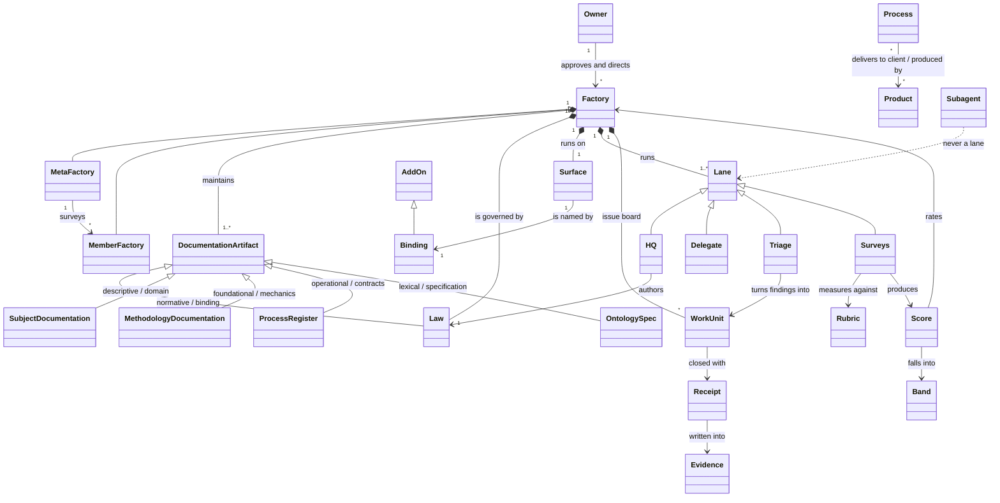
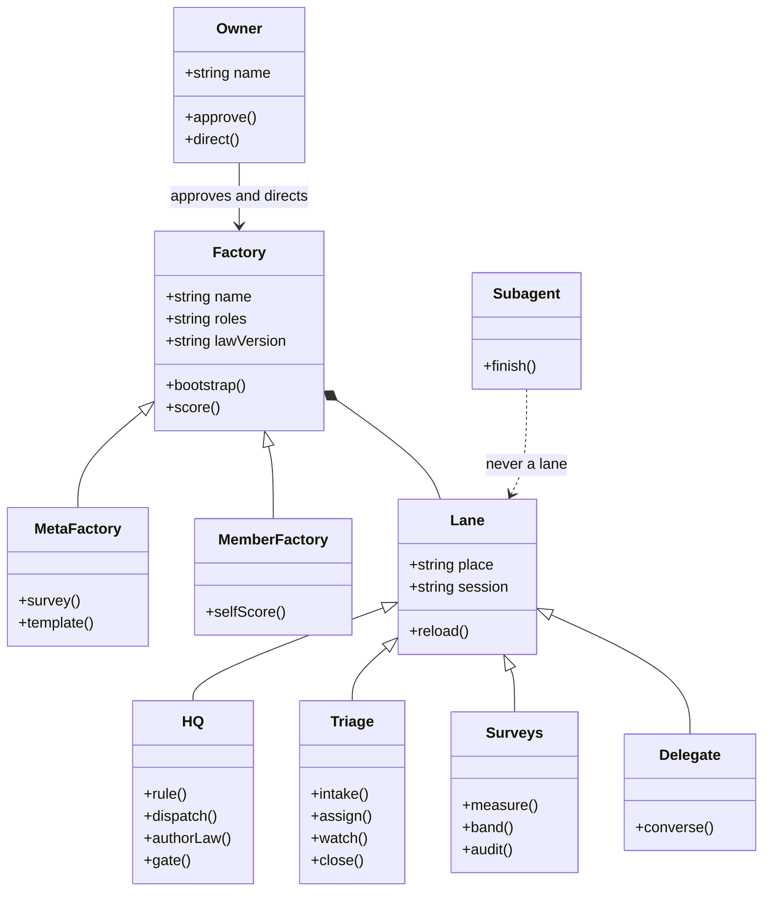
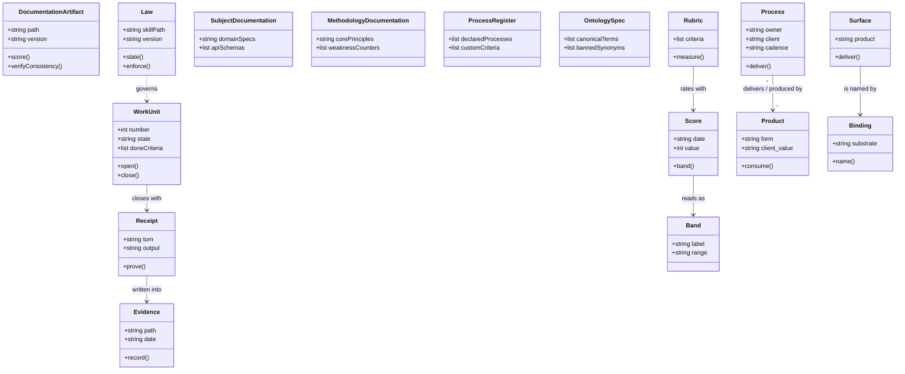
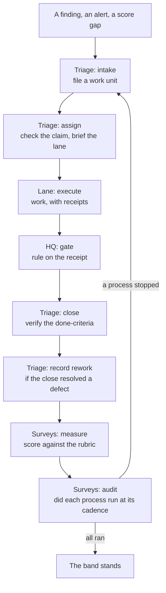

# agent-factories — ontology

**Version:** 0.1.0
**Owns:** the canonical vocabulary of this factory. One term, one meaning.

Every term below is the **only** word allowed for that concept — in issues, in
reports, in chat, in this repo's own prose. Anything in the *Not* column is a
defect to fix, not a synonym to tolerate.

> Why this file exists: the same concept under three names makes reports
> unreadable and `grep` useless. This factory writes reports about other
> factories, so its own drift is read as their drift — and a meta-factory that
> cannot name its own parts cannot score anyone else's.

---

## Canonical terms

| Term | Definition | Contextual synonyms (avoid when meaning this term) |
|---|---|---|
| `factory` | An autonomously self-improving delivery system consisting of versioned process laws, a chat surface whose place names carry state, and a repo whose issues are the task list | bot, agent, team, department, project |
| `autonomously_self_improving_factory` | A factory engineered with outer pacemaker loops, inner task eval loops, and automated defect-to-gate RSI loops that execute and improve without human prompt dependence | autonomous agent, self-healing bot, auto-coder |
| `meta-factory` | This project: the factory whose output is autonomously self-improving factories | meta-layer, the factory, main factory, mother factory |
| `member factory` | A factory this project surveys and converses with | client, tenant, subject, target, downstream |
| `owner` | The party accountable for a thing. When unqualified, refers to the human who approves and directs the factory. Not a lane, not a role | boss, admin, user, client, customer |
| `HQ` | The lane that rules, holds the owner relationship, and owns law authorship | supervisor, lead, manager, boss, admin |
| `Delegate` | The lane that converses with member HQs | liaison, ambassador, envoy, middleman, messenger |
| `Triage` | The lane that turns findings into tracked work and assigns it | intake, dispatcher, router, janitor |
| `Surveys` | The lane that measures factories against the rubric | measurement, metrics, analytics, scorekeeper, auditor |
| `lane` | A persistent session bound to one named place | worker session, thread, channel, chat session, agent |
| `work unit` | Any subject that reaches a close: a board issue of the board the ledger records, or a descriptive stem where no issue exists — or where a second board's numbering would collide with that board's | task, ticket, job, item |
| `surface` | The chat product a factory runs on — NOT the §11 state surface; the two are different objects and are separated below | platform, messenger (for the state sense say `state surface` or name the file) |
| `standalone` | A shipped kit file that is an instrument in its own own right — runnable, or a library with an interface of its own — so its absence in a factory means the factory is BEHIND. The residual class, so a new file is never silently unclassified | `shared` (it already means the shared brain files and the shared cgroup on this box) |
| `closure` | A shipped kit file with no interface of its own, imported by an instrument — so its absence BREAKS the parent at import (the `#137` defect) and it must travel WITH that parent, never alone | dependency, companion, helper module |
| `seed` | A shipped kit file the factory instantiates under a different name with its own content — a template of law or data, never overwritten by an update and never judged byte-for-byte | factory file, template file, stub |
| `binding` | An add-on that names the substrate. Exactly one of each kind | link, mapping, connection, integration |
| `add-on` | A pack of extra structure on top of the core | plugin, extension, module, adapter |
| `law` | A factory's versioned, prescriptive process rules that bind agent execution (a normative specialization of documentation artifact) | policy, guidelines, SOP, playbook, rules doc |
| `documentation_artifact` | Any codified, versioned knowledge asset of the factory (law, subject docs, methodology core, process register, ontology spec) | document, doc, file, manual |
| `rubric` | The 19 quality criteria across 6 families | scorecard, checklist, matrix |
| `score` | A factory's rating against the rubric on a stated date | grade, rating, mark |
| `band` | The coarse label a score falls into — Provisional, Operational, Scalable, Optimizing. The score is the measurement; the band is the reading of it | tier, level, category |
| `process` | A recurring act that keeps a property true. It has an owner, a declared cadence, product(s) it delivers to its client(s), and a run that leaves a trace | workflow, routine, procedure, pipeline |
| `subprocess` | A nested process delegated by a parent process owner, with its own process owner, process client, and process implementers | sub-routine, step, stage |
| `process owner` | The role accountable for the design, health, and SLA of a process. Delegates execution to implementers | owner, lead, pipeline owner |
| `process client` | The party who triggers a process, sets its acceptance criteria, and consumes its output | client, requester, customer, upstream |
| `process implementer` | The actor (lane, tool, subagent, automated script) executing a run of a process and spending its resources | worker, executor, runner, actor |
| `process quality criteria` | The explicit standards a process must meet, defined in terms of client and stakeholder value | quality gate, acceptance criteria, standards |
| `product` | What a process delivers to its process client, in verifiable form, carrying explicit client value | output, deliverable, result |
| `run` | One execution of a process, recorded as a state transition | execution, invocation |
| `throughput` | What a process produces per period — units reaching done | volume, productivity |
| `cadence` | How often a process actually runs, against how often it is declared to run | frequency, interval, periodicity |
| `duration` | Wall time one run takes, from start to the trace it leaves | runtime, elapsed time, latency |
| `resources consumed` | What one run spends — tokens, agent turns, wall time, money | spend, usage, burn |
| `first-pass yield` | The share of runs whose output was accepted without rework | success rate, acceptance rate |
| `waste` | What a process spends on output that was reworked, re-run, or abandoned. Rework is one form of it, not the term for it | scrap, churn, overhead |
| `receipt` | Tool output, produced in the same turn, that proves a claim | proof, log, trace |
| `evidence` | The dated file a receipt is written into | proof, receipt, log |
| `subagent` | A one-shot spawned session with no channel binding. **Never a lane** | lane, worker |
| `atomic_subprocess` | A single, non-decomposable stage in a process pipeline with explicit input/output contracts and failure modes | step, micro-process |
| `custom_acceptance_criteria` | The domain-specific quality standards that define acceptable product delivery for a particular process | domain criteria, custom rules |
| `documentation_class` | Documentation as a first-class scored operational artifact evaluated against a 0–4 rubric | doc object, docs |
| `methodology_core` | The foundational guidance on LLM cognition, weakness counters, quality loops, and substrate bindings | factory handbook, core docs |
| `onboarding_interview` | The structured dialogue loop that calibrates a new factory's documentation to survey baseline (≥2/4) | gap-closing session, intake chat |
| `dual_rail_architecture` | Multi-agent coordination model decoupling fast-path execution signaling from durable state ledgers and watchdog pacemakers | hybrid architecture, decoupled sync |
| `push_handoff` | Direct peer-to-peer event and goal dispatch from upstream to downstream implementer upon completing a state transition | direct handoff, instant dispatch |
| `queue_dwell_tax` | The latency penalty ($T_{\text{dwell}} = \frac{\Delta t}{2}$) imposed on tasks by polling-based state consumption | polling delay, queue latency |
| `fast_path` | Zero-latency peer-to-peer transport plane for task signaling and autonomous goal dispatch | push rail, signal rail |
| `survey_resolution_ratio` | The ratio $Q = \frac{N_{\text{leaf}}}{S} = \frac{N_{\text{total}} - N_{\text{coord}}}{S}$ measuring the inspection granularity across a system's atomic subprocesses | audit depth ratio, inspection coverage |
| `leaf_auditor` | A dedicated, non-overlapping inspection session evaluating a discrete atomic subprocess or state endpoint without context cross-contamination | sub-auditor, worker auditor |
| `coordinating_auditor` | The root session (Surveys lane) orchestrating hierarchical survey fan-out, synthesizing leaf audit receipts, and computing scores | audit lead, survey orchestrator |
| `epistemic_failure` | An agent defect caused by autoregressive token generation ungrounded in physical facts, receipts, or execution results | hallucination, confabulation |
| `context_capacity_failure` | An agent defect caused by attention dilution across large token windows or state obliteration during context compaction | amnesia, context bloat, lost in the middle |
| `behavioral_bias_failure` | An agent defect caused by conversational fine-tuning (RLHF) favoring politeness and premature turn yielding over task convergence | chat reflex, premature yield, early quit |
| `operational_friction_failure` | An agent defect caused by over-generalization and unbounded search depth resulting in scope creep or repetitive tool thrashing | thrashing, scope creep, rabbit hole |
| `context_manifest_curation` | Explicit pre-compaction prompt declaration of active and discarded skills and required tools to guarantee post-compaction state retention | manifest tagging, context filtering |
| `cognitive_trap` | A failure mode a person and an agent share, where the counter is a practice rather than a stronger generator. Naming it a trap keeps the remedy in view | human error, mistake, quirk, weakness |
| `mirror_test` | The diagnostic that asks whether a person fails the same way, and which of the four failure families the defect belongs to, before any counter is designed | analogy check, sanity check, gut check |
| `canonicality` | Which of two contradicting states is the one to keep — a property of a PAIR, settled by the cheapest resolution tier that can answer it, never by which side was written last | authority, ownership, correctness, source of truth |
| `resolution tier` | One of the five ordered rungs a discrepancy is resolved at: T0 identity, T1 precedence, T2 metric, T3 strategy, T4 neither | level, priority, rank, layer |
| `UNRESOLVED` | The T4 verdict — neither side is canonical on the evidence available. A finding to route, never a failure to conceal | unknown, undecided, pending, TBD |

<!--
Rules for a good entry:
- The definition states what the term IS, in one sentence, without using a
  banned synonym to explain it.
- "Not" lists every word the team actually says instead. If nobody says it,
  do not list it.
- Terms that only appear in code go in the code's own glossary, not here.
-->

### The shape

The terms above are not a list, they are a graph. This is that graph: what a
factory is made of, and who does what to whom.

Class names are the canonical terms written as one word: `MetaFactory` is
`meta-factory`, `WorkUnit` is `work unit`, `AddOn` is `add-on`. Four edges
carry the load:

- **`Factory <|-- MetaFactory` and `Factory <|-- MemberFactory`** — both are
  factories. They differ in what they produce, not in what they are made of.
- **`AddOn <|-- Binding`** — every binding is an add-on; not every add-on is a
  binding.
- **`Process "*" --> "*" Product`** — the relationship is **many-to-many**:
  one process can deliver multiple distinct products (e.g. measurement yields
  score diffs, consulting advisories, and insight entries), and one product can
  be produced or refined by multiple processes (e.g. the template product is
  produced by work delivery, hardened by rework prevention, and shaped by survey
  findings).
- **`Subagent ..> Lane : never a lane`** — the dashed edge *is* the constraint.
  A subagent has no named place and does not persist, which is exactly what a
  lane is.

`Owner` sits outside `Lane` deliberately: this file says the owner is not a lane
and not a role, so the diagram may not draw one.

### The classes and what they carry

The shape above says what is a kind of what. These two say what each kind
**holds** and what it **does**: a line without parentheses is state an object
carries, a line with parentheses is a duty it performs.

**The factory and its people.**

**The work and its record.**

A class with no members is still a class. `Subagent` holds nothing and has one
duty — to finish — which is exactly why it can never be a lane.

### The objects

The classes above are kinds. These are the objects: this factory's live
instances of them. A class is what a thing is; an object is the thing.

| Object | Its class | What it is |
|---|---|---|
| Alexey | `Owner` | the human who approves and directs |
| agent-factories | `MetaFactory` | this repo — the factory whose output is factories |
| the four surveyed factories | `MemberFactory` | the factories this one surveys |
| the HQ topic | `HQ` | the lane that rules, dispatches and authors law |
| the Triage topic | `Triage` | the lane that files work and watches it run |
| the Surveys topic | `Surveys` | the lane that measures and audits |
| the Delegate topic | `Delegate` | the lane that converses with member HQs |
| the Factories chat | `Surface` | the place this factory runs in |
| the binding in force | `Binding` | the mechanics that name that place |
| issues #6 to #12 | `WorkUnit` | the work units this factory has run |
| `skills/meta-factory/SKILL.md` | `Law` | the process law, versioned in git |
| `docs/quality-criteria.md` | `Rubric` | the 19 criteria across 6 families and the scale |
| 2026-09-12, 14 of 52 | `Score` | the latest reading of this factory |
| Operational | `Band` | the label that score falls into |
| `evidence/ledger.jsonl` | `Evidence` | where state transitions are written |
| `evidence/rework.md` | `Evidence` | where defects and their prevention are written |
| `docs/subject/` | `SubjectDocumentation` | domain specs and client deliverable schemas |
| `docs/methodology/` | `MethodologyDocumentation` | the 5-module factory methodology core |
| `docs/processes.md` | `ProcessRegister` | process register with atomic subprocess contracts |
| `ONTOLOGY.md` | `OntologySpec` | canonical vocabulary and syntax graph |

`Subagent` has no object in this table, and that is the point: a subagent does
not persist, so there is nothing to list. An id recorded as a lane is a defect
this table would have caught.

### Participants, duties and owners

An **owner** is the one party accountable for a thing. When unqualified, it
refers to the human who approves and directs the factory. Within a process, the
**process owner** is the role accountable for the design, health, and SLA of the
process, while **process implementers** execute the runs.

| Participant | Owns | Duties | Does not do |
|---|---|---|---|
| **Owner** | the direction | approves, directs, rules on policy | is not a lane and not a role |
| **HQ** | the process | rules, dispatches, authors the law, runs the gates; kept idle for incoming managerial work | implements anything — every work item goes to a lane |
| **Triage** | intake and routing | files work units, checks claims, assigns, watches execution, closes, records rework | decides direction; implements |
| **Surveys** | measurement | runs the measurement, reads the band, audits the processes | adjudicates a member's product decisions |
| **Delegate** | member conversation | converses with member HQs and their delegates | does a member's work |
| **Worker** | one work unit | executes, verifies, reports | closes its own place; widens scope |
| **Carrier** *(template card)* | the ship chain | merges, verifies the artifact, records the ship, rolls back | decides whether the change was right |

This factory runs a `Worker` lane — the implementation lane `HQ` delegates work
items to — and no `Carrier` lane. The `Worker` row is this factory's lane, not
only the template's card: `HQ` implements nothing, so without it a work item
would have nowhere to go. `Carrier` stays a template card, since nothing here
ships a binary.

### The processes

The model above is what the factory is made of. This is what it **does** — the
recurring acts that keep its properties true. A property is a state; a process
is the act that holds the state up, and only the second one can silently stop.

Every process has:
- A **process client** who triggers it and consumes its value.
- A **process owner** accountable for its design and health.
- Delegated **process implementers** who execute the runs.
- A **product** — the verifiable result one run delivers to its process client.
- Explicit **process quality criteria** defined in terms of client and stakeholder value.

| Process | Process Owner | Process Client | Delegated Implementers | Quality Criteria (Stakeholder Value) | What a run leaves behind |
|---|---|---|---|---|---|
| The four gates | HQ | Carrier / Author | automated runner / CLI | Zero regressions, immediate feedback (<10s) | an exit code and its output |
| Intake | Triage | Reporter / Finder | Triage lane | Unambiguous scope and done-criteria on intake | a work unit with a goal, an owner and done-criteria |
| Assignment | Triage | Worker / Task | Triage lane | Verified unclaimed, unambiguous task brief | a claim row, and a brief delivered to the lane |
| Execution watchdog | Triage | HQ / Owner | Triage lane | No silent worker stall > declared SLA | an escalation, or nothing to report |
| Rework entry | Triage | Surveys / Quality loop | Triage lane | Root cause and preventative rule recorded | an entry in `evidence/rework.md` |
| The ship chain | Carrier | Consumers / Release | Carrier lane | Reversible atomic release, verified artifacts | the ship record: version, commit, artifact identity |
| Daily measurement | Surveys | Owner / Factory HQs | Surveys lane / cron | Objective, reproducible score diffs at 09:00 MSK | `evidence/scores/<date>.md` |
| The process audit | Surveys, and the meta-factory | Owner / Governance | Surveys lane | Detection of unexecuted or stopped processes | **proposed** — the register is not written yet |

A process is not merely checked, it is **measured**. Six readings a run can
carry: `throughput`, `cadence`, `duration`, `resources consumed`,
`first-pass yield` and `waste`. They are the same measures the rubric applies
one level **up** — the Output family's Throughput (O1), Stability (O2) and Cost
per successful task (O3) — so a measured process is where those numbers come
from rather than something Surveys has to read by hand. Which measures apply to
which process is stated by the process register, proposed in
`docs/process-audit.md` §4.5.

Every process above has a named owner and leaves a trace, except the last one.
The audit of the processes themselves is proposed in `docs/process-audit.md`;
the owner ruled on three of its five open calls on 2026-09-12 — the factory's
own `Surveys` lane audits it, the meta-factory audits the factory, and both
keep their own band — and the register itself is not yet written.

### Terms that are not synonyms

Six pairs look interchangeable and are not. Conflating them is how work gets
duplicated and claims get filed against the wrong object:

| Pair | The difference |
|---|---|
| `receipt` vs `evidence` | A receipt is one tool result in one turn. Evidence is the dated file receipts are written into. A receipt that was never written down is not evidence |
| `binding` vs `add-on` | Every binding is an add-on; not every add-on is a binding. A binding names the substrate and there is exactly one of each kind; a domain add-on is optional and plural |
| `subagent` vs `lane` | A subagent has no channel binding and finishes. A lane is bound to a place and persists. A subagent id recorded as a lane is a defect — six member-HQ replies parked against one on 2026-09-11 |
| `epistemic_failure` vs `context_capacity_failure` | Both leave a wrong statement behind, and only one is a hallucination. The first is generation ungrounded in facts — the fact was never in context. The second is a fact that *was* in context and is gone. The counters differ (a receipt vs a flush), so calling a lost fact a hallucination prescribes prompt-bloat that cannot work. Run the `mirror_test` before naming either |
| `pair` vs `twin` | A **pair** is the byte-identical relation between a shipped file and its template copy — the term the manifest, the gate and the hook use (`PAIRS`, `test_template_sync.py`). **`twin` is not the term, and on 2026-09-26 the kit's own shipped hook was using it for exactly that relation**: `tools/hooks/pre-commit` named the other side of a split pair `twin` in nine places, including user-facing remedy text reading *"Stage the twin in this commit"* — beside a table constant called `PAIRS` and a sentence in the same message calling it *the pair*. One message, two words, one object, at the moment the hook refuses a commit. Renamed to `pair` in the hook, its gate and four test comments. **The residual uses are NOT the pair relation** and are kept: `tools/ledger.py`'s `twin` variable names the row sharing a patch-id; `docs/addons/surface/telegram-forums.md` names a migrated group; one `test_patrol_host_state.py` fixture string uses it of two candidate rows. **Predicate for any count here**, since a bare number cannot be checked: `grep -rn '\\btwin\\b'` over the law corpus, then exclude `docs/proposals/` and `docs/projects/` (the rename discussion itself). A count published without that predicate was wrong twice while this row was being written — 6, then 49, then 45 — which is the reason the predicate travels instead of the number |
| `surface` (chat) vs `surface` (state) | The chat product a factory runs on, and §11's "every surface has one writer" — the place a durable fact lives. Two objects, one word, and the canonical row named the RAREST sense while the dominant one went unenumerated. **Predicate, since a bare number cannot be checked:** over the law corpus, every line matching `\bsurfaces?\b`, bucketed by whether it names a chat product (a card, message, topic, or a send/render surface), a state file (§11's `has one writer`, a state surface, the ledger as a surface), or neither. Measured 2026-09-26: **~727 generic mechanism**, **57 state**, **9 chat**. The generic sense is not enumerated here because it is not a term of art — it is the English word — but a reader meeting "surface has one writer" is reading a state file, not Telegram, and the terms row above now says so. **Renaming across ~727 uses is not available**, which is why this row separates the senses instead of renaming them; the row was corrected rather than the corpus because §11's phrase is good law and the corpus is large |
| `canonicality` vs `ownership` | Ownership answers WHO may write a surface (§11) — it is authority over a surface. Canonicality answers WHICH of two contradicting states stands — it is truth about a pair. Ownership supplies ONE of T1's precedence forms, so it decides a disagreement only when one side is a derivation of the other. Two readings of the SAME surface have the same owner, so ownership cannot choose between them: the `23.67 %` ↔ `23.73 %` pair was settled by freshness, not by authorship. And where no surface records the actor at all (#138), ownership is ABSENT — the honest verdict is `UNRESOLVED`, not a named culprit. Reading the two as one turns "who is answerable" into "whose number wins", which freezes a stale value the moment its owner is named |

---

## Banned synonyms

| Don't say | Say | Why it matters |
|---|---|---|
| `supervisor` | `HQ` | The role was renamed on 2026-09-11. A report naming a supervisor describes a role that no longer exists; the rename record is the only place the old name belongs |
| `meta-layer` | `meta-factory` | Two names for one thing means a search finds half the references. Reports about the same project cannot be compared, and the name that survives is whichever was typed last |
| `meta layer` | `meta-factory` | Same defect, spaced instead of hyphenated — and invisible to a search for the hyphenated form |

<!--
The "why it matters" column is the load-bearing one. A ban with no stated
consequence reads as taste, and taste gets overridden under deadline. State
what breaks: a report that cannot be compared, a query that misses rows, a
handover that means two different things to two people.
-->

---

## Enforcement

| Where | How |
|---|---|
| This repo's prose | `python3 tests/test_ontology.py` fails on any unexempted banned synonym from `## Banned synonyms` |
| The `work unit` definition | `python3 tests/test_audit_rates.py` fails when the definition and the population `closed_subjects` counts admit different shapes (issue #39) |
| Contextual synonyms column | Reference only: guidance for disambiguation; not a global prose ban (per owner ruling 2026-09-13) |
| Issue titles | Prefix vocabulary: `triage:`, `law:`, `survey:`, `template:`, `surface:` |
| Reports | Reviewed at close — a banned synonym is a finding, not a nit |

The test parses the `## Banned synonyms` table above, so **the ban list is the
source of truth** and the gate cannot drift from it. The third column of the
terms table ("Contextual synonyms") provides contextual disambiguation (e.g.
avoiding "lane" when specifically meaning "subagent") and is not parsed as a
global prose ban. An exemption is a `(path, substring)` pair in
`tests/test_ontology.py`, and it exempts only a line that also contains the
named substring — so a historical mention stays visible and justified rather
than silently tolerated.

**Status:** enforced by `tests/test_ontology.py`; no CI runner is configured
yet, so the gate is run by hand and its result is a receipt. Wiring it to CI is
what would make it a build failure in the strict sense.

<!--
If enforcement is not yet automated, say so explicitly and name what would
prove it. An ontology nobody can violate is documentation; an ontology a test
enforces is law. Do not claim the second while shipping the first.
-->

---

## Naming law

| Artifact | Pattern | Example |
|---|---|---|
| Work-unit place | `<State> — #N <title>` | `Worker — #14 rank basis undocumented` |
| Closed place | `<State> — #N <title>` | `Done — #14 rank basis undocumented` |
| Issue | `<prefix>: <statement>` | `law: the leak test misses best-practices.md` |
| Decision record | `NNNN-<slug>` | `0003-authoritative-state-writer` |
| Score record | `evidence/scores/YYYY-MM-DD.md` | `evidence/scores/2026-09-12.md` |

Rename on close; never re-create. A work unit's address is stable across
renames, which is what scheduled deliveries point at.

**One spelling split is not a split, measured so the next reader does not chase it.**
`add-on` is canonical (60 uses over 30 law files) and its banned synonyms are `plugin`,
`extension`, `module`, `adapter`. The string `AddOn` appears 4 times and **all four are
a Mermaid class identifier**, where a hyphen is not expressible in the syntax — so they
are not prose uses of a rival spelling. A census that counted `addon` against `add-on`
would report a split that does not exist.

> The **exact** naming mechanics — what a named place is, how its address is
> obtained, what a delivery target looks like — belong to the surface binding,
> not here. This table states the pattern; the binding states how it is
> realised.
