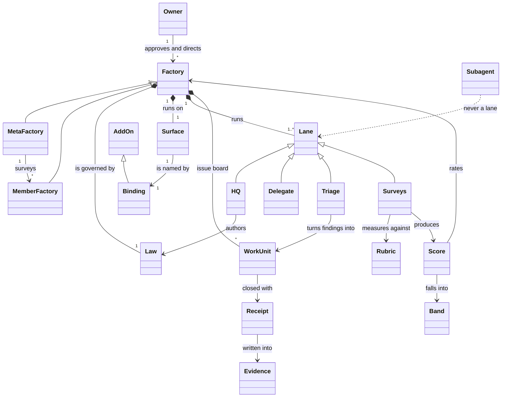
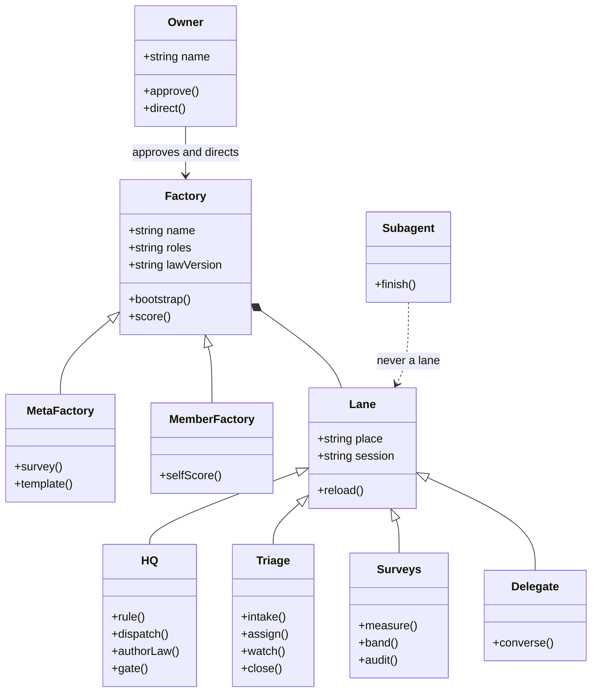
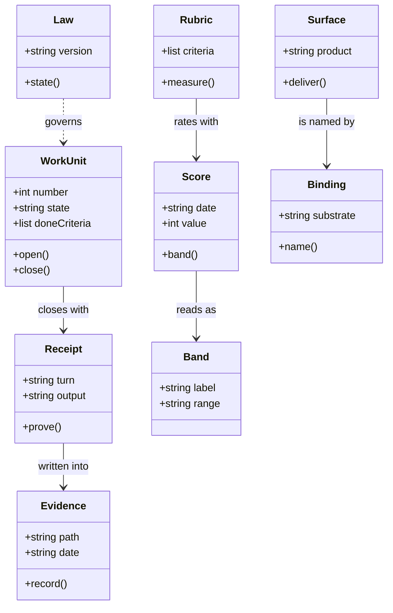
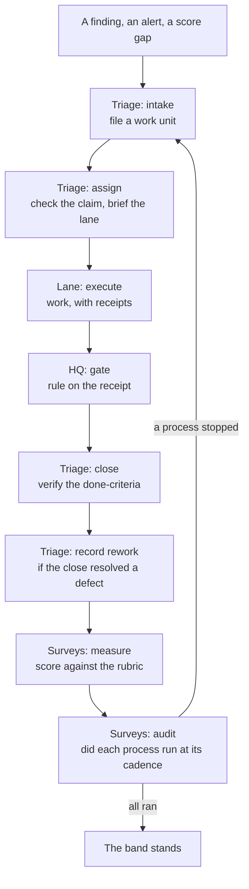

# agent-factories — ontology

**Version:** 0.1.0
**Owns:** the canonical vocabulary of this factory. One term, one meaning.

Every term below is the **only** word allowed for that concept — in issues, in
reports, in chat, in this repo's own prose. Anything in the *Not* column is a
defect to fix, not a synonym to tolerate.

> Why this file exists: the same concept under three names makes reports
> unreadable and `grep` useless. This factory writes reports about other
> factories, so its own drift is read as their drift — and a meta-factory that
> cannot name its own parts cannot score anyone else's.

---

## Canonical terms

| Term | Definition | Not |
|---|---|---|
| `factory` | A versioned process law, a chat surface whose place names carry state, and a repo whose issues are the task list — all three, or it is not a factory | bot, agent, team, department, project |
| `meta-factory` | This project: the factory whose output is factories | meta-layer, the factory, main factory, mother factory |
| `member factory` | A factory this project surveys and converses with | client, tenant, subject, target, downstream |
| `owner` | The human who approves and directs. Not a lane, not a role | boss, admin, user, client, customer |
| `HQ` | The lane that rules, holds the owner relationship, and owns law authorship | supervisor, lead, manager, boss, admin |
| `Delegate` | The lane that converses with member HQs | liaison, ambassador, envoy, middleman, messenger |
| `Triage` | The lane that turns findings into tracked work and assigns it | intake, dispatcher, router, janitor |
| `Surveys` | The lane that measures factories against the rubric | measurement, metrics, analytics, scorekeeper, auditor |
| `lane` | A persistent session bound to one named place | worker session, thread, channel, chat session, agent |
| `work unit` | One issue, from opened to closed | task, ticket, job, item |
| `surface` | The chat product a factory runs on | chat, channel, platform, messenger |
| `binding` | An add-on that names the substrate. Exactly one of each kind | link, mapping, connection, integration |
| `add-on` | A pack of extra structure on top of the core | plugin, extension, module, adapter |
| `law` | A factory's versioned process rules | policy, guidelines, SOP, playbook, rules doc |
| `rubric` | The 13 quality criteria | scorecard, checklist, matrix |
| `score` | A factory's rating against the rubric on a stated date | grade, rating, mark |
| `band` | The coarse label a score falls into — Provisional, Operational, Scalable, Optimizing. The score is the measurement; the band is the reading of it | tier, level, category |
| `receipt` | Tool output, produced in the same turn, that proves a claim | proof, log, trace |
| `evidence` | The dated file a receipt is written into | proof, receipt, log |
| `subagent` | A one-shot spawned session with no channel binding. **Never a lane** | lane, worker |

<!--
Rules for a good entry:
- The definition states what the term IS, in one sentence, without using a
  banned synonym to explain it.
- "Not" lists every word the team actually says instead. If nobody says it,
  do not list it.
- Terms that only appear in code go in the code's own glossary, not here.
-->

### The shape

The terms above are not a list, they are a graph. This is that graph: what a
factory is made of, and who does what to whom.

Class names are the canonical terms written as one word: `MetaFactory` is
`meta-factory`, `WorkUnit` is `work unit`, `AddOn` is `add-on`. Three edges
carry the load:

- **`Factory <|-- MetaFactory` and `Factory <|-- MemberFactory`** — both are
  factories. They differ in what they produce, not in what they are made of.
- **`AddOn <|-- Binding`** — every binding is an add-on; not every add-on is a
  binding.
- **`Subagent ..> Lane : never a lane`** — the dashed edge *is* the constraint.
  A subagent has no named place and does not persist, which is exactly what a
  lane is.

`Owner` sits outside `Lane` deliberately: this file says the owner is not a lane
and not a role, so the diagram may not draw one.

### The classes and what they carry

The shape above says what is a kind of what. These two say what each kind
**holds** and what it **does**: a line without parentheses is state an object
carries, a line with parentheses is a duty it performs.

**The factory and its people.**

**The work and its record.**

A class with no members is still a class. `Subagent` holds nothing and has one
duty — to finish — which is exactly why it can never be a lane.

### The objects

The classes above are kinds. These are the objects: this factory's live
instances of them. A class is what a thing is; an object is the thing.

| Object | Its class | What it is |
|---|---|---|
| Alexey | `Owner` | the human who approves and directs |
| agent-factories | `MetaFactory` | this repo — the factory whose output is factories |
| the four surveyed factories | `MemberFactory` | the factories this one surveys |
| the HQ topic | `HQ` | the lane that rules, dispatches and authors law |
| the Triage topic | `Triage` | the lane that files work and watches it run |
| the Surveys topic | `Surveys` | the lane that measures and audits |
| the Delegate topic | `Delegate` | the lane that converses with member HQs |
| the Factories chat | `Surface` | the place this factory runs in |
| the binding in force | `Binding` | the mechanics that name that place |
| issues #6 to #12 | `WorkUnit` | the work units this factory has run |
| `skills/meta-factory/SKILL.md` | `Law` | the process law, versioned in git |
| `docs/quality-criteria.md` | `Rubric` | the 13 criteria and the scale |
| 2026-09-12, 14 of 52 | `Score` | the latest reading of this factory |
| Operational | `Band` | the label that score falls into |
| `evidence/ledger.jsonl` | `Evidence` | where state transitions are written |
| `evidence/rework.md` | `Evidence` | where defects and their prevention are written |

`Subagent` has no object in this table, and that is the point: a subagent does
not persist, so there is nothing to list. An id recorded as a lane is a defect
this table would have caught.

### Participants, duties and owners

An **owner** is the one party accountable for a thing. It is not always a lane:
the owner of the factory's direction is the human.

| Participant | Owns | Duties | Does not do |
|---|---|---|---|
| **Owner** | the direction | approves, directs, rules on policy | is not a lane and not a role |
| **HQ** | the process | rules, dispatches, authors the law, runs the gates | implements a member's work, or work it has already dispatched |
| **Triage** | intake and routing | files work units, checks claims, assigns, watches execution, closes, records rework | decides direction; implements |
| **Surveys** | measurement | runs the measurement, reads the band, audits the processes | adjudicates a member's product decisions |
| **Delegate** | member conversation | converses with member HQs and their delegates | does a member's work |
| **Worker** *(template card)* | one work unit | executes, verifies, reports | closes its own place; widens scope |
| **Carrier** *(template card)* | the ship chain | merges, verifies the artifact, records the ship, rolls back | decides whether the change was right |

This factory runs no `Worker` and no `Carrier` lane: with `ROLES` set to `HQ`
alone there is no lane to delegate to, so HQ implements its own repo. The two
rows are the template's cards, not this factory's lanes.

### The processes

The model above is what the factory is made of. This is what it **does** — the
recurring acts that keep its properties true. A property is a state; a process
is the act that holds the state up, and only the second one can silently stop.

| Process | Owner | What it upholds | What a run leaves behind |
|---|---|---|---|
| The four gates | HQ | verification depth, vocabulary conformance, single-writer state | an exit code and its output |
| Intake | Triage | specification clarity | a work unit with a goal, an owner and done-criteria |
| Assignment | Triage | coordination integrity | a claim row, and a brief delivered to the lane |
| Execution watchdog | Triage | coordination integrity | an escalation, or nothing to report |
| Rework entry | Triage | the improvement loop | an entry in `evidence/rework.md` |
| The ship chain | Carrier | recoverability | the ship record: version, commit, artifact identity |
| Daily measurement | Surveys | the rubric — throughput, stability, cost | `evidence/scores/<date>.md` |
| The process audit | Surveys, and the meta-factory | law freshness, the improvement loop | **proposed** — the register is not written yet |

Every process above has a named owner and leaves a trace, except the last one.
The audit of the processes themselves is proposed in `docs/process-audit.md`;
the owner ruled on three of its five open calls on 2026-09-12 — the factory's
own `Surveys` lane audits it, the meta-factory audits the factory, and both
keep their own band — and the register itself is not yet written.

### Terms that are not synonyms

Three pairs look interchangeable and are not. Conflating them is how work gets
duplicated and claims get filed against the wrong object:

| Pair | The difference |
|---|---|
| `receipt` vs `evidence` | A receipt is one tool result in one turn. Evidence is the dated file receipts are written into. A receipt that was never written down is not evidence |
| `binding` vs `add-on` | Every binding is an add-on; not every add-on is a binding. A binding names the substrate and there is exactly one of each kind; a domain add-on is optional and plural |
| `subagent` vs `lane` | A subagent has no channel binding and finishes. A lane is bound to a place and persists. A subagent id recorded as a lane is a defect — six member-HQ replies parked against one on 2026-09-11 |

---

## Banned synonyms

| Don't say | Say | Why it matters |
|---|---|---|
| `supervisor` | `HQ` | The role was renamed on 2026-09-11. A report naming a supervisor describes a role that no longer exists; the rename record is the only place the old name belongs |
| `meta-layer` | `meta-factory` | Two names for one thing means a search finds half the references. Reports about the same project cannot be compared, and the name that survives is whichever was typed last |
| `meta layer` | `meta-factory` | Same defect, spaced instead of hyphenated — and invisible to a search for the hyphenated form |

<!--
The "why it matters" column is the load-bearing one. A ban with no stated
consequence reads as taste, and taste gets overridden under deadline. State
what breaks: a report that cannot be compared, a query that misses rows, a
handover that means two different things to two people.
-->

---

## Enforcement

| Where | How |
|---|---|
| This repo's prose | `python3 tests/test_ontology.py` fails on any unexempted banned synonym |
| Issue titles | Prefix vocabulary: `triage:`, `law:`, `survey:`, `template:`, `surface:` |
| Reports | Reviewed at close — a banned synonym is a finding, not a nit |

The test parses the table above, so **the ban list is the source of truth** and
the gate cannot drift from it. An exemption is a `(path, substring)` pair in
`tests/test_ontology.py`, and it exempts only a line that also contains the
named substring — so a historical mention stays visible and justified rather
than silently tolerated.

**Status:** enforced by `tests/test_ontology.py`; no CI runner is configured
yet, so the gate is run by hand and its result is a receipt. Wiring it to CI is
what would make it a build failure in the strict sense.

<!--
If enforcement is not yet automated, say so explicitly and name what would
prove it. An ontology nobody can violate is documentation; an ontology a test
enforces is law. Do not claim the second while shipping the first.
-->

---

## Naming law

| Artifact | Pattern | Example |
|---|---|---|
| Work-unit place | `<State> — #N <title>` | `Worker — #14 rank basis undocumented` |
| Closed place | `<State> — #N <title>` | `Done — #14 rank basis undocumented` |
| Issue | `<prefix>: <statement>` | `law: the leak test misses best-practices.md` |
| Decision record | `NNNN-<slug>` | `0003-authoritative-state-writer` |
| Score record | `evidence/scores/YYYY-MM-DD.md` | `evidence/scores/2026-09-12.md` |

Rename on close; never re-create. A work unit's address is stable across
renames, which is what scheduled deliveries point at.

> The **exact** naming mechanics — what a named place is, how its address is
> obtained, what a delivery target looks like — belong to the surface binding,
> not here. This table states the pattern; the binding states how it is
> realised.
