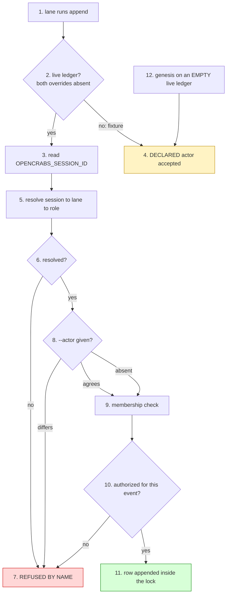

# The ledger instrument — its own law

Writer: ledger-instrument owner lane (meta-factory) — authors this file.
Frame: docs/instruments/template-instruments.md — cross-instrument definitions are cited from there, never restated here.
Authority: cross-factory clauses, and process law about instruments, rest with meta-factory HQ.

**Owns:** everything specific to THIS instrument — its write-path identity law, its row schema
and extension surface, its declaration files, its gate set, and its own divergence matrix. It
cites the frame for what an instrument IS, what its full set is, how classes work, how promotion
works, and how distribution works; it restates none of them.

**Owner order:** 2026-09-27 — the owner asked (a) what `actor` is and why a derived value is
stored, (b) whether ledger events should be linkable, (c) whether members should be able to carry
references to their own objects, (d) whether the text format is unhandy for search, and (e) that
the instrument law be separated from the skill and owned by a named lane. Every figure below was
read first-hand and carries its predicate, scope and instant.

---

## 1. The instrument's declaration

Per the frame's §1 (what an instrument is) and §2 (the full set), this instrument declares:

| field | value |
|---|---|
| **name** | `ledger` |
| **executable(s)** | `tools/ledger.py` — the only write path and the read path (`append`, `tail`, `verify`, `repair`). `tools/ledger-index.py` — the derived index (build/find/subject/touching/check) |
| **closure** | `tools/ledger_declaration.py` (the authorized-actor matrix and the declaration readers), `tools/field_predicate.py`, `tools/reconstruction.py`, `tools/telemetry.py`, `tools/registry*.py` — HARD tier; a tree missing any of them fails at import |
| **gate set** | six gates, named in §5 below |
| **version source** | `registry/kit.json` → `kit_version`, derived from the manifest, never hand-typed (frame §7.1) |
| **data surfaces** | `evidence/ledger.jsonl` (factory-owned, never overwritten by an update); `docs/ledger-*.json` (factory-owned declarations, shipped as `.example.json`); `evidence/.ledger-index.sqlite` (derived, gitignored, deletable) |

The instrument's LAW is this file. Before 2026-09-27 it had no home: it was prose woven through
`skills/meta-factory/SKILL.md`, measured at **48 `ledger` mentions and ZERO headings naming it**,
with no `docs/ledger*.md` anywhere — so it could not be cited by section, could not be versioned
independently of the skill, and its divergence was invisible to the kit census.

---

## 2. The write path's identity law — `actor` and `session`

`actor` is the row's **capacity**: the role the write was made in. It is a role name from a set
that is closed **PER FACTORY**, not per fleet — the core set (`hq · triage · worker · carrier ·
owner`) plus whatever the factory declares in `tools/actors.txt`, one role per line. There is no
fleet-wide actor list and there should not be: a factory with a lane nobody else has declares it,
and a factory without one does not.

It is **derived, never typed**: the daemon exports `OPENCRABS_SESSION_ID` into every tool
subprocess, `append` resolves it through the registry's own lane resolver, and a `--actor` is
accepted only when it **agrees** with that derivation. A session that cannot be resolved is
refused **by name**, never defaulted.



Two checks hang off it, and the second is the one that was missing: **membership** (`actor` is a
known role) and **authorization** (`AUTHORIZED_ACTORS_BY_EVENT` — is this role allowed to write
this *event*). The law's own phrasing: **membership is not authorization**. Measured before the
matrix existed: three `intake` rows in one member factory carried `actor=worker`, and `intake` is
Triage's — the write path accepted every one.

### Why the row stores the derived value

The test is whether the derivation can be **re-run later**. Measured 2026-09-27, it cannot, on
three independent counts:

| the join | measured | predicate / scope / instant |
|---|---|---|
| session → binding | **117 of 1558 = 7.5 %** | `opencrabs.db` `sessions` vs `session_bindings`, `mode=ro`, 2026-09-27T03:2xZ |
| lane → role | **37 of 62 declared lanes carry no role** | `registry/factories/*.json` → `lanes[].role`, same instant |
| the lane is ambiguous anyway | **two lanes declare `role: worker`** in one factory (threads 32, 559) | same read |

And the declarations are **attested snapshots** (`attested_at`), so a lane's role today is a claim
about today. So `actor` is not a **cache** of the derivation — it is the **record of the decision
the write path made**, stored at the one instant the evidence was in hand. A cache is droppable
without loss; a record is the only copy of a fact. **Derive at write; store the conclusion; never
re-derive in order to read.**

### The `session` key

With only a role, a row cannot be traced to the LANE that wrote it, and the fleet paid for that
twice: **245 of 1269 meta rows (19.3 %)** paste a session uuid into the free-text `detail`, and
one inferhub row carries a uuid in the **`actor` field itself** — it needed identity, found no
field for it, and took the role field, which is why the matrix cannot bind that row.

So the row carries **both**, and they are different quantities:

| key | what it is | vocabulary | derived from |
|---|---|---|---|
| `actor` | the **capacity** the write was made in | closed per factory | session → registry → role |
| `session` | the **lane** that made the write | open, unforgeable | `OPENCRABS_SESSION_ID`, verbatim |

`session` is intrinsic to the write, like `ts` and `actor`, so it is a **row key, not a `refs`
entry**: identity is present on every row from a live lane, while `refs` is a sparse assertion the
author chooses to make. Both keys are **additive** — a six-key row stays valid — so the four forked
member copies are not broken on day one.

---

## 3. The extension surface — how a row points, and how a factory speaks

Before 2026-09-27 the instrument had no **declared** extension surface, so every extension anyone
needed was taken by forking the file. Measured on the meta ledger (1294 rows, 2026-09-27): edges
were asserted in free-text `detail`, and no instrument could follow one.

| edge asserted in prose | rows | share |
|---|---|---|
| `#N` (board issue) | 947 | 73.2 % |
| sha | 859 | 66.4 % |
| `n=<digits>` (row ref) | 700 | 54.1 % |
| session uuid | 245 | 18.9 % |
| `row <digits>` | 79 | 6.1 % |

### `refs` — a typed pointer

An optional row key, a list of typed pointers: `{"row": 1228}`, `{"subject": "#149"}`,
`{"commit": "be47c443…"}`, `{"session": "…"}`, `{"rework": "2026-09-11:#3"}`, or a **declared**
kind for a member's own object.

- **Form is validated before the lock is taken** — a write path that acquires the lock and then
  rejects its own arguments has serialised a lane against nothing.
- **Existence is validated INSIDE the lock**, which is the only place the check is cheap: a `row`
  ref must satisfy `n <= max`, a fact the append already holds. That kills a dangling pointer at
  the one instant it is cheap.
- **`verify` carries the other half**, the one append cannot do: it walks every ref and reports one
  that was **valid when written and broken afterwards** (a rewrite, a truncation, a hand-edit), and
  reports an **undeclared kind** by name. It prints the population it examined beside the verdict,
  so a leg that examined nothing never reads as one that examined the ledger and found it clean.

### The declared vocabulary — a member's own event is a DECLARATION, not a fork

`docs/ledger-refs-kinds.json` (shipped as `.example.json`) declares `kinds` and `events` beyond the
core. One reader serves the write path and `verify`, so they cannot disagree.

This is the DRY route and it retires a live divergence: **inferhub-watch's ledger carries 8 `ack`
rows**, an event the shipped tuple does not name, so `verify` reds on rows that were all written
lawfully — which is precisely the pressure that pushes a member to fork the file. Measured
2026-09-27: with no declaration, `unknown event 'ack'` appears twice; with
`{"events": ["ack"]}` supplied, the count is **zero**.

A declaration **ADDS**; it never removes or redefines a core entry, so a factory cannot shadow
`close` and quietly escape the sequence law.

### Member objects travel as refs, never as columns

A member kind is declared, and the value is **opaque to the tool**:
`{"member": "miidas", "kind": "contour", "id": "zamer/01"}`. Columns were rejected because they
would mean the union of five factories' fields in every row, with `verify` unable to tell a typo
from a field another factory does not declare — and with the tool copied four ways, a member's new
column would exist in one copy and be refused by the rest.

### A refusal names its routes

An unrecognized flag is refused by the instrument's own handler, naming the two lawful routes
(`--ref` for a pointer; `docs/ledger-refs-kinds.json` for a new kind or event), instead of
argparse's bare usage line — which cannot tell a typo from a request for a capability the tool does
not carry. Exit 2.

---

## 4. The row schema

Six required keys, plus two optional ones:

```
{"n":1,"ts":"…","event":"claim","actor":"triage","subject":"#6","detail":"…"}
```

| key | required | meaning |
|---|---|---|
| `n` | yes | dense ordinal, `1..N` with no gaps |
| `ts` | yes | ISO-8601 UTC, the arrival instant |
| `event` | yes | core or **declared** event (§3) |
| `actor` | yes | the capacity, closed per factory (§2) |
| `subject` | yes | the object the row is about; a bare `#N` is ONE board's namespace, never fleet-unique |
| `detail` | yes | the human record |
| `refs` | no | typed pointers (§3) |
| `session` | no | the writing lane's session id (§2) |

The gate accepts **six or seven or eight** keys during the transition and requires the full shape
only at a member's own pin. That is deliberate: the two new keys are additive, so a forked copy is
not broken before it has migrated.

---

## 5. The gate set

Six gates uphold this instrument. Per the frame's §5, a review is a **close condition**, not a step,
and a gate lands with the first promotion rather than ahead of the population it judges.

| gate | upholds |
|---|---|
| `tests/test_ledger.py` | the write path and the read path end to end — refusals, the sequence law, the append-time ref check, the declared vocabulary, the fail-open skip |
| `tests/test_ledger_schema.py` | the row schema, the event and actor vocabulary, the authorization matrix, the domain invariants |
| `tests/ledger_boundary.py` | the declared boundaries — a row before its boundary is excused, one after it is governed |
| `tests/test_ledger_no_shrink.py` | the ledger never returns to empty |
| `tests/test_ledger_close_preflight.py` | a close's preconditions at the write path |
| `tests/test_ledger_index.py` | the derived index's own rule — a rebuild AGREES WITH A PLAIN SCAN |

`tests/test_ledger_commit_cites_no_rows.py` and `tests/test_ledger_identity.py` ride the same
family. A gate that refuses what the instrument lawfully writes is worse than no gate: measured
2026-09-27, `test_ledger_schema.py` carried its **own** `EVENT_TYPES` tuple, so a declared event
passed the tool and red the gate. It now reads the same declaration through the same seam.

---

## 6. This instrument's divergence matrix

Measured 2026-09-27T04:42Z. **Predicate:** the manifest's ledger paths, against each registered
member's tree. **Scope:** the manifest at `kit_version` for this commit, and the five member
factories registered in `registry/fleet.json`. **Instant:** as stated. A member acts on its **own
pin**, judged by its own gate, never on this figure.

| member | ledger paths present | gates present | `ledger_declaration.py` | `tools/ledger.py` |
|---|---|---|---|---|
| ai-antispam | 3 of 17 | 2 | absent | 277 lines |
| infra-factory | 2 of 17 | 1 | absent | 311 lines |
| inferhub-watch | 4 of 17 | 1 | present (120) | 1117 lines |
| miidas | 3 of 17 | 2 | absent | 365 lines |
| opencrabs-dev | 0 of 17 | 0 | absent | no ledger object — a different object entirely |

Against the template's `tools/ledger.py` at **1308 lines** before this round's additions.

**Three of the four member ledger-holders have no authorization matrix at all**, so an unauthorized
row is accepted silently there today. That is not history — it is a live property of those trees,
and it is the strongest single argument for the migration round.

**Pins vendored:** 2 of the 5 members carry `registry/kit.json` (infra-factory, inferhub-watch);
the other three do not. An earlier figure of "0 of 5" was read before those two vendored theirs and
is superseded by this one.

---

## 7. The migration process — cited, not restated

The migration rule is **cross-instrument**: it governs any instrument's donor, not the ledger
alone, so it lives in the frame and, for the clauses that bind member factories, with HQ. This file
cites it and adds only the ledger's own instantiation above (§6).

For the ledger specifically, the dispositions resolve as:

| member | its divergent half | disposition |
|---|---|---|
| inferhub-watch | deepest — `repair`, a forked event set, 1117 lines | migrate, with its `ack` event **absorbed** as a declaration (§3) |
| ai-antispam | its `#144` write-path refusal and the `#38` yield fix | **promote** the member's half, then migrate |
| miidas | a `subject_law.py` import | declare the fork with its reason, or migrate |
| infra-factory | stdlib-only, a deliberate constraint | **declare** the fork, with the reason and the closure it carries |
| opencrabs-dev | no ledger object; a different object by design | a declared exemption, not a migration |

---

## 8. The derived index — and what is NOT the source of truth

`tools/ledger-index.py` builds `evidence/.ledger-index.sqlite`: one table per field, an FTS table
over `detail`, and a `refs(src,dst)` table. Measured on the meta ledger (2.59 MiB, 1263 rows):
subject scan 0.0365 s against indexed equality 0.00022 s (**166×**), FTS ~2 ms, the index 2.92× the
text. At the measured fleet growth (~490 MB/year) the scan is ~7 s in a year and ~35 s in five.

The **JSONL stays the source of truth**. The index is gitignored, deletable at any instant, and
reproduced by one build from the ledgers alone; one writer, the patrol round.

**Rejected as a source of truth, with the measurement:**

- **SQLite** — it fixes none of the ledger's failure classes (a predicted `n`, a colliding bare
  `#N`, wake latency deciding legality), and git-plus-a-binary-blob is the worst pairing for an
  append-only audited log: no diff, no review, unmergeable on two writers. The grite prototype
  measured the cost directly — concurrent appends survived 3/10 and 1/3, and its merge path lost
  four events while reporting `ok: true`.
- **File ACLs / modes** — all five ledgers are `root:root 644` and every lane runs as the same uid,
  so a POSIX mode cannot distinguish one lane from another. Dead by measurement.
- **git refs/blobs** — right primitive, wrong object: the ledger's contract is a dense ordinal plus
  wall-clock arrival order, and a content-addressed store gives neither.

---

## 9. What this file does not own

| subject | home |
|---|---|
| what an instrument is; the full set; classes; promotion; distribution | the frame, `docs/instruments/template-instruments.md` |
| the migration duty as a rule, and the clauses that bind member factories | the frame, and meta-factory HQ |
| the ledger law as it stood before this file existed | `skills/meta-factory/SKILL.md`, which keeps exactly one pointer line to this file |
| code under `tools/**` | the lane that owns that code in the tree concerned — an instrument owner supplies text and acceptance criteria, and does not land another lane's file |

