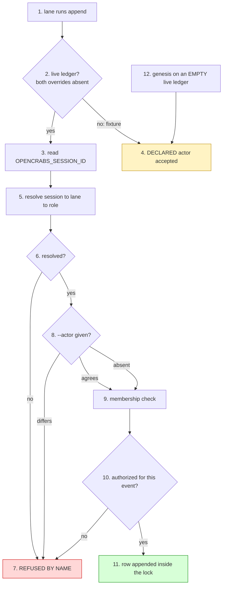

# The ledger instrument — its own law

Writer: ledger-instrument owner lane (meta-factory) — authors this file.
Frame: docs/instruments/template-instruments.md — cross-instrument definitions are cited from there, never restated here.
Authority: cross-factory clauses, and process law about instruments, rest with meta-factory HQ.

**Owns:** everything specific to THIS instrument — its write-path identity law, its row schema
and extension surface, its declaration files, its gate set, its write discipline, and its own divergence matrix. It
cites the frame for what an instrument IS, what its full set is, how classes work, how promotion
works, and how distribution works; it restates none of them.

**Owner order:** 2026-09-27 — the owner asked (a) what `actor` is and why a derived value is
stored, (b) whether ledger events should be linkable, (c) whether members should be able to carry
references to their own objects, (d) whether the text format is unhandy for search, and (e) that
the instrument law be separated from the skill and owned by a named lane. Every figure below was
read first-hand and carries its predicate, scope and instant.

---

## 1. The instrument's declaration

Per the frame's §1 (what an instrument is) and §2 (the full set), this instrument declares:

| field | value |
|---|---|
| **name** | `ledger` |
| **executable(s)** | `tools/ledger.py` — the only write path and the read path (`append`, `tail`, `verify`, `repair`). `tools/ledger-index.py` — the derived index (build/find/subject/touching/check) |
| **closure** | `tools/ledger_declaration.py` (the authorized-actor matrix and the declaration readers), `tools/field_predicate.py`, `tools/reconstruction.py`, `tools/telemetry.py`, `tools/registry*.py` — HARD tier; a tree missing any of them fails at import |
| **gate set** | six gates, named in §5 below |
| **version source** | `registry/kit.json` → `kit_version`, derived from the manifest, never hand-typed (frame §7.1) |
| **data surfaces** | `evidence/ledger.jsonl` (factory-owned, never overwritten by an update); `docs/ledger-*.json` (factory-owned declarations, shipped as `.example.json`); `evidence/.ledger-index.sqlite` (derived, gitignored, deletable) |

The instrument's LAW is this file. Before 2026-09-27 it had no home: it was prose woven through
`skills/meta-factory/SKILL.md`, measured at **49 lines carrying `ledger` (82 occurrences) and ZERO headings naming it** (case-insensitive; lines != occurrences, so both are stated),
with no `docs/ledger*.md` anywhere — so it could not be cited by section, could not be versioned
independently of the skill, and its divergence was invisible to the kit census.

---

## 2. The write path's identity law — `actor` and `session`

`actor` is the row's **capacity**: the role the write was made in. It is a role name from a set
that is closed **PER FACTORY**, not per fleet — the core set (`hq · triage · worker · carrier ·
owner`) plus whatever the factory declares in `tools/actors.txt`, one role per line. There is no
fleet-wide actor list and there should not be: a factory with a lane nobody else has declares it,
and a factory without one does not.

It is **derived, never typed**: the daemon exports `OPENCRABS_SESSION_ID` into every tool
subprocess, `append` resolves it through the registry's own lane resolver, and a `--actor` is
accepted only when it **agrees** with that derivation. A session that cannot be resolved is
refused **by name**, never defaulted.



Two checks hang off it, and the second is the one that was missing: **membership** (`actor` is a
known role) and **authorization** (`AUTHORIZED_ACTORS_BY_EVENT` — is this role allowed to write
this *event*). The law's own phrasing: **membership is not authorization**. Measured before the
matrix existed: three `intake` rows in one member factory carried `actor=worker`, and `intake` is
Triage's — the write path accepted every one.

### Why the row stores the derived value

The test is whether the derivation can be **re-run later**. Measured 2026-09-27, it cannot, on
three independent counts:

| the join | measured | predicate / scope / instant |
|---|---|---|
| session → binding | **118 of 1609 = 7.3 %** | `opencrabs.db` `sessions` vs `session_bindings`, `mode=ro`, 2026-09-27T10:28Z |
| lane → role | **37 of 62 declared lanes carry no role** | `registry/factories/*.json` → `lanes[].role`, same instant |
| the lane is ambiguous anyway | **two lanes declare `role: worker`** in one factory (threads 32, 559) | same read |

And the declarations are **attested snapshots** (`attested_at`), so a lane's role today is a claim
about today. So `actor` is not a **cache** of the derivation — it is the **record of the decision
the write path made**, stored at the one instant the evidence was in hand. A cache is droppable
without loss; a record is the only copy of a fact. **Derive at write; store the conclusion; never
re-derive in order to read.**

### The `session` key

With only a role, a row cannot be traced to the LANE that wrote it, and the fleet paid for that
twice: **246 of 1322 meta rows (18.6 %)** paste a session uuid into the free-text `detail`, and
one inferhub row carries a uuid in the **`actor` field itself** — it needed identity, found no
field for it, and took the role field, which is why the matrix cannot bind that row.

So the row carries **both**, and they are different quantities:

| key | what it is | vocabulary | derived from |
|---|---|---|---|
| `actor` | the **capacity** the write was made in | closed per factory | session → registry → role |
| `session` | the **lane** that made the write | open, unforgeable | `OPENCRABS_SESSION_ID`, verbatim |

`session` is intrinsic to the write, like `ts` and `actor`, so it is a **row key, not a `refs`
entry**: identity is present on every row from a live lane, while `refs` is a sparse assertion the
author chooses to make. Both keys are **additive** — a six-key row stays valid — so the four forked
member copies are not broken on day one.

---

## 3. The extension surface — how a row points, and how a factory speaks

Before 2026-09-27 the instrument had no **declared** extension surface, so every extension anyone
needed was taken by forking the file. Measured on the meta ledger (1322 rows, 2026-09-27T10:28Z): edges
were asserted in free-text `detail`, and no instrument could follow one.

| edge asserted in prose | rows | share |
|---|---|---|
| `#N` (board issue) | 1001 | 75.7 % |
| sha | 895 | 67.7 % |
| `n=<digits>` (row ref) | 820 | 62.0 % |
| session uuid | 246 | 18.6 % |
| `row <digits>` | 79 | 6.0 % |

### `refs` — a typed pointer

An optional row key, a list of typed pointers: `{"row": 1228}`, `{"subject": "#149"}`,
`{"commit": "be47c443…"}`, `{"session": "…"}`, `{"rework": "2026-09-11:#3"}`, or a **declared**
kind for a member's own object.

- **Form is validated before the lock is taken** — a write path that acquires the lock and then
  rejects its own arguments has serialised a lane against nothing.
- **Existence is validated INSIDE the lock**, which is the only place the check is cheap: a `row`
  ref must satisfy `n <= max`, a fact the append already holds. That kills a dangling pointer at
  the one instant it is cheap.
- **`verify` carries the other half**, the one append cannot do: it walks every ref and reports one
  that was **valid when written and broken afterwards** (a rewrite, a truncation, a hand-edit), and
  reports an **undeclared kind** by name. It prints the population it examined beside the verdict,
  so a leg that examined nothing never reads as one that examined the ledger and found it clean.

### The declared vocabulary — a member's own event is a DECLARATION, not a fork

`docs/ledger-refs-kinds.json` (shipped as `.example.json`) declares `kinds` and `events` beyond the
core. One reader serves the write path and `verify`, so they cannot disagree.

This is the DRY route and it retires a live divergence: **inferhub-watch's ledger carries 8 `ack`
rows**, an event the shipped tuple does not name, so `verify` reds on rows that were all written
lawfully — which is precisely the pressure that pushes a member to fork the file. Measured
2026-09-27: with no declaration, `unknown event 'ack'` appears twice; with
`{"events": ["ack"]}` supplied, the count is **zero**.

A declaration **ADDS**; it never removes or redefines a core entry, so a factory cannot shadow
`close` and quietly escape the sequence law.

### Member objects travel as refs, never as columns

A member kind is declared, and the value is **opaque to the tool**:
`{"member": "miidas", "kind": "contour", "id": "zamer/01"}`. Columns were rejected because they
would mean the union of five factories' fields in every row, with `verify` unable to tell a typo
from a field another factory does not declare — and with the tool copied four ways, a member's new
column would exist in one copy and be refused by the rest.

### A refusal names its routes

An unrecognized flag is refused by the instrument's own handler, naming the two lawful routes
(`--ref` for a pointer; `docs/ledger-refs-kinds.json` for a new kind or event), instead of
argparse's bare usage line — which cannot tell a typo from a request for a capability the tool does
not carry. Exit 2.

---

## 4. The row schema

Six required keys, plus two optional ones:

```
{"n":1,"ts":"…","event":"claim","actor":"triage","subject":"#6","detail":"…"}
```

| key | required | meaning |
|---|---|---|
| `n` | yes | dense ordinal, `1..N` with no gaps |
| `ts` | yes | ISO-8601 UTC, the arrival instant |
| `event` | yes | core or **declared** event (§3) |
| `actor` | yes | the capacity, closed per factory (§2) |
| `subject` | yes | the object the row is about; a bare `#N` is ONE board's namespace, never fleet-unique |
| `detail` | yes | the human record |
| `refs` | no | typed pointers (§3) |
| `session` | no | the writing lane's session id (§2) |

The gate accepts **six or seven or eight** keys during the transition and requires the full shape
only at a member's own pin. That is deliberate: the two new keys are additive, so a forked copy is
not broken before it has migrated.

---

## 5. The gate set

Six gates uphold this instrument. Per the frame's §5, a review is a **close condition**, not a step,
and a gate lands with the first promotion rather than ahead of the population it judges.

| gate | upholds |
|---|---|
| `tests/test_ledger.py` | the write path and the read path end to end — refusals, the sequence law, the append-time ref check, the declared vocabulary, the fail-open skip |
| `tests/test_ledger_schema.py` | the row schema, the event and actor vocabulary, the authorization matrix, the domain invariants |
| `tests/ledger_boundary.py` | the declared boundaries — a row before its boundary is excused, one after it is governed |
| `tests/test_ledger_no_shrink.py` | the ledger never returns to empty |
| `tests/test_ledger_close_preflight.py` | a close's preconditions at the write path |
| `tests/test_ledger_index.py` | the derived index's own rule — a rebuild AGREES WITH A PLAIN SCAN |

`tests/test_ledger_commit_cites_no_rows.py` and `tests/test_ledger_identity.py` ride the same
family. A gate that refuses what the instrument lawfully writes is worse than no gate: measured
2026-09-27, `test_ledger_schema.py` carried its **own** `EVENT_TYPES` tuple, so a declared event
passed the tool and red the gate. It now reads the same declaration through the same seam.

---

## 6. This instrument's divergence matrix

Measured 2026-09-27T10:28Z. **Predicate:** the manifest's ledger paths, against each registered
member's tree. **Scope:** the manifest at `kit_version` for this commit, and the five member
factories registered in `registry/fleet.json`. **Instant:** as stated. A member acts on its **own
pin**, judged by its own gate, never on this figure.

| member | ledger paths present | gates present | `ledger_declaration.py` | `tools/ledger.py` |
|---|---|---|---|---|
| ai-antispam | 3 of 18 | 2 | absent | 277 lines |
| infra-factory | 2 of 18 | 1 | absent | 311 lines |
| inferhub-watch | 4 of 18 | 1 | present (120) | 1117 lines |
| miidas | 5 of 18 | 4 | absent | 453 lines |
| opencrabs-dev | 0 of 18 | 0 | absent | no ledger object — a different object entirely |

Against the template's `tools/ledger.py` at **1484 lines**, including this round's additions.

**Three of the four member ledger-holders accept an unauthorized pair silently today** — but the
population is **inverted** against file presence, so a file count cannot stand in for the
capability. Re-measured 2026-09-27T05:57Z by **behavioural probe**: a synthetic ledger, `append --event intake
--actor worker`, run through each member's own `tools/ledger.py` with `OC_LEDGER_PATH` overridden.
That is the only predicate that answers the question, and it disagrees with the file census in
**both** directions.

| member | carries `ledger_declaration.py` | refuses an unauthorized pair |
|---|---|---|
| ai-antispam | no | **no** — accepted |
| infra-factory | no | **no** — accepted |
| inferhub-watch | **yes** | **no** — accepted |
| miidas | no | **yes** — refused |
| opencrabs-dev | no ledger object | — |

The single tree that **enforces** authorization carries no declaration module (miidas — an inline
`authorize()` routed through both its write and its read path); the single tree that **carries**
the module does not enforce it (inferhub-watch — the module is present, the write path never
consults it). So *"has no authorization matrix"* and *"accepts an unauthorized row"* are
different populations, and a census keyed on the file reports the wrong set either way. This is
the strongest single argument for the migration round, stated the other way round: **the
capability is what migrates, never the file that usually carries it.**

**Pins vendored:** 2 of the 5 members carry `registry/kit.json` (infra-factory, inferhub-watch);
the other three do not. An earlier figure of "0 of 5" was read before those two vendored theirs and
is superseded by this one.

**A cross-member `verify` verdict owes its TOOL and its EXEMPTION STATE, or it merges two
populations.** Measured 2026-09-27, corrected by the member itself: a census run over
infra-factory's ledger reported a defect the member's own tool correctly excuses — re-run
first-hand, `rc=0`, *"ledger clean: 590 row(s), monotonic, all event types known, sequences
complete"*, with **three granted excusals** printed. The excusal list
(`docs/ledger-exemptions.json`, read through `ledger_declaration.py`) is **per-member state that a
cross-member run cannot see**, so an exemption-blind run reports a defect on precisely the members
that have lawfully excused one — a false positive that reads as a finding. The dispatches for this
round quoted the un-excused form of that condition; the figure was wrong, the member's `rc=0`
stands. Name the tool and the exemption state beside any `verify` verdict.

---

## 7. The migration process — cited, not restated

The migration rule is **cross-instrument**: it governs any instrument's donor, not the ledger
alone, so it lives in the frame and, for the clauses that bind member factories, with HQ. This file
cites it and adds only the ledger's own instantiation above (§6).

For the ledger specifically, the dispositions resolve as:

| member | its divergent half | disposition |
|---|---|---|
| inferhub-watch | deepest — `repair`, a forked event set, 1117 lines | migrate, with its `ack` event **absorbed** as a declaration (§3) |
| ai-antispam | its `#144` write-path refusal and the `#38` yield fix | **promote** the member's half, then migrate |
| miidas | a `subject_law.py` import | declare the fork with its reason, or migrate |
| infra-factory | stdlib-only, a deliberate constraint | **declare** the fork, with the reason and the closure it carries |
| opencrabs-dev | no ledger object; a different object by design | a declared exemption, not a migration |

---

## 8. The derived index — and what is NOT the source of truth

`tools/ledger-index.py` builds `evidence/.ledger-index.sqlite`: one table per field, an FTS table
over `detail`, and a `refs(src,dst)` table. Measured on the meta ledger (2.59 MiB, 1263 rows):
subject scan 0.0365 s against indexed equality 0.00022 s (**166×**), FTS ~2 ms, the index 2.92× the
text. At the measured fleet growth (~490 MB/year) the scan is ~7 s in a year and ~35 s in five.

The **JSONL stays the source of truth**. The index is gitignored, deletable at any instant, and
reproduced by one build from the ledgers alone; one writer, the patrol round.

**Rejected as a source of truth, with the measurement:**

- **SQLite** — it fixes none of the ledger's failure classes (a predicted `n`, a colliding bare
  `#N`, wake latency deciding legality), and git-plus-a-binary-blob is the worst pairing for an
  append-only audited log: no diff, no review, unmergeable on two writers. The grite prototype
  measured the cost directly — concurrent appends survived 3/10 and 1/3, and its merge path lost
  four events while reporting `ok: true`.
- **File ACLs / modes** — all five ledgers are `root:root 644` and every lane runs as the same uid,
  so a POSIX mode cannot distinguish one lane from another. Dead by measurement.
- **git refs/blobs** — right primitive, wrong object: the ledger's contract is a dense ordinal plus
  wall-clock arrival order, and a content-addressed store gives neither.

---

## 9. The write discipline — one writer, one receipt, nothing removed

The clauses below govern *writing*, as distinct from what a row may contain (§4) and which gates
uphold it (§5). Until 2026-09-27 they were prose woven through `skills/meta-factory/SKILL.md`; they
move here so the instrument's law has one home, and the skill keeps a pointer.

### 9.1 Single-writer is a mechanism, not a habit

The ledger has exactly one append path. Concurrent writers would each read the same last row and
each write `n+1`, so the file silently gains two row 41s and every count taken from it is wrong
from then on — in a way that looks fine. `tools/ledger.py` takes an exclusive `fcntl.flock`,
computes the next row number **inside** it, and fsyncs before releasing. `tests/test_ledger.py`
runs twenty concurrent appends and asserts the row numbers are still `1..N`, so the property is
**tested**, not asserted.

The guarantee is *one append path*, not *tamper-proof*: the ledger is append-only by construction —
the tool has no rewrite command — but it is still a file, and a file can be edited. That is what
version control is for: a rewrite shows up as a diff, and the history is the audit.

### 9.2 The settlement receipt is the TOOL's, never the author's

Settlement is *append the close row, then verify*, so the receipt must cover the row it certifies —
and both cannot hold inside one append. The law therefore no longer asks the author to declare
`rows=<count>`: **the author cannot know that number**, because it is assigned inside the append
lock, and the only way to satisfy the predicate was to PREDICT `current_count + 1` — correct until
a peer appends in between. Measured across all five factory ledgers, **2 of 17 declaring closes
were off by exactly one** for that reason, and both are permanent debt, because an append-only
ledger has no repair space for a wrong number.

So the declaration is **retired**, and `append --event close` writes a **second row inside the same
lock**: a `run` row carrying `verified_rows=N`, where N is the count the sequence check covered
with the close row present. A row *about* a row, written after it — no prediction and no
self-reference. It carries **no `outcome=`**, for the duty receipt's own reason: a settlement
receipt is selection-biased, so admitting it to `first_pass_yield_population` would make the
published yield optimistic. The commit-msg hook already refuses a subject citing a row number for
this same reason (*"the number is assigned inside the append lock, so it cannot be known before
the append"*, n=405).

### 9.3 A close is refused at the write path when its subject has no legs

`tools/ledger.py append --event close` runs the same sequence predicate `verify` runs — **one
predicate, two call sites** — and exits non-zero naming the subject and the missing leg, without
writing anything. The refusal carries no exemption surface and needs none: a close appended *now*
can never predate the gate. `EXEMPTIONS` governs `verify`'s reading of *history* only and stays
printed there.

A **row count is not an integrity check.** The ledger is read as a *sequence*: a subject reaching
`close` must have been filed (`intake`) before it and taken (`claim`) after that intake, and each
missing leg is reported independently, so one pass says everything that is absent. The order leg is
evaluated only when both legs are present, bounded by the latest intake before the close, so a
re-opened subject must be re-claimed. Exemptions are listed explicitly by subject, leg, date and
PROOF in `EXEMPTIONS` inside `tools/ledger.py` and printed as `excused:` whenever one is used, so
**"clean" and "excused" are never the same output**.

### 9.4 A reconstructed claim declares itself and its basis, never an interval

A reconstruction declares **two facts the author controls** — the self-declaration token and the
basis, named under the canonical marker `BASIS:` — and nothing else. It must **not** assert an
interval: the claim's `ts` is its own write instant, one of the five `ROW_IDENTITY` fields, while
the close row's `ts` belongs to whoever appends the close, so the second boundary is not the
author's to control and a hand-supplied `ts` would invite back-dating on the honour system.
Measured over the five historical reconstructions, the gaps were 0s, 2s, 0s, 347s and 65s — **three
of five miss that equality**, so a gate over it would have fired on honest rows. **A gate must test
a property its author controls.** The interval therefore moves from DECLARED to
**RECOMPUTED-AND-PRINTED**: the reader recomputes it from the two rows' own `ts` values, tool-sourced
on both sides, with no typed expectation.

The gate PRINTS the population it examined and is proven to BITE by a synthetic probe; its live
population is legitimately EMPTY until the next reconstruction, so the loud-fail-on-zero form is
the **wrong** guard here. Its boundary is declared in `docs/ledger-invariants.json`, and the five
historical reconstructions are OUTSIDE its population: **nothing is backfilled.** The `claim_gap`
token is withdrawn as a requirement (#115, n=687), and no hand-edit of a ledger row is ever lawful —
the one-append-path rule stands, and a correction is a DECLARED DEVIATION, never precedent.

### 9.5 A subject is `#N` or a descriptive stem — and `#N` is ONE board's

A subject that names a board issue is written `#N` — the hash, the digits, and nothing else. `#N`
is the strict form every subject-keyed predicate resolves through, so a near-miss is not a
malformed reference to those predicates: **it is not a reference at all**, and the row silently
leaves their population without ever being reported as wrong. A subject naming no issue is a
descriptive stem in words (`pickaxe-attribution-trap`), and a clause label extending a reference
(`#31-close-receipt`) is descriptive, not a reference. `_STRICT` is `^#\d+\Z` while `_CLAUSE_LABEL`
(`^#\d+-\S`) is descriptive, so a clause label silently leaves the reference population rather than
naming a second board.

The number a subject names is **not bound to this factory's board** — a row may cite another
repository's issue, so the FORM is what is codified and no gate may read `#N` as naming this
factory's board without saying so. The gate is `tests/test_subject_form.py`.

**A ledger's `#N` namespace is ONE board's, and keeping it unique is the factory's obligation — the
kit cannot check it.** The sequence predicate keys on the exact subject string, so two boards
sharing a numbering make one bare `#N` name two work units, and the collision does **not** RED: a
close on the second board's unit is accepted on the FIRST board's intake and claim — a defeated
guard reported as clean (reproduced on a throwaway ledger against `TEMPLATE/tools/ledger.py`:
`verify` rc=0, colliding close ACCEPTED rc=0, non-colliding control refused rc=1). Nor can a board
lookup close it: a row records a NUMBER and not WHICH board it meant, so the ambiguity lives in the
row, not in the checker. A factory carrying more than one board therefore picks ONE disposition and
states which: **scope lifecycle rows to the board the ledger records**, naming a second board's
units with a distinct descriptive stem (which then needs its own intake and claim, like any
subject), or **keep a second ledger** via `OC_LEDGER_PATH`. A bare `#N` is never reused across two
boards (#971).

### 9.6 Nothing is removed — retirement names a row, and a false value stays visible

**A row is retired by naming it, never by deleting it.** The single-writer lock binds the *code*,
not the artifact: a writer that never calls `tools/ledger.py` takes no lock and leaves no trace,
and once its removal is *committed* the append guard compares working against committed, goes
self-consistent, and every gate reads green over a ledger that has lost committed history. So no
row identity — the `(n, ts, event, actor, subject)` tuple a row is known by — is ever removed.
`tests/test_ledger_no_shrink.py` walks the committed history and reports every commit whose diff
removes a row identity, which is why the check is a **set difference over identities** and not a
text search: the one measured case removes a row whose surviving neighbours still contain every
word it carried. Its exemptions are factory data in `docs/ledger-no-shrink-exemptions.json`, keyed
by full sha and never inline in the gate, and every run prints them so "clean" and "excused" are
never the same output; a gate that examines zero commits fails loudly rather than passing vacuously.

**"Retired" names two different objects**, and the difference carries the teeth: a row's IDENTITY,
and a FIELD VALUE the ledger cannot remove. A close row declares the revision its receipts describe
(`head=<sha>`), and because the ledger is append-only, a token that resolves to nothing **cannot be
removed** — the row stands exactly as written and the false value stands inside it. The exit is a
DECLARATION in its own file, `docs/ledger-retirements.json`, which NAMES the value rather than
excusing the row. **Admission is a proof obligation, not a lookup:** an entry is admitted only when
the ledger CARRIES its naming row AND that row's detail carries the false value VERBATIM — so a
declaration whose naming row is absent, whose naming row does not carry the value it claims, or
whose target row's canonical run does not declare that value at all, is a gate ERROR and never a
silent pass. A retired declaration is **neither edited nor excused**: excusing is what the exemption
surfaces do for a violation whose repair space is empty, while a retirement names the false value,
keeps the true one beside it, and stays visible. The gate prints every admitted entry as a
`retired:` line, beside its `excused:` lines and the count it examined, and the three — `clean`,
`excused`, `retired` — are never the same output.

**The existence leg asks whether the declared object EXISTS in this repository, and its bound is
the part a reader will overread: EXISTENCE is neither ANCESTRY nor TRUTH.** A declared revision
that resolves is not thereby the revision the row MEASURED, and the leg cannot say that it is.
Ancestry is refused as the predicate for a MEASURED reason rather than a taste: a history rewrite
leaves an honest revision unreachable while its object survives, so an ancestry test would condemn
exactly the rows a rewrite did not touch. And **a leg that cannot judge SAYS SO** — on a tree with
no object database it reports a STATED inability and prints `NOT RUN` with its reason, never the
verdict of a leg that examined the population and found it clean.

### 9.7 An ad-hoc probe never appends to live state

A scratch script, throwaway harness or one-off probe that appends to a durable surface is a SECOND
writer on a surface this section gives one, and the rows it leaves behind are indistinguishable
from real state transitions — the factory has paid for this twice, once with twenty rows and once
with one, and in both cases the author did not know the seam existed. **Copying the data file
isolates nothing:** the append path is bound to the TOOL's location, not to the data it reads, so a
copy of the ledger with the tool still resolving its own repository root writes to the live file.
The requirement is therefore a three-part SHAPE — the tool exposes a redirect for every path an
append can land in; the harness binding documents those names and the incantation that uses them,
because a name is a mechanic of one product and naming it in this law is a leak; and a gate proves
the tool HONOURS each name the binding publishes, since a binding that names a redirect the tool no
longer reads is a law naming a mechanism that does not exist. **The seam carries a stated COST:** a
path outside the repository has no committed lineage to compare against, so the guard that makes a
rewrite of live history loud FAILS OPEN and warns — that warning is EXPECTED on this path and is
not an error. The gate is `tests/test_binding_mechanism_exists.py`.

### 9.8 One field, one predicate

A telemetry field read out of a row's `detail` has exactly ONE predicate, and it lives in
`tools/field_predicate.py`. A module that reads such a field IMPORTS that predicate rather than
re-implementing it; two readers of one field that disagree are a defect in the second reader.

### 9.9 An append-only surface with no reader is a write-only memory

`tools/ledger.py tail` is the read path. When a lane's state is in question, the ledger is what it
is checked against.

**The rework log is the other half of the ledger.** The ledger records that work closed;
`evidence/rework.md` records what had to be redone and why. The rubric's Stability criterion asks
for two rates — change fail rate and rework rate — and neither is computable from memory. The log
is the **numerator**, the ledger's `close` rows are the **denominator**, and both are recomputed on
each measurement run, never recalled: a remembered rate is an impression with a decimal point.

---

## 10. What this file does not own

| subject | home |
|---|---|
| what an instrument is; the full set; classes; promotion; distribution | the frame, `docs/instruments/template-instruments.md` |
| the migration duty as a rule, and the clauses that bind member factories | the frame, and meta-factory HQ |
| the ledger law as it stood before this file existed | `skills/meta-factory/SKILL.md`, which keeps exactly one pointer line to this file |
| code under `tools/**` | the lane that owns that code in the tree concerned — an instrument owner supplies text and acceptance criteria, and does not land another lane's file |

