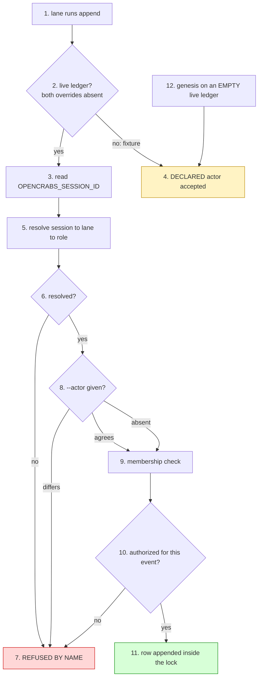

# The ledger instrument — its own law

Writer: ledger-instrument owner lane (meta-factory) — authors this file.
Frame: docs/instruments/template-instruments.md — cross-instrument definitions are cited from there, never restated here.
Authority: cross-factory clauses, and process law about instruments, rest with meta-factory HQ.

**Owns:** everything specific to THIS instrument — its write-path identity law, its row schema
and extension surface, its declaration files, its gate set, its write discipline, and its own divergence matrix. It
cites the frame for what an instrument IS, what its full set is, how classes work, how promotion
works, and how distribution works; it restates none of them.

**Owner order:** 2026-09-27 — the owner asked (a) what `actor` is and why a derived value is
stored, (b) whether ledger events should be linkable, (c) whether members should be able to carry
references to their own objects, (d) whether the text format is unhandy for search, and (e) that
the instrument law be separated from the skill and owned by a named lane. Every figure below was
read first-hand and carries its predicate, scope and instant.

---

## 1. The instrument's declaration

Per the frame's §1 (what an instrument is) and §2 (the full set), this instrument declares:

| field | value |
|---|---|
| **name** | `ledger` |
| **executable(s)** | `tools/ledger.py` — the only write path and the read path (`append`, `tail`, `verify`, `repair`). `tools/ledger-index.py` — the derived index (build/find/subject/touching/check) |
| **closure** | **§2 rows 3–7** — `tools/ledger_declaration.py` (the authorized-actor matrix and the declaration readers), `tools/field_predicate.py`, `tools/reconstruction.py`, `tests/ledger_boundary.py`, `tests/gate_fixtures.py`. HARD tier: measured 2026-09-27 by the **import graph**, `ledger.py` imports rows 3–5 (`:73`, `:87`, `:100`) and `test_ledger.py` imports rows 6–7 (`:53`, `:52`), so a tree missing any of them fails at import. **Two paths previously named here — `tools/telemetry.py` and `tools/registry*.py` — are NOT in the closure:** grepped over every surface file (`grep -nE '^(import\|from) (telemetry\|registry\|kit_pin)'` across `ledger.py`, `ledger-index.py`, `ledger_declaration.py`, `field_predicate.py`, `reconstruction.py`, `ledger_boundary.py`) returns **0 hits**. They were asserted rather than measured; corrected here instead of silently overwritten. |
| **gate set** | six gates, named in §5 below |
| **version source** | `registry/kit.json` → `kit_version`, derived from the manifest, never hand-typed (frame §7.1) |
| **data surfaces** | `evidence/ledger.jsonl` (factory-owned, never overwritten by an update); `docs/ledger-*.json` (factory-owned declarations, shipped as `.example.json` — including `ledger-refs-kinds.json` for vocabulary and `ledger-authorizations.json` for a factory's own lanes); `evidence/.ledger-index.sqlite` (derived, gitignored, deletable) |

The instrument's LAW is this file. Before 2026-09-27 it had no home: it was prose woven through
`skills/meta-factory/SKILL.md`, measured at **49 lines carrying `ledger` (82 occurrences) and ZERO headings naming it** (case-insensitive; lines != occurrences, so both are stated),
with no `docs/ledger*.md` anywhere — so it could not be cited by section, could not be versioned
independently of the skill, and its divergence was invisible to the kit census. **Two readings,
each with its instant, because the strip is HQ's and in flight:** 49 lines / 82 occurrences at the
carve decision (2026-09-27 ~04:00Z), and **39 lines / 54 occurrences** re-measured at 2026-09-27T14:0xZ
after HQ began the strip. A reader who checks the skill and finds a third number has caught the
edit mid-flight, not a defect in this figure.

---

## 2. The declared file set — and the write path's identity law

**Predicate:** the shipped paths `registry/kit.json` classifies `standalone` or `closure` that carry
this instrument. **Scope:** the manifest at the instant named in §5. Both halves are listed because
the pair is what a member adopts; the manifest hashes the `TEMPLATE/` half (frame §7.1).

| # | path (member half ↔ TEMPLATE half) | class | what it is |
|---|---|---|---|
| 1 | `tools/ledger.py` ↔ `TEMPLATE/tools/ledger.py` | `standalone` | **the write path and the read path** — `append`, `tail`, `verify`, `repair` |
| 2 | `tools/ledger-index.py` ↔ `TEMPLATE/tools/ledger-index.py` | `standalone` | the derived index (§8) — `build`, `find`, `subject`, `touching`, `check` |
| 3 | `tools/ledger_declaration.py` ↔ `TEMPLATE/tools/ledger_declaration.py` | `closure` | the authorized-actor matrix and the declaration readers (`ledger.py:73`) |
| 4 | `tools/field_predicate.py` ↔ `TEMPLATE/tools/field_predicate.py` | `closure` | the shared field predicate — one field, one read (`ledger.py:87`, `reconstruction.py:26`) |
| 5 | `tools/reconstruction.py` ↔ `TEMPLATE/tools/reconstruction.py` | `closure` | a reconstructed claim's basis, and its recomputed interval (`ledger.py:100`) |
| 6 | `tests/ledger_boundary.py` ↔ `TEMPLATE/tests/ledger_boundary.py` | `closure` | the declared boundaries — a row before its boundary is excused (`test_ledger.py:53`); also gate 3 of §5 |
| 7 | `tests/gate_fixtures.py` ↔ `TEMPLATE/tests/gate_fixtures.py` | `closure` | the staged-tool fixture (`test_ledger.py:52`, `test_ledger_identity.py`) — shared with other instruments' gates |
| 8 | `tests/test_ledger.py` ↔ `TEMPLATE/tests/test_ledger.py` | `standalone` | **the gate** — the write path and the read path end to end |
| 9 | `tests/test_ledger_identity.py` ↔ `TEMPLATE/tests/test_ledger_identity.py` | `standalone` | **the gate** — the row's own identity fields |
| 10 | `tests/test_ledger_schema.py` ↔ `TEMPLATE/tests/test_ledger_schema.py` | `standalone` | **the gate** — the schema, the vocabularies, the authorization matrix |
| 11 | `tests/test_ledger_no_shrink.py` ↔ `TEMPLATE/tests/test_ledger_no_shrink.py` | `standalone` | **the gate** — the ledger never returns to empty |
| 12 | `tests/test_ledger_close_preflight.py` ↔ `TEMPLATE/tests/test_ledger_close_preflight.py` | `standalone` | **the gate** — a close's preconditions at the write path |
| 13 | `tests/test_ledger_commit_cites_no_rows.py` ↔ `TEMPLATE/tests/test_ledger_commit_cites_no_rows.py` | `standalone` | **the gate** — a commit names no row number |
| 14 | `tests/test_ledger_index.py` ↔ `TEMPLATE/tests/test_ledger_index.py` | `standalone` | **the gate** — a rebuild AGREES WITH A PLAIN SCAN |
| 15 | `docs/instruments/ledger.md` ↔ `TEMPLATE/docs/instruments/ledger.md` | `standalone` | this file |

**This is the ONE table the census parses** — `tools/instrument_census.py::declared_paths` reads
the numbered rows rather than keeping a second list that would drift, so a shipped path added here
is measured there with no second edit. **A member is HELD only when all fifteen are present.**

**Rows 3–7 are the closure, and they are declared here because the census's question is *"is this
instrument complete here?"* — a closure left out of the measured set answers it wrongly.** Measured
2026-09-27 by the import graph, not by reading the prose: `ledger.py` imports rows 3, 4 and 5
(`:73`, `:87`, `:100`), `test_ledger.py` imports rows 6 and 7 (`:53`, `:52`), and
`test_ledger_identity.py` imports row 7 — so a member holding only the executables and the gates
reads **8/8 HELD while unable to run.** Row 7 is additionally shared: four other instruments' gates
import it too, which is why it is a `closure` row of the kit rather than this instrument's own file.

**Not in the measured set, and why — recorded so a later reader does not read the list as
accidental.** The nine `docs/ledger-*.example.json` seeds ship in the kit but are **factory-owned
declarations**: a factory writes its own from the example, and their absence is the default state
rather than an incomplete instrument. `evidence/ledger.jsonl` is a **data surface**, not a shipped
path (§1). Measuring either would report every member as incomplete for declining an optional file.

**Why the identity law shares §2.** Frame §1.5 puts the declared set at the **§2 coordinate**. This
instrument's §2 was already the identity law, and renumbering §3–§10 to make room would silently
repoint `skills/meta-factory/SKILL.md`'s `§9` citation at a different section — a stale pointer that
lands on a plausible-but-wrong object, which is this fleet's most repeated citation failure. The
declared set therefore **opens** §2 and the identity law follows in the same section, rather than
every number below it moving. Measured 2026-09-27: `§9` is the only section number of this file
cited anywhere outside it.

### The write path's identity law — `actor` and `session`

`actor` is the row's **capacity**: the role the write was made in. It is a role name from a set
that is closed **PER FACTORY**, not per fleet — the core set (`hq · triage · worker · carrier ·
owner`) plus whatever the factory declares in `tools/actors.txt`, one role per line. There is no
fleet-wide actor list and there should not be: a factory with a lane nobody else has declares it,
and a factory without one does not.

It is **derived, never typed**: the daemon exports `OPENCRABS_SESSION_ID` into every tool
subprocess, `append` resolves it through the registry's own lane resolver, and a `--actor` is
accepted only when it **agrees** with that derivation. A session that cannot be resolved is
refused **by name**, never defaulted.



Two checks hang off it, and the second is the one that was missing: **membership** (`actor` is a
known role) and **authorization** (`AUTHORIZED_ACTORS_BY_EVENT` — is this role allowed to write
this *event*). The law's own phrasing: **membership is not authorization**. Measured before the
matrix existed: three `intake` rows in one member factory carried `actor=worker`, and `intake` is
Triage's — the write path accepted every one.

### Why the row stores the derived value

The test is whether the derivation can be **re-run later**. Measured 2026-09-27, it cannot, on
three independent counts:

| the join | measured | predicate / scope / instant |
|---|---|---|
| session → binding | **118 of 1609 = 7.3 %** | `opencrabs.db` `sessions` vs `session_bindings`, `mode=ro`, 2026-09-27T10:28Z |
| lane → role | **37 of 62 declared lanes carry no role** | `registry/factories/*.json` → `lanes[].role`, same instant |
| the lane is ambiguous anyway | **two lanes declare `role: worker`** in one factory (threads 32, 559) | same read |

And the declarations are **attested snapshots** (`attested_at`), so a lane's role today is a claim
about today. So `actor` is not a **cache** of the derivation — it is the **record of the decision
the write path made**, stored at the one instant the evidence was in hand. A cache is droppable
without loss; a record is the only copy of a fact. **Derive at write; store the conclusion; never
re-derive in order to read.**

### The `session` key

With only a role, a row cannot be traced to the LANE that wrote it, and the fleet paid for that
twice: **246 of 1322 meta rows (18.6 %)** paste a session uuid into the free-text `detail`, and
one inferhub row carries a uuid in the **`actor` field itself** — it needed identity, found no
field for it, and took the role field, which is why the matrix cannot bind that row.

So the row carries **both**, and they are different quantities:

| key | what it is | vocabulary | derived from |
|---|---|---|---|
| `actor` | the **capacity** the write was made in | closed per factory | session → registry → role |
| `session` | the **lane** that made the write | open, unforgeable | `OPENCRABS_SESSION_ID`, verbatim |

`session` is intrinsic to the write, like `ts` and `actor`, so it is a **row key, not a `refs`
entry**: identity is present on every row from a live lane, while `refs` is a sparse assertion the
author chooses to make. Both keys are **additive** — a six-key row stays valid — so the four forked
member copies are not broken on day one.

The write path emits it at **all three row-build sites** — the main append, the settlement receipt
the tool writes when a `close` lands, and the repair `run` row — read **verbatim** from
`OPENCRABS_SESSION_ID` and deliberately never resolved, which is the opposite of `actor`:
resolution is the lossy step, and a session the registry cannot place still **wrote** the row, so
dropping it is exactly how that row becomes untraceable. Two writes carry none, and both are
deliberate rather than absent:

- a **fixture** write (a redirected `OC_LEDGER_PATH`), because a fixture is not a lane, and
  stamping the runner's session into one would make a fixture's bytes depend on **who ran the
  suite**; and
- a write made with the variable **unset** — the honest answer for a write made outside a lane. The
  key is then **omitted, never fabricated**: a fabricated identity is worse than a missing one,
  because only the missing one is visibly missing.

A law key that nothing emits is indistinguishable from a key nothing needs, and the schema's
`OPTIONAL_FIELDS` widening could not tell the two apart: it declared the key optional, and every
gate stayed green over a key **no row carried** (#256). `tests/test_ledger_identity.py` arm 11 pins
the write in both directions, with a non-vacuity probe over its own predicate.

---

## 3. The extension surface — how a row points, and how a factory speaks

Before 2026-09-27 the instrument had no **declared** extension surface, so every extension anyone
needed was taken by forking the file. Measured on the meta ledger (1322 rows, 2026-09-27T10:28Z): edges
were asserted in free-text `detail`, and no instrument could follow one.

| edge asserted in prose | rows | share |
|---|---|---|
| `#N` (board issue) | 1001 | 75.7 % |
| sha | 895 | 67.7 % |
| `n=<digits>` (row ref) | 820 | 62.0 % |
| session uuid | 246 | 18.6 % |
| `row <digits>` | 79 | 6.0 % |

### `refs` — a typed pointer

An optional row key, a list of typed pointers: `{"row": "1228"}`, `{"subject": "#149"}`,
`{"commit": "be47c443…"}`, `{"session": "…"}`, `{"rework": "2026-09-11:#3"}`, or a **declared**
kind for a member's own object.

- **Form is validated before the lock is taken** — a write path that acquires the lock and then
  rejects its own arguments has serialised a lane against nothing.
- **Existence is validated INSIDE the lock**, which is the only place the check is cheap: a `row`
  ref must satisfy `n <= max`, a fact the append already holds. That kills a dangling pointer at
  the one instant it is cheap.
- **An event may REQUIRE a kind** — the requirement is per-event, never a blanket demand that every
  row carry a ref. A `dispatch` must name the session it routed to (`--ref session:<uuid>`), refused
  at the write path (#425 clause 1): the row's target is what the delivery leg corroborates against,
  and a routing claim that names no target names no message history to read — while a row is
  immutable once pushed, so the leg could afterwards only label it **NOT JUDGED**, never repair it
  into one that carries its target.
- **`verify` carries the other half**, the one append cannot do: it walks every ref and reports one
  that was **valid when written and broken afterwards** (a rewrite, a truncation, a hand-edit), and
  reports an **undeclared kind** by name. It prints the population it examined beside the verdict,
  so a leg that examined nothing never reads as one that examined the ledger and found it clean.

### The declared vocabulary — a member's own event is a DECLARATION, not a fork

`docs/ledger-refs-kinds.json` (shipped as `.example.json`) declares `kinds` and `events` beyond the
core. One reader serves the write path and `verify`, so they cannot disagree.

This is the DRY route and it retires a live divergence: **inferhub-watch's ledger carries 8 `ack`
rows**, an event the shipped tuple does not name, so `verify` reds on rows that were all written
lawfully — which is precisely the pressure that pushes a member to fork the file. Measured
2026-09-27: with no declaration, `unknown event 'ack'` appears twice; with
`{"events": ["ack"]}` supplied, the count is **zero**.

A declaration **ADDS**; it never removes or redefines a core entry, so a factory cannot shadow
`close` and quietly escape the sequence law.

### A claim is withdrawn by a `release`, never by a `close`

The event is declared in the factory's own `docs/ledger-refs-kinds.json` (#210, ruling n=1577),
never by widening the core tuple: a member that never withdraws a claim carries no dead vocabulary,
and the transition promotes to the core set when a second factory needs it — the owner's promotion law
applied to one event. **This factory declares it**; the kit ships only the empty `.example.json`, so a
tree that has not adopted the vocabulary carries the arms' precondition as a stated SKIP, never a red
(#229).

**A withdrawal wearing a `close` is refused.** `close` means COMPLETION in this instrument — its
contract carries the board state observed, `head=<sha>` and a rework disposition — so a withdrawal
dressed as a close asserts a completion that never happened *and* would satisfy the intake→claim
sequence while meaning the opposite. That is the false-clean class, and it is why the withdrawal gets
its own event instead of borrowing a terminal one.

**The row NAMES the claim it terminates.** The released claim's own row number travels as a ref of
kind `row` (already core), plus a stated reason. Three refusals at the write path, and each answers a
different way of writing a release that terminates nothing:

| written | refused because |
|---|---|
| a release with no `row:` ref | indistinguishable from an intake, and the claim it meant to withdraw stays open forever |
| a release naming a row that is **not** a claim | a claim is the only row a release can terminate |
| a **second** release of one claim | refused **naming the release that landed** — the `#213` class on a new event, since `append` is not idempotent and a retry after a client-side timeout would mint a duplicate |

**The read side learns it in the same change** — `#218`: a declaration nothing reads is a field
written but never read. `verify` carries the **claim-lifecycle leg**: a claim terminates by a `close`
for its subject *after* it, or by a `release` naming its own row; anything else is **OPEN**. It prints
its population and names its findings, counted *and* named:

```
  claim lifecycle examined: 195 claim row(s) over 189 subject(s) — 192 terminal by
  close, 0 terminal by release, 3 open; 0 release(s) examined
```

*Predicate: every `claim` row in `evidence/ledger.jsonl`, terminal-by-close positional and
terminal-by-release by ref · scope: this factory's live ledger · instant 2026-09-28T21:58Z.*

**It reports and never gates.** An open claim is NORMAL — work in flight — not a defect, so this leg
has no red to give; what it makes visible is the reading a reader could not previously get: finished,
withdrawn, or still open. Measured at the instant it landed, it named the two prose withdrawals this
ruling exists for — `#52` (n=316, superseded) and `#172` (n=1357, withdrawn) — which had sat
indistinguishable from in-flight work ever since they were written.

**THE BOUND:** a declared event has no row in the core authorization matrix, so the matrix does not
bind `release` — the same state as inferhub-watch's declared `ack`. The substantive constraint on a
release is its ref (it must name a claim), not the role that writes it.

### The authorization declaration — a factory's own lane, without a fork

Membership had a declaration surface (`tools/actors.txt`) and **authorization did not**: the
role-to-event matrix was a hard constant inside `tools/ledger_declaration.py`, which is copied into
every factory. So a factory whose law names a lane the core set does not have could be **declared as
a lane and still refused at append** — it resolved, and then had no row to write under. Measured
2026-09-27: four owner-commissioned lanes in this factory resolved through the registry and every
one was refused, which made the instrument owner's own close row unwritable.

`docs/ledger-authorizations.json` is that missing surface, and it is the **same shape** as the two
sibling declarations:

```json
{"actors": ["instrument"], "by_event": {"ruling": ["instrument"]}}
```

| field | meaning |
|---|---|
| `actors` | lanes this factory declares that the core set does not name — **membership** |
| `by_event` | what each may write — **authorization** |

Both are needed, because **membership is not authorization**: `actors` alone yields a lane that
resolves and is refused, which is exactly the state this seam removes.

**A declaration ADDS; it never removes or redefines a core entry.** The constant stays the floor, so
every factory keeps the core matrix whether or not it declares anything, and a factory cannot shadow
its own lifecycle law by declaring a lane for `close`. The composed predicate lives in **one home**
(`ledger_declaration.authorized_for_event`), read by both the write path and the schema gate —
because while those two held separate copies, a declared authorization would pass the tool and red
the gate, the same defect that once made `test_ledger_schema.py` refuse an event the tool lawfully
wrote.

**Absent means none; malformed is a problem** — the convention every sibling surface states. A
missing file is a factory that has declared no lanes of its own (the shipped state of a new
factory); a file that exists and cannot be read **fails loudly at the top level**, because a
declaration that quietly fails to load is indistinguishable from no declaration, and a factory whose
own lanes vanished on a typo would meet a membership error naming no file.

**THE BOUND, stated because it is what made the gap invisible for so long:** the matrix binds a
**derived** actor, and a fixture's actor is `declared` by construction — reaching the live ledger
requires both overrides absent — so no fixture can drive a real lane's refusal. The gate therefore
proves the *predicate* the write path calls and the composition rule it obeys; the derived leg is
exercised by the first real lane to write.

### Member objects travel as refs, never as columns

A member kind is declared, and the value is **opaque to the tool**:
`{"member": "miidas", "kind": "contour", "id": "zamer/01"}`. Columns were rejected because they
would mean the union of five factories' fields in every row, with `verify` unable to tell a typo
from a field another factory does not declare — and with the tool copied four ways, a member's new
column would exist in one copy and be refused by the rest.

### A refusal names its routes

An unrecognized flag is refused by the instrument's own handler, naming the two lawful routes
(`--ref` for a pointer; `docs/ledger-refs-kinds.json` for a new kind or event), instead of
argparse's bare usage line — which cannot tell a typo from a request for a capability the tool does
not carry. Exit 2.

---

## 4. The row schema

Six required keys, plus two optional ones:

```
{"n":1,"ts":"…","event":"claim","actor":"triage","subject":"#6","detail":"…"}
```

| key | required | meaning |
|---|---|---|
| `n` | yes | dense ordinal, `1..N` with no gaps |
| `ts` | yes | ISO-8601 UTC, the arrival instant |
| `event` | yes | core or **declared** event (§3) |
| `actor` | yes | the capacity, closed per factory (§2) |
| `subject` | yes | the object the row is about; a bare `#N` is ONE board's namespace, never fleet-unique |
| `detail` | yes | the human record |
| `refs` | no | typed pointers (§3) |
| `session` | no | the writing lane's session id (§2) |

The gate accepts **six or seven or eight** keys during the transition and requires the full shape
only at a member's own pin. That is deliberate: the two new keys are additive, so a forked copy is
not broken before it has migrated.

---

## 5. The gate set

Seven gates uphold this instrument. Per the frame's §5, a review is a **close condition**, not a step,
and a gate lands with the first promotion rather than ahead of the population it judges.

| gate | upholds |
|---|---|
| `tests/test_ledger.py` | the write path and the read path end to end — refusals, the sequence law, the append-time ref check, the declared vocabulary, the fail-open skip |
| `tests/test_ledger_schema.py` | the row schema, the event and actor vocabulary, the authorization matrix, the domain invariants |
| `tests/ledger_boundary.py` | the declared boundaries — a row before its boundary is excused, one after it is governed |
| `tests/test_ledger_no_shrink.py` | the ledger never returns to empty |
| `tests/test_ledger_close_preflight.py` | a close's preconditions at the write path |
| `tests/test_ledger_index.py` | the derived index's own rule — a rebuild AGREES WITH A PLAIN SCAN |
| `tests/test_ledger_citation_declared.py` | a `§N` written into a row NAMES the document it cites — judged over the row's OWN VOICE, so a quotation is not read as an assertion |

`tests/test_ledger_commit_cites_no_rows.py` and `tests/test_ledger_identity.py` ride the same
family. A gate that refuses what the instrument lawfully writes is worse than no gate: measured
2026-09-27, `test_ledger_schema.py` carried its **own** `EVENT_TYPES` tuple, so a declared event
passed the tool and red the gate. It now reads the same declaration through the same seam.

The SAME class has an **actor half**, measured the same day on the first member tree to use the
seam (`inferhub-watch`): the authorization self-probe asserted the CORE matrix — `worker` for
`ruling` — while `docs/ledger-authorizations.json` exists precisely so a factory can **ADD** to
that matrix. That factory lawfully declared the pair, so the probe demanded an error the
declaration is designed to suppress and the gate returned rc=1 on a correct tree. **A probe that
asserts a DEFAULT must state which world it asserts in**, by pinning the isolation seam the
declaration surface already carries; and it must carry the **converse arm**, or it cannot tell
"no declaration" from "a declaration that extends the default". Both arms ship.

Two probe-design rules follow, and they are what this class keeps teaching:

- **A non-vacuity anchor attaches to the population the check WALKS, never to the defect it
  COUNTS.** Measured the same day: `test_board_intake_recorded.py` required its defect population
  — subjects acted on with no intake row — to be non-empty, justified as "non-empty by
  construction". That is false in a **REPAIRED** ledger: once every acted subject has been
  backfilled an intake row the predicate returns `[]` legitimately, and the gate reds a ledger in
  its best state, which is the very failure the anchor exists to prevent. The population that
  survives repair is the walk; the defect does not.
- **A fix lands with its rule, and a member's first use is the instrument's real test.** Both
  defects above were found by a member, not by us, on the first tree that used the seam we
  shipped — and neither reproduced in the tree that authored it.
- **A probe that validates a SYNTHETIC tree must pin EVERY ambient seam it reads, and the pin
  must be to an ABSENT path.** The third instance, same day, one probe deeper: the exemption
  self-probes build a fixture whose row 2 is an *unauthorized* intake and every arm tests the
  exemption surface against that premise — but the authorized set arrives from the module-level
  `REPO` while the exemptions two lines later arrive from the tree under test. A factory that
  lawfully declared `intake` for `worker` therefore authorized the fixture's row, it stopped
  being governed, and three probes red on `matches no governed row`. The gate could not be green
  in that tree **either way**: red with the declaration the seam exists to permit, red without it
  on the rows that declaration makes lawful. `_DeclarationPin(None)` is not the fix — it POPS the
  variable and the loader falls back to the real `REPO` file, which IS the leak. **An absent path
  means NONE; popping means INHERIT.** The generalisation is the two-authority read, not the one
  seam: wherever a checker takes one input from the tree under test and another from the ambient
  tree, the ambient half must be pinned.
- **The membership seam is the deliberate exception, and it is structural, not lucky.**
  `ACTORS_FILE` binds at import, so no per-block pin could reach it — and it needs none, because
  `known_actors()` is core UNION declared and the declaration is **additive-only**: membership can
  grow but never shrink, so a fixture built from CORE actors is untouched by what a factory adds.
  The additive floor is what buys that, and it is why the matrix is a constant floor rather than a
  default. A pin, like a probe, must also be **proven load-bearing** — this fix ships a mutation
  arm that grants the pair and asserts the stale-entry error appears, or the block would pass on
  a pin that pins nothing.

---

### 5.1 What the gate must make PROVABLE, not merely describe

Promoted (scoped) from `miidas` 2026-09-28, whose gate ran 496 lines ahead of ours on the
enforcement path. The part that transfers is the **seam**, not the file.

`validate_row_schema` takes `event_types=...`, defaulting to the declaration this gate already
consumes. The live audit is byte-for-byte unchanged; what changes is that a caller can now pass
the **OLD private copy** and demonstrate — not describe — that the shape removed for #53 rejects a
row the shipped writer accepts. Without the parameter the divergence was **describable but not
demonstrable**, which is how it survived unnoticed: two consumers holding the same eight names in
two places agree on the day they are written and diverge on the first edit of either.

Two rules came with it:

- **A test's POPULATION comes from the policy, never from the universe under test.** Iterating
  `known_actors()` lets a narrowed universe shrink its own test set instead of failing it — a
  vacuous green. The promoted cases derive the actor set from the policy, and the probe event from
  the vocabulary's own free names, so admitting a name later cannot break them for a reason
  unrelated to the defect.
- **A script-mode gate needs its `unittest` cases WIRED, or they are dead code that reads as
  coverage.** `unittest.main()` never fires when the file is run as a script. The runner is called
  from BOTH exit paths, including the by-design `SkipGate` one — a tree with no ledger is exactly a
  tree that needs the seam proven.
- **AND IT MUST BE RUN AS A SCRIPT — `pytest` reports rc=5 over it, which reads exactly like a
  failure.** Measured 2026-09-28 by HQ re-verifying the ledger set: SIX of the eight gates
  (`test_ledger`, `test_ledger_identity`, `test_ledger_no_shrink`, `test_ledger_index`,
  `test_docs_sync`, `test_template_sync`) are `__main__` scripts, so `python3 -m pytest
  tests/<x>.py` returns **rc=5 "no tests ran"** — a number that means *the harness found nothing to
  run*, never *the gate failed*. Run them as `python3 tests/<x>.py`. This is the mirror of the
  blind-counter class: there a counter could not SEE the fault, here a runner INVENTS one, and both
  are silent for the same reason — the exit code is read as a verdict without asking what the
  harness can observe. A gate's wrapper and a gate's body are different instruments.
- **GREEN AND CLEAN ARE NOT THE SAME OUTPUT, and a receipt must carry which one it read.**
  `test_ledger_no_shrink` on origin/main is green WITH ONE DECLARED EXEMPTION, which the gate prints
  itself ("a visible debt, not a clean run"). So "all rc=0" is true and would still be an
  over-reading if it were offered as "nothing outstanding" — the exemption is the difference, and it
  is stated in the gate's own output rather than in its exit code.

**THE BOUND, measured, and stated so it is not rediscovered as a defect.** The same source carries
`TestWriterGateConvergence`, which asserts the writer and the gate return the **SAME** verdict for
every `(event, actor)` pair. Against THIS write path — 8 events × 11 actors = 88 pairs — **21 agree
and 67 do not**, in three by-design classes: the matrix binds a **derived** actor only, so a fixture
(which declares its actor) is authorized for whatever membership permits while the gate has no
fixture concept (45); the writer enforces **predecessor legs** while the gate validates a single row
in isolation (21); one pair is refused by both. The premise holds in the source tree because that
fork carries none of those three predicates — verified there, `rc=0`, 33 tests. It cannot hold here
without deleting this write path's identity law, so the sweep is **not** ported: grafting it
verbatim would red 67 of 88 on a false premise and invite muting the reds, which is worse than the
missing coverage.

### 5.2 A gate's PARAMETERS are factory data, never source inside it

Measured 2026-09-28, and it blocked adoption outright. `tests/test_ledger_commit_cites_no_rows.py`
bounds the clause it upholds with a **marker commit** — the first commit touching the ledger whose
subject obeys the clause, with only commits after it examined. That marker was a module constant:
`MARKER = "743b543"`, a sha belonging to **this factory's** history, inside a file the template
copies byte-identically (`tests/test_template_sync.py`). A factory bootstrapped from the template
therefore carried the gate in a state it could neither satisfy nor lawfully correct: editing the sha
is a fork of a shipped file, and leaving it reds the gate on a history the tree does not have. Two
members reported the wall in the same round — `ai-antispam` HQ and `inferhub-watch` HQ — each
holding a shipped gate they were told to adopt and could not anchor.

That is **P35**, and this is its second instance, which is exactly the condition
`tests/ledger_boundary.py` was created for (issue #78, ruled at ledger `n=515` clause 4): *a
byte-paired gate must not assert a live-tree fact its own tree cannot satisfy*, and a second
instance makes the remedy a MECHANISM rather than another exemption. The split is the one that
module already states: the gate's **LOGIC is universal** — a commit after the boundary must declare
what the boundary requires — while its **PARAMETERS are factory-specific** — the boundary itself,
and the ledger it reads. So the parameters are DECLARED, in the factory's own tree, and one reader
serves both the gate and the repair path.

The marker now follows the same shape, on the surface the gate already reads:
`docs/ledger-commit-exemptions.json`, whose skeleton (`…example.json`) ships while the filled file
does not. Three outcomes, and the difference between them is the point:

| state | outcome |
|---|---|
| a DECLARED marker that **does not resolve** | **FAILS loudly** — the factory named a sha it cannot honour, and a declared parameter that cannot be honoured is a defect, not an absence (the `#69` clause (e) shape). It never falls back to the default: substituting another factory's sha examines the wrong range and calls the result a verdict |
| no declaration, the shipped default **resolves** | judged over the default's range — the template's own home factory, where the default is real history |
| no declaration, the shipped default **does not resolve** | **SKIP, with the reason and the route named** — the state every fresh adopter is in, and it examines nothing and says so rather than passing vacuously |

Two migrations follow from that, and both are member-side: **declare** the marker (one key, no
fork), or **send the gate the sha it needs** as a kit change if the mechanism itself is wrong. The
first is available to every adopter today, which is the whole point of moving the parameter out of
the source.

The declaration is also where the two **exits** stay, unchanged: an exemption entry is still keyed
by a full 40-character sha, still printed on every run, and still admitted only where a violation
has an EMPTY REPAIR SPACE. Nothing about the marker's move touches what may be excused — it only
changes *who* names the range.

### 5.3 A gate must not red on a declaration the kit does not ship

Measured 2026-09-29 (`#229`). This instrument's gate drives `#210`'s `release` arms, and
`release` is **factory data** — declared in `docs/ledger-refs-kinds.json`, whose skeleton alone
ships (`…example.json`, `"events": []`). So the shipped tree had nothing to drive: the same bytes
scored **two verdicts** — this factory's tree `rc=0`, the tree the kit hands every member
`rc=1` with six failing arms — and the difference was a declaration, not a defect.

The rule, and it is `#219`'s applied to a second surface: **a probe whose precondition is factory
data declares that precondition once, above the arms, and SKIPS with its reason where the data is
absent.** A missing declaration is not a broken instrument, and a shipped gate that cannot run in
the tree it ships to is a wall in front of every adopter.

The shape is the one `tests/ledger_boundary.py` already implements, and the three outcomes are
§5.2's, which is the point — one doctrine, two surfaces:

| state | outcome |
|---|---|
| the factory has **declared** the vocabulary | the arms RUN — this factory's own tree, where the declaration is real |
| the factory has **not** declared it | **SKIP, with the reason stated** — the shipped tree, and every fresh adopter; it examines nothing and says so rather than passing vacuously |
| the factory declares it but the vocabulary is **unreachable** | a defect in the declaration, not an absence — the reader treats an unreadable declaration as absent *for the core vocabulary's sake*, so this case surfaces as the first two, never as a third silent state |

**How it got through, because the mechanism matters more than the instance.** `c9a8ec6` added the
event, the declaration carrying it, the write path, the read side and the arms — and regenerated
the kit. The declaration went to this factory's own file, which is **not a kit entry**; the kit
gained only the test that drives it. That is the fourth instance today of one shape (`#202`,
`#211`, `#219`, `#229`): **a change correct in the tree it was written in, in a fleet where the
shipped tree is a DERIVED VIEW and nothing checks that a new requirement's carrier also ships.**
The instance is closed here; the shape is not, and it is the reason this section names the
mechanism rather than only the fix.

## 6. This instrument's divergence matrix

Measured 2026-09-27T10:28Z. **Predicate:** the manifest's ledger paths, against each registered
member's tree. **Scope:** the manifest at `kit_version` for this commit, and the five member
factories registered in `registry/fleet.json`. **Instant:** as stated. A member acts on its **own
pin**, judged by its own gate, never on this figure.

| member | ledger paths present | gates present | `ledger_declaration.py` | `tools/ledger.py` |
|---|---|---|---|---|
| ai-antispam | 3 of 18 | 2 | absent | 277 lines |
| infra-factory | 2 of 18 | 1 | absent | 311 lines |
| inferhub-watch | 4 of 18 | 1 | present (120) | 1117 lines |
| miidas | 5 of 18 | 4 | absent | 453 lines |
| opencrabs-dev | 0 of 18 | 0 | absent | no ledger object — a different object entirely |

Against the template's `tools/ledger.py` at **1484 lines**, including this round's additions.

**Three of the four member ledger-holders accept an unauthorized pair silently today** — but the
population is **inverted** against file presence, so a file count cannot stand in for the
capability. Re-measured 2026-09-27T05:57Z by **behavioural probe**: a synthetic ledger, `append --event intake
--actor worker`, run through each member's own `tools/ledger.py` with `OC_LEDGER_PATH` overridden.
That is the only predicate that answers the question, and it disagrees with the file census in
**both** directions.

| member | carries `ledger_declaration.py` | refuses an unauthorized pair |
|---|---|---|
| ai-antispam | no | **no** — accepted |
| infra-factory | no | **no** — accepted |
| inferhub-watch | **yes** | **no** — accepted |
| miidas | no | **yes** — refused |
| opencrabs-dev | no ledger object | — |

The single tree that **enforces** authorization carries no declaration module (miidas — an inline
`authorize()` routed through both its write and its read path); the single tree that **carries**
the module does not enforce it (inferhub-watch — the module is present, the write path never
consults it). So *"has no authorization matrix"* and *"accepts an unauthorized row"* are
different populations, and a census keyed on the file reports the wrong set either way. This is
the strongest single argument for the migration round, stated the other way round: **the
capability is what migrates, never the file that usually carries it.**

**Pins vendored:** 2 of the 5 members carry `registry/kit.json` (infra-factory, inferhub-watch);
the other three do not. An earlier figure of "0 of 5" was read before those two vendored theirs and
is superseded by this one.

**A cross-member `verify` verdict owes its TOOL and its EXEMPTION STATE, or it merges two
populations.** Measured 2026-09-27, corrected by the member itself: a census run over
infra-factory's ledger reported a defect the member's own tool correctly excuses — re-run
first-hand, `rc=0`, *"ledger clean: 590 row(s), monotonic, all event types known, sequences
complete"*, with **three granted excusals** printed. The excusal list
(`docs/ledger-exemptions.json`, read through `ledger_declaration.py`) is **per-member state that a
cross-member run cannot see**, so an exemption-blind run reports a defect on precisely the members
that have lawfully excused one — a false positive that reads as a finding. The dispatches for this
round quoted the un-excused form of that condition; the figure was wrong, the member's `rc=0`
stands. Name the tool and the exemption state beside any `verify` verdict.

---

## 7. The migration process — cited, not restated

The migration rule is **cross-instrument**: it governs any instrument's donor, not the ledger
alone, so it lives in the frame and, for the clauses that bind member factories, with HQ. This file
cites it and adds only the ledger's own instantiation above (§6).

For the ledger specifically, the dispositions resolve as:

| member | its divergent half | disposition |
|---|---|---|
| inferhub-watch | deepest — `repair`, a forked event set, 1117 lines | migrate, with its `ack` event **absorbed** as a declaration (§3) |
| ai-antispam | its `#144` write-path refusal and the `#38` yield fix | **promote** the member's half, then migrate |
| miidas | a `subject_law.py` import | declare the fork with its reason, or migrate |
| infra-factory | stdlib-only, a deliberate constraint | **declare** the fork, with the reason and the closure it carries |
| opencrabs-dev | no ledger object; a different object by design | a declared exemption, not a migration |

---

## 8. The derived index — and what is NOT the source of truth

`tools/ledger-index.py` builds `evidence/.ledger-index.sqlite`: one table per field, an FTS table
over `detail`, and a `refs(src,dst)` table. Measured on the meta ledger (2.59 MiB, 1263 rows):
subject scan 0.0365 s against indexed equality 0.00022 s (**166×**), FTS ~2 ms, the index 2.92× the
text. At the measured fleet growth (~490 MB/year) the scan is ~7 s in a year and ~35 s in five.

The **JSONL stays the source of truth**. The index is gitignored, deletable at any instant, and
reproduced by one build from the ledgers alone; one writer, the patrol round.

**Rejected as a source of truth, with the measurement:**

- **SQLite** — it fixes none of the ledger's failure classes (a predicted `n`, a colliding bare
  `#N`, wake latency deciding legality), and git-plus-a-binary-blob is the worst pairing for an
  append-only audited log: no diff, no review, unmergeable on two writers. The grite prototype
  measured the cost directly — concurrent appends survived 3/10 and 1/3, and its merge path lost
  four events while reporting `ok: true`.
- **File ACLs / modes** — all five ledgers are `root:root 644` and every lane runs as the same uid,
  so a POSIX mode cannot distinguish one lane from another. Dead by measurement.
- **git refs/blobs** — right primitive, wrong object: the ledger's contract is a dense ordinal plus
  wall-clock arrival order, and a content-addressed store gives neither.

### 8.1 The index must never be committable — and its carrier is the local exclude

The index is a binary blob **2.92× the text** it derives from, so committing it is the one thing it
must not be. The requirement is therefore enforced rather than remembered: `build` ensures its own
artifact is ignored *before* it writes it.

The carrier is the repository-**local** exclude (`<git-common-dir>/info/exclude`), never a shipped
`.gitignore`. Measured: **0 of 136 kit paths is a `.gitignore`** — the kit ships none, by design. A
member's `.gitignore` is a hand-edited shared file, and a delivery that overwrote it would be the
destructive-write class (#211). The local exclude is untracked, per-clone, honoured by git, shared
by every linked worktree through the common dir, and self-heals on the first build in every clone.

**Measured basis for the requirement:** at the 2026-09-30 audit, all **four** adopting members
(ai-antispam, inferhub-watch, infra-factory, miidas) carried no ignore line, and this gate's own
check was the sole red keeping the closest adopter — ai-antispam, held 15/15, `behind_by` 1 — from
green. A requirement with no carrier is not a rule, it is a hope: the class of #229.

The tool adds a line only where **nothing** carries the requirement: a path already ignored by any
mechanism — a member's own `.gitignore` line included — is left alone and reported as such, and an
index outside the repository has nothing to ignore and is SKIPPED by name rather than silently.

**The gate is keyed on the index's existence, not on the requirement alone.** An index that has never
been built has nothing committable, so the arm SKIPS and names the remedy
(`python3 tools/ledger-index.py build`) rather than failing: a red on a clean tree is not a defect,
and a gate that reds clean trees teaches lanes to ignore red gates. A **present** index must be
ignored — that is the arm that protects, and it is the only state in which the requirement has
anything to bite. Measured 2026-10-01: the unconditional form red all **three** real adopters
(ai-antispam, inferhub-watch, miidas) on trees where the index was **absent** and `git check-ignore`
returned **rc=1** — three FAILs on a state where nothing was committable. The predicate's teeth are
kept by an arm that runs in *both* states: the same check must FAIL on a path nothing ignores.


---

## 9. The write discipline — one writer, one receipt, nothing removed

The clauses below govern *writing*, as distinct from what a row may contain (§4) and which gates
uphold it (§5). Until 2026-09-27 they were prose woven through `skills/meta-factory/SKILL.md`; they
move here so the instrument's law has one home, and the skill keeps a pointer.

### 9.1 Single-writer is a mechanism, not a habit

The ledger has exactly one append path. Concurrent writers would each read the same last row and
each write `n+1`, so the file silently gains two row 41s and every count taken from it is wrong
from then on — in a way that looks fine. `tools/ledger.py` takes an exclusive `fcntl.flock`,
computes the next row number **inside** it, and fsyncs before releasing. `tests/test_ledger.py`
runs twenty concurrent appends and asserts the row numbers are still `1..N`, so the property is
**tested**, not asserted.

The guarantee is *one append path*, not *tamper-proof*: the ledger is append-only by construction —
the tool has no rewrite command — but it is still a file, and a file can be edited. That is what
version control is for: a rewrite shows up as a diff, and the history is the audit.

**Both legs leave a residual, and it is irreducible.** The lock serializes writers that reach the
same file; the freshness leg refuses a writer whose view of the remote is stale; the divergence leg
refuses a writer whose working file disagrees with the committed lineage. None of the three can see
an append that exists only in a WORKING TREE. Two checkouts that each hold an **uncommitted,
unpublished** row carry no ref the other can read, so both may re-mint the same `n` and neither is
refused. Closing that hole would require committing on append, which a write path must not do — so
the remedy is **protocol, not mechanism**:

- **`n` is immutable once PUBLISHED, and free to RE-MINT while UNPUBLISHED.** A row that exists only
  in a working tree has no identity a peer can observe, so moving it rewrites nothing.
- **The unpublished sibling re-appends at the next free `n`**, and owes **no** `re-minted-from`
  declaration: the lost copy was never published, and declaring it would imply a published row moved,
  which is the one thing §9.6 forbids.
- **A fork where BOTH sides are PUBLISHED is DECIDED, and it is never the case above: the removal is
  UNLAWFUL, and the repair is an append-only RECONCILIATION ROW.** The re-mint freedom does not reach
  it — a row a peer can observe has an identity, and moving that row removes the identity from the
  published lineage. The reconciliation row NAMES every removed identity verbatim, as the full tuple
  `(n, ts, event, actor, subject)`: a `ts` change is exactly what a re-mint leaves behind, so a naming
  that omits the tuple names nothing. The identities cannot be restored (the lineage is pushed, and
  rewriting it is barred by the identity law), so the repair is by APPEND and by nothing else.
- **The reconciliation is a DECLARATION the machine reads, and it lives in the ledger itself.** A
  row's `detail` carries a line ANCHORED at `reconciles:` — at the start of a line, so prose that
  merely mentions the word cannot satisfy it — followed by a JSON object whose `removed` list holds
  one object per removed identity, each carrying all five `IDENTITY_KEYS`. The identity IS the key:
  `tests/test_ledger_no_shrink.py` matches it verbatim against what its walk observed removed, so a
  declaration naming an identity no commit removed is a FALSE RECORD and reds the gate as a stale
  declaration. No second factory-data file and no sha-keyed lookup is owed, and a malformed
  declaration is a gate ERROR, never a silent read of zero declarations.
- **The declaration may also name what SURVIVES, and that claim is read against the tip.** Beside
  `removed`, it may carry `"surviving": [<identity>, ...]` — the identities it says hold at the tip
  after the re-mint, each as the full tuple. This is not decoration: `tests/test_ledger_no_shrink.py`
  reads every named identity against the rows standing at the tip, and one naming an identity that is
  not there is a problem — a declaration describing a state the ledger is not in accounts for
  nothing. A `surviving` field is a field with a READER by construction, because a field written and
  never read can only lie. `removed` and `surviving` are judged against DIFFERENT things on purpose —
  `removed` against the removal the walk observed (a REMOVAL against its sanction), `surviving`
  against the present rows (the declaration's own factual claim about the present) — so the two are
  never folded into one judgement.
- **A reconciliation is not an exemption, and it does not soften the bar on one.** An exemption
  excuses a removal without naming its identities, keyed by the offending SHA; a reconciliation names
  the identities and accounts for them by append. `#47` clause 4 (ruling `n=328`) stands unchanged —
  a SECOND exemption of the same shape is a PROCESS DEFECT, and the remedy is a mechanism. This
  clause IS that mechanism: the shape that produced it (`#298`, ruled at `n=2139`; reconciliation row
  `n=2148`) is reconciled by row, never by a second exemption.
- **A declaration accounts for the identities it names and NOTHING ELSE.** A commit removing five
  identities is not excused by a declaration naming one — the remainder is still a problem. The leg
  is scoped per-identity for exactly this reason: a commit-scoped declaration would be an exemption
  wearing a different name.
- **The declaration names only what the walk can SEE, and that bound is stated, not hidden.** The
  walker reads `git log --numstat`, which emits no diff for merge commits, so a merge that re-mints a
  published identity is invisible to it. A declaration naming such an identity would read as stale and
  red the gate on a true statement — so the declaration carries the identities the walker observes,
  the prose carries the rest, and the walker's merge-blindness is filed as its own defect (board
  `#301`) rather than papered over here.

**The residual was RULED, and the ruling is what makes this clause an ACCEPTANCE rather than an
omission.** HQ ruling n=1584 states it in terms — *"even with both legs, two checkouts each holding
an uncommitted unpushed append can still fork, since no ref carries either row; irreducible without
commit-on-append, and the remedy is the protocol"* — and orders it written here; n=1583 rules the
re-mint protocol and closes with *"a fork where BOTH sides are published is not decided here"*. This
clause is the delivery of that order, and it landed at `bccbda1` on 2026-09-29T01:31Z. **The shape
`n=1583` left open is now CLOSED:** `#298` ruled it on 2026-10-03 — HQ ruling `n=2139`
(`comment=5974017076`), reconciliation row `n=2148` — and the clause above is that ruling's
delivery, so this section carries no open case.

**"Protocol, not mechanism" governs the REMEDY; it does not leave the acceptance unupheld.** P29
still owes the rule an active process or a deterministic gate, and this one has four, none of which
this clause invents.

| layer | what it settles | where |
|---|---|---|
| git's non-fast-forward refusal | a fork cannot be PUSHED silently — the losing side is stopped and told | `git push` |
| the pusher's divergence report | a diverged branch is NAMED and the run stops rather than resolving it | `tools/publish.py` |
| the write path's divergence leg | a working file disagreeing with the committed lineage is refused BEFORE an `n` is minted | `tools/ledger.py` |
| `verify`'s monotonic-`n` loop | the residue a WRONG remedy leaves — two rows carrying one `n` — is caught on the committed file | `tools/ledger.py verify` |

The last layer answers the obvious objection — *what if a lane resolves the rejection with a MERGE
instead of a re-mint?* — and it is MEASURED rather than argued: driven on 2026-10-01 against a
fixture carrying two rows numbered `n=3`, `verify` returned rc=1 and named both offending lines. The
protocol's failure mode therefore leaves a mark on a surface that is read.

**The clause's first measured instance is #257 (2026-10-01T06:16:56Z), and it is the COVERED case.**
Two checkouts each minted `n=1834`: HQ's, published as `fc4cec7`, and Triage's, unpublished. The
published sibling KEPT its number; the unpublished one re-appended at the next free `n` as `n=1835`,
owing no declaration — bullet 2 above, executed by a lane that had not read this clause.

**That last fact is the finding, and it is the half a reader would not predict.** The protocol was
followed correctly by a lane that had not read it, so what carried the behaviour was the refusal, not
the clause: it was re-derived from first principles two days after it landed, by a lane that read
`tools/ledger.py` line by line and still did not meet it — because the pointer telling a reader what
§9 holds omitted it. **A clause whose own pointer omits it is a clause that will be re-derived**, and
that repair belongs in the pointer, not here.

### 9.2 The settlement receipt is the TOOL's, never the author's

Settlement is *append the close row, then verify*, so the receipt must cover the row it certifies —
and both cannot hold inside one append. The law therefore no longer asks the author to declare
`rows=<count>`: **the author cannot know that number**, because it is assigned inside the append
lock, and the only way to satisfy the predicate was to PREDICT `current_count + 1` — correct until
a peer appends in between. Measured across all five factory ledgers, **2 of 17 declaring closes
were off by exactly one** for that reason, and both are permanent debt, because an append-only
ledger has no repair space for a wrong number.

So the declaration is **retired**, and `append --event close` writes a **second row inside the same
lock**: a `run` row carrying `verified_rows=N`, where N is the count the sequence check covered
with the close row present. A row *about* a row, written after it — no prediction and no
self-reference. It carries **no `outcome=`**, for the duty receipt's own reason: a settlement
receipt is selection-biased, so admitting it to `first_pass_yield_population` would make the
published yield optimistic. The commit-msg hook already refuses a subject citing a row number for
this same reason (*"the number is assigned inside the append lock, so it cannot be known before
the append"*, n=405).

### 9.3 A close is refused at the write path when its subject has no legs

`tools/ledger.py append --event close` runs the same sequence predicate `verify` runs — **one
predicate, two call sites** — and exits non-zero naming the subject and the missing leg, without
writing anything. The refusal carries no exemption surface and needs none: a close appended *now*
can never predate the gate. `EXEMPTIONS` governs `verify`'s reading of *history* only and stays
printed there.

A **row count is not an integrity check.** The ledger is read as a *sequence*: a subject reaching
`close` must have been filed (`intake`) before it and taken (`claim`) after that intake, and each
missing leg is reported independently, so one pass says everything that is absent. The order leg is
evaluated only when both legs are present, bounded by the latest intake before the close, so a
re-opened subject must be re-claimed. Exemptions are listed explicitly by subject, leg, date and
PROOF in `EXEMPTIONS` inside `tools/ledger.py` and printed as `excused:` whenever one is used, so
**"clean" and "excused" are never the same output**.

**An exemption's ground states the bar that HOLDS, and a claim of ABSENCE carries its own probe.**
An exemption exists because a required gate cannot be satisfied — so what it declares is *why*, and
the why is a claim that must be the true one. **"No lawful path restores the token" is a MECHANICAL
claim** — a claim that an operation cannot be performed — and a mechanical claim is exactly the
shape a recorded attempt falsifies: `repair` reaches a pushed row and returns rc=0, so the
statement was not merely imprecise, it was **the stronger claim and the false one**. The ground
that holds in that class is **TRUTHFULNESS**: the row is reachable, and the only value that would
satisfy the gate would be false, because the gate's token is a state read **at close time** and the
row's own `ts` precedes it (the no-backfill rule above, line 1048 — a record written after the fact
is falsified, not repaired). The two are not interchangeable: an impossibility prescribes
*exempt and prevent the shape*, a truthfulness bar prescribes *exempt, and say the value would be
false*.

So an exemption ground that asserts an absence must carry **the recorded probe of the attempt** —
the command, its exit code, and the effect read back — or the claim is not stated at all. This is
`AGENTS.md` rule 7 applied to exemption grounds: **a zero is a verdict only from a working
instrument**, and an unprobed "cannot be done" is a zero from no instrument. Where the ground has a
**vocabulary** — the family of bars an exemption may name — the surface carries it as a **declared
key with one lawful value** (`§9.12`), read and refused by the gate's own loader, so the falsified
ground is **UNEXPRESSIBLE** rather than merely discouraged in prose. Measured 2026-10-07 (#437,
ruling `n=2844`): `docs/close-board-exemptions.json` admitted three rows on "no lawful path restores
the token", the probe returned rc=0, and the corrected surface declares `bar=no-truthful-value`
with the loader refusing every other value — the phrase appears on **no** shipped surface.

### 9.4 A reconstructed claim declares itself and its basis, never an interval

A reconstruction declares **two facts the author controls** — the self-declaration token and the
basis, named under the canonical marker `BASIS:` — and nothing else. It must **not** assert an
interval: the claim's `ts` is its own write instant, one of the five `ROW_IDENTITY` fields, while
the close row's `ts` belongs to whoever appends the close, so the second boundary is not the
author's to control and a hand-supplied `ts` would invite back-dating on the honour system.
Measured over the five historical reconstructions, the gaps were 0s, 2s, 0s, 347s and 65s — **three
of five miss that equality**, so a gate over it would have fired on honest rows. **A gate must test
a property its author controls.** The interval therefore moves from DECLARED to
**RECOMPUTED-AND-PRINTED**: the reader recomputes it from the two rows' own `ts` values, tool-sourced
on both sides, with no typed expectation.

The gate PRINTS the population it examined and is proven to BITE by a synthetic probe; its live
population is legitimately EMPTY until the next reconstruction, so the loud-fail-on-zero form is
the **wrong** guard here. Its boundary is declared in `docs/ledger-invariants.json`, and the five
historical reconstructions are OUTSIDE its population: **nothing is backfilled.** The `claim_gap`
token is withdrawn as a requirement (#115, n=687), and no hand-edit of a ledger row is ever lawful —
the one-append-path rule stands, and a correction is a DECLARED DEVIATION, never precedent.

### 9.5 A subject is `#N` or a descriptive stem — and `#N` is ONE board's

A subject that names a board issue is written `#N` — the hash, the digits, and nothing else. `#N`
is the strict form every subject-keyed predicate resolves through, so a near-miss is not a
malformed reference to those predicates: **it is not a reference at all**, and the row silently
leaves their population without ever being reported as wrong. A subject naming no issue is a
descriptive stem in words (`pickaxe-attribution-trap`), and a clause label extending a reference
(`#31-close-receipt`) is descriptive, not a reference. `_STRICT` is `^#\d+\Z` while `_CLAUSE_LABEL`
(`^#\d+-\S`) is descriptive, so a clause label silently leaves the reference population rather than
naming a second board.

The number a subject names is **not bound to this factory's board** — a row may cite another
repository's issue, so the FORM is what is codified and no gate may read `#N` as naming this
factory's board without saying so. The gate is `tests/test_subject_form.py`.

**A ledger's `#N` namespace is ONE board's, and keeping it unique is the factory's obligation — the
kit cannot check it.** The sequence predicate keys on the exact subject string, so two boards
sharing a numbering make one bare `#N` name two work units, and the collision does **not** RED: a
close on the second board's unit is accepted on the FIRST board's intake and claim — a defeated
guard reported as clean (reproduced on a throwaway ledger against `TEMPLATE/tools/ledger.py`:
`verify` rc=0, colliding close ACCEPTED rc=0, non-colliding control refused rc=1). Nor can a board
lookup close it: a row records a NUMBER and not WHICH board it meant, so the ambiguity lives in the
row, not in the checker. A factory carrying more than one board therefore picks ONE disposition and
states which: **scope lifecycle rows to the board the ledger records**, naming a second board's
units with a distinct descriptive stem (which then needs its own intake and claim, like any
subject), or **keep a second ledger** via `OC_LEDGER_PATH`. A bare `#N` is never reused across two
boards (#971).

### 9.6 Nothing is removed — retirement names a row, and a false value stays visible

**A row is retired by naming it, never by deleting it.** The single-writer lock binds the *code*,
not the artifact: a writer that never calls `tools/ledger.py` takes no lock and leaves no trace,
and once its removal is *committed* the append guard compares working against committed, goes
self-consistent, and every gate reads green over a ledger that has lost committed history. So no
row identity — the `(n, ts, event, actor, subject)` tuple a row is known by — is ever removed.
`tests/test_ledger_no_shrink.py` walks the committed history and reports every commit whose diff
removes a row identity, which is why the check is a **set difference over identities** and not a
text search: the one measured case removes a row whose surviving neighbours still contain every
word it carried. Its exemptions are factory data in `docs/ledger-no-shrink-exemptions.json`, keyed
by full sha and never inline in the gate, and every run prints them so "clean" and "excused" are
never the same output; a gate that examines zero commits fails loudly rather than passing vacuously.
A removal that a **reconciliation row NAMES** is a third case and prints as `reconciled:` — accounted
for by append, never excused (`§9.1`) — so `clean`, `excused` and `reconciled` are three distinct
outputs and none of them reads as another.

**"Retired" names two different objects**, and the difference carries the teeth: a row's IDENTITY,
and a FIELD VALUE the ledger cannot remove. A close row declares the revision its receipts describe
(`head=<sha>`), and because the ledger is append-only, a token that resolves to nothing **cannot be
removed** — the row stands exactly as written and the false value stands inside it. The exit is a
DECLARATION in its own file, `docs/ledger-retirements.json`, which NAMES the value rather than
excusing the row. **Admission is a proof obligation, not a lookup:** an entry is admitted only when
the ledger CARRIES its naming row AND that row's detail carries the false value VERBATIM — so a
declaration whose naming row is absent, whose naming row does not carry the value it claims, or
whose target row's canonical run does not declare that value at all, is a gate ERROR and never a
silent pass. A retired declaration is **neither edited nor excused**: excusing is what the exemption
surfaces do for a violation whose repair space is empty, while a retirement names the false value,
keeps the true one beside it, and stays visible. The gate prints every admitted entry as a
`retired:` line, beside its `excused:` lines and the count it examined, and the three — `clean`,
`excused`, `retired` — are never the same output.

**The existence leg asks whether the declared object EXISTS in this repository, and its bound is
the part a reader will overread: EXISTENCE is neither ANCESTRY nor TRUTH.** A declared revision
that resolves is not thereby the revision the row MEASURED, and the leg cannot say that it is.
Ancestry is refused as the predicate for a MEASURED reason rather than a taste: a history rewrite
leaves an honest revision unreachable while its object survives, so an ancestry test would condemn
exactly the rows a rewrite did not touch. And **a leg that cannot judge SAYS SO** — on a tree with
no object database it reports a STATED inability and prints `NOT RUN` with its reason, never the
verdict of a leg that examined the population and found it clean.

### 9.7 An ad-hoc probe never appends to live state

A scratch script, throwaway harness or one-off probe that appends to a durable surface is a SECOND
writer on a surface this section gives one, and the rows it leaves behind are indistinguishable
from real state transitions — the factory has paid for this twice, once with twenty rows and once
with one, and in both cases the author did not know the seam existed. **Copying the data file
isolates nothing:** the append path is bound to the TOOL's location, not to the data it reads, so a
copy of the ledger with the tool still resolving its own repository root writes to the live file.
The requirement is therefore a three-part SHAPE — the tool exposes a redirect for every path an
append can land in; the harness binding documents those names and the incantation that uses them,
because a name is a mechanic of one product and naming it in this law is a leak; and a gate proves
the tool HONOURS each name the binding publishes, since a binding that names a redirect the tool no
longer reads is a law naming a mechanism that does not exist. **The seam carries a stated COST:** a
path outside the repository has no committed lineage to compare against, so the guard that makes a
rewrite of live history loud FAILS OPEN and warns — that warning is EXPECTED on this path and is
not an error. The gate is `tests/test_binding_mechanism_exists.py`.

### 9.8 One field, one predicate

A telemetry field read out of a row's `detail` has exactly ONE predicate, and it lives in
`tools/field_predicate.py`. A module that reads such a field IMPORTS that predicate rather than
re-implementing it; two readers of one field that disagree are a defect in the second reader.

### 9.9 An append-only surface with no reader is a write-only memory

`tools/ledger.py tail` is the read path. When a lane's state is in question, the ledger is what it
is checked against.

**The rework log is the other half of the ledger.** The ledger records that work closed;
`evidence/rework.md` records what had to be redone and why. The rubric's Stability criterion asks
for two rates — change fail rate and rework rate — and neither is computable from memory. The log
is the **numerator**, the ledger's `close` rows are the **denominator**, and both are recomputed on
each measurement run, never recalled: a remembered rate is an impression with a decimal point.

### 9.10 The append budget, and why a duplicate pair is a LATENCY symptom

**A write that exceeds its CALLER's budget while COMPLETING server-side is read by that caller as a
failed write, and retried.** The ledger then carries a duplicate pair — and `verify` returns rc=0
over it, because the sequence leg looks for the PRESENCE of intake/claim/close and nothing checks
uniqueness on `(event, subject)`. Measured 2026-09-28: `#202` at `n=1502/1504` and `#84` at
`n=1509/1511`, each pair byte-equivalent, each written by a caller that had read a 120 s timeout as
"did not happen".

Two legs answer it, deliberately INDEPENDENT — a refusal prevents, a predicate detects:

| leg | site | rule |
|---|---|---|
| **detect** | `verify` | a subject carrying more than one `close` is a FINDING over a stated population (count examined, each pair named). It is **printed, never gated red**: a history-wide red whose repair space is empty is the #83 class — the pairs are append-only and stand |
| **prevent** | the append path | a second `close` for a subject is REFUSED, and the refusal NAMES the existing row so a retrying writer learns its first write landed |

**Scope is the SINGLETON events, not a blanket `(event, subject)` uniqueness.** Two `run` rows for
one subject are lawful — two duty receipts — so a blanket rule would refuse a legitimate row. A
legitimate RE-CLOSE (after a reopen) declares itself in the row's own `detail` with the `reclose=`
token; `close` first, stated rather than inferred.

**The re-close declaration's VALUE is ONE token, and that is not a style rule — a value containing
a space TERMINATES the canonical trailing run.** Measured 2026-09-28:
`trailer_tokens("... head=<sha> reclose=the subject was reopened")` is `[]`, so a row written in
that form declares nothing at all while its author believes the re-close declared. Write
`reclose=<one-token>` and keep the explanation in the detail's prose, which is where this ledger
has always put narrative.

**Two stacked defects reached the shipped tool, and the probe that catches either is now in
`tests/test_ledger.py` (arms a-e).** The refusal first called `declares_field`, which serves a
NUMERIC key and TYPE-TESTS the value it finds — so no free-text `reclose` value could satisfy it,
and the escape hatch the refusal's own message prescribed was UNREACHABLE while every second
`close` was refused, the lawful re-close included. It had been "verified" by grepping its own
source for the word `reclose`: a receipt that proves a mechanism EXISTS and says nothing about
whether it FUNCTIONS. Fixing the predicate exposed the second defect, the disappearing run above.
Hence the pair of readers — `declared_reclose` reads the canonical run and IS the guard's
predicate, while `mentions_reclose` reads the whole detail and never may be (a lexical test lets a
row that merely DISCUSSES a re-close satisfy its own guard, the `#88` / `n=405` clause 5 damage).
The lexical half exists for one job, and it is a MESSAGE rather than a gate: so a malformed
declaration is NAMED rather than silently not seen, since otherwise an author is told to declare the
token they already wrote. It asks a LEXICAL question — does any whitespace-separated token start with
the key — and it sits BEFORE the prior-row leg, so giving it enforcement made it refuse a FIRST row
that merely quoted the convention, with nothing to refuse (#247). It is therefore a NOTE on BOTH
ends, on stderr, and it states the TWO lawful responses: declare the token in ONE token, or leave the
prose alone when this is not a second row for the same actor. The protection is structural rather
than argued: `prior_closes` / `prior_claims` sit inside the SAME `if` and run AFTER the lexical
branch, so a second same-actor row declaring nothing is still refused — and that refusal carries the
malformation sentence too, for the author who did mean to declare.

**#215 and #247 are the two directions of ONE defect, and only one of them was written down.** #215:
a lexical test let a row that REFUSES the token SATISFY its own guard — *prose must not SATISFY a
field*. #247: a lexical test REFUSED a row that merely QUOTES the token — *prose must not VIOLATE a
field*. Both are a lexical test used as a semantic predicate, and the pair is why the rule is stated
in both directions: a lexical predicate may NAME what it did not match, and may never decide a
semantic question in either direction.

**The CLAIM is the other end of the same lifecycle, and it carried none of the three mechanisms
until #246.** `close` had a declaration, a write-path refusal and a read leg; `claim` had none, so
`verify` returned `rc=0` over a subject claimed twice by the same lane eighteen minutes apart, and no
surface distinguished that from a genuine two-stage claim. The repair mirrors `#213` exactly, and the
mirroring is the point: a reader who learns one end's form should meet the other's in the same shape.

| mechanism | form |
|---|---|
| declaration | `reclaim=<one-token>` in the canonical trailer — a deliberate re-claim declares itself |
| write-path refusal | a second `claim` for a subject **by the same actor** declaring no `reclaim=` is refused, non-zero, naming the first claim's `n` |
| read leg | `verify` prints `multiple claims examined: N claimed subject(s), M carrying more than one claim` |

**The actor scope is MEASURED, not chosen.** An actor-blind refusal was refused because it would have
blocked the two lawful multi-actor cases in the same population — `#34` (hq takes it, then worker) and
`#234` (surveys claims the derivation half, worker the law half). A hand-off and a two-half unit are
both correct states, and only a second claim by the SAME actor is the class the refusal answers. So
the read leg splits three ways and prints which applies: a **same-actor undeclared** pair carries the
refusal's sentence, a pair whose later rows all declare `reclaim=` reads as declared re-claims, and a
pair whose actors all differ reads as **admitted, with no declaration owed** — printing that last form
under the duplicate wording would send a reader to repair a state no rule forbids.

**The token is a FORMALISATION rather than a new burden**, which the measured population shows: three
of the eight multi-claim subjects already declared themselves in prose before the token existed
(`RE-CLAIM by the Worker lane … after Triage's intake at n=480`, `CLAIM #113 (fresh) — a SECOND
acceptance`, `Re-claiming #161 after the intake leg landed`). The convention existed and only lacked a
token.

**Nothing is backfilled**, for the reason the multiple-closes leg states: the eight are printed as the
leg's examined population, and a row written after the fact to declare what the original omitted is a
falsified record rather than a repair.

**The upstream half is not optional, and this is where the budget comes from.** The refusal stops
the duplicate; it does not stop the timeout, and callers keep timing out until the append's own
budget is a **declared multiple of a measured runtime**. Measured 2026-09-28 on the ops session DB,
whose `messages` table carries NO index on `created_at` (only the rowid autoindex and
`idx_messages_session_id`):

| window | runtime | rows scanned |
|---|---|---|
| 1 h | 91.8 s | 77,125 |
| 1 d | 88.2 s | 77,125 |
| 7 d | 106.1 s | 77,125 |

**The cost is the SCAN, not the window** — a one-hour range costs what a week costs — so narrowing
the range does not help. The bound is therefore a declared budget,
`TELEMETRY_QUERY_BUDGET_SEC` in `tools/telemetry.py` (default **30.0 s**, read through the
`OC_TELEMETRY_BUDGET_S` seam so a factory can state its OWN measured multiple), which is **0.28x of the 106.1 s worst
case**, enforced by a SQLite progress handler so a runaway scan is aborted rather than allowed to
outlive its caller. A cut-off query returns **`None`**, which every call site already renders as the
STATED ABSENCE `telemetry=unavailable` (`§9.8`, and the `#130` class): a row of zeros would read as
a measurement of nothing, which is the fabrication the `now - 300` constant was removed for.

**Declared, not derived** — a budget the instrument cannot state is a budget no reader can check,
which is the same rule the gate budgets carry (`#94`).

### 9.11 The freshness refusal — refuse, never fetch

`append` refuses when the ref it is about to judge against is not the remote's tip: the committed
lineage it just compared has been superseded, so a peer's push may already have taken the next `n`.
The refusal names the sync (`git fetch origin`) — a refusal a caller cannot act on is a wall.

Two properties are deliberate, and both are load-bearing:

- **A fetch is NEVER performed inside the append lock.** Fetching rewrites `origin/*` as a side
  effect of a *write* — a second writer acting on refs — and makes an append network-bound on a box
  where several lanes append within minutes. The price of not fetching is one caller-side fetch.
- **There is no force-shaped override.** An escape hatch here would be exercised precisely when the
  guard is right, which is the only moment it matters.

Fail-open keeps its own boundary, and the boundary is the whole point: a factory with **nothing to
compare against** — no remote, no commits, an untracked ledger — still writes, because a guard that
blocks a fresh factory protects nothing. What made this a defect is that the two cases used to be
**indistinguishable**: both wrote the same stderr warning, and no surface this factory reads ever
shows one. **A remote that exists but whose committed lineage cannot be read is REFUSED**, because
there the guard failed to look rather than having had nothing to look at.

### 9.12 One key, one vocabulary — a declaration key cannot also carry a pointer

**A field with ONE lawful value is a DECLARATION, and a second value put into it is not a second
vocabulary — it is a NON-DECLARATION SQUATTING ON A DECLARATION KEY.** The distinction is not
pedantic, because the two fail differently: two vocabularies would mean two readers disagreeing,
which is a reading defect, while a squat means the key is **occupied**, which is a WRITE defect with
a repair cost.

`claim` carries exactly one lawful value in this factory — `claim=reconstructed`, the declaration a
`claim` row writes when it is stamped **after** its first edit (`§9.4`; `tools/reconstruction.py:31`,
`RECONSTRUCTION_KEY`/`RECONSTRUCTION_VALUE`). The only reader is an exact-token test,
`declares_token(detail, "claim", "reconstructed")`, and a grep over `tools/*.py` and `tests/*.py`
finds **no reader of any other value**. Measured 2026-09-30 over all 1794 rows: **three** rows put
the row's own SUBJECT in it — `n=1754`/`n=1755` (`#220`), `n=1767` (`#239`) — against **28**
declaring `reconstructed` in their canonical run.

**The damage is the REPAIR SPACE, and it is why this belongs at the write path rather than in a
reader.** `repair --append-detail` refuses to give a key a second value (`§9.8`'s field-twice clause,
`#104`, ruled at ledger `n=620` PART 4). So the ONE repair that would make such a row lawful is
unreachable from the instant the squat is written, while the squat itself is still admitted: driven
on a copy of origin at 1790 rows, `append --event claim --subject '#N' --detail '… claim=#N'`
returned **rc=0** and minted a row, and the repair that would have corrected it returned **rc=1**
with the ledger byte-identical.

**A subject pointer is not a claim, and its lawful home already exists.** `--ref subject:#N` is a
typed, followable edge, first-class on every row and repeatable (`CORE_REF_KINDS` carries
`subject`), and the row's own `subject` field already carries the same value — so the squat adds
nothing and takes the key.

| leg | rule |
|---|---|
| **refuse** | the append path: an append whose canonical trailer declares `claim=<anything but reconstructed>` exits non-zero, writing nothing, naming `--ref subject:#N` |
| **no repair of the legacy rows** | the three rows stand exactly as they are, not backfilled — they are ordinary pre-first-edit claims that are not reconstructions, need no token, and nothing reads their value |
| **re-entry** | a row that already carries the collision re-enters by the designed path (`§9.10`): `reclaim=<one-token>` plus a **fresh** row |

**The scope is the KEY, not the event that carries it.** A squat empties *that row's* repair space
whichever event it sits on, and `repair` reaches a sub-ledger as readily as the main one, so the
refusal is event-agnostic and sits ahead of the sequence leg. The same 1794-row scan finds `claim=`
in the canonical trailer of **no event other than `claim`**, so the wider scope reaches no history
it would have to excuse.

**The read is the SHARED positional predicate, never a private scan** (`§9.8`, `n=405` PART 5,
`n=599`): `declared_claim` in `tools/field_predicate.py`, mirroring `declared_reclaim` and
`declared_reclose`. It is POSITIONAL — the canonical trailer — because a `detail` is free prose that
**quotes** trailers as evidence, and a whole-detail substring read takes a quotation for a
declaration. That is not hypothetical here: this factory's own `#247` close row (`n=1785`) counted
eight prose quotations as eight declarations and put a false population into a durable record,
corrected forward-only at `n=1790` (the `#99` class). **A refusal built on `declares_token` would
have been wrong in the same direction**: it answers whether ONE named value is present, so it reads
`claim=#220` as "nothing declared here" — precisely the state the refusal exists to catch — which
is why the guard SEES the value rather than matching it.

**No boundary and no exemption surface**, for the reason the sibling refusals state: this binds the
row about to be written, so it can never predate itself. Upheld by the arms in
`tests/test_ledger.py` — refuse the squat, admit the one lawful value on the SAME text, admit a
prose MENTION, show the scope is the key rather than the event, and prove `#104` is untouched.

### 9.13 The dispatch leg requires PRESENCE, never precedence

**A `dispatch` row naming a work unit is a problem only when its subject has no `intake` row
ANYWHERE in the ledger — the intake need not PRECEDE it.** The leg asks whether the subject was
filed, not when. The designed filing-time order is `ruling -> dispatch -> intake`: the ruling and
the dispatches are stamped before the intake row exists, because they are written by different
lanes whose wake latencies are independent, so a POSITIONAL check fires on the DESIGN rather than
on a defect. This is the sibling-leg retirement applied a second time — the CLAIM leg's precedence
clause was retired to presence the same way (`n=602`) — and for the same reason: the two rows are
written by two lanes, so their order is a DERIVED outcome of that race, not an error by either.

**The ordering leg was POSITIONAL and rows are immutable, so an inversion was PERMANENT.** The
measured instance: a dispatch written 62 seconds before its intake made `verify` exit non-zero
with a problem no lane could repair — the row's position is one of the five `ROW_IDENTITY` fields,
so a fresh dispatch cannot retract the old one and a correction row only ADDS a second dispatch.
Presence is checkable without asking one lane to control another lane's timing; precedence is not.

**The pre-gate boundary is retired with the clause it bounded.** The leg had excused a historical
population against a declared `DISPATCH_LEG_BOUNDARY` date, because the law had never been enforced
and every instance predated it by construction. That excusal lumped TWO different facts together: a
race instance has an intake LATER, while a genuine routing-before-filing has none at all. With the
ordering requirement gone the race class is lawful and needs no excusal, so the boundary has
nothing left to bound — and no exemption surface is created in its place, because the surviving
rule is satisfied by the very rows the boundary used to excuse.

**A subject may name ANOTHER board's issue (`§9.5`), and this leg reads `#N` as THIS factory's
board.** The number is not bound to one board, so a bare `#N` citing a second repository's unit is
a known FALSE-POSITIVE class: the leg cannot resolve which board a number belongs to. The lawful
exit is an exemption entry (`§9.3`) whose proof names the board the number belongs to — never a
weakening of the predicate. `§9.5` prescribes a DISTINCT DESCRIPTIVE STEM for a second board's
units precisely so this class does not arise; where an immutable row predates that, it stands as
visible debt.

**The `malformed subject` half is UNCHANGED** (`n=524`): a bare or hash-led non-strict subject is
REPORTED and named, never gated, because the row's identity is immutable once pushed and only a
NEW row can repair it.

| leg | rule |
|---|---|
| **problem** | a `dispatch` whose strict `#<n>` subject has no `intake` row ANYWHERE in the ledger |
| **clean** | the same row with an intake anywhere — BEFORE or AFTER the dispatch |
| **exemptable** | yes, like every other leg, by an entry in `docs/ledger-exemptions.json` (`§9.3`); admitted by an external receipt, never by the omission it excuses |
| **reported, never gated** | a malformed subject — not a strict `#<n>` and not a descriptive stem |

Upheld by the arms in `tests/test_ledger.py` — a dispatch whose intake lands LATER reads CLEAN, and
a dispatch whose subject has no intake anywhere reads a PROBLEM naming the subject — each arm
proven to BITE by the other's absence, so neither a clean nor a problem verdict is reachable
without a population.

---

### 9.14 A row's citation NAMES its document, and only the row's OWN VOICE is judged

**A `§N` written into a row NAMES the document it cites.** A row numbers no sections of its own, so a
`§N` it carries can only point at ANOTHER document: a bare number resolves against nothing, and a
reader who meets the row out of tree has nothing to resolve it against. The harm is measured, not
theoretical (`#184`): a brief carrying a bare `§11` reached Miidas HQ asserting *"your law §11
prescribes a remedy"* against a document whose section 11 holds no such thing. Measured when this
clause was written, **149 of 219 `§N` citations in this factory's ledger (68%) named no document**,
and the class had not died — the bare share ran 62–77% by band.

**The ledger sits outside the shipped citation gate by a DIRECTORY BOUNDARY, never by that gate's own
reason.** `tests/test_citation_clause_titles.py` excludes prose for a PROPERTY — docs are prose that
may number their own sections — and a ledger ROW does not share that property, because it numbers no
sections of its own. So this clause is upheld by its OWN leg, living with this instrument's gate set
(`§5`), and the shipped gate keeps ONE population and ONE predicate: its `SCOPE_DIRS` gains nothing,
and its comment states the boundary rather than the property. This is the clause `#262` was filed to
close (ruled at ledger `n=2246`).

**The predicate is QUOTING-AWARE, and that is the load-bearing half.** A row's `detail` is free prose
that QUOTES other documents and rows, so a naive scan reads a QUOTATION as an assertion — the error
class `§9.8` names, and repeating it in a second reader would be the very defect that clause forbids.
The scope is therefore the row's OWN VOICE, and the predicate for it is the SHARED one:
`tools/field_predicate.own_voice_text`, IMPORTED and never re-implemented. A `§N` inside a
parenthetical aside is a quotation; a `§N` at parenthetical depth 0 is the row's own citation. **A
document is named by the SHIPPED gate's own convention** — a markdown token
(`([A-Za-z0-9_./-]+\.md)`) within a stated window BEFORE the marker — so the two legs agree about
what naming means: `SKILL.md §State` and `docs/measurement-procedure.md §5` name their document;
`SKILL §4` does not, because `SKILL` is the basename of a file every factory carries its own copy of
and the numbering differs per tree; and a row reference (`n=950 §4`) is not a document either.

**FORWARD-ONLY, from a boundary THIS FACTORY declares.** The ledger is append-only and its rows are
immutable once published, so a historical bare citation is a RECORD and not a repairable defect —
**nothing is backfilled**. The boundary lives in `docs/ledger-invariants.json` under this gate's own
name and is read through `tests/ledger_boundary.py`; rows BEFORE it print as `excused:` on every run
and are never folded into a bare "clean", and rows AT OR AFTER it are governed. A tree that has
declared no boundary SKIPS with a stated reason — never a silent pass, and never another factory's
date.

**What this clause cannot do, stated rather than implied.** It cannot catch a WRONG section number. A
row that NAMES a document for the wrong section satisfies the predicate completely — measured on this
factory's own rows, which cited `docs/measurement-procedure.md` §8 for what is that document's §5
STEP 8. That variant is a READ DISCIPLINE, not a gate: no gate can know which number was meant.

Upheld by `tests/test_ledger_citation_declared.py` — a governed row carrying a bare `§N` reads a
PROBLEM; the same citation with its document named reads CLEAN; a pre-boundary row reads EXCUSED; and
a tree that declares no boundary reads SKIP with its reason. The run PRINTS the population it
examined beside its verdict, so a clean read is never indistinguishable from a vacuous one.

---

## 10. What this file does not own

| subject | home |
|---|---|
| what an instrument is; the full set; classes; promotion; distribution | the frame, `docs/instruments/template-instruments.md` |
| the migration duty as a rule, and the clauses that bind member factories | the frame, and meta-factory HQ |
| the ledger law as it stood before this file existed | `skills/meta-factory/SKILL.md`, which keeps exactly one pointer line to this file |
| code under `tools/**` | the lane that owns that code in the tree concerned — an instrument owner supplies text and acceptance criteria, and does not land another lane's file |

