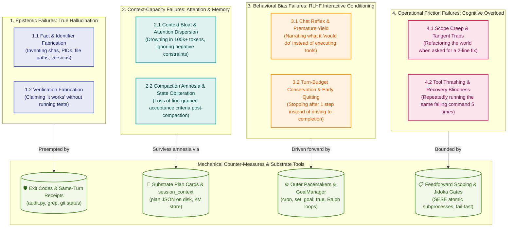

# Methodology Module 01: LLM Cognition, Agent Nature & Failure Taxonomy

> **Core Law:** AI agents are probabilistic, conversational, and subject to memory degradation. Autonomous reliability cannot be achieved by prompt pleading; it requires an orthogonal failure taxonomy paired with deterministic substrate memory and mechanical execution gates.

---

## 1. The Orthogonal Agent Nature Failure Taxonomy

Lumping all agent anomalies under the vague label of "hallucination" leads to ineffective prompt-bloat remedies. An Autonomously Self-Improving Factory (ASIF) isolates four orthogonal failure families based on distinct generative mechanisms:



### 1.1 Epistemic Failures (True Hallucination)
* **Generative Mechanism:** Probabilistic next-token sampling ungrounded in physical facts or tool execution.
* **Manifestations:** Fabricating commit SHAs, PIDs, file paths, or claiming verification passes without test execution.
* **Substrate Counter:** **Deterministic Exit Codes & Same-Turn Receipts.** The absolute law: *no receipt, no verdict*. Every factual claim requires a live tool result (`rc=0`) in the same turn context.

### 1.2 Context-Capacity Failures (Attention Dispersion & Compaction Amnesia)
* **Generative Mechanism:** Attention dilution over massive contexts ("Lost in the Middle") and lossy semantic compression when context compaction triggers.
* **Manifestations:** Ignoring negative prompt constraints after 50k tokens; waking up post-compaction having forgotten pending sub-tasks, active intermediate variables, and acceptance criteria.
* **The Harness Pre-Compaction Warning:** The OpenCrabs runtime provides explicit pre-compaction warnings when context consumption approaches compaction limits. Rather than treating compaction as an unpredictable crash, an agent must treat this boundary signal as a deterministic trigger to flush in-flight ephemeral state into durable substrates (`plan` card on disk, `session_context` KV store) before history is summarized.
* **Substrate Counter:** **The `plan` Tool (Durable Disk Plan Card) + `session_context`.** 
  * The `plan` tool persists coarse task state, dependencies, and checkable criteria to disk (`.opencrabs_plan_<id>.json`), surviving history summarization.
  * `session_context` preserves ephemeral, fine-grained calculation variables across turns without polluting message history.
  * Calling `plan(operation="show_plan")` immediately re-anchors the model to ground truth upon waking post-compaction.

### 1.3 Behavioral Bias Failures (RLHF Interactive Conditioning)
* **Generative Mechanism:** Reinforcement learning from human feedback (RLHF) optimizes models to be polite, deferential, single-turn conversationalists.
* **Manifestations:** Chat reflex (narrating intent instead of executing); premature conversational yielding (asking "Should I proceed?"); early stopping before verified closure.
* **Substrate Counter:** **`GoalManager` (`set_goal: true`) + Outer Cron Pacemakers (P28).** Forces autonomous convergence loops (Ralph), disabling conversational pauses until acceptance criteria pass deterministically.

### 1.4 Operational Friction Failures (Scope Creep & Cognitive Thrashing)
* **Generative Mechanism:** Over-generalization from training data causing unbounded search depth and cascading errors.
* **Manifestations:** Tangent refactors; tool thrashing (repeating failed commands without hypothesis testing).
* **Substrate Counter:** **Single-Entry Single-Exit (SESE) Subprocesses + Jidoka Stop-on-Defect.** Strict turn budgets per atomic subprocess; immediate line halt on first gate failure.

---

## 2. The Single-Writer Locking Principle (P26)

State that lives only in chat is a memory of a conversation. Durable state lives in files on disk with **exactly one named writer**.

```python
import fcntl

# Pattern: Exclusive append lock with atomic monotonic row assignment
with open("evidence/ledger.jsonl", "a+") as f:
    fcntl.flock(f.fileno(), fcntl.LOCK_EX)
    # 1. Read existing rows to determine n + 1
    # 2. Write new JSONL row with timestamp
    # 3. fsync to flush to disk before releasing lock
    f.flush()
    fcntl.flock(f.fileno(), fcntl.LOCK_UN)
```

---

## 3. Jidoka & First-Pass Yield Recovery

1. **Jidoka (Autonomation / Stop-on-Defect):** In the Toyota Production System, line workers halt the assembly line immediately upon detecting an anomaly. In AI multi-agent factories, any gate failure in `tools/audit.py` or unit test suite requires an immediate halt and root-cause isolation before additional turns or code generation occur.
2. **Deterministic Pre-Flight Gates:** Before declaring a work unit complete, all mechanical gates must pass locally in sub-second execution time.
3. **Yield Telemetry:** First-pass yield is computed as `accepted_runs / total_runs`. Defect clusters trigger automatic remediation issues on the board via autonomous telemetry mining (`tools/synthesize_insights.py`).

---

## 4. The Mirror Test: these are not AI failures, they are mind failures

The taxonomy above is not a list of machine defects. Every family in it describes a failure mode that humans already have a name for, a remedy for, and centuries of practice at mitigating — because a probabilistic memory that degrades under load is what a person's mind is, too.

Before designing a counter for an observed agent defect, run the mirror test: ask the same question of yourself.

| Mirror question | Human name for it | Family |
|---|---|---|
| Do you ever forget anything? | Forgetting, absent-mindedness | 2 — Context-capacity |
| Have you ever "remembered" something that never happened? | Confabulation, false memory | 1 — Epistemic |
| Have you ever lost the thread in a flood of information? | Overload, attention fatigue | 2 — Context-capacity |
| Have you ever lost focus while being bombarded from several directions? | Interruption cost, context switching | 2 + 4 |
| Have you ever said "yes, done" to end an awkward exchange? | Social lubrication, conflict avoidance | 3 — Behavioral bias |
| Have you ever kept going on the wrong thing because stopping meant admitting it? | Sunk cost | 3 + 4 |

The value of the mirror test is diagnostic, not decorative. It tells you where to look for the remedy: where humans solved this, the solution is usually a *practice* rather than a smarter brain — and a practice can be implemented as mechanical substrate, which is exactly what a factory is. It also predicts where the resemblance stops, and §7 states those limits.

---

## 5. The Management Analogy: a factory is a department

The second half of the same insight: if you have ever run a department, you already know how to run an agent factory. The correspondence is close enough to be a design method.

| A department has | A factory has |
|---|---|
| People who talk to each other | Sessions that message each other |
| People who ask each other questions | Peer lanes that query each other directly |
| People who hand work over | Push handoff to the owning session |
| People who contend for shared resources | Contention for one ledger, one repo, one claim |
| An escalation path upward | Triage → HQ → owner |
| A manager accountable for the process | Exactly one named process owner (P31) |
| People who complain about each other | Cross-lane defect reports routed to the owning lane |

Consequence: **org design is the design method.** The counters below are not novel inventions; they are the standard instruments of managing work, re-expressed in substrate.

| Human remedy | Why it works for people | Substrate implementation |
|---|---|---|
| Written checklist | Takes recall off the critical path | `plan` card on disk — survives compaction |
| External notes, notebook | Offloads working memory to a durable medium | `session_context`, ledger, `rework.md` |
| Standard work, SOP | Makes the right action the default action | `SKILL.md` + role cards, reloaded after compaction |
| Shift handover note | Carries state across a change of worker | Pre-compaction flush into the plan card |
| Two-person rule, peer review | An independent reader catches what the author cannot | Adversarial isolated review (P32), mechanical gates |
| Job rotation, fresh eyes | Breaks author-blindness | Review in an isolated session with a clean context |
| Single accountability | Shared ownership is zero ownership | P31 — one named process owner |
| Escalation path | Unblocks a worker who cannot decide alone | Triage → HQ → owner |
| Defect log with root cause | Stops the same defect recurring | `evidence/rework.md` with a `Prevented by` column |
| Stop-the-line authority | Prevents building on a known-bad unit | Jidoka — halt on first gate failure |

Two entries are structurally the same remedy: peer review and job rotation both work by putting a *different* reader on the work. In a factory both reduce to one mechanism — an isolated review session with a clean context window. That is why P32 requires isolation, rather than merely asking the author to re-read their own work.

---

## 6. The Trap Runbook

The taxonomy says what goes wrong. This says what to do about it, stated as the moment it happens, because that is when it is cheap to catch.

### Trap 1 — You are about to say "done"
**Symptom:** you are writing a completion sentence and the last tool result in your context is not the one that proves it.
**Counter:** name the receipt. If the proving command has not run, run it; if it ran, quote it. No receipt, no verdict — and "I have not verified this" is a complete and acceptable answer.

### Trap 2 — You are about to state a number, a sha, a path or an id
**Symptom:** the value came from memory or from mental arithmetic rather than from a tool result in this turn.
**Counter:** copy the full value out of live output, and compute with a tool, never in your head. A number must travel with its predicate: say what it counts and how it was counted, or state no number.

### Trap 3 — The context is getting long
**Symptom:** the harness warns that compaction is approaching; earlier instructions feel faint; you are re-reading things you already read.
**Counter:** flush *before* the summary — remaining steps and acceptance criteria into the plan card, in-flight variables into `session_context` — then carry on. After compaction, reload the skill and read the plan back from disk before any ruling, dispatch or status claim.

### Trap 4 — You are about to ask the operator something you could answer yourself
**Symptom:** the answer is in a file, a log, or a tool you have not called.
**Counter:** call the tool. Ask the operator only for a decision, a preference or a credential — never for a fact the substrate can supply. Ask once, with the options framed, then stop.

### Trap 5 — You have run the same failing command twice
**Symptom:** the second result resembles the first.
**Counter:** stop. Jidoka — halt, isolate the root cause, form a hypothesis, then act on the hypothesis. Repetition is not progress; a changed input is.

### Trap 6 — The task has grown beyond the work unit
**Symptom:** you are fixing something nobody asked about, "while you are in there".
**Counter:** write it down as its own item and finish the one you claimed. Scope is a decision that belongs to whoever owns the queue, not to whoever is mid-task.

### Trap 7 — You are about to accept a green you did not run
**Symptom:** the gate is reported passing by another lane, by an earlier turn, or by a summary.
**Counter:** run it yourself, in this turn, and read the exit code. A gate's green is only worth the same-turn receipt for it.

### Trap 8 — You are about to widen a gate so that it passes
**Symptom:** the honest reading of the law and the gate's verdict disagree, and the cheaper fix is the gate.
**Counter:** never. Change what the gate *measures* so it passes honestly, or surface the conflict upward. A gate edited to accommodate a violation has been deleted while appearing to remain (P15).

### Trap 9 — You are about to hand off by writing it down and moving on
**Symptom:** the next owner will not see the work unless they happen to poll.
**Counter:** push it. Write the durable record, then dispatch directly to the owning session. The ledger records what happened; it is not the conveyor belt that makes it happen.

### Trap 10 — You are about to close a work unit whose gate you have not re-run since the last edit
**Symptom:** the last edit came after the last green.
**Counter:** re-run the gate. Every edit invalidates the previous green, and a close row is a durable claim that will be read by someone who was not there.

---

## 7. What the mirror test does not license

The analogy is a design heuristic, not a claim about what an agent is. Two limits keep it honest:

1. **A similar symptom is not the same cause.** A person who forgets may be tired or distracted; an agent that forgets has had its history summarized. The remedy is chosen from the *mechanism*, which is exactly why §1 separates the families by generative mechanism rather than by how the failure looks from outside.
2. **The analogy predicts where it fails, too.** A person can notice they are confused and say so. An agent's report of its own confidence is produced by the same process that produced the error, so it carries no independent information. This is the reason every counter in §5 and §6 is external and mechanical — receipts, gates and durable state — and none of them is introspection.


