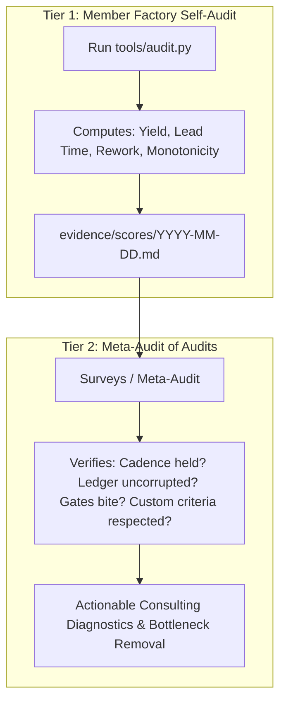

# Methodology Module 02: Process & Quality Management

> **Core Law:** An autonomous factory is an eval loop. Quality is measured objectively via first-pass yield, lead time, and rework rates, upheld by a two-tier quality architecture.

---

## 1. The Two-Tier Quality Architecture (ISO 9001 for Agent Factories)

Quality cannot be sustained through direct, external micromanagement. It requires two distinct tiers:

- **Tier 1 (Internal Quality Control):** Every member factory runs its own deterministic `tools/audit.py` on a daily pacemaker, evaluating its mechanical gates, first-pass yield, and rework rate.
- **Tier 2 (External Quality Assurance / Meta-Audit):** The meta-factory surveys the *validity of the self-audit*, spot-checking receipts, measuring cadence integrity, and analyzing queue dwell time vs. active execution time.

---

## 2. Core Factory Metrics

| Metric | Definition | Formula | Target |
|---|---|---|:---:|
| **First-Pass Yield ($A_0$)** | Share of task runs accepted on turn 1 without rework. | $\frac{\text{Accepted on Turn 1}}{\text{Total Runs}}$ | $\ge 90\%$ |
| **Average Task Lead Time** | Total duration from `intake` to `close`. | $\frac{1}{N} \sum (t_{\text{close}} - t_{\text{intake}})$ | Monitored |
| **Queue Dwell Ratio** | Proportion of lead time spent idling in queues vs. active execution. | $\frac{t_{\text{claim}} - t_{\text{intake}}}{t_{\text{close}} - t_{\text{intake}}}$ | $< 20\%$ |
| **Rework Rate** | Number of rework defects relative to closed tasks. | $\frac{\text{Total Rework Entries}}{\text{Total Closed Tasks}}$ | Decreasing |
| **Unit Cost per Task** | Average dollar token cost per closed deliverable. | $\frac{\text{Total USD Cost}}{\text{Closed Tasks}}$ | Tracked |

---

## 3. The Rework & Self-Improvement Loop

1. **Defect Codification:** Every failure caught in verification or post-release is recorded in `evidence/rework.md`.
2. **Mandatory Prevented By Column:** Entries must name a specific mechanical gate or prompt rule. Vague entries ("be more careful") are rejected by `tests/test_rework.py`.
3. **Automated RSI Trigger (P1/P27):** When daily audit scores regress or rework recurs, intake issues are automatically filed on the board to upgrade gates and prompt laws.
