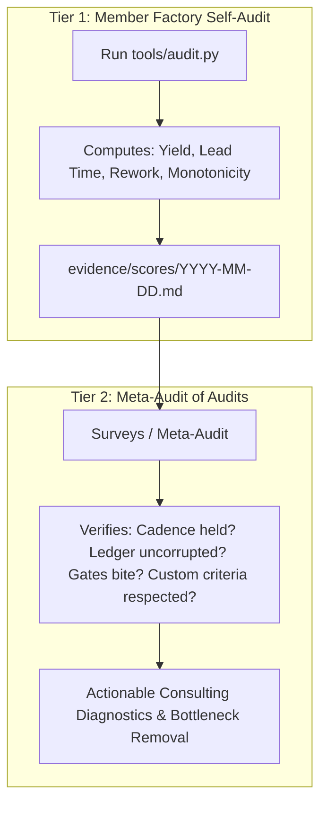
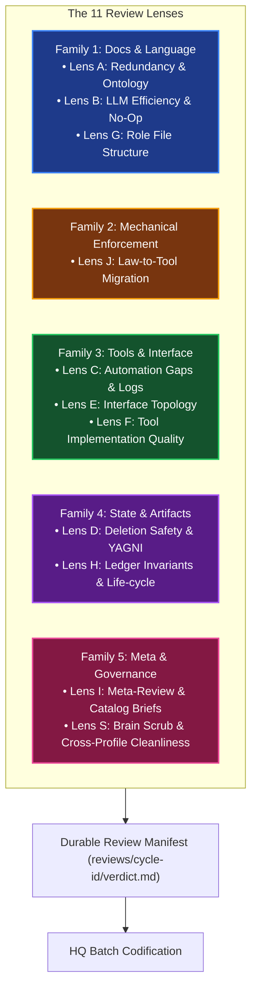

# Methodology Module 02: Process & Quality Management

> **Core Law:** An autonomous factory is an eval loop. Quality is measured objectively via first-pass yield, lead time, and rework rates, upheld by a two-tier quality architecture.

---

## 1. The Two-Tier Quality Architecture (ISO 9001 for Agent Factories)

Quality cannot be sustained through direct, external micromanagement. It requires two distinct tiers:

- **Tier 1 (Internal Quality Control):** Every member factory runs its own deterministic `tools/audit.py` on a daily pacemaker, evaluating its mechanical gates, first-pass yield, and rework rate.
- **Tier 2 (External Quality Assurance / Meta-Audit):** The meta-factory surveys the *validity of the self-audit*, spot-checking receipts, measuring cadence integrity, and analyzing queue dwell time vs. active execution time.

---

## 2. Core Factory Metrics

| Metric | Definition | Formula | Target |
|---|---|---|:---:|
| **First-Pass Yield ($A_0$)** | Share of task runs accepted on turn 1 without rework. | $\frac{\text{Accepted on Turn 1}}{\text{Total Runs}}$ | $\ge 90\%$ |
| **Average Task Lead Time** | Total duration from `intake` to `close`. | $\frac{1}{N} \sum (t_{\text{close}} - t_{\text{intake}})$ | Monitored |
| **Queue Dwell Ratio** | Proportion of lead time spent idling in queues vs. active execution. | $\frac{t_{\text{claim}} - t_{\text{intake}}}{t_{\text{close}} - t_{\text{intake}}}$ | $< 20\%$ |
| **Rework Share** | Rework entries as a share of all work accounted for — the closed work units plus the rework itself. The form that compares across factories of different size. | $\frac{\text{Rework Entries}}{\text{Closed Work Units} + \text{Rework Entries}}$ | Decreasing |
| **Rework per Close** | Rework entries paid per unit of planned work closed. The form that says how much repair this factory pays for each unit it intended to deliver. | $\frac{\text{Rework Entries}}{\text{Closed Work Units}}$ | Decreasing |
| **Change Fail Rate** | Closes whose change actually failed, as a share of closed work units. The Stability form (O2): it asks *how often a change fails*, which is a different question from how much repair is paid — see the coverage note below, without which the number is unreadable. | $\frac{\text{Closes with a Rework Entry}}{\text{Closed Work Units}}$ | Decreasing |
| **Unit Cost per Task** | Average dollar token cost per closed deliverable. | $\frac{\text{Total USD Cost}}{\text{Closed Tasks}}$ | Tracked |

> **One name, one number.** The two forms above are never both called "the rework rate":
> they answer different questions and differ by a wide margin, so a single name would
> leave a reader unable to tell which number was meant — and unable to tell a real change
> from a switch of form. `tools/audit.py` reports them as `rework_share` and
> `rework_per_close`, each computed from the denominator its own name states, and
> `tests/test_audit_rates.py` fails if either form is missing or the two collapse onto one
> value.
>
> **Denominator.** "Closed work units" counts distinct work units, never close events: a
> work unit that is re-opened and closed again carries two `close` rows and is still one
> unit of closed work. The audit therefore reports `closed_subjects` (the denominator) and
> `close_events` (the rows) side by side, so the denominator is reconciled rather than
> assumed.
>
> **Change fail rate is a third metric, not a third form of the rework rate.** Both rework
> forms above divide the *same* numerator — every rework entry — by a denominator they each
> name. The change fail rate divides a **different** numerator: only those closes whose
> change actually failed, read from the `Subject` column of `evidence/rework.md`. A defect
> caught before any change landed carries `none` — a rework entry, but not a failed change.
> An entry written before the column existed carries `not recorded (pre-column)` and cannot
> be attributed either way, so it is an absence of evidence and never evidence of no
> failure. A `#<n>` naming a work unit that never closed is likewise not a failed change.
>
> **The coverage is mandatory and travels with the rate.** The numerator is only as complete
> as that column, so a bare rate is forbidden: an under-linked numerator of 0 reads as
> "nothing ever failed" when the truth is "nothing is linked". `tools/audit.py` therefore
> emits the rate and its linkage coverage in the same payload — `change_fail_rate`,
> `change_fail_rate_numerator`, `change_fail_rate_denominator` (always
> `closed_subjects`), `subject_coverage`, `subject_coverage_numerator` and
> `subject_coverage_denominator` (always the rework entry count) — and prints them on one
> report line, e.g. `2.9% = 1 ÷ 34 closed work units (linkage coverage: 3/22 entries carry a
> determinate Subject)`. `tests/test_audit_rates.py` fails if the coverage is missing from
> the payload or the report, if the numerator is stated rather than re-derived from the log,
> or if the denominator drifts off `closed_subjects`.

---

## 3. The Rework & Self-Improvement Loop

1. **Defect Codification:** Every failure caught in verification or post-release is recorded in `evidence/rework.md`.
2. **Mandatory Prevented By Column:** Entries must name a specific mechanical gate or prompt rule. Vague entries ("be more careful") are rejected by `tests/test_rework.py`.
3. **Automated RSI Trigger (P1/P27):** When daily audit scores regress or rework recurs, intake issues are automatically filed on the board to upgrade gates and prompt laws.

---

## 4. Periodic 11-Lens Factory Review (Process Evolution)

In addition to defect-driven rework, mature factories run a periodic **11-Lens Review** (adapted from OpenCrabs Dev Duty 4+6 and codified in **P32**) every $N$ versions or regular operational intervals.

The review decomposes factory health across five independent families:

### Review Invariants
- **Adversarial Sub-Agent Isolation:** Review lenses MUST be executed by dedicated sub-agents spawned with clean context windows and adversarial auditor briefs (`tools/review.py brief <lens>`). The primary authoring agent suffers from conversational self-confirmation bias; an isolated adversarial sub-agent is instructed to actively seek defects, contradictions, and prompt waste.
- **Quote-Anchored Findings:** Findings without a verifiable file locator and verbatim quote are rejected.
- **Pure Function Test (Lens J):** Any prose directive whose decision can be settled from disk state is converted into a deterministic CLI script or mechanical test.
- **Single-Writer Codification:** Reviewer lenses operate read-only. Only HQ codifies findings into process files.
