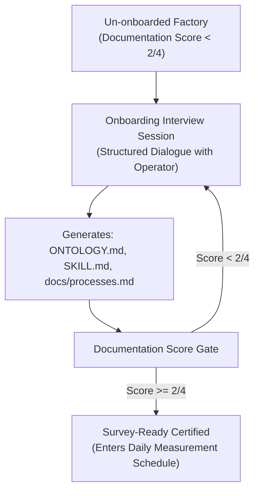

# Methodology Module 03: Documentation Standards & The Documentation Object Class

> **Core Law:** Documentation is a first-class operational object class that must be scored against an objective 0–4 rubric. A factory cannot be surveyed until its documentation achieves baseline calibration ($\ge 2/4$).

---

## 1. The Dual Documentation Requirement

Every autonomous factory requires two distinct documentation pillars:

1. **Subject Matter Documentation (`docs/subject/`):** Explains *what* the factory builds (domain model, business rules, API schemas, client deliverables).
2. **Factory Methodology Documentation (`docs/methodology/`):** Explains *how* the factory operates (LLM weakness counters, quality loops, harness bindings, surface bindings).

---

## 2. The Documentation Scoring Rubric (4 Dimensions, 0–4)

| Dimension | Minimal Baseline (Score 2) | Exemplary Standard (Score 4) |
|---|---|---|
| **1. Ontology (`ONTOLOGY.md`)** | $\ge 10$ core domain terms defined unambiguously with canonical definitions. | Full ontology with canonical terms, banned synonyms, entity lifecycles, and test gate (`tests/test_ontology.py`). |
| **2. Process Register (`docs/processes.md`)** | All core processes declared with named single owner role and custom acceptance criteria. | All processes decomposed into atomic subprocesses with explicit input/output contracts and lead time targets. |
| **3. Process Law (`SKILL.md`)** | Execution rules, forbidden actions, and role boundaries declared. | Full feedforward constraints, rework memory integration, and post-compaction recovery anchors. |
| **4. Substrate & Harness Bindings** | Chat surface and agent runtime paths explicitly documented. | Full telemetry hooks, single-writer locking, and zero-token trigger probes wired. |

---

## 3. The Onboarding / Gap-Closing Interview Loop

When bootstrapping a new factory or onboarding a legacy codebase:

- **Objective:** Bridge the documentation gap rapidly through structured dialogue.
- **Stop Condition:** Terminates when all 4 documentation dimensions score $\ge 2/4$.
- **Outcome:** The factory is baseline calibrated, enabling meaningful consulting and automated audits.
