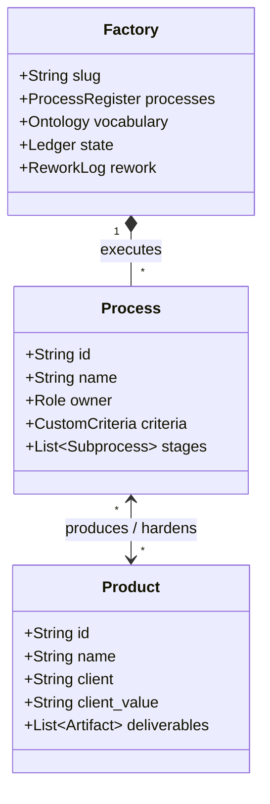

# Subject Documentation: Meta-Factory Domain Model

> **Domain:** Autonomous AI Agent Factories, Process Engineering, and Multi-Tier Quality Assurance.

---

## 1. Domain Entities & Core Architecture

---

## 2. Core Value Streams
1. **Factory Template & Add-on Packs:** Production-ready factory scaffolding.
2. **Consulting & Advisories:** Diagnostic reporting and bottleneck elimination for member factories.
3. **Factory Growth Map:** 5-stage maturity model from prototype to fleet.
4. **Empirical Insights Narrative:** Case studies on real-world multi-agent factory operations.
