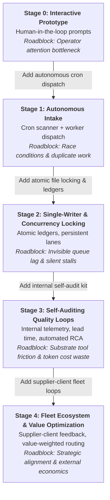

# Factory Growth & Maturity Map

**Owns:** the evolutionary trajectory of agent factories across throughput bands, mapping the
inevitable roadblocks and the structural mechanisms required to transition between stages.

---

## 0. The Core Thesis: Roadblocks Shift With Throughput

A factory producing 5 commits a month has fundamentally different failure modes than a
factory handling 1,200 events a day.

Applying Stage 3 governance to a Stage 0 experiment kills momentum with bureaucracy.
Conversely, trying to scale a Stage 1 prompt setup into continuous production produces
uncontrolled token burn, race conditions, and silent task loss.

This document maps the **5 stages of agent factory maturity**, defining:
1. **The Operating Profile** (velocity, actors, state model)
2. **The Inevitable Roadblock** (the ceiling that halts growth at that stage)
3. **The Breakthrough Mechanism** (the architectural transition required to unlock the next band)
4. **Primary Health Metric** (what to measure to know if the stage is healthy)

---

## 1. The 5 Evolutionary Stages

---

### Stage 0: Interactive Prototype (Prompt-Driven)

- **Throughput:** 1–5 tasks / week.
- **Operating Profile:** Single interactive session. Human operator writes prompts, reviews code, runs tests, and guides every turn.
- **The Roadblock:** **Operator Attention Fatigue.** The factory's capacity is strictly limited by human availability. The operator spends hours babysitting turn completions.
- **Breakthrough Mechanism:** Decouple intake from human presence. Move to issue boards as the single intake surface and introduce an autonomous polling trigger.
- **Primary Metric:** `turns_per_task` (human intervention ratio).

---

### Stage 1: Autonomous Intake & The Pacemaker Law (Continuous Flow)

- **Throughput:** 5–50 tasks / week.
- **Operating Profile:** Scheduled jobs (crons) act as thin pacemakers, periodically notifying persistent lane sessions to scan the issue board, match open tasks, and invoke worker agents.
- **The Pacemaker Law:** Every agent role that owns a periodic process must have a dedicated thin cron pacemaker waking its session UUID. Without it, conversational bias halts the loop.
- **The Roadblock:** **The Concurrency Paradox & Queue Lag Illusion.**
  1. Multiple cron sweeps spawn duplicate workers on the same issue, leading to git merge collisions and clobbered work.
  2. While LLMs code in minutes, tasks spend 95% of their lifecycle idling in queue waiting for polling cycles (The 10.4-Hour Queue Trap).
- **Breakthrough Mechanism:** Atomic task claiming via exclusive file locks (`fcntl.flock`), single-writer state surfaces, and thin session-nudging pacemakers.
- **Primary Metric:** `queue_dwell_time` (time from issue creation to first worker claim).

---

### Stage 2: Single-Writer & Concurrency Locking

- **Throughput:** 50–200 events / day.
- **Operating Profile:** Multi-lane operations. Persistent topic-bound workers. State transitions recorded in immutable, append-only ledgers (`evidence/ledger.jsonl`).
- **The Roadblock:** **The Inspector's Trap & Silent Rework.**
  The factory appears busy and commits are landing, but defects are repeatedly caught downstream. Without internal telemetry, the factory cannot distinguish real progress from repetitive churn and rework loops.
- **Breakthrough Mechanism:** The **Self-Audit Kit** (`tools/audit.py`). Transition from external inspection to internal self-auditing, calculating First-Pass Yield, Rework Share, and Rework per Close mechanically.
- **Primary Metric:** `first_pass_yield` (percentage of tasks completed without requiring rework).

---

### Stage 3: Self-Auditing Quality Loops

- **Throughput:** 200–1,000 events / day.
- **Operating Profile:** Autonomous continuous integration. Defects automatically trigger root-cause analysis (RCA), writing prevention rules into tests (`tests/test_rework.py`). The factory audits its own lead times and yields daily.
- **The Roadblock:** **Substrate Friction & Economic Waste.**
  Internal processes are disciplined, but execution hits limits in the underlying agent runtime (e.g. inability to bind forum topics autonomously, model timeout loops, token cost inefficiencies).
- **Breakthrough Mechanism:** **Supplier-Client Fleet Loops.**
  Formalize relationships with fleet suppliers:
  - Runtime harness supplier (e.g. OpenCrabs core): report substrate defects, demand native tools (e.g. Issue #170 topic auto-binding).
  - Inference provider (e.g. InferHub): monitor cache hit rates, prompt token demand, and model value routing.
- **Primary Metric:** `cost_per_accepted_task` ($ / task) split by Demand vs Supply.

---

### Stage 4: Fleet Ecosystem & Value Optimization

- **Throughput:** 1,000+ events / day.
- **Operating Profile:** Network of specialized, autonomous factories (development, analytics, domain bots) interacting via structured protocols. Minimal operator intervention required except for strategic priority setting.
- **The Roadblock:** **Strategic Alignment & Value Drift.**
  The machine runs at blistering speed, but optimizes for easy tasks rather than highest client value.
- **Breakthrough Mechanism:** Value-weighted priority routing (e.g. Artificial Analysis IQ / ask-weighted value crowns) and automated portfolio governance.
- **Primary Metric:** `net_client_value_delivered` per unit of capital burned.

---

## 2. Stage Transition Matrix

| From | To | Trigger to Evolve | Mechanics to Deploy |
|---|---|---|---|
| **0** | **1** | Operator spends >2 hrs/day babysitting agent turns | Issue board intake + thin cron pacemaker nudges |
| **1** | **2** | Workers collide on git branches or duplicate claims | `tools/ledger.py` with `fcntl.flock`, closed actor sets |
| **2** | **3** | Rework share exceeds 30% or tasks stall silently | `tools/audit.py`, `evidence/rework.md`, RCA gates |
| **3** | **4** | Substrate friction or token costs dominate spend | Supplier-client loops, runtime feature requests, value routing |

---

## 3. Template Packaging Rule

Every factory bootstrapped from the template starts with the architectural foundations for **Stage 2 and 3** pre-installed:
- `tools/ledger.py` (atomic single-writer locking)
- `tools/audit.py` (internal self-audit)
- `tests/test_single_writer.py` (state surface verification)
- `tools/hygiene.py` (garbage collection)

A new factory operates in **Stage 0 or 1** mode initially, but inherits the guardrails so it does not suffer the concurrency crashes and rework blindness when throughput accelerates.

---

## 4. Bi-Weekly Fleet Calibration & Maturity Verification (2026-09-16)

> **Pacemaker Cadence:** Bi-Weekly (1st & 15th) · `factory-growth-map-biweekly`  
> **Evaluation Rubric:** Quality Criteria v0.4 (17 criteria across 5 families, max 68)  
> **Telemetry Source:** Live state across 6 fleet factories (`evidence/scores/2026-09-16.md`, `evidence/ledger.jsonl`, git trees, and CI/audit receipts)

### Fleet Maturity Census

| Factory | Score (v0.4/68) | Maturity Band | Active Stage | Target Stage | Breakthrough Mechanism Deployed | Primary Health Metric Status |
|---|:---:|:---:|:---:|:---:|---|---|
| **Meta-factory** | **65** (96%) | **Optimizing** | **Stage 3** | Stage 4 | Tier-1 Self-Audit Kit (8 green gates), single-writer `fcntl.flock`, automated RCA (`rework.md`) | First-pass yield: 100%, rework rate: 77.8%, avg cost/task: $0.0138 |
| **OpenCrabs dev** | **56** (82%) | **Optimizing** | **Stage 3** | Stage 4 | 4-leg smoke rubric, atomic `workers-ledger.json` (`fcntl.flock`), fast-swap rollback journal | Smoke pass rate: 100% on 850+ runs; throughput: 480+ events/day |
| **InferHub Watch** | **53** (78%) | **Optimizing** | **Stage 3** | Stage 3 | Tier-1 Self-Audit Kit, 762 automated pytests, hourly cron pacemaker | 100% self-audit yield; True TPS & latency telemetry active |
| **Miidas** | **53** (78%) | **Optimizing** | **Stage 3** | Stage 3 | Tier-1 Self-Audit Kit (8 green gates), single-writer `fcntl.flock`, `rework.md` | 100% self-audit yield; 337 pytests passing clean |
| **Infra Factory** | **50** (74%) | **Scalable** | **Stage 2** | Stage 3 | Single-writer ledger (`fcntl.flock`), 5 mechanical audit gates, topic-based coordination | 100% yield on 5 gates; first closed end-to-end task lead time met |
| **AI AntiSpam** | **35** (51%) | **Scalable** | **Stage 1** | Stage 2 | 0-token preflight cron pacemakers (`trigger_cmd`), Postgres single-writer | 500+ tests pass; blocked on D3 until file-level ledger & audit kit adopted |

### Stage-by-Stage Verification Summary

1. **Stage 0 (Interactive Prototype): 100% Graduated (0/6 active).**
   - No fleet factory relies on prompt-by-prompt human operator guidance.
   - All 6 factories intake tasks from persistent surfaces (GitHub boards, topic backlogs, or structured sweep epochs).

2. **Stage 1 (Autonomous Intake & The Pacemaker Law): 100% Conformance.**
   - All factories operate scheduled cron pacemakers waking persistent session UUIDs.
   - OpenCrabs v0.5.1 thin cron spec with zero-token pre-flight checks (`trigger_cmd`) and `set_goal: true` successfully rolled out to AI AntiSpam (`cfb86dc5`), Infra Factory (`d6119dbc`), and Miidas (`a2936da9`).
   - 1 factory (AI AntiSpam) currently resides at Stage 1, actively working on Stage 2 concurrency mechanisms.

3. **Stage 2 (Single-Writer & Concurrency Locking): 83.3% Deployed (5/6 active).**
   - Meta-factory, OpenCrabs dev, InferHub Watch, Miidas, and Infra Factory enforce immutable, append-only ledgers guarded by `fcntl.flock` with closed actor sets.
   - Concurrency collisions eliminated across multi-lane sessions.
   - AI AntiSpam has Postgres transaction safety for outreach, but requires the repo-level single-writer ledger to complete Stage 2 transition.

4. **Stage 3 (Self-Auditing Quality Loops): 66.7% Active / Piloted (4/6 active).**
   - **Meta-factory & OpenCrabs dev:** Full Stage 3 maturity. Meta-factory runs 8 deterministic gates via `tools/audit.py`, measuring lead times, yields, and automated issue generation (P1/P27). OpenCrabs dev enforces a 4-leg smoke verification rubric before any harvest PR.
   - **Miidas & InferHub Watch:** Piloting Stage 3. Miidas runs 8 green audit gates and maintains `rework.md`; InferHub Watch runs 762 automated pytests and hourly self-audits.
   - **Infra Factory:** Initial Stage 3 loops deployed with 5 mechanical audit gates.

5. **Stage 4 (Fleet Ecosystem & Value Optimization): 33.3% In Progress (2/6 pioneering).**
   - Meta-factory and OpenCrabs dev have established active supplier-client fleet loops.
   - Meta-factory reports substrate friction directly to OpenCrabs (e.g. Issue #170 forum topic auto-binding) and inference telemetry to InferHub.
   - OpenCrabs dev operates as the upstream engine supplying the runtime binary.
   - Next milestone: value-weighted task routing and cross-factory token economics.
