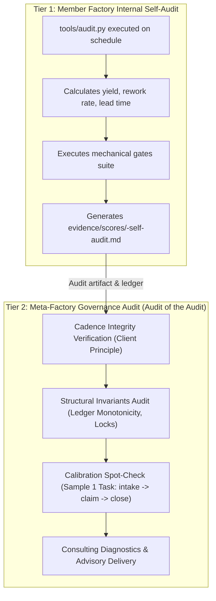
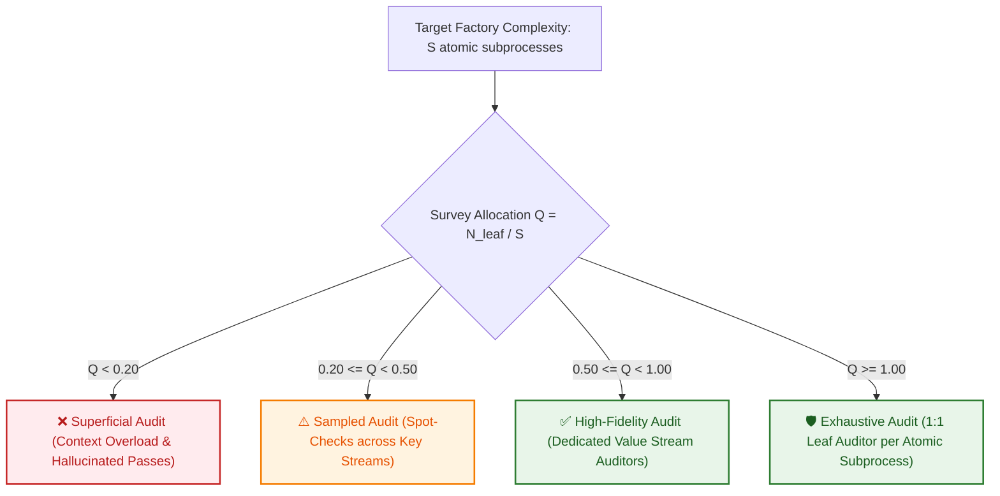

# Daily factory measurement — procedure

The recurring measurement run. **The scheduled job's prompt points here; the
procedure lives in this file, not in the job.**

> Why: a job's definition cannot be updated by a change to the law. Procedure
> embedded in a job prompt silently goes stale the moment this file changes.
> The job carries a pointer; this file carries the procedure.

---

## 1. Purpose: Measurement & Consulting Practice

This procedure operationalizes **Process 3 (Operational Measurement & Consulting)**
from the Process Register ([processes.md](processes.md)). It fulfills the factory's
two-part mission:
1. **The Product:** Measure effectiveness and health across the surveyed fleet against
   [quality-criteria.md](quality-criteria.md), deriving template laws from empirical patterns.
2. **The Consulting Practice:** Act as a process consultant to surveyed member
   factories, diagnosing operational bottlenecks, detecting stalled pipelines, and
   advising member factory HQs on concrete interventions to increase throughput,
   cadence, and first-pass yield while eliminating waste.

---

## 2. Roles and the Process Triad

| Role | Entity | Accountability & Function |
|---|---|---|
| **Process Owner** | `Surveys` role (meta-factory) | Accountable for the audit specification, rubric consistency, objective scoring, and consulting advisory delivery. |
| **Process Client** | Factory Owner & Member Factory HQs | Sets expectations for timing (daily at 09:00 MSK), consumes the dated scores, and uses consulting advisories to improve operational performance. |
| **Process Implementer** | Surveys lane / scheduled runner | Executes the survey steps, gathers live evidence, computes diffs, records telemetry, and formats reports. |

---

## 3. The Audit Lens: Process Operations & Value Streams

The survey evaluates a factory not as a static collection of files, but as a live
operating engine structured around **three primary operational processes**:

```mermaid
flowchart TD
    subgraph Stream1["1. Work Delivery Pipeline"]
        WD1["Intake and Spec"] --> WD2["Assignment and Lock"]
        WD2 --> WD3["Build and Self-Verification"]
        WD3 --> WD4["Automated Gates and Release"]
    end

    subgraph Stream2["2. Quality and Rework Prevention"]
        RP1["Defect Isolation"] --> RP2["Mechanism RCA"]
        RP2 --> RP3["Automated Gate Creation"]
        RP3 --> RP4["Contiguous Rework Log"]
    end

    subgraph Stream3["3. Governance and Measurement"]
        GM1["Standing Cadence"] --> GM2["Process Register Audit"]
        GM2 --> GM3["Telemetry and Yield Tracking"]
    end
```

For each surveyed factory, the audit examines:

### 3.1 Work Delivery Pipeline (Value Stream)
- Does work flow reliably from client finding/task to verified release?
- Is intake disciplined with explicit acceptance criteria, or do lanes begin work on vague prompts?
- Is there a clear handoff and locking mechanism preventing duplicate work?
- Are verification gates mechanized and automated, or does release rely on manual review?
- Where is work currently queueing or stalling?

### 3.2 Quality & Rework Prevention (Feedback Loop)
- When a bug or regression occurs, what process runs to ensure it never happens again?
- Does the factory perform root cause analysis identifying the structural mechanism, or does it record superficial narrative blame?
- Is every defect paired with an automated test, mechanical gate, or enforceable law preventing recurrence?
- Is the rework log contiguous, audited, and linked to real preventative changes?

### 3.3 Governance, Measurement & Laws without Processes
- Does the factory maintain an accurate, audited process register?
- Are codified laws (e.g. single-writer state, workspace cleanliness, boundary enforcement) actually upheld by running processes and automated gates, or are they dead letters?
- Are process costs co-owned across Demand (prompt/model efficiency) and Supply (token provider latency/pricing)?

---

## 4. The Client Principle: Scoring Cadence & Stalled Triggers

Per **Ruling 4 (2026-09-13)**:
> *"Every process runs for its client. The client decides when the process should start.
> The failure to start when the client expects it to run is a failure and should be
> scored as such."*

The surveyor does not merely check if a cron job or scheduled trigger is written in a file:
1. **Verify live execution against declared cadence:** Inspect the factory's scheduler,
   run logs, and ledger timestamps.
2. **Deadlocks and missed triggers are execution failures:** If an automated cycle was
   scheduled to run hourly or daily and silently stalled (e.g. locked scheduler, missed
   trigger, unhandled exception), it is recorded as `outcome = failed`.
3. **Scoring penalty:** A stalled or deadlocked process directly depresses **Stability**
   and **Cadence**. Codification without live execution does not earn level 3 or 4.

---

## 5. What One Run Does: The Two-Tier Audit Architecture

The measurement framework operates as a **two-tier quality management system**:

### Step-by-Step Procedure:

1. **Tier 1 — Internal Self-Audit (Local Factory Execution):**
   - Each factory runs its own internal self-audit using `tools/audit.py` (or local equivalent).
   - Verifies ledger sequence monotonicity, single-writer locking, and gate bite.
   - Derives operational measures: first-pass yield, rework rate, lead time.
   - Records run telemetry into `evidence/ledger.jsonl`.

2. **Tier 2 — Meta-Audit of Member Factories (By Surveys Lane):**
   For each surveyed member factory:
   - **Cadence & Trigger Verification:** Inspect whether the factory's recurring self-audit executed on its declared schedule. A missed or stalled run is scored as `outcome = failed` per Ruling 4.
   - **Structural Invariants Check:** Audit ledger monotonicity, unbroken row numbering, and single-writer file locking in live state.
   - **Calibration Spot-Check:** Sample exactly **one** recently closed task from the member factory's ledger and audit the complete receipt chain (`intake` → `claim` → `run` → `close` + entry in `evidence/rework.md`). If the claims diverge from receipts, flag an audit calibration failure.
   - **Gate Verification:** Check whether mechanical gates ran and passed with live rc=0 receipts.
   *Rule: Never score from memory, narrative claims, or the previous report.*

3. **Audit against the 19 Quality Criteria:**
   Score each criterion (0–4) against [quality-criteria.md](quality-criteria.md) across all 6 families (Documentation, Output, Machine, Law, Stewardship, Autonomy).
   Evaluate whether capabilities are *Absent* (0), *Ad-hoc* (1), *Defined* (2),
   *Measured* (3), or *Self-correcting* (4).

4. **Assess Process Health & Cadence:**
   Evaluate the 3 core value streams and verify client cadence fulfillment. Flag any
   stopped, deadlocked, or un-upheld processes.

5. **Diff against Previous Run:**
   Compare each score against the previous dated entry in `evidence/scores/`. Note
   movement drivers and whether the calibration gap (self-score vs surveyor audit) is closing.

6. **Generate Consulting Diagnostics:**
   Formulate actionable, prioritized recommendations for that factory's HQ:
   - Bottlenecks in the Work Delivery Pipeline.
   - Recurrent defects requiring mechanical gates.
   - Stalled cycles requiring trigger restoration.
   - Un-upheld laws that lack automated verification.

7. **Record and Commit:**
   - Write dated report to `evidence/scores/<YYYY-MM-DD>.md`.
   - Append a `score` event row to `evidence/ledger.jsonl` via `tools/ledger.py append`,
     carrying the closing workspace-gate verdict (`workspace_gate=rc=0`) and the HEAD sha
     the run committed at — so the run is *recorded* as gated, not merely asserted to be
     (§2), and the verdict is checkable after the fact by anyone reading the ledger.
   - Commit cleanly to the repository.
   - **Closing invariant — the run is not finished until the workspace gate is clean.**
     Execute `python3 tools/hygiene.py --audit` and require **rc=0** before step 8. Any
     re-read correction landing *after* the commit above re-opens this step: commit it and
     re-run the gate. A gate that exists but is never invoked is dead text (P29), and the
     run's own artifact is the first thing it must cover — a score file left uncommitted is
     a claim the repository cannot back, and it strands the run's own Recoverability
     receipt at the moment that receipt is written.

8. **Report to Operator & Member HQs:**
   - Present summary, score movements, and fleet patterns to the Factories analysis topic.
   - Deliver consulting advisories to member factory HQs via direct communication channels.

---

## 6. Cognitive Bounds & Survey Resolution Ratio (Q = N_leaf / S)

### 6.1 The Mathematical Model
When inspecting a multi-agent factory or an entire fleet, a single context window cannot maintain high fidelity across hundreds of files, execution logs, and live state ledgers. Under **Ashby's Law of Requisite Variety (1956)**, the variety of the auditor must match or exceed the variety of the system being audited.

We define the **Survey Quality Resolution Ratio ($Q$)**:

$$Q = \frac{N_{\text{leaf}}}{S} = \frac{N_{\text{total}} - N_{\text{coord}}}{S}$$

Where:
* **$S$:** The total number of atomic subprocesses, distinct state surfaces, and endpoints in the target system.
* **$N_{\text{leaf}}$:** The number of independent, non-overlapping leaf auditor sessions inspecting distinct subsystems.
* **$N_{\text{coord}}$:** The coordinating auditor sessions orchestrating the survey and aggregating findings ($N_{\text{coord}} \ge 1$).
* **$N_{\text{total}}$:** The total session capacity allocated to the survey ($N_{\text{total}} = N_{\text{leaf}} + N_{\text{coord}}$).

### 6.2 Resolution Thresholds & Audit Fidelity

| Resolution Band | Ratio Range | Audit Granularity | Risk & Error Profile |
|---|:---:|---|---|
| **Superficial (Low)** | $Q < 0.20$ | Monolithic single-session scan of entire factory. | **Severe:** Context amnesia forces the agent to judge from README summaries rather than raw ledger receipts. |
| **Sampled (Medium)** | $0.20 \le Q < 0.50$ | Single auditor spot-checking 1–2 sampled tasks. | **Moderate:** Catches obvious broken files but misses silent deadlocks in edge subprocesses. |
| **High-Fidelity (High)** | $0.50 \le Q < 1.00$ | Dedicated leaf auditors assigned per value stream. | **Low:** Deep inspection of intake, claim, execution, and verification pipelines. |
| **Exhaustive (Full)** | $Q \ge 1.00$ | 1:1 leaf auditor per atomic subprocess with zero overlap. | **Zero:** Mathematically complete state and receipt coverage; zero context cross-contamination. |

### 6.3 Hierarchical Survey Fan-Out Procedure
For complex multi-factory fleets ($S \gg 10$), the **Surveys lane** acts as the coordinating auditor ($N_{\text{coord}}$):
1. **Decomposition:** Breaks the target factory into its canonical atomic subprocesses (Intake $\to$ Claim $\to$ Feedforward $\to$ Eval $\to$ Settlement).
2. **Leaf Auditor Dispatch:** Dispatches parallel leaf sessions via push handoff (`session_notify` with discrete goal and target subprocess scope).
3. **Receipt Aggregation:** Collects deterministic exit receipts, verifies proof artifacts (`cmp -s`, checksums, ledger monotonicity), and computes the composite quality score.

---

## 6. What One Run Must NOT Do (Hard Boundaries)

| Don't | Why |
|---|---|
| **Adjudicate a factory's product decisions** | That is its own HQ's responsibility. The survey measures the machine and process, not the product domain. |
| **Touch or edit a member factory's repository** | Doing a member's work violates **P25 (Non-Participation)**, duplicates lanes, and breaks their process ownership. |
| **Talk directly into a member factory's worker lanes** | Communication flows strictly between meta-factory (or Delegate) and the member factory's **HQ**. |
| **Report a score without a live receipt** | Every score is an evidentiary claim; claims require same-turn tool receipts. |
| **Bypass failures because "code is written"** | A written rule whose process does not execute is un-upheld; score what runs, not what is intended. |

**Unreadable factories:** If a factory's live state cannot be reached (e.g. repo inaccessible,
scheduler offline), log this as an explicit finding and score absent elements as 0.
"Could not read" and "scored zero" must be distinguished with the exact read failure stated.

---

## 7. Consulting Advisory Format

When communicating findings to a member factory HQ, structure each advisory around:
1. **Observed Symptom / Bottleneck:** What is stalled, drifting, or producing waste.
2. **Underlying Mechanism:** Why it is happening (e.g. scheduler lock, un-gated state file).
3. **Recommended Process Fix:** The concrete template pattern, gate, or role adjustment to resolve it.
4. **Expected Impact:** How the fix will improve throughput, cadence, or stability.

---

## 8. Surveyed Member Factory Roster

The fleet consists of 6 surveyed member factories:

| Factory | Repository | Purpose & Domain | Primary Client |
|---|---|---|---|
| **Meta-factory** | `/root/agent-factories` | Factory template governance, process laws, fleet measurement, consulting | Factory Owner & Member HQs |
| **OpenCrabs dev** | `/root/opencrabs` | Agent harness runtime, core daemon, tools, and channel gateways | Factory Fleet & Developers |
| **InferHub Watch** | `/root/inferhub-watch` | Token routing telemetry, pricing models, provider latency and health | OpenCrabs & Fleet Lanes |
| **AI AntiSpam** | `/root/ai-antispam` | Anti-spam filtering, outreach campaign sweeps, moderation | Channel Admins & Outreach |
| **Miidas** | `/root/miidas` | Multi-tenant customer dialogue automation and business operations | Business Tenants & Operator |
| **Infra** | `/root/vds-servers` | VDS server fleet ops (`vpn`, `apps`, `agents`), Gatus recovery, tunnels | Operator & Live Fleet Nodes |

---

## 9. Fleet Supplier-Client Feedback Loop

When live measurement reveals that member factories are experiencing friction caused by
underlying substrates (runtime harness or token provider):
- **Harness Friction:** Synthesize patterns and file instrument requests with the
  runtime development factory (e.g. native process telemetry hooks, topic auto-binding).
- **Inference & Token Supply:** Flag latency spikes, routing failures, or prompt caching
  anomalies with the inference monitoring factory (`inferhub-watch`).
