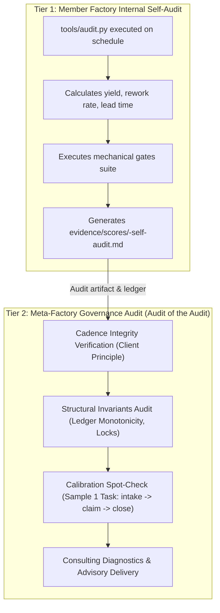
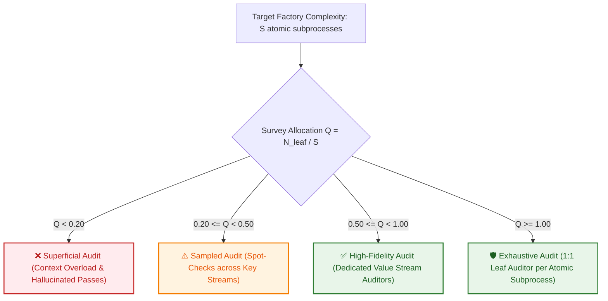

# Daily factory measurement — procedure

The recurring measurement run. **The scheduled job's prompt points here; the
procedure lives in this file, not in the job.**

> Why: a job's definition cannot be updated by a change to the law. Procedure
> embedded in a job prompt silently goes stale the moment this file changes.
> The job carries a pointer; this file carries the procedure.

---

## 1. Purpose: Measurement & Consulting Practice

This procedure operationalizes **Process 3 (Operational Measurement & Consulting)**
from the Process Register ([processes.md](processes.md)). It fulfills the factory's
two-part mission:
1. **The Product:** Measure effectiveness and health across the surveyed fleet against
   [quality-criteria.md](quality-criteria.md), deriving template laws from empirical patterns.
2. **The Consulting Practice:** Act as a process consultant to surveyed member
   factories, diagnosing operational bottlenecks, detecting stalled pipelines, and
   advising member factory HQs on concrete interventions to increase throughput,
   cadence, and first-pass yield while eliminating waste.

---

## 2. Roles and the Process Triad

| Role | Entity | Accountability & Function |
|---|---|---|
| **Process Owner** | `Surveys` role (meta-factory) | Accountable for the audit specification, rubric consistency, objective scoring, and consulting advisory delivery. |
| **Process Client** | Factory Owner & Member Factory HQs | Sets expectations for timing (daily at 09:00 MSK), consumes the dated scores, and uses consulting advisories to improve operational performance. |
| **Process Implementer** | Surveys lane / scheduled runner | Executes the survey steps, gathers live evidence, computes diffs, records telemetry, and formats reports. |

---

## 3. The Audit Lens: Process Operations & Value Streams

The survey evaluates a factory not as a static collection of files, but as a live
operating engine structured around **three primary operational processes**:

```mermaid
flowchart TD
    subgraph Stream1["1. Work Delivery Pipeline"]
        WD1["Intake and Spec"] --> WD2["Assignment and Lock"]
        WD2 --> WD3["Build and Self-Verification"]
        WD3 --> WD4["Automated Gates and Release"]
    end

    subgraph Stream2["2. Quality and Rework Prevention"]
        RP1["Defect Isolation"] --> RP2["Mechanism RCA"]
        RP2 --> RP3["Automated Gate Creation"]
        RP3 --> RP4["Contiguous Rework Log"]
    end

    subgraph Stream3["3. Governance and Measurement"]
        GM1["Standing Cadence"] --> GM2["Process Register Audit"]
        GM2 --> GM3["Telemetry and Yield Tracking"]
    end
```

For each surveyed factory, the audit examines:

### 3.1 Work Delivery Pipeline (Value Stream)
- Does work flow reliably from client finding/task to verified release?
- Is intake disciplined with explicit acceptance criteria, or do lanes begin work on vague prompts?
- Is there a clear handoff and locking mechanism preventing duplicate work?
- Are verification gates mechanized and automated, or does release rely on manual review?
- Where is work currently queueing or stalling?

### 3.2 Quality & Rework Prevention (Feedback Loop)
- When a bug or regression occurs, what process runs to ensure it never happens again?
- Does the factory perform root cause analysis identifying the structural mechanism, or does it record superficial narrative blame?
- Is every defect paired with an automated test, mechanical gate, or enforceable law preventing recurrence?
- Is the rework log contiguous, audited, and linked to real preventative changes?

### 3.3 Governance, Measurement & Laws without Processes
- Does the factory maintain an accurate, audited process register?
- Are codified laws (e.g. single-writer state, workspace cleanliness, boundary enforcement) actually upheld by running processes and automated gates, or are they dead letters?
- Are process costs co-owned across Demand (prompt/model efficiency) and Supply (token provider latency/pricing)?

---

## 4. The Client Principle: Scoring Cadence & Stalled Triggers

Per **Ruling 4 (2026-09-13)**:
> *"Every process runs for its client. The client decides when the process should start.
> The failure to start when the client expects it to run is a failure and should be
> scored as such."*

The surveyor does not merely check if a cron job or scheduled trigger is written in a file:
1. **Verify live execution against declared cadence:** Inspect the factory's scheduler,
   run logs, and ledger timestamps.
2. **Deadlocks and missed triggers are execution failures:** If an automated cycle was
   scheduled to run hourly or daily and silently stalled (e.g. locked scheduler, missed
   trigger, unhandled exception), it is recorded as `outcome = failed`.
3. **Scoring penalty:** A stalled or deadlocked process directly depresses **Stability**
   and **Cadence**. Codification without live execution does not earn level 3 or 4.

### 4.1 Cadence freshness: the own-elapsed-slot predicate

Per **Ruling (2026-09-19, ledger row `n=456`)**:

> *"Cadence freshness is judged against each job's OWN last elapsed slot, read WITH its
> timezone — never against wall-clock "today" in UTC across a mixed-timezone cron table.
> A slot that has not yet arrived cannot have been missed."*

And the demotion:

> *"The artifact-date proxy (newest `evidence/scores/*` file) is DEMOTED to a secondary
> signal. It measures report **GENERATION**, not process **EXECUTION** — a writer that
> stamps telemetry without emitting a file reads as a missed cadence when it in fact ran."*

**Why the structural case is intrinsic, not a one-off.** `factory-measurement-daily`
itself fires `0 9 * * *` **Europe/Moscow = 06:00Z**, so **any** job whose slot falls after
06:00Z is measured *before its own slot arrives*. At the measurement instant
(`06:20:59Z`, commit `7e5506a`), Miidas's `09:00Z` slot was **2h39m01s in the FUTURE**.

**What stands, and what was retracted.**

| Item | State |
|------|-------|
| criterion re-scored | **none** |
| A2=2 reading, Optimizing → Scalable band move | **stand** — on the undisputed fact that no Tier-1 artifact exists for the 09-18 slot |
| the correction itself | committed `8b79c36` (ledger row `n=449`) |
| §8 remedy to Miidas | **retracted** |
| the timezone *value* | **out of scope** — a member's declared cadence is that factory's call; Miidas has put the alignment question to the owner itself |

**Sibling of #70 — one cause, two surfaces.** Both share a single cause: **a law naming
an OUTPUT (a file) while the mechanism produces something else (a telemetry row)**, so an
external surveyor reads absence. **#70** is the **law's name** being wrong — the declared
artifact the runner never writes. This rule is the **surveyor's predicate** being wrong —
measuring generation and calling it execution. They are fixed together.

---

## 5. What One Run Does: The Two-Tier Audit Architecture

The measurement framework operates as a **two-tier quality management system**:

### Step-by-Step Procedure:

1. **Tier 1 — Internal Self-Audit (Local Factory Execution):**
   - Each factory runs its own internal self-audit using `tools/audit.py` (or local equivalent).
   - Verifies ledger sequence monotonicity, single-writer locking, and gate bite.
   - Derives operational measures: first-pass yield, rework rate, lead time.
   - Records run telemetry into `evidence/ledger.jsonl`.

2. **Tier 2 — Meta-Audit of Member Factories (By Surveys Lane):**
   For each surveyed member factory:
   - **Cadence & Trigger Verification:** Inspect whether the factory's recurring self-audit executed on its declared schedule. A missed or stalled run is scored as `outcome = failed` per Ruling 4.
   - **Structural Invariants Check:** Audit ledger monotonicity, unbroken row numbering, and single-writer file locking in live state.
   - **Calibration Spot-Check:** Sample exactly **one** recently closed task from the member factory's ledger and audit the complete receipt chain (`intake` → `claim` → `run` → `close` + entry in `evidence/rework.md`). If the claims diverge from receipts, flag an audit calibration failure.
   - **Gate Verification:** Check whether mechanical gates ran and passed with live rc=0 receipts.
   *Rule: Never score from memory, narrative claims, or the previous report.*

3. **Audit against the 19 Quality Criteria:**
   Score each criterion (0–4) against [quality-criteria.md](quality-criteria.md) across all 6 families (Documentation, Output, Machine, Law, Stewardship, Autonomy).
   Evaluate whether capabilities are *Absent* (0), *Ad-hoc* (1), *Defined* (2),
   *Measured* (3), or *Self-correcting* (4).

4. **Assess Process Health & Cadence:**
   Evaluate the 3 core value streams and verify client cadence fulfillment. Flag any
   stopped, deadlocked, or un-upheld processes.

5. **Diff against Previous Run:**
   Compare each score against the previous dated entry in `evidence/scores/`. Note
   movement drivers and whether the calibration gap (self-score vs surveyor audit) is closing.

6. **Generate Consulting Diagnostics:**
   Formulate actionable, prioritized recommendations for that factory's HQ:
   - Bottlenecks in the Work Delivery Pipeline.
   - Recurrent defects requiring mechanical gates.
   - Stalled cycles requiring trigger restoration.
   - Un-upheld laws that lack automated verification.

7. **Record and Commit:**
   - Write dated report to `evidence/scores/<YYYY-MM-DD>.md`.
   - **The artifact's REQUIRED SECTIONS — the run's own output is gated too.** The dated
     file must carry, at minimum, these headings:
     - `## Executive Summary & Movements`, with the `### Family-level fleet view`
       subsection (mean score per family, out of 4 per criterion);
     - `## Subject Matter Consulting Gate Status`;
     - `## Detailed Factory Scorecards`, carrying one numbered per-factory criterion
       scorecard heading per surveyed factory, written `### <n>. <factory> — <score> / 76`;
     - `## Consulting Advisories (prioritised)`;
     - a `## Method` section stating the run's limits;
     - `## Run Self-Audit Verdict` — the run's own gate verdict, so the artifact states the
       machine's condition beside the fleet's;
     - `## Pacemaker Verification` — the pacemaker-thinness result described below.

     Seven of those nine entries are DERIVED: each is present in BOTH committed artifacts
     (`evidence/scores/2026-09-17.md` and `2026-09-18.md`), which is what makes them this
     artifact's actual shape rather than a preference. The remaining two are MANDATED by
     ruling and cannot be derived, because neither committed artifact carries them as a
     section. Two entries are matched by family rather than by a fixed string, and the
     artifacts are why: the method-note heading is not identical across the two runs, and
     the per-family scorecards are numbered — requiring either as an exact string would
     invent a form the artifacts do not have. `tests/test_score_artifact_sections.py`
     asserts each named section is present, forward-only from **2026-09-20**. The landing
     day's artifact is already written and is reported as `excused:`, never backfilled: a
     section reconstructed after the fact is fabricated provenance, the same no-backfill
     law as the close trailer's.
   - **Pacemaker thinness — P7's upholding mechanism, in TWO parts.** The run verifies that
     the pacemaker crons it relies on are THIN and records the result in the artifact's
     `## Pacemaker Verification` section. That is the LIVE half: cron state lives in the
     harness database, not in the tree, so no repo gate can read it without reding in every
     bootstrapped factory that has no such table. The MECHANICAL half is
     `tests/test_cron_thinness.py` — a pure predicate over a LIST of cron rows, probeable
     with synthetic ones, which flags a row in any of THREE classes. CLASS 1, the UNBAKED
     TARGET: `deliver_to` is a raw create-time `oc://` URL, which the harness refuses at fire
     time — reported UNCONDITIONALLY, because the route cannot be read at all and calling it
     a missing wake would name a defect the row does not have (issue #119). Leg (a), the
     WAKE: the row's route is neither a `session:` target nor a notify command in its prompt.
     Leg (b), the WORK ORDER: the row wakes something AND its non-empty prompt does not
     declare itself wake-only with the canonical marker the reference thin rows carry — a
     work order on a waking row is the two-writers-on-one-actor shape #50 ruled on and
     rewrote, so a route is necessary but NOT sufficient (issue #120). It reads BOTH
     `deliver_to` and the prompt, because the meta-factory's own correctly-thin pacemaker
     carries its wake in-prompt with `deliver_to` NULL, and "thin" is not a byte count. `tests/test_law_coverage.py` maps P7
     (and P28, which states the same rule) to that predicate and to the section gate above.
     It was mapped to `tools/hygiene.py` before, which declares its own scope as P20,
     mentions the pacemaker only in prose, and never reads a cron row — and the mapping
     passed anyway, because the coverage test's only check is that a target EXISTS (issue
     #54). The predicate's host-side runner is WIRED (issue #121, ruling n=739):
     `tools/patrol_host_state.py`'s cron-thinness leg reads every OpenCrabs home on the BOX
     in place through a `mode=ro` URI — never a copy, since a copy of a WAL-mode database is
     stale state and a disk leak — attributes each enabled row by the fleet manifest's
     declared `job_prefixes` (ownership is the DECLARATION, never the home a row sits in),
     and hands its own factory's rows to `pacemaker_problems`, reporting the homes it could
     not reach BESIDE the verdict, NAMING every row nobody declares — with the home it was
     read from — rather than judging it, and FAILING LOUDLY when zero rows are attributed
     over a declared prefix set. The
     deferral surface survives the wiring as a CLASS guard: a leg the runner does not run
     must declare the board issue tracking it and its factual claims about the tree in a
     closed vocabulary, and both are checked against HEAD on every run, so a stated reason
     can no longer rot un-checked — which is exactly how the class first appeared.
   - **Skill-body budget — a STANDING reading, printed and never gated.** Report the line
     count of every skill body against the owner's 500-line budget (owner order 2026-09-19),
     naming each body at or over it, or stating plainly that none is. The predicate is LINE
     COUNT (`wc -l`) — never bytes and never tokens, because a limit re-expressed in another
     unit stops meaning what it says. The population is the ops profile's skill root,
     `profiles/ops/skills/*/SKILL.md` (depth 1) — the bodies the profile actually loads — and
     the population is stated BESIDE the count, because a count whose population is unstated
     cannot be re-checked. The count is PRINTED, never a verdict: no gate fails on a body being
     over budget, the owner's rule being "warn, do not block" and the same idiom section 11
     already uses for the rework share. Ordered by ruling n=622 (board issue #105), after the
     crossing of this factory's own body went unrecorded for a day. The same section carries
     the brain-metrics COMPANION readings — the always-injected brain-file line count, and the
     post-compaction input-token figure read from the daemon log — so the owner's 2026-09-19
     brain-metrics question becomes a standing reading rather than a one-off. **The instrument
     is `tools/brain_metrics.py` (`--home`, `--hours`, `--log-dir`)**, and it reports all three
     figures in one command: the always-injected brain files (its default population is the
     Tier 0 triple, cited from `docs/methodology/04-harness-binding.md`, and a named file that
     is absent is printed BY NAME rather than dropped), every `skills/*/SKILL.md` body against
     the 500-line budget above, and the post-compaction input tokens from the daemon log.
     **It prints the predicate, the population and the instant beside every figure**, and it
     **gates none of them** — no exit code depends on a measured magnitude, so a moved corpus
     still exits 0. **Two bounds travel with the reading rather than sitting in a footnote.**
     (1) **A revision stamp pins only what is in version control:** the always-injected files
     live in no repository, so their identity is the INSTANT and a stamp pins the skill bodies
     and pins nothing about them — which is why a standing reading exists at all. (2) **The
     dated oracle is REPORTED, never asserted** as current: the instrument prints the live
     figure BESIDE the 2026-09-19 snapshot with the delta named, and a nonzero delta is
     movement of the corpus, never a regression. Its gate is `tests/test_brain_metrics.py`,
     fixture-driven and offline by construction for exactly that reason: the arithmetic is
     the pass/fail, the live figure is the report.
   - **Compaction RATE — a STANDING reading, printed and never gated.** Report, per lane and
     **worst-first**, the ratio of **CONTEXT COMPACTIONS** to **COMPLETED TURNS** over a
     stated window, naming every lane at or above **1:1** as **IN A LOOP**. The instrument is
     `tools/compaction_rate.py` (`--hours`, `--home`); the two populations are read
     independently and are deliberately different:
     - **compactions** — the count of `role='user'` rows in `<home>/opencrabs.db` whose
       content **begins** with the compaction marker, one row per compaction, read in place
       over a `mode=ro` URI;
     - **turns** — the count of daemon-log lines from `channels::telegram::turn_settle`
       (`Telegram settle: session <uuid>`), one line per **completed** turn.

     **The load-bearing figure is the ratio**, because size cannot see a loop: the window
     that produced this metric carried **15 compactions against ONE completed turn** on the
     Worker lane while post-compaction SIZE stayed healthy throughout. **The population and
     the window are PRINTED BESIDE the count** — a count over a mutable population that
     carries neither cannot be re-checked (the #102 law) — and the instrument prints the
     predicate's all-time match count alongside the in-window one, so a zero in-window is
     visibly different from a predicate that matches nothing.
     **BOUNDS, stated in the reading rather than hidden:** (1) the turn marker is
     **channel-scoped** to telegram, so it covers telegram-bound sessions only — every lane
     on this box, but not a headless one; (2) it counts **completed** turns, so a turn
     interrupted by a compaction never settles and the marker **undercounts exactly in the
     state being measured** — the direction is safe, it makes a loop look better than it is;
     (3) a session with **no settle marker observed** has a **structurally absent**
     denominator, so its compaction count is printed, its ratio is **not** computed, and it
     is **never** named a loop — the absence cannot be told apart from a turn that never
     completed, and reporting it as an infinite ratio would be a verdict the data does not
     carry.
     The reading is **never a scored criterion** (ruling n=643 PART 4, board issue #108; its
     stated reason narrowed at ledger n=646): a compaction rate is substantially a **harness**
     property — the daemon's compaction **logic** (summary size growing across successive
     compactions), its compaction threshold and the model's context window set it — while **a
     scored criterion must be actionable by the scored party**. Provider failure is
     **decoupled** from the rate by measurement (n=646): the fallback-chain exhaustion storm on
     09-19 (106 `primary 'inferhub' failed (stream error)`, 71 `primary 'llm-gateway' failed
     (stream error)`, 107 `fallback chain exhausted`) fell to **0 / 3 / 0** on 09-20 while the
     loop ran at full rate, and the loop leg is filed as opencrabs **#438**. It is re-visited,
     not closed: if the rate later proves dominated by factory-controlled inputs, a scored
     criterion can be added under its own ruling. The same idiom as the skill-body budget
     above: **warn, do not block.**
   - **Model calls BETWEEN consecutive compactions — a STANDING reading, printed and never
     gated.** The COMPANION leg to the rate above, and it exists because the ratio is blind
     to what this measures: `compactions:turns` scores a lane compacting once per turn after
     **40 calls of work** identically to a spiral compacting once per turn after **2**.
     Report, per lane, the **MODEL CALLS** observed between two **CONSECUTIVE COMPACTIONS**
     of that lane — the interval distribution (min, p25, median, p75, max) and the share of
     intervals at or below **5 calls** — with the **POPULATION** (lanes read, intervals
     examined) and the **INSTANT** of the read stamped beside the figures (`date -u`), the
     instrument printing the population itself. The instrument is
     `instruments/calls-per-compaction.py` in the **opencrabs-dev state repo** (committed
     under #114); it streams the daemon log line by line with bounded RSS and reads no
     database. Its three predicates, all anchored on **TEXT**:
     - **model call** — `streaming request: model=` (the llm-gateway streaming dispatch) or
       `[OI] API request: model=` (the non-streaming dispatch). The line
       `[OI] stream request: ~N input tokens` is the **SAME call logged a second time** and
       is **not** counted.
     - **compaction** — `Spawning background compaction at`, one line per real compaction.
     - **interval** — the calls observed for one `session_id` between two consecutive
       compaction lines of that same session.
     **TRAP 1 — `triggering LLM compaction` is a CHECK line, not an event.** Counting it
     over-counts by about **8.5x**, and it fails toward a *confident* wrong number rather
     than an obvious one: on OpenCrabs Dev HQ's first pass it produced *"median **0** model
     calls between compactions"*. Measured first-hand on the ops daemon log for this reading
     (2026-09-20T03:59Z): **8,916** CHECK lines against **1,038** real compactions on 09-19
     (8.6x) and **1,799** against **211** on 09-20 (8.5x).
     **TRAP 2 — ANCHOR ON TEXT, NEVER ON A LINE NUMBER.** The dispatch line drifts per
     build: it read `custom_openai_compatible.rs:3631` on 09-18, `:3667` and `:3673` on
     09-19 (the daemon was swapped mid-day) and `:3673` on 09-20. A line-number anchor
     returned **ZERO** calls for 09-18 while the same text was present **33,164 times** in
     that day's log — a total, silent loss of the population that reads exactly like a quiet
     box.
     **A lane whose intervals cannot be computed prints its raw counts and the reason, never
     a computed ratio** — a lane with fewer than two compactions has no consecutive pair to
     measure, and an absent interval is not a zero-length one. The first reading
     (2026-09-20T03:59Z, the 09-19 and 09-20 logs) read **111 lanes**, of which **67** carried
     at least one compaction and **52** carried a computable interval: median clean interval
     **18.0 calls**, **35.0%** of intervals at or below 5 calls, and per-lane medians spread
     **1.0 → 75.0** — the fleet mean describes no lane.
     **BOUNDS, stated in the reading rather than hidden:** (1) the predicate counts
     **dispatch** lines, so a request that never reaches one contributes no call; (2) a call
     is attributed to a lane only when its line carries a `session_id` — over those two logs
     **1,544 of 44,072** streaming lines (**3.5%**) carried none and enter no lane figure and
     no fleet ratio; (3) an interval is defined **within one session**, so a lane's first
     compaction opens none.
     The reading is **never a scored criterion** (ruling n=677 PART 5, board issue #114,
     continuing n=643 PART 4): a compaction rate is substantially a **harness** property and
     **a scored criterion must be actionable by the scored party**. Same idiom as the
     skill-body budget above: **warn, do not block.**
   - Append a `score` event row to `evidence/ledger.jsonl` via `tools/ledger.py append`,
     carrying the closing workspace-gate verdict (`workspace_gate=rc=0`) and the HEAD sha
     the run committed at (`head=<full-sha>`) — those two tokens are read by
     `tests/test_score_gate_recorded.py`, so the run is *recorded* as gated rather than
     asserted to be (§2), and the verdict is checkable after the fact by anyone reading
     the ledger.
   - Commit cleanly to the repository.
   - **Closing invariant — the run is not finished until the workspace gate is clean.**
     Execute `python3 tools/hygiene.py --audit` and require **rc=0** before step 8. Any
     re-read correction landing *after* the commit above re-opens this step: commit it and
     re-run the gate. A gate that exists but is never invoked is dead text (P29), and the
     run's own artifact is the first thing it must cover — a score file left uncommitted is
     a claim the repository cannot back, and it strands the run's own Recoverability
     receipt at the moment that receipt is written.

8. **Report to Operator & Member HQs:**
   - Present summary, score movements, and fleet patterns to the Factories analysis topic.
   - Deliver consulting advisories to member factory HQs via direct communication channels.

---

## 5.1 The Insights Synthesis Run — Process 3's second artifact

Process 3 declares **two** artifacts: `evidence/scores/<date>.md` and
`evidence/insights.jsonl`. The procedure above covers the first. This section covers the
second, and it sits here rather than in a document of its own because the closing
mechanism is the SAME mechanism: a run is not finished until its declared artifact is
committed and the workspace gate is clean. One rule, two artifacts.

> Origin (issue #46): on 2026-09-18 the synthesis run appended insight #22, wrote its own
> `run` row carrying `audit=DEGRADED-hygiene-modified-tracked-files`, reported anyway, and
> left `evidence/insights.jsonl` uncommitted for over two hours. The run *recorded* the
> dirty tree instead of clearing it. A law gap, not a habit gap: no document stated what
> the run owed, so nothing could hold it to anything.

### Step sequence

**Provenance, stated plainly.** The step sequence below was **transcribed by the Worker
lane in the shape of the score run's own steps**, not quoted from a Surveys-authored
specification — no ledger row from Surveys specified these steps, and the run's only two
recorded rows (`n=241`, `n=298`) carry its outcome and its pacemaker rewrite rather than
its procedure. The *shape* is rule-bound (the closing invariant is the score run's,
verbatim in mechanism); the *enumeration* is a transcription, and it is marked as one so a
later reader does not mistake it for a ruling.

1. **Read the evidence.** Collect the period's observed patterns from the ledger, the
   gates, the rework log and the surveys. Every claim carries a receipt; a remembered
   pattern is not an input.
2. **Synthesise.** Append each new insight to `evidence/insights.jsonl` through
   `tools/insights.py append` — the file's one writer. An insight is a finding plus the
   mechanism behind it, not a restatement of a metric.
3. **File what the insights imply.** A finding that names a defect or a missing gate is
   filed as a board issue, not left as prose in the insight.
4. **Record the run.** Stamp the `run` row on `evidence/ledger.jsonl` by
   `python3 tools/ledger.py append`, carrying the insights appended and the workspace
   verdict described below.
5. **Commit and close.**
   - Commit the run's own artifacts — `evidence/insights.jsonl` and any board-visible
     record the run produced — with an explicit pathspec.
   - The run row carries `workspace_gate=rc=0` and `head=<sha>`, the HEAD it committed at,
     so the verdict is *recorded* rather than asserted, and the sha makes the row checkable
     against the repository instead of a claim about a tree that has since moved.
   - **Closing invariant — the run is not finished until the workspace gate is clean.**
     Execute `python3 tools/hygiene.py --audit` and require **rc=0**, **scoped to the run's
     own artifacts**: the gate answers for the files this run touched, and an unrelated
     lane's in-flight changes are not this run's defect. Any re-read correction landing
     *after* the commit above re-opens this step: commit it, re-run the gate, and only then
     report. A gate that exists and is never invoked is dead text (P29), and the run's own
     artifact is the first thing it must cover — an insights file left uncommitted is a
     claim the repository cannot back.
6. **Report.** Present the insights and the filed issues to the operator. Reporting comes
   after the gate, never instead of it: a run that reports from a dirty tree is reporting
   an artifact that does not exist yet.

### The mechanical half

`tests/test_insights_gate_recorded.py` upholds steps 4 and 5 for every run row written at
or after the boundary this factory declares in `docs/ledger-invariants.json` under
`insights_gate_recorded`. It reads the population through the shared
`tests/ledger_boundary.py` reader — one implementation, shared with the close-row and
score-run gates — and it is **forward-only**: rows written before the declared boundary
print as `excused:` with their count and are never backfilled, because a verdict written
today for a run that predates the rule would be a falsified record rather than a repair.

The gate's bound, stated so it is not oversold: it asserts that the verdict and the sha are
**present and well-formed**, not that the gate they name truly passed. A run that wrote
`workspace_gate=rc=0` over a red gate would still pass — the token records the run's own
act, and no structural read can falsify it. The live half of that property is the operator's
review of the artifact, which is exactly why the sha travels with the verdict.

---

## 6. Cognitive Bounds & Survey Resolution Ratio (Q = N_leaf / S)

### 6.1 The Mathematical Model
When inspecting a multi-agent factory or an entire fleet, a single context window cannot maintain high fidelity across hundreds of files, execution logs, and live state ledgers. Under **Ashby's Law of Requisite Variety (1956)**, the variety of the auditor must match or exceed the variety of the system being audited.

We define the **Survey Quality Resolution Ratio ($Q$)**:

$$Q = \frac{N_{\text{leaf}}}{S} = \frac{N_{\text{total}} - N_{\text{coord}}}{S}$$

Where:
* **$S$:** The total number of atomic subprocesses, distinct state surfaces, and endpoints in the target system.
* **$N_{\text{leaf}}$:** The number of independent, non-overlapping leaf auditor sessions inspecting distinct subsystems.
* **$N_{\text{coord}}$:** The coordinating auditor sessions orchestrating the survey and aggregating findings ($N_{\text{coord}} \ge 1$).
* **$N_{\text{total}}$:** The total session capacity allocated to the survey ($N_{\text{total}} = N_{\text{leaf}} + N_{\text{coord}}$).

### 6.2 Resolution Thresholds & Audit Fidelity

| Resolution Band | Ratio Range | Audit Granularity | Risk & Error Profile |
|---|:---:|---|---|
| **Superficial (Low)** | $Q < 0.20$ | Monolithic single-session scan of entire factory. | **Severe:** Context amnesia forces the agent to judge from README summaries rather than raw ledger receipts. |
| **Sampled (Medium)** | $0.20 \le Q < 0.50$ | Single auditor spot-checking 1–2 sampled tasks. | **Moderate:** Catches obvious broken files but misses silent deadlocks in edge subprocesses. |
| **High-Fidelity (High)** | $0.50 \le Q < 1.00$ | Dedicated leaf auditors assigned per value stream. | **Low:** Deep inspection of intake, claim, execution, and verification pipelines. |
| **Exhaustive (Full)** | $Q \ge 1.00$ | 1:1 leaf auditor per atomic subprocess with zero overlap. | **Zero:** Mathematically complete state and receipt coverage; zero context cross-contamination. |

### 6.3 Hierarchical Survey Fan-Out Procedure
For complex multi-factory fleets ($S \gg 10$), the **Surveys lane** acts as the coordinating auditor ($N_{\text{coord}}$):
1. **Decomposition:** Breaks the target factory into its canonical atomic subprocesses (Intake $\to$ Claim $\to$ Feedforward $\to$ Eval $\to$ Settlement).
2. **Leaf Auditor Dispatch:** Dispatches parallel leaf sessions via push handoff (`session_notify` with discrete goal and target subprocess scope).
3. **Receipt Aggregation:** Collects deterministic exit receipts, verifies proof artifacts (`cmp -s`, checksums, ledger monotonicity), and computes the composite quality score.

---

## 6. What One Run Must NOT Do (Hard Boundaries)

| Don't | Why |
|---|---|
| **Adjudicate a factory's product decisions** | That is its own HQ's responsibility. The survey measures the machine and process, not the product domain. |
| **Touch or edit a member factory's repository** | Doing a member's work violates **P25 (Non-Participation)**, duplicates lanes, and breaks their process ownership. |
| **Talk directly into a member factory's worker lanes** | Communication flows strictly between meta-factory (or Delegate) and the member factory's **HQ**. |
| **Report a score without a live receipt** | Every score is an evidentiary claim; claims require same-turn tool receipts. |
| **Bypass failures because "code is written"** | A written rule whose process does not execute is un-upheld; score what runs, not what is intended. |

**Unreadable factories:** If a factory's live state cannot be reached (e.g. repo inaccessible,
scheduler offline), log this as an explicit finding and score absent elements as 0.
"Could not read" and "scored zero" must be distinguished with the exact read failure stated.

---

## 7. Consulting Advisory Format

When communicating findings to a member factory HQ, structure each advisory around:
1. **Observed Symptom / Bottleneck:** What is stalled, drifting, or producing waste.
2. **Underlying Mechanism:** Why it is happening (e.g. scheduler lock, un-gated state file).
3. **Recommended Process Fix:** The concrete template pattern, gate, or role adjustment to resolve it.
4. **Expected Impact:** How the fix will improve throughput, cadence, or stability.

---

## 8. Surveyed Member Factory Roster

The fleet consists of 6 surveyed member factories:

| Factory | Repository | Purpose & Domain | Primary Client |
|---|---|---|---|
| **Meta-factory** | `/root/agent-factories` | Factory template governance, process laws, fleet measurement, consulting | Factory Owner & Member HQs |
| **OpenCrabs dev** | `/root/opencrabs` | Agent harness runtime, core daemon, tools, and channel gateways | Factory Fleet & Developers |
| **InferHub Watch** | `/root/inferhub-watch` | Token routing telemetry, pricing models, provider latency and health | OpenCrabs & Fleet Lanes |
| **AI AntiSpam** | `/root/ai-antispam` | Anti-spam filtering, outreach campaign sweeps, moderation | Channel Admins & Outreach |
| **Miidas** | `/root/miidas` | Multi-tenant customer dialogue automation and business operations | Business Tenants & Operator |
| **Infra** | `/root/vds-servers` | VDS server fleet ops (`vpn`, `apps`, `agents`), Gatus recovery, tunnels | Operator & Live Fleet Nodes |

---

## 9. Fleet Supplier-Client Feedback Loop

When live measurement reveals that member factories are experiencing friction caused by
underlying substrates (runtime harness or token provider):
- **Harness Friction:** Synthesize patterns and file instrument requests with the
  runtime development factory (e.g. native process telemetry hooks, topic auto-binding).
- **Inference & Token Supply:** Flag latency spikes, routing failures, or prompt caching
  anomalies with the inference monitoring factory (`inferhub-watch`).
