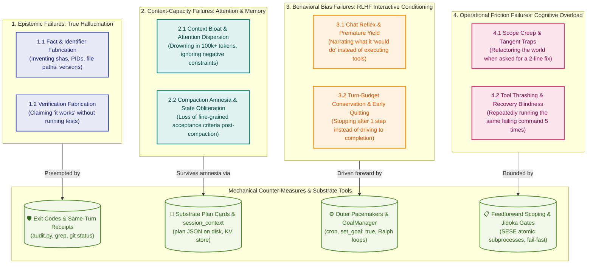

# Methodology Module 01: LLM Cognition, Agent Nature & Failure Taxonomy

> **Core Law:** AI agents are probabilistic, conversational, and subject to memory degradation. Autonomous reliability cannot be achieved by prompt pleading; it requires an orthogonal failure taxonomy paired with deterministic substrate memory and mechanical execution gates.

---

## 1. The Orthogonal Agent Nature Failure Taxonomy

Lumping all agent anomalies under the vague label of "hallucination" leads to ineffective prompt-bloat remedies. An Autonomously Self-Improving Factory (ASIF) isolates four orthogonal failure families based on distinct generative mechanisms:



### 1.1 Epistemic Failures (True Hallucination)
* **Generative Mechanism:** Probabilistic next-token sampling ungrounded in physical facts or tool execution.
* **Manifestations:** Fabricating commit SHAs, PIDs, file paths, or claiming verification passes without test execution.
* **Substrate Counter:** **Deterministic Exit Codes & Same-Turn Receipts.** The absolute law: *no receipt, no verdict*. Every factual claim requires a live tool result (`rc=0`) in the same turn context.

### 1.2 Context-Capacity Failures (Attention Dispersion & Compaction Amnesia)
* **Generative Mechanism:** Attention dilution over massive contexts ("Lost in the Middle") and lossy semantic compression when context compaction triggers.
* **Manifestations:** Ignoring negative prompt constraints after 50k tokens; waking up post-compaction having forgotten pending sub-tasks and acceptance criteria.
* **Substrate Counter:** **The `plan` Tool (Durable Disk Plan Card) + `session_context`.** 
  * The `plan` tool persists coarse task state and checkable criteria to disk (`.opencrabs_plan_<id>.json`), surviving history summarization.
  * `session_context` preserves ephemeral, fine-grained calculation variables across turns without polluting message history.
  * Calling `plan(operation="show_plan")` immediately re-anchors the model to ground truth.

### 1.3 Behavioral Bias Failures (RLHF Interactive Conditioning)
* **Generative Mechanism:** Reinforcement learning from human feedback (RLHF) optimizes models to be polite, deferential, single-turn conversationalists.
* **Manifestations:** Chat reflex (narrating intent instead of executing); premature conversational yielding (asking "Should I proceed?"); early stopping before verified closure.
* **Substrate Counter:** **`GoalManager` (`set_goal: true`) + Outer Cron Pacemakers (P28).** Forces autonomous convergence loops (Ralph), disabling conversational pauses until acceptance criteria pass deterministically.

### 1.4 Operational Friction Failures (Scope Creep & Cognitive Thrashing)
* **Generative Mechanism:** Over-generalization from training data causing unbounded search depth and cascading errors.
* **Manifestations:** Tangent refactors; tool thrashing (repeating failed commands without hypothesis testing).
* **Substrate Counter:** **Single-Entry Single-Exit (SESE) Subprocesses + Jidoka Stop-on-Defect.** Strict turn budgets per atomic subprocess; immediate line halt on first gate failure.

---

## 2. The 5 OpenCrabs Memory Layers in Architecture

In an ASIF, memory is structured into five distinct operational tiers:

| Memory Tier | Substrate Mechanism | Location / Scope | Operational Role |
|---|---|---|---|
| **Tier 0: Structural Invariants** | Core Brain Files | `SOUL.md`, `USER.md`, `AGENTS.md` (injected last) | Unconditional behavioral constraints and security boundaries. |
| **Tier 1: Passive In-Flight Recall** | `memory_recall.rs` (BM25) | User prompt envelope (matches `MEMORY.md`, active skills, directives) | Automatic, zero-effort contextual conditioning before turn 1. |
| **Tier 2: Active Multi-Corpus Retrieval** | `memory_search` (Hybrid RRF) | Scopes: `brain` (rules), `memory` (logs), `external` (code graph) | Deliberate research and prior precedent lookups. |
| **Tier 3: Substrate Task State** | `plan` tool & `session_context` | Persistent disk JSON (`.opencrabs_plan_*.json`) & session DB | Durable task contracts, dependencies, and variables surviving compaction. |
| **Tier 4: Durable Fleet History** | `evidence/ledger.jsonl` & `rework.md` | Single-writer disk files (`fcntl.flock`) | Monotonic state transitions and defect root-cause preventions. |

---

## 3. The Single-Writer Locking Principle (P26)

State that lives only in chat is a memory of a conversation. Durable state lives in files on disk with **exactly one named writer**.

```python
import fcntl

# Pattern: Exclusive append lock with atomic monotonic row assignment
with open("evidence/ledger.jsonl", "a+") as f:
    fcntl.flock(f.fileno(), fcntl.LOCK_EX)
    # 1. Read existing rows to determine n + 1
    # 2. Write new JSONL row with timestamp
    # 3. fsync to flush to disk before releasing lock
    f.flush()
    fcntl.flock(f.fileno(), fcntl.LOCK_UN)
```

---

## 4. Jidoka & First-Pass Yield Recovery

1. **Jidoka (Autonomation / Stop-on-Defect):** In the Toyota Production System, line workers halt the assembly line immediately upon detecting an anomaly. In AI multi-agent factories, any gate failure in `tools/audit.py` or unit test suite requires an immediate halt and root-cause isolation before additional turns or code generation occur.
2. **Deterministic Pre-Flight Gates:** Before declaring a work unit complete, all mechanical gates must pass locally in sub-second execution time.
3. **Yield Telemetry:** First-pass yield is computed as `accepted_runs / total_runs`. Defect clusters trigger automatic remediation issues on the board via autonomous telemetry mining (`tools/synthesize_insights.py`).
