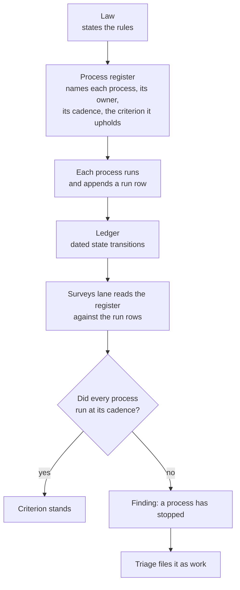

# The process register — a law needs the processes that uphold it

**Status: proposed, not law.** Nothing in this file is in force. It is written
from an owner question of 2026-09-12. The owner ruled on **three** of its five
open questions that same day, so those three are decisions and the other two are
still open. The register itself is not yet written — it is the next piece of
work, and it now has to be written the way the rulings say rather than the way
§4.3 first proposed.

> *"A law needs to have processes that uphold it, and most probably also an
> auditor of those processes. It's the auditor who decides whether the factory
> is efficient or not. One other thing that the factory must keep track of is its
> own processes, and these have to be audited. How does it fit into our current
> structure?"*

---

## 1. What the question actually names

Three different things, and today the structure holds only two of them.

| Element | What it is | Example here |
|---|---|---|
| **Law** | The rules, versioned | `skills/meta-factory/SKILL.md` |
| **Process** | A recurring act that holds a rule up | the four gates, the daily measurement run, the ledger sequence check |
| **Audit** | Reading whether the processes ran | *does not exist* |

The rubric measures **properties** — is the law fresh, is state single-writer, is
throughput measured. A property is a *state*. What the question names is a
*process*: the act that keeps the state true. The two are not the same thing, and
only one of them is measured today.

---

## 2. What exists today

| Element | Exists | Where | Gap |
|---|---|---|---|
| Law | Yes | `SKILL.md`, `TEMPLATE/SKILL.md.tmpl` | — |
| Processes | Partly | four gates in `tests/`, `tools/ledger.py verify`, the daily job | They exist as **code**, not as a **named list** with an owner and a cadence |
| The factory tracking its own processes | **No** | — | Nothing records that a process ran |
| An audit of the processes | **No** | — | Nothing asks whether they still run |
| A verdict on efficiency | Partly | the score and its band | The band is assigned by the factory's own score |

---

## 3. The gap, with evidence

**`score` is a declared event type with zero rows.** The ledger's closed event set
is `genesis, intake, claim, dispatch, close, score, ruling`. In the live ledger of
2026-09-12 the counts are: genesis 1, intake 6, claim 5, dispatch 1, close 7,
ruling 3 — and **score 0**. The daily measurement run writes
`evidence/scores/<date>.md` and leaves no state transition behind. The one
process this factory runs on a schedule is invisible in the surface built to
record state.

**This is the third instance of one shape in this repo.** A check that reads only
what is *present* cannot see an *absence*:

| Instance | The check | What it could not see |
|---|---|---|
| **#10** | the ledger gate | a close with no intake — a **missing row** |
| **#12** | the rework gate | a table split by a blank line — a **missing contiguity** |
| *today* | the vocabulary gate | the per-term banned synonyms — a **missing enforcement** |

That third row is new and was found while writing this file. `ONTOLOGY.md`
declares banned synonyms in two places: the enforced `## Banned synonyms` table
(3 terms) and the "Not" column of the term table, which gives a synonym for
`Surveys`, one for `Delegate`, and 17 more. `tests/test_ontology.py` parses
**only the first**. The second is documentation nobody can violate, which is
exactly what the vocabulary criterion says an ontology must not be.

A process that has stopped running is the same shape once more: it produces no
output, and no output is indistinguishable from nothing wrong.

---

## 4. The proposal

Three parts. The first two make the third possible.

### 4.1 A process register — `docs/processes.md`

One row per recurring process: its **owner** (a lane), its **cadence**, the
**criterion it upholds**, and the **evidence a run leaves**. The register is what
makes "the factory keeps track of its own processes" a thing a reader can check
rather than a claim.

### 4.2 Run rows — every execution leaves a state transition

A process that runs appends a row. `score` already exists for the measurement run
and has never been used; the others need one more event type (`run`) in the
closed set. A missed cadence then becomes **visible as a gap in the sequence**,
which is what the ledger gate was built to read.

### 4.3 The verdict — two bands, not one

**Ruled 2026-09-12: both parties keep their own band.** The factory's own score
carries the factory's band; the `Surveys` lane scores independently and carries
its own. Neither reading replaces the other — and a disagreement between them is
itself the finding, because it means the factory's picture of itself and the
outside reading of it have drifted apart.

| Reading | Who | Cadence | Output |
|---|---|---|---|
| Self-score, self-band | the factory | continuous / daily | the improvement trigger — gaps become work |
| The audit, its own band | the `Surveys` lane | periodic | the outside verdict on efficiency |

This keeps the owner's 2026-09-11 ruling — self-judgment is the engine of
self-improvement — and adds the audit on top rather than replacing it.

The first draft of this section proposed *moving* the band to `Surveys`, on the
argument that a verdict issued by the party being judged is not a verdict. The
ruling is the other shape, and it is the better one for a reason the draft
missed: moving the band would have deleted the factory's own reading, and with
it the only signal that fires self-improvement without waiting for an audit.

### 4.4 The audit is itself a process

The `Surveys` lane's own runs belong in the same register and leave the same run
rows. That is the whole point of putting the register in the repo: the audit of
the audit is not a special case, it is the same mechanism read one level up.

---

## 5. What it would change, and what could break

| Change | Risk |
|---|---|
| A new `run` event in the closed set | the schema is closed deliberately; a new type is a law change, not a convenience |
| A cadence per process | a cadence nobody checks is decoration — the audit is what gives it force |
| The band moving to `Surveys` | a member factory may read it as losing its own verdict; the split in 4.3 is what prevents that |
| Run rows for every process | a process that runs hourly writes 24 rows a day; the register must state which processes are row-writing and which are continuous |

---

## 6. The five questions, and what was ruled

The owner answered three of the five on 2026-09-12, in one line each. Those three
are now decisions this file has to be read against; the other two are still open.

| # | Question | Ruling |
|---|---|---|
| 1 | **The band** — does it become the `Surveys` lane's verdict, or does the factory keep assigning its own? | **Both have their own bands** |
| 2 | **Who audits this factory's own processes** — its own `Surveys` lane, or a peer factory's? | **Its own, plus the meta-factory** |
| 3 | **Does the register ship in the template**, so every factory inherits it, or is it meta-factory-only? | **It ships** |
| 4 | **A missed cadence** — does it block the score, or is it reported alongside it? | *open* |
| 5 | **The unenforced second banned table** (§3) — enforce it, or delete it? | *open* |

Two consequences follow from the rulings, and both change what gets built:

- **Ruling 3 makes the register a template artifact.** It is not a meta-factory
  convenience; every bootstrapped factory inherits it, so its rows may not name
  this factory's own lanes and its text may not leak the harness.
- **Ruling 1 makes §4.3 a two-column reading**, not a handover: the register must
  carry a band for the factory and a band for the audit, and the register's own
  audit line names both auditors from ruling 2.

Question 4 still shapes the register — a cadence is only meaningful once it is
known what a miss does — so the register waits on it. Question 5 is independent
of the register and can be settled on its own.
