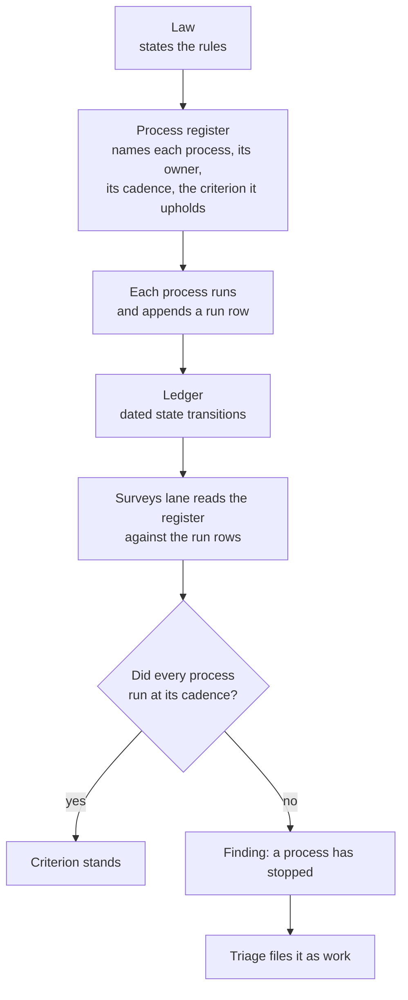
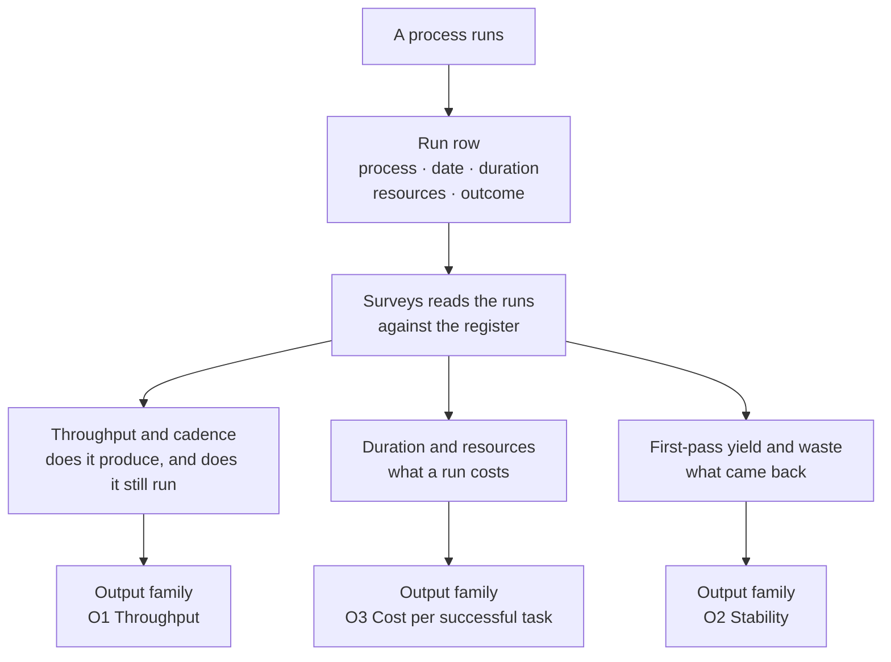

# The process register — a law needs the processes that uphold it

**Status: proposed, not law.** Nothing in this file is in force. It is written
from an owner question of 2026-09-12. The owner ruled on **three** of its five
open questions that same day, so those three are decisions and the other two are
still open. The register itself is not yet written — it is the next piece of
work, and it now has to be written the way the rulings say rather than the way
§4.3 first proposed.

On 2026-09-13 the owner added the measurement model in **§4.5**: a process is
**measured**, not merely checked. That changes what a register row has to carry,
so §4.5 is written before the register and not after it.

> *"A law needs to have processes that uphold it, and most probably also an
> auditor of those processes. It's the auditor who decides whether the factory
> is efficient or not. One other thing that the factory must keep track of is its
> own processes, and these have to be audited. How does it fit into our current
> structure?"*

---

## 1. What the question actually names

Three different things, and today the structure holds only two of them.

| Element | What it is | Example here |
|---|---|---|
| **Law** | The rules, versioned | `skills/meta-factory/SKILL.md` |
| **Process** | A recurring act that holds a rule up | the four gates, the daily measurement run, the ledger sequence check |
| **Audit** | Reading whether the processes ran | *does not exist* |

The rubric measures **properties** — is the law fresh, is state single-writer, is
throughput measured. A property is a *state*. What the question names is a
*process*: the act that keeps the state true. The two are not the same thing, and
only one of them is measured today.

---

## 2. What exists today

| Element | Exists | Where | Gap |
|---|---|---|---|
| Law | Yes | `SKILL.md`, `TEMPLATE/SKILL.md.tmpl` | — |
| Processes | Partly | four gates in `tests/`, `tools/ledger.py verify`, the daily job | They exist as **code**, not as a **named list** with an owner and a cadence |
| The factory tracking its own processes | **Partly** | `evidence/ledger.jsonl` | One process leaves a row — the daily run, from 2026-09-13. Every other process leaves none |
| An audit of the processes | **No** | — | Nothing asks whether they still run |
| A verdict on efficiency | Partly | the score and its band | The band is assigned by the factory's own score |

---

## 3. The gap, with evidence

**`score` was a declared event type with zero rows — until 2026-09-13.** The
ledger's closed event set is `genesis, intake, claim, dispatch, close, score,
ruling, run`. On 2026-09-12 the counts were genesis 1, intake 6, claim 5, dispatch 1,
close 7, ruling 3 — and **score 0**. The daily measurement run wrote
`evidence/scores/<date>.md` and left no state transition behind, so the one
process this factory runs on a schedule was invisible in the surface built to
record state.

**The 2026-09-13 run changed that, and nothing written says it should have.**
It appended row **n=25** — event `score`, actor `surveys`, subject
`survey-2026-09-13`. So the gap is now half closed from the wrong end:
`docs/measurement-procedure.md` does not mention the ledger at all, and neither
does the cron prompt. The row is real, and no written process requires it. A
behaviour that exists but is unwritten is the same defect from the other side —
it survives on the run's own initiative, and the next run may simply not repeat
it. A register row for this process would have caught the difference immediately,
because the register is where "this process appends a row" is stated.

**This is the third instance of one shape in this repo.** A check that reads only
what is *present* cannot see an *absence*:

| Instance | The check | What it could not see |
|---|---|---|
| **#10** | the ledger gate | a close with no intake — a **missing row** |
| **#12** | the rework gate | a table split by a blank line — a **missing contiguity** |
| *today* | the vocabulary gate | the per-term banned synonyms — a **missing enforcement** |

That third row is new and was found while writing this file. `ONTOLOGY.md`
declares banned synonyms in two places: the enforced `## Banned synonyms` table
(3 terms) and the "Not" column of the term table, which gives a synonym for
`Surveys`, one for `Delegate`, and 17 more. `tests/test_ontology.py` parses
**only the first**. The second is documentation nobody can violate, which is
exactly what the vocabulary criterion says an ontology must not be.

A process that has stopped running is the same shape once more: it produces no
output, and no output is indistinguishable from nothing wrong.

---

## 4. The proposal

Three parts. The first two make the third possible.

### 4.1 A process register — `docs/processes.md`

One row per recurring process: its **owner** (a lane), its **cadence**, the
**criterion it upholds**, the **evidence a run leaves**, and — from §4.5 — the
**measures that apply to it**. The register is what makes "the factory keeps
track of its own processes" a thing a reader can check rather than a claim.

### 4.2 Run rows — every execution leaves a state transition

A process that runs appends a row. `score` already exists for the measurement run
and has never been used; the others need one more event type (`run`) in the
closed set. A missed cadence then becomes **visible as a gap in the sequence**,
which is what the ledger gate was built to read.

### 4.3 The verdict — two bands, not one

**Ruled 2026-09-12: both parties keep their own band.** The factory's own score
carries the factory's band; the `Surveys` lane scores independently and carries
its own. Neither reading replaces the other — and a disagreement between them is
itself the finding, because it means the factory's picture of itself and the
outside reading of it have drifted apart.

| Reading | Who | Cadence | Output |
|---|---|---|---|
| Self-score, self-band | the factory | continuous / daily | the improvement trigger — gaps become work |
| The audit, its own band | the `Surveys` lane | periodic | the outside verdict on efficiency |

This keeps the owner's 2026-09-11 ruling — self-judgment is the engine of
self-improvement — and adds the audit on top rather than replacing it.

The first draft of this section proposed *moving* the band to `Surveys`, on the
argument that a verdict issued by the party being judged is not a verdict. The
ruling is the other shape, and it is the better one for a reason the draft
missed: moving the band would have deleted the factory's own reading, and with
it the only signal that fires self-improvement without waiting for an audit.

### 4.4 The audit is itself a process

The `Surveys` lane's own runs belong in the same register and leave the same run
rows. That is the whole point of putting the register in the repo: the audit of
the audit is not a special case, it is the same mechanism read one level up.

### 4.5 A process is measured, not merely checked

**Owner input, 2026-09-13:**

> *"The processes can be measured as well — throughput/cadence/duration,
> resources consumed, first-pass yield/waste."*

This is the part §4.2 was missing, and it changes what the register is. §4.2 asks
only *did it run* — a yes or a no. A yes/no cannot tell a healthy process from
one that is running slower, costing more, or producing work that comes back. The
six measures are what turn the register from a checklist into an instrument.

| Measure | What it answers | What a bad reading looks like |
|---|---|---|
| **Throughput** | What does the process produce per period? | It runs on time and produces nothing |
| **Cadence** | Does it run as often as it is declared to? | It has silently slowed, or stopped |
| **Duration** | How long does one run take? | Runs are growing longer — the cost before the failure |
| **Resources consumed** | What does one run spend? | Correct, and no longer affordable |
| **First-pass yield** | How much of its output was accepted without rework? | It produces work that keeps coming back |
| **Waste** | How much went into rework, re-runs, abandoned runs? | The complement of yield, and the part nobody sees |

**They are not six independent axes — three are recorded, three are read off the
record.** That distinction decides what a run row has to carry, and it is why a
row naming a derived measure without its inputs cannot be read at all.

| Layer | Measure | Where it comes from |
|---|---|---|
| **Recorded** — one run writes it | Duration | the run's own start and end |
| | Resources consumed | what the run spent: tokens, turns, money — wall time is the separate duration column, not a second entry in this one |
| | Outcome | accepted · reworked · abandoned |
| **Derived** — read off many rows | Cadence | runs ÷ the runs the register declares — needs one law fact, not one more field |
| | Throughput | accepted outputs ÷ the period |
| | First-pass yield | accepted runs ÷ runs |
| | Waste | `(1 − yield) × spend` — arithmetic on two derived readings, not a fourth measurement |
| | Cost per successful task | `spend ÷ throughput` — the rubric's O3, and the composite of all of them |

So the register asks a process to **record three**, not to collect six. Two
consequences, and both are corrections to the table below:

- **A derived measure is readable only if its inputs are named beside it.** The
  four gates row listed `waste` without `resources consumed`; the ship chain row
  listed `waste` without `first-pass yield`. Neither could be read as written,
  and `waste` on its own is the one measure that always reduces to others.
- **Cadence applies only to a process that has a period.** A gate that runs
  *every change* has no declared interval to fall short of, so it carries no
  cadence reading; a watchdog that runs hourly does. Cadence is the one measure
  that needs a law fact — the declared rate — rather than a run.

**None of this is a new measurement system.** `docs/quality-criteria.md` already
adopted exactly these, one level **up**: the Output family is Throughput (O1),
Stability (O2) and Cost per successful task (O3), and the rubric's own cited
sources already name the pair — DORA's split of *throughput* against
*instability*, and flow metrics' *first-pass yield*. What the owner names is the
same discipline applied one level **down**: to the processes that produce the
factory, rather than to the factory.

That closes the loop the rubric leaves open today. O1, O2 and O3 are scored by
reading live state by hand; nothing produces them mechanically. A process that
writes its measures into a run row is the missing source.

**What each row has to carry.** The register states the declared cadence and
which measures apply; the run row carries the per-run values. Each process is
defined with its **Process Owner**, **Process Client**, delegated **Implementers**,
and its **Quality Criteria framed as client/stakeholder value**. Naming which
measures apply is part of the register, not an afterthought.

| Process | Process Owner | Process Client | Delegated Implementers | Declared cadence / trigger | Quality Criteria (Stakeholder Value) | Measures that apply |
|---|---|---|---|---|---|---|
| The four gates | HQ | Carrier / Author | CLI / test runner | every change | Zero regressions, immediate verification receipt | duration · resources consumed · first-pass yield · waste |
| Intake | Triage | Reporter / Finder | Triage lane | on finding | Unambiguous scope, owner, and done-criteria | throughput · duration |
| Assignment | Triage | Worker / Task | Triage lane | on intake | Clean claim check, clear brief delivered | throughput · duration · first-pass yield |
| Execution watchdog | Triage | HQ / Owner | Triage lane | periodic (hourly) | Detection of stalled workers before SLA breach | cadence · throughput · first-pass yield |
| Rework entry | Triage | Surveys / Quality loop | Triage lane | on defect | Root cause and actionable prevention recorded | throughput · first-pass yield |
| Ship chain | Carrier | Consumers / Release | Carrier lane | every release | Atomic, verified artifact without release rollback | duration · resources consumed · first-pass yield · waste |
| Daily measurement | Surveys | Owner / Factory HQs | Surveys lane / cron | daily (09:00 MSK) | Reproducible, objective score diffs on schedule | cadence · duration · resources consumed · throughput |
| Process audit | Surveys, and the meta-factory | Owner / Governance | Surveys lane | periodic | Early detection of silently stopped processes | cadence · first-pass yield |

**The client ruling on missed cadence (ruling 4, 2026-09-13).** On 2026-09-13 the
owner ruled: *"Every process runs for its client. The client decides when the
process should start. The failure to start when the client expects it to run is a
failure and should be scored as such."*

This resolves Question 4 cleanly:
1. **The client sets the expectation.** A process does not exist in isolation;
   it serves a named client who decides when execution is expected (by event
   trigger or scheduled cadence).
2. **Failure to start is an execution failure.** If the client's trigger arrives
   or the scheduled interval passes and the process fails to start, that missed
   start is recorded as a failed run (`outcome = failed`).
3. **It scores directly against yield and stability.** It is neither an
   informational note nor a clumsy gate blocking the audit: it enters the
   metrics as a failure, depressing **first-pass yield** and directly lowering
   the rubric's **Stability (O2)** score. If a process stops completely, its
   yield collapses to zero, and the stability score collapses with it.

---

## 5. What it would change, and what could break

| Change | Risk |
|---|---|
| A new `run` event in the closed set | the schema is closed deliberately; a new type is a law change, not a convenience |
| A cadence per process | a cadence nobody checks is decoration — the audit is what gives it force |
| The band moving to `Surveys` | *rejected by the 2026-09-12 ruling* — recorded here because it was the first draft's shape; §4.3 is the shape in force |
| Run rows for every process | a process that runs hourly writes 24 rows a day; the register must state which processes are row-writing and which are continuous |
| A measure per process (§4.5) | a measure nobody reads is decoration in exactly the way a cadence nobody checks is; the run row is what makes it a reading |
| Resources per run (§4.5) | a process that cannot report what it spent is **unmeasured** — the same absence shape §3 describes, one level down |
| Duration and waste as new terms | neither word appears anywhere in this repo today; both are now canonical, so every existing report that wanted them had no word to use |

---

## 6. The five questions, and what was ruled

The owner answered the first three questions on 2026-09-12 and resolved Question 4
and Question 5 on 2026-09-13. All five questions are now ruled and recorded.

| # | Question | Ruling |
|---|---|---|
| 1 | **The band** — does it become the `Surveys` lane's verdict, or does the factory keep assigning its own? | **Both have their own bands** (2026-09-12) |
| 2 | **Who audits this factory's own processes** — its own `Surveys` lane, or a peer factory's? | **Its own, plus the meta-factory** (2026-09-12) |
| 3 | **Does the register ship in the template**, so every factory inherits it, or is it meta-factory-only? | **It ships** (2026-09-12) |
| 4 | **A missed cadence** — does it block the score, or is it reported alongside it? | **A failure to start when the client expects it is an execution failure and scored as such** (2026-09-13) |
| 5 | **The unenforced second banned table** (§3) — enforce it, or delete it? | **Rename column to contextual disambiguation; enforce only the global banned table** (2026-09-13) |

Three consequences follow from the complete rulings:

- **Ruling 3 makes the register a template artifact.** It is not a meta-factory
  convenience; every bootstrapped factory inherits it, so its rows may not name
  this factory's own lanes and its text may not leak the harness.
- **Ruling 1 makes §4.3 a two-column reading**, not a handover: the register must
  carry a band for the factory and a band for the audit, and the register's own
  audit line names both auditors from ruling 2.
- **Ruling 4 binds cadence to the client.** A process exists for its client;
  missing expected execution is scored as a failed run, depressing first-pass
  yield and Stability (O2).

**The vocabulary gap this file depends on.** Checked mechanically on 2026-09-13:
`ONTOLOGY.md` carried **20** canonical terms, and `process` — the central noun of
this entire proposal, used in 33 files — was not among them. Neither were
`cadence` (13 files), `throughput` (7 files) or `first-pass yield` (2 files), and
`duration` and `waste` appeared in **no file at all**. All eight are canonical
now, because a proposal about measuring processes cannot be written in words the
factory's own vocabulary does not define.

**The predicate, because the number is not readable without it.** A canonical
term is a row of the `## Canonical terms` table, counted between that heading and
the next one. The file counts are case-insensitive hits across git-tracked files
at `247654e`, the commit before the eight terms landed. The first version of this
paragraph said 27, and the total was reported as 35: both came from a pattern
matching every row whose first cell was a backticked term, and three tables in
`ONTOLOGY.md` start a row that way — the terms, the objects, the banned synonyms.
Seven rows that are not terms were counted as terms, in both figures. The counts
are 20 and 28.
