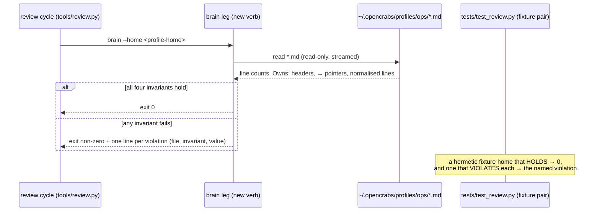

# The mechanical brain leg on the review rotation

**Owns:** the design for the mechanical half of gap **G4** — four deterministic invariants over the
ops profile brain, run by the review-rotation mechanism. **Status: DESIGN — awaiting the design
gate; nothing built.**
**Date:** 2026-10-05 · **Lane:** meta-factory / Review Rotation
**Origin chain:** hygiene inventory §4 (gap G4) → owner ruling on meta q16 (2026-09-30T13:56:32Z,
*"let infra own it"*, ledger n=1020) → infra design
`docs/rulings/2026-10-02-shared-brain-gate-design.md` → **owner answer on q19
(2026-10-05T06:43:37Z)** → infra hand-off (ledger n=1089, commit `cfa86162`; infra built nothing).

---

## 1. The gap

The ops profile's brain files are injected into **every** lane's session. One line in `AGENTS.md`
governs every lane on the box, and the file lives in **no repository**, so no repo gate can read it.
Its only defences today are a periodic **semantic** lens (Lens S, by eye) and a **size reading**
(`tools/brain_metrics.py`, which prints and gates nothing). Nothing checks its mechanical
properties deterministically — a lens cannot count 500 lines.

## 2. What the owner decided

q19, verbatim:

> *"Agents.md should be checked by the review rotation mechanisms. If you want to improve them, talk to the review instrument lane"*

Read as: **the check lives in the review rotation, and infra builds nothing.** Infra's four
candidate shapes (extend its own `audit.py` leg / a standalone script + cron / a write-time gate in
the OpenCrabs substrate / close G4 as covered) are **all untaken** — the answer re-homes the check
instead of picking one. Infra handed over the **spec** (its §4) and stopped.

## 3. The four invariants (infra §4 — the spec, cited)

Each is already codified in the brain or its law, and each is checkable with the **stdlib alone**:

| # | invariant | predicate |
|---|---|---|
| 1 | **size budget on the always-loaded file** | `AGENTS.md` line count ≤ **500** (canon `skills/opencrabs-dev/fleet-directives.md:173`). Infra measured **129** on 2026-10-02 — headroom, but nothing asserts it. |
| 2 | **an ownership declaration** | an `Owns:` header present. **Tolerant** — blockquote-stripped, `**Owns:**` anywhere in the first N lines. The format is **not uniform** today (`SOUL.md`'s sits inside a blockquote). |
| 3 | **pointer resolution** | a `→ X` pointer names another brain file that **exists**; a renamed or deleted target dangles invisibly today. |
| 4 | **no duplicated rule across files** | normalise each line (strip whitespace/case); flag **exact repeats across ≥2 files** — the brain's own *one concept, one home* law (`AGENTS.md` §Memory). |

**Deliberately NOT in the first cut** (kept from infra §4): semantic checks (*"is this rule still
true"*), secret scanning (**rule 21 accepts secrets in these surfaces**), and prose quality — none
is mechanical, and a gate that guesses is worse than no gate.

## 4. Where it goes — the shape question

The rotation's mechanism today is a **cycle** (`init → brief → record → verify → compile → close`)
over the 14 lenses, each lens run by an **isolated sub-agent**. **No mechanical leg exists**, and
the engine `tools/review.py` is **stdlib-only with a declared EMPTY closure** (instrument law §3) —
it cannot be broken at import by a missing sibling.

| # | shape | new moving parts | the trade |
|---|---|---|---|
| **a** | a new **`brain` verb in `tools/review.py`** (the instrument's own executable) | none — one verb, one probe per invariant | **keeps the declared empty closure**; the instrument stays self-contained; invoked by the cycle |
| b | a **`--check` mode on `tools/brain_metrics.py`** | none new, but the leg then depends on a file **outside** the instrument's declared set | reuses the existing reader (no second reader to drift); **breaks the declared empty closure** |
| c | a **standalone `tools/brain_gate.py`** + its own cron | 1 script, 1 cron | a **second** reader of the brain; a new wake — this is infra's untaken shape *b* |
| d | a **lens** (extend Lens S) | none | **rejected by construction**: a lens is a semantic sub-agent judgement, and a sub-agent cannot count 500 lines deterministically — the owner's own stated reason the mechanical half is needed |

**Recommendation: shape (a).** The instrument is the mechanism the owner named; keeping the check
inside its own executable preserves the property the law celebrates (a member adopting the declared
five paths gets a runnable, self-contained instrument), and it adds no file, no cron and no second
reader of the brain. The ~30 lines of streaming read that (a) duplicates from `brain_metrics.py` are
the price of that closure — and `brain_metrics.py` keeps its own role, the **standing reading**,
print-only (#105, *"printed, never gated"*), which is a different concern from a cycle gate.

## 5. Ponytail ladder

- **Does this need to exist at all?** Yes — the inventory rates it the highest blast radius per byte
  on the box, and the owner routed it rather than closing it. *(Rung rejected: "do nothing".)*
- **Stdlib only?** Yes — `pathlib` + `re`, no dependency. *(Rung satisfied.)*
- **Native platform feature?** A systemd path unit would watch the directory, but needs a new unit
  and a trigger where the cycle already runs. *(Rung rejected: more moving parts than the check.)*
- **Already-installed dependency?** `tools/review.py` is the instrument's own executable and already
  parses cycles, reads the ledger and emits JSON. *(Rung satisfied — this is where the verb belongs.)*
- **One line?** No — four invariants is four checks. But it is **one verb + one probe per invariant**.
- **Only then minimum code** — that is the recommendation.

## 6. The leg's contract



```
review.py brain --home <profile-home> [--json]
```

- **exit 0** = all four invariants hold; **exit non-zero** = a violation, with **one line per
  violation** naming the file, the invariant and the observed value.
- **Read-only**, and **streamed line by line** — the box runs a small cgroup cap and `MEMORY.md` is
  ~3k lines; never read a whole file into memory (the `brain_metrics.py` discipline).
- **Population:** the `*.md` files at the top level of `<home>`. A file that is **absent** from the
  always-injected triple is reported **by name**, never silently dropped.
- **The gate runs on the box, never in CI** — the brain does not exist on a CI runner, and a gate
  that is green because its input is missing is the exact failure G4 describes.

## 7. The probes (non-vacuity)

One **fixture pair** per invariant in `tests/test_review.py`, so the gate is shown to **bite**:

- a **hermetic fixture home** that HOLDS all four → exit 0;
- and one that **VIOLATES each** → the named violation.
- The budget and `Owns:` probes read a **fixture**, never the live brain: a live reading passes
  today and tests nothing (the disarmed-control class, ops `AGENTS.md` rule 7).
- The duplicate probe uses **two fixture files sharing one normalised line**, never the live brain.

## 8. The design-gate question

This is a **design choice**, not a mechanical repair: it carries a heuristic (the `Owns:` line
window **N**) and a placement choice (**a** vs **b**). Under register item 2 (*"the test is the
OPTION COUNT, not the size of the diff"*) it is **gated**. **Nothing is built until the gate clears.**

---

**What this document is not.** It is not approval to build. No verb was added, no probe written, no
brain file touched, no cron created. It is the spec's destination, recorded so the shape is
reviewable before any code moves.
