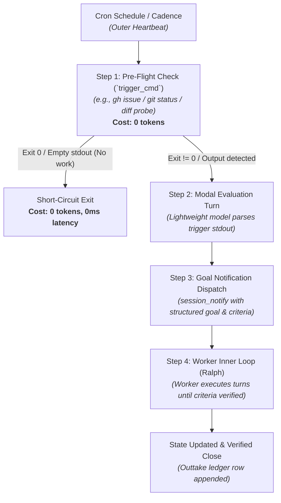

# OpenCrabs Harness Feature Proposal: Mechanical CLI Trigger & Gated Goal Dispatch in `cron_manage`

**Proposal ID:** `PROP-01-CRON-GATED-GOAL-PIPELINE`  
**Target:** OpenCrabs Factory (`leshchenko1979/opencrabs`, Crabs Kanban Board topic `OC DEV HQ`)  
**Authors:** Meta-Factory HQ (`leshchenko1979/agent-factories`) on behalf of the 5-factory fleet  
**Date:** 2026-09-14  
**Status:** Ready for Dispatch / RFC  
**Skill Reference:** `/meta-factory` · `docs/addons/harness/opencrabs.md` · `ONTOLOGY.md`

---

## 1. Executive Summary

Autonomous agent factories require continuous background execution without human prompting. However, current cron scheduling in OpenCrabs wakes up an LLM model turn unconditionally on every schedule tick, even when the queue is empty or system state is healthy. Furthermore, when the agent wakes, its conversational training causes it to stop after a single turn rather than driving multi-step work to mechanical completion.

We propose enhancing `cron_manage` with a **4-step execution pipeline**:
1. **Mechanical CLI Trigger (Pre-Flight Check):** Run a local shell command first (0 tokens). If exit is clean / output is empty, terminate immediately at zero token cost.
2. **Modal Output Evaluation:** If the trigger detects work/drift, invoke a model turn with trigger stdout injected into context.
3. **Structured Goal Notification:** Dispatch `session_notify` to a persistent worker lane with an explicit `set_goal` payload.
4. **Ralph Convergence Loop (Inner Loop):** The target worker session converges on the goal criteria, preventing premature conversational stopping.

---

## 2. Ontological Alignment & Factory Architecture

This proposal maps directly to our canonical vocabulary (`ONTOLOGY.md`) and process taxonomy (`docs/processes.md`):

| Factory Concept | Canonical Ontological Term | Role in the 4-Step Pipeline |
|---|---|---|
| **Scheduled Pacemaker** | `process` / `cadence` | Outer loop timer configured in `cron_manage`. |
| **Zero-Token Probe** | `pre-flight check` | Step 1 (`trigger_cmd`): host execution before model allocation. |
| **Intake Evaluation** | `process implementer` (Triage) | Step 2: lightweight modal evaluation of trigger output. |
| **Work Unit Dispatch** | `work unit` / `session_notify` | Step 3: structured task assignment with explicit goal & criteria. |
| **Task Convergence** | `inner loop` / `Ralph loop` | Step 4: worker lane loops until acceptance criteria are verified. |
| **State Settlement** | `outtake surface` / `receipt` | Verified completion recorded in `evidence/ledger.jsonl`. |

Under this model, the factory separates the **outer loop** (cadenced discovery and intake evaluation) from the **inner loop** (goal-driven task execution), maintaining strict single-writer and zero-token idle invariants.

---

## 3. Harness Binding Integration (`harness/opencrabs`)

In `docs/addons/harness/opencrabs.md`, periodic processes are bound to `cron_manage`. This proposal formalizes how the OpenCrabs harness binding satisfies the **Mechanical Enforcement Law** (*"Everything that can be mechanized should be mechanized"*):



---

## 4. Proposed Specification for `cron_manage`

Enhance the `cron_manage` tool and daemon scheduler with the following parameters:

```toml
[cron.issue_dispatcher]
name = "autonomous-issue-dispatcher"
cron = "0 * * * *"
tz = "UTC"

# Step 1: Mechanical Pre-Flight Check (0 LLM Tokens)
trigger_cmd = "gh issue list --repo $REPO --label unclaimed --json number,title"
trigger_on = "non_empty" # Options: "non_empty", "exit_non_zero", "regex:<pattern>"

# Step 2: Modal Evaluation (Executed ONLY if Step 1 triggers)
model = "ag/gemini-3.7-flash-high" # Optional override for evaluation turn
prompt = """
You are the intake dispatcher. Unclaimed issues detected:
{{TRIGGER_OUTPUT}}

Evaluate priority and formulate a concrete task goal with runnable acceptance criteria for the worker lane.
"""

# Step 3: Structured Goal Dispatch
deliver_to = "session://2646d31a-71ee-49f0-be81-9c8dc32d32fa" # Or topic URI
set_goal = true
goal_template = """
Title: Fix {{ISSUE_TITLE}} (#{{ISSUE_NUMBER}})
Acceptance Criteria:
1. pytest tests/test_feature.py exits 0
2. git status is clean
3. evidence/ledger.jsonl row appended with close event
"""
```

---

## 5. Concrete Fleet Use Cases

| Factory | Trigger Command (`trigger_cmd`) | Trigger Condition | Target Action |
|---|---|---|---|
| **InferHub Watch** | `gh issue list -R leshchenko1979/inferhub-watch --label unclaimed --json number` | `non_empty` | Dispatches task goal to persistent worker `1122b15e`. |
| **Meta-Factory** | `python3 tools/hygiene.py --check` | `exit_non_zero` | Dispatches workspace cleanup goal if stale scratch files exceed threshold. |
| **Miidas** | `python3 scripts/tenant_health_probe.py` | `non_empty` | Dispatches tenant remediation goal if client bot drift is detected. |
| **AI AntiSpam** | `python3 outreach/lib/check_new_replies.py` | `non_empty` | Dispatches outreach reply sweep goal to moderator lane. |

---

## 6. Expected Fleet Impact

1. **Economic Efficiency:** 80%–95% reduction in cron token consumption during idle periods across the 5 factories.
2. **Deterministic Completion:** Eliminates conversational "one-shot stopping" by coupling scheduled triggers directly to Ralph convergence loops.
3. **Substrate Simplification:** Replaces brittle userbot/wrapper scripts with a native daemon capability.

---

## 7. Submission & Routing

- **Tracking:** Filed in `docs/proposals/01-cron-gated-goal-pipeline.md` in `agent-factories`.
- **Target Dispatch:** OpenCrabs Factory HQ via `session_notify` (topic `OC DEV HQ`) and fork issue on `leshchenko1979/opencrabs`.
