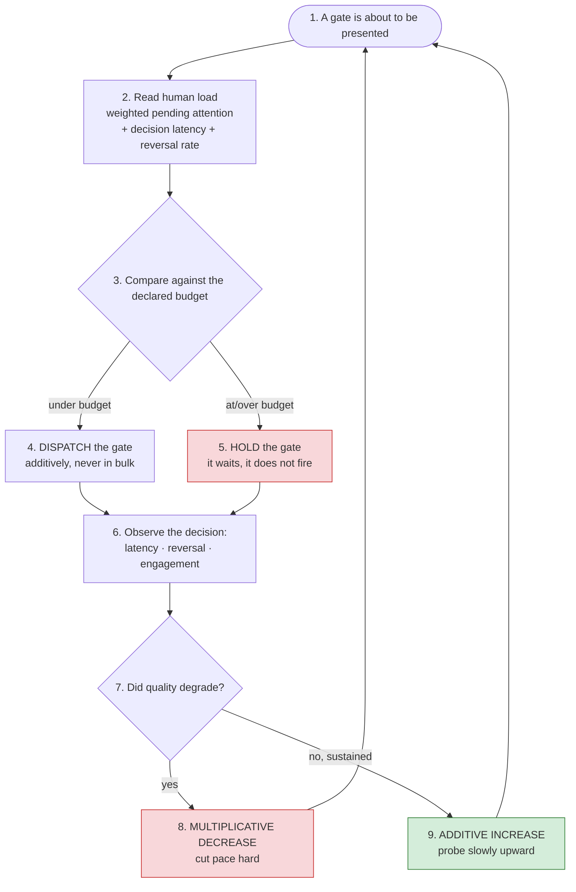

# Human Load as a Governed Resource — Pacemaker Pacing Against Owner Capacity

**Proposal ID:** `PROP-02-HUMAN-LOAD-GOVERNED-PACING`
**Target:** meta-factory law (`skills/meta-factory/SKILL.md`), reaching member factories via `TEMPLATE/`
**Author:** Meta-Factory HQ (`leshchenko1979/agent-factories`)
**Date:** 2026-09-23
**Status:** design input — not law; owner has not ruled
**Related:** `ONTOLOGY.md` (`canonicality`, `resolution tier`), the canonicality ladder
(clause in `skills/meta-factory/SKILL.md` beside §8/§11), P14 (irreversible gates), P30

---

## 1. The problem

The owner is a **rate-limited shared resource across the whole cluster**, and nothing in
this factory's law treats him as one. Each factory's pacemaker is tuned for *its own*
throughput; none of them knows what the others just asked him for.

The failure is not that he is asked too much — it is that **load degrades decision
QUALITY**, and a degraded decision is more expensive than a late one:

> *"When a lot of factories in the cluster fire at the human, what happens is the human
> loses focus. He starts to skip details in the received explanations and questions. The
> human decisions lose quality and cause more work."* — owner, 2026-09-23

So the cost of overload is **paid downstream, in rework**, and it is paid by the factories —
which is why measuring it is the factories' job and not a courtesy.

The measured baseline is in **§8** — including the finding that the fleet's declared
owner-facing surface is pointed at the wrong object, and that the obvious metric
(send-event counts) overstates the real load by about 19x.

## 2. The measurement must be OBSERVED, never self-reported

**This is the load-bearing design constraint, and it follows from the complaint itself.**
An overloaded human is by definition one who is skipping details; he is therefore the least
reliable reporter of his own saturation. Asking "are you overloaded?" also *adds* load, and
a self-report is a claim, not a receipt (§8).

The signal is behavioural, and it is already being emitted:

| Signal | What it measures | Where the evidence already is |
|---|---|---|
| **Decision latency**, per gate | queueing + attention | gate presented (card/notify ts) → decision (command/callback ts) |
| **Reversal rate** | the owner's own stated harm: "decisions lose quality and cause more work" | a decision later corrected by a subsequent instruction or a re-opened item |
| **Rubber-stamp rate** | skipping — a decision whose latency is ~0 on a gate carrying open questions | latency against the gate's `open_question_count` |
| **Bypass rate** | the gate was never engaged (work proceeded unapproved, or `/execute` pressed on a card whose questions were unanswered) | approvals whose decision text addresses none of the card's open questions |

**What is NOT a valid metric: queue depth alone.** A shallow queue is ambiguous — it means
either *capacity to spare* or *gates being dropped*. Reading depth alone as capacity is the
same trap as reading a blind counter's zero as a clean result.

## 3. Gate **weight**, not gate count

The owner's second point — *"different factories may be configured differently regarding the
number of human gates"* — means a raw count of pending decisions is the wrong unit. Gates
are not interchangeable:

| Axis | Why it changes the cost of the decision |
|---|---|
| **open questions** on the card | a card with 5 open questions is not one decision, it is 5 |
| **irreversibility** (P14) | an irreversible gate cannot be delegated or undone; it demands real attention |
| **blast radius** | a fleet-wide law change costs more attention than a single-file fix |

So the governed quantity is **loaded attention** — a weighted sum, not a tally. A proposal
for the weight function is `open_questions × (irreversible ? k : 1) × blast_radius`, with the
constants declared rather than tuned silently.

## 4. The control loop — AIMD, not a threshold

Pacing must **reduce fast and increase slowly**, because the two errors are not symmetrical:
under-pacing costs latency, over-pacing costs *decision quality*, which costs rework. Two
failure modes must both be avoided: a hard threshold oscillates, and a linear probe walks
straight back into overload.

The stable shape is the one TCP congestion control arrived at for the same problem —
**AIMD**:

- **Multiplicative decrease** on an overload signal: cut pace immediately and sharply
  (e.g. × 0.5). Relief must be fast, because the harm is being done now.
- **Additive increase** only on *sustained* health: probe upward slowly (+1 step per clean
  period), so a false "capacity available" signal is corrected before it is amplified.

**The budget is the owner's to declare, and it must be a number with a unit** — "N loaded
attention units per day", not "reasonable load" (a documented limit needs a unit; a claim
needs a predicate).

## 5. What this is in the ladder's terms

This is a **T2 — METRIC** clause, and the clearest instance the ladder has: when a
pacemaker's cadence and the owner's capacity disagree over *when* a gate should be
presented, **the metric decides**, and the metric is human load measured against the
declared budget.

It also demonstrates the ladder's discipline rather than escaping it:
- The arbiter must be **the goal, not a proxy** — so the metric is decision *quality*, and
  latency/queue depth are proxies that must never be the sole arbiter.
- It must be **fresh** — human load is a property of the instant, so it carries the instant
  it was read, like every other measurement here.
- The verdict must **name its tier** — a gate held because the budget was exceeded says so,
  so the hold is auditable and re-litigable when the budget moves.

## 6. The hard part: capacity cannot be inferred from a quiet period

A factory that raises its tempo because its queue is empty is measuring **the absence of
work**, not the presence of capacity. Two guards:

1. **Increase only on a positive signal** — decisions made *well inside* the latency budget,
   on *weighted* gates, with a *low* reversal rate. Never on idle time.
2. **A hold is a recorded state, not a silent drop.** A gate held for budget must print
   itself (`HELD: human budget — n units pending`), for the same reason the patrol prints
   `RAN` / `NOT RUN`: so "held deliberately" and "silently dropped" are never the same
   output. This is the failure the ladder's T4 clause exists to prevent, in a new place.

## 7. Open questions for the owner

1. **What is the budget, and in what unit?** Loaded attention per day, or per gate-time
   window? Without a declared number the loop has no setpoint and degrades to vibes.
2. **Who owns the budget's freshness?** Load is cluster-wide, so is this a meta-factory
   measurement (this factory measures the human across all member factories) or does each
   factory measure only its own gate stream and the owner sums it?
3. **Does a hold ever expire?** If the budget stays exceeded, does a gate wait indefinitely
   or escalate after a declared age? Indefinite waiting converts a pacing rule into a
   starvation rule.
4. **Is the weight function wanted, or is count-plus-irreversibility enough?** The three-axis
   weight is the most YAGNI-prone part of this proposal and can be dropped without
   disturbing the loop.

---

## 8. The measured baseline (2026-09-23), and the trap in the obvious metric

Measured on this box, this turn. The proposal above argues *how* to govern human load; this
section records *what the load is now*, because a loop with no measured baseline has no
setpoint.

### 8.1 The declared surface is not the loaded surface

`audience` is a schema-validated per-service field (`agent|owner`, `tools/registry.py:509`).
Fleet-wide, of 39 declared services:

| factory | agent | owner |
|---|---|---|
| ai-antispam | 5 | 3 |
| miidas | 3 | 3 |
| infra-factory | 6 | 2 |
| inferhub-watch | 5 | 1 |
| **meta-factory** | 6 | **0** |
| opencrabs-dev | 5 | 0 |
| **total** | **30** | **9** |

Cross-checked against the rendered `registry/index.json` — same tally (30 / 9), so the two
readings agree rather than one being a stale render.

The load actually arriving, from channel telemetry — **new** messages to the owner-facing
group on 09-23:

| topic | new messages |
|---|---|
| 21 (meta-factory HQ) | 48 |
| 68 (Delegate) | 29 |
| 20 (Triage) | 19 |
| 19 (Surveys) | 14 |
| **meta-factory, all four** | **110 of 117 (94 %)** |

**The declaration and the load are inverted.** The factory that declares **zero**
owner-facing services generates ~94 % of the new owner-facing traffic. The five factories
that declare the 9 owner-facing services contributed the remaining ~7.

Cause: `audience` is declared on **services** (crons), while the owner's attention is
consumed by **lanes** — and a lane declares `topic`, `thread_id`, `role` and `announcements`
and **no audience field at all**. So the surface that actually carries the load has nothing
to measure against, and the surface that is measured is not the one that loads him.

This is the declared-vs-effective failure in a new place: not a stale number, but a
correctly-declared field pointed at the wrong surface.

### 8.2 The obvious metric overstates by ~19x

| day | send events | **new messages** | edits |
|---|---|---|---|
| 09-22 (full) | 3 525 | **184** | 2 281 |
| 09-23 (to 14:22Z) | 2 272 | **117** | 1 485 |

A send-event count is not a load. 1 485 of 09-23's 2 272 events are `editMessageText`
against messages that already exist — a single live status bubble is re-edited every few
seconds. This is the same law the factory already applies to deliveries: a send telemetry
line is not the artefact, and N sends can be ONE visible message.

So the metric's population is **new messages plus decision requests (gates)** — never
platform events. A loop driven by send-event counts would be throttling against its own
status bubble.

### 8.3 What this changes in the design

1. The declaration must move to (or be added on) the **lane**, because that is where the
   attention is spent. A per-service audience answers "which crons notify the owner", which
   is not the question this proposal exists to answer.
2. The metric counts **new messages and gates**; its unit is declared per §4.
3. A measured baseline now exists, so the setpoint can be set against a number rather than
   an impression — and both readings above carry their instant and their population.
