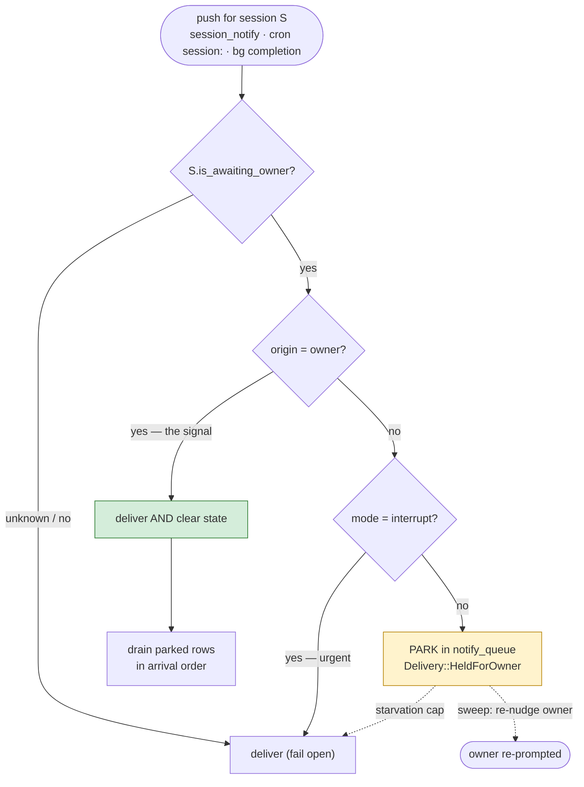

# Owner-Gated Lane Intake — holding a lane's automation while it awaits the owner

**Proposal ID:** `PROP-08-OWNER-GATED-INTAKE`
**Target:** the OpenCrabs harness (runtime behaviour), reaching every factory through the
harness binding
**Author:** meta-factory (this lane)
**Date:** 2026-10-03 · **rev.2** 2026-10-04 (§10: peer-lane waits) · **rev.3** 2026-10-04 (§11: adversarial-review corrections) · **rev.4** 2026-10-04 (§12: add-on boundary, re-nudge payload, sleeping owner) · **rev.5** 2026-10-04 (§13: off-hours measured, safe default is an ask-time test) · **rev.6** 2026-10-04 (§14: every citation re-verified through the code index)
**Status:** design input — not law; owner has not ruled. **Supersessions:** §4.2–§4.4 and §10.4.2/.5/.6 by §11; §4.1 (set-path list), §4.3 (drain rule), §4.4 (re-nudge payload) by §12; §12.3 rule 3 (quiet window) and Q6/Q7 by §13. The adversarial review is `docs/proposals/08-owner-gated-lane-intake.review.md`.
**Related:** `PROP-01` (cron-gated goal pipeline), `PROP-02` (human-load governed pacing),
`docs/addons/harness/opencrabs.md`; upstream `leshchenko1979/opencrabs` — #13 (in-flight
failsafe), #43/#50 (notify quiet mode), #344 (durable await record), #547 (oc-questions)

---

## 1. The problem

A lane's turn can end in **three** states. The harness distinguishes **two**.

| State | Durable record today? | What the harness does when new traffic arrives |
|---|---|---|
| **Done** — no pending work | none needed | wakes the lane; correct |
| **Awaiting an external completion** — a CI run, a peer lane | yes: `await_kind/await_ref/await_at` on the binding (#344) | resumed at boot; re-checked by a periodic sweep |
| **Awaiting the OWNER** — a plan in `Editing`, a `suggest_options` card, an open question | **none** | **wakes the lane and starts a fresh turn** |

The failure, in the owner's words (2026-10-03):

> *"the awaiting user input state is just flooded over by a wave of new notifications and
> info and tasks and the previous work is just lost."*

The mechanism is exact, and it is why the existing gates do not catch it: **an
awaiting-owner lane is idle, not mid-turn.** The #13 mid-turn gate (`session_routes.rs`,
`deliver_to_session`) only refuses while a turn is *running*. So the next cron
`deliver_to: session:<uuid>` (the scheduler calls `deliver_to_session` at
`src/cron/scheduler.rs:1035`), the next `session_notify`, the next background-task
completion all find the lane idle and **start a new turn**. The pending question scrolls out
of the lane's working state; when the owner finally answers, the answer arrives as one more
message in a pile, and the plan card or question must be re-derived from the transcript.

Classify it: a **context-capacity failure** (the pending decision is evicted by intake) whose
counter is **operational** — gate the intake, do not strengthen the generator
(`docs/methodology/01-llm-weakness-counters.md` §13).

---

## 2. What the substrate already has (read from source, this turn)

Almost every part of the fix exists. The gap is that nothing connects them.

| Piece | Where | What it gives us |
|---|---|---|
| Durable await record | `src/db/repository/session_binding.rs:71-77` (`await_kind`, `await_ref`, `await_at`, `is_awaiting()`) | A restart-surviving, per-binding "I am parked" flag |
| Await writer, with `owner_gate` as a kind | `src/brain/tools/await_external.rs` (`AWAIT_KINDS = ci_run, peer_lane, owner_gate, external`) | The **owner wait is already a named kind** — but it is a manual habit and it gates nothing |
| Periodic sweep of stale waits | `src/channels/telegram/await_sweep.rs` | A timer that already re-checks a lane parked too long |
| Boot resume of parked lanes | `src/channels/telegram/resume.rs` (`awaiting_for_channel`) | A parked lane is not lost across restart |
| **Single delivery chokepoint** | `src/brain/agent/service/session_routes.rs` → `deliver_to_session`, `Delivery{Delivered, Parked, NoRoute, RefusedInFlight, Redirected}` | Every non-owner push passes here: `session_notify`, A2A `session/notify`, cron `session:` targets, bg completions, subagents |
| **Durable parking** | `src/brain/agent/service/notify_queue.rs` (`notify_queue` table, `redeliver_persisted`, 72 h reap) | A held push is already persisted, not lost; a redelivery path already exists |
| Delivery policy | `src/brain/agent/service/notify_policy.rs` (`TurnEnd` \| `Interrupt` \| `Quiet`, `max_delay` starvation cap) | Modes and a starvation cap to reuse |
| Mid-turn probe | `session_routes.rs` `turn_probe`, registered by the channel's #501/#845 gate | The shape of a per-session state probe to copy |
| Plan state | `src/tui/plan.rs:654` (`PlanStatus::{Editing, Active}`), plan JSON per session | "Awaiting owner" is **already derivable** for the plan case |
| Open Questions register | upstream #547 (`oc-questions ask`) | A parked owner decision is already a durable artifact |

**The missing link:** nothing reads the plan state or the open-question state at delivery
time, and `owner_gate` on the await record does not gate anything.

---

## 3. Best practices (what other systems converged on)

| Source | The pattern | The transferable rule |
|---|---|---|
| **Temporal — Approval pattern** | `wait_condition(..., timeout)` blocks the workflow until a **Signal** carries the decision; on timeout it escalates/rejects | (a) an explicit **durable wait state**, (b) the awaited input is a first-class **signal**, (c) a **timeout that escalates**, never an infinite wait |
| **Durable-execution / human-in-the-loop** | pending approvals and history survive request completion and hibernation | the waiting state must be **durable**, not in-memory |
| **Approval-queue pattern (agent frameworks)** | new work **queues behind** a pending approval; approvals survive disconnects | queue the automation, do not drop it and do not interleave it |
| **Actor mailbox + backpressure** | a message queues while the actor is in a waiting state | "idle but waiting" ≠ "idle and free" |
| **Message queueing / `prepareStep`** | queued messages inject at a **step boundary**, never mid-reasoning | delivery point is the turn boundary, same as the existing `turn-end` tier |
| **Support-desk "waiting on customer"** | a conversation status gates further automation | the state is a **named status**, readable and auditable |
| **MCP elicitation** | a tool call needs out-of-band human input; the interaction resumes on the answer | the answer is the **only** thing that clears the wait |

**The convergent core, and the design below is exactly it:** *a durable, named "awaiting the
human" state; the human's reply is the signal that clears it; every other producer's traffic
queues behind it; a timeout escalates to the human rather than waiting forever.*

---

## 4. The design

### 4.1 A first-class state: `awaiting_owner`

Promote `owner_gate` from a manual habit to a **named, durable, per-binding state** on the
session binding — the same home as the existing await record, so it survives restart and is
read by the boot classifier for free.

**Set automatically** (no lane habit) when a turn ends on any of:

- a plan in `PlanStatus::Editing` awaiting Approve;
- `suggest_options` fired (`src/brain/tools/suggest_options.rs` — currently records no state);
- an open question parked (`oc-questions ask`);
- an explicit `await_external kind=owner_gate`.

**Cleared automatically** when the owner's next inbound message arrives on the bound
chat/topic — *that message is the awaited signal* — or on explicit `clear`.

The state is not owner-only. A lane may equally be parked on a **peer lane**, and the
durable record for that already exists (`await_kind = 'peer_lane'`). What differs is the
*signal* that clears it — **correlated**, not origin-based — and the fact that peer waits
can deadlock and block transitively on the owner. §10 works that case through; the gate
below is written once and generalises to it.

### 4.2 Gate at the single chokepoint

Add one check to `deliver_to_session`, **before** the #13 mid-turn gate (the ownership gate
stays outermost):

- If the target `is_awaiting_owner()` **and** the push is not owner-origin **and** the mode
  is not `interrupt` → **park durably** in `notify_queue` and return a new
  `Delivery::HeldForOwner { since }`.
- **Owner-origin messages bypass and clear** the state (they are the signal).
- **`interrupt` bypasses** — the urgent tier (#393) must still land (Gatus alerts).
- **Unknown state → deliver** (fail open), the same posture as every existing gate.

One chokepoint covers every producer: `session_notify`, A2A `session/notify`, the cron
scheduler's `session:` arm, background-task completions, subagents. No producer needs to
learn a new rule.

### 4.3 Drain on clear

When the state clears, re-offer the session's parked rows **in arrival order, after the
owner's message has been processed**. Reuse the per-session machinery in
`notify_queue::redeliver_persisted` (a `drain_for_session(id)` beside it). One turn per
boundary; the existing queued-message join (`queued_message_join_test`) coalesces the batch.

### 4.4 Timeout escalates to the owner, never waits forever

Reuse `await_sweep`. For `awaiting_owner` the sweep must **re-nudge the owner** (re-surface
the pending question) rather than wake the lane — waking the lane is the flood this proposal
exists to stop. Independently, a held push older than a declared cap is **force-delivered**
(the `Quiet` mode's `max_delay` precedent) so a never-answered question cannot starve a
lane's automation indefinitely.

### 4.5 Receipts — a hold must print itself

- A held push logs and reports itself (`HELD: awaiting owner since <ts>`), so "held
  deliberately" and "silently dropped" are never the same output.
- The state is readable from the binding, so a third party can tell why a lane is quiet.

---

## 5. What changes, per file

| File | Change | Risk |
|---|---|---|
| `db/repository/session_binding.rs` | add `awaiting_owner` (or reuse `await_kind='owner_gate'`) set/clear/read helpers | migration-light (column already exists) |
| `brain/tools/plan_tool.rs`, `suggest_options.rs`, `oc-questions` | set the state when a turn ends on a user question | must not fire on non-interactive surfaces |
| `brain/agent/service/session_routes.rs` | new `Delivery::HeldForOwner`; gate + park branch; owner-origin bypass | the one behavioural change; unit-testable |
| `brain/agent/service/notify_queue.rs` | `drain_for_session(id)` on clear | reuses `redeliver_persisted` internals |
| `channels/*/handler.rs` | clear the state on the owner's inbound message | must be the owner, not any member |
| `channels/telegram/await_sweep.rs` | for `awaiting_owner`: nudge the owner, not the lane | changes sweep semantics for one kind only |
| `cron/scheduler.rs` | none (already routes through `deliver_to_session`) | — |

---

## 6. Failure modes and their guards

| Failure | Guard |
|---|---|
| A lane is wrongly marked awaiting → its automation stalls | fail open: unknown/unreadable state delivers; the state clears on the owner's next message; a starvation cap force-delivers |
| A push is held and then lost | `notify_queue` is already durable; held rows ride the existing boot redelivery; the 72 h reap logs every drop loudly |
| A lane is never answered | sweep re-nudges the owner; cap force-delivers the held automation |
| An urgent alert is held | `interrupt` bypasses the gate |
| The gate itself becomes the flood (the sweep re-waking lanes) | for `awaiting_owner` the sweep targets the owner, not the lane |
| A non-owner member clears the state | the clear is keyed to the owner identity, not to any inbound message |

---

## 7. Verification

- **Unit — the gate says no:** a binding with `awaiting_owner` + a `session_notify` push →
  `Delivery::HeldForOwner`, one row in `notify_queue`, no turn started.
- **Unit — the signal:** an owner-origin message → `Delivered`, state cleared, parked rows
  drained in order.
- **Unit — urgent bypass:** same binding + `interrupt` → `Delivered`.
- **Positive control:** no binding / unreadable state → `Delivered` (proves the gate can
  return "no", so its "yes" is not vacuous).
- **Integration:** a lane in plan `Editing`; a cron with `deliver_to: session:<uuid>` fires →
  the cron parks; the owner presses Approve → the plan proceeds and the parked cron drains.
- **Starvation:** a held row past the cap → force-delivered and logged.

---

## 8. Open questions for the owner

1. **Automatic or opt-in?** Derive the state from the known cases (plan `Editing`,
   `suggest_options`, open question) with explicit declaration for anything else — or require
   every lane to declare it? *Recommended: automatic for the known cases.*
2. **Starvation cap.** How long may a notification be held before force-delivery? *Recommended:
   the existing 1800 s `quiet` cap, configurable.*
3. **Does `interrupt` bypass?** *Recommended: yes — an alert must land.*
4. **A held cron: drained, or re-scheduled?** *Recommended: drained (the work is not lost).*
5. **Scope of the state:** per binding (channel) or per session? *Recommended: per binding,
   matching the await record.*

---

## 9. Boundary — who implements what

The runtime change belongs to the **OpenCrabs harness** (a fork issue on
`leshchenko1979/opencrabs`, this proposal attached). This factory's part is the **process
law** that follows from it: what a lane must do when it parks, and what a sender must expect
(its push may be held). The two ship together — the harness leg alone would hold pushes with
no lane-side rule to declare the wait; the law alone would have nothing to enforce.

---

## 10. Peer-lane waits — the same state, a correlated signal, and two new failure classes

Raised by the owner, 2026-10-04: *"What if a lane is waiting not on the human but on
another lane?"*

### 10.1 The state already exists — the signal and the gate do not

`await_external` accepts `peer_lane` as a kind today (`src/brain/tools/await_external.rs:36`),
the record is durable on the binding (`await_kind`/`await_ref`/`await_at`), the boot
classifier resumes it (`resume.rs`), and the sweep re-checks it after `await_stale_secs`
(`await_sweep.rs`). So a peer wait is **not** a gap in the state.

It is a gap in **how the wait is cleared**. For an owner wait the clearing signal is
origin-identifiable: the owner's inbound message on the bound chat/topic. For a peer wait the
reply is an ordinary push. `session/notify` carries `session_id`, `message`, `title`,
`sender`, `interrupt`, `delivery`, `notify_id`, `goal` — and **no correlation field** (read
this turn, `src/a2a/handler/notify.rs:56-144`). `notify_id` is a dedup receipt for the notify
itself, not a link back to the waiter's `await_ref`. Consequences of gating without a
correlation:

- bypass "anything from the peer" → the peer's **unrelated** pushes walk straight through and
  the flood resumes;
- bypass nothing → the **actual answer** is held behind the very gate that waits for it.

Neither is correct. The wait needs a **correlation token** (§10.4.2).

### 10.2 Two failure classes owner-waits do not have

| Failure | Shape | Why owner-waits are immune |
|---|---|---|
| **Cyclic wait (deadlock)** | A waits on B, B waits on A. Both park; no human is in the loop to break it; only the sweep eventually fires | a human answers, or does not — there is no second waiter to close a cycle |
| **Transitive block on the owner** | A waits on B; B is parked on `owner_gate`. A is blocked on the **owner** through B, but A's record says `peer_lane`, so the sweep wakes *A* — into the same flood — while the real blocker is the owner's unanswered question | an owner wait's root block *is* the owner; a peer wait's root block may be one hop away |

Both are structural. They are the reason the peer case needs a deadline and a cycle rule, not
just the gate.

### 10.3 What the best practices say

| Source | Pattern | Transferable rule |
|---|---|---|
| **Temporal — Signals** | `wait_condition` unblocks on a *named* Signal, not on any workflow event; `signal_with_start` carries the correlation | the awaited reply is a **named, correlated signal** |
| **Erlang / Akka — selective receive** | `receive { {Ref, Reply} -> … }` matches one ref and **leaves every other message in the mailbox** | consume only the correlated reply; park the rest — the gate, scoped to one wait |
| **gRPC** | deadline propagation; cancellation propagation | a peer wait **inherits** the peer's deadline; cancelling upstream cancels downstream |
| **BPMN / workflow engines** | *message catch event* with a **correlation key** + a **boundary timer** | a wait is a pair: (correlation key, timer → escalation) |
| **AMQP / message queues** | `reply_to` + `correlation_id` on the message | the **transport** carries the correlation, not the receiver's memory |
| **Distributed deadlock detection** | wait-for graph; Chandy–Misra–Haas probe messages; wound-wait | a cycle in lane waits must be **broken by a rule** — earlier deadline escalates, later one keeps waiting |
| **Circuit breaker / bulkhead** | a peer that never answers must not consume capacity forever | bounded wait → escalate; never infinite |
| **Saga / orchestration** | a timeout triggers a **compensation** | the waiter reports `blocked upstream` to its own consumer instead of hanging |

**The convergent core:** *the same durable wait state; a signal that is **correlated** rather
than **origin-based**; a **deadline that propagates** along the wait chain; and a **cycle
rule** — because peer waits, unlike owner waits, can deadlock.*

### 10.4 Design extension (generalise §4, add four pieces)

1. **Generalise the gate.** Key §4.2 on `is_awaiting()` (the predicate already exists,
   `session_binding.rs:82`) rather than on `owner_gate` alone. Hold every push except (a) the
   awaited signal and (b) `interrupt`. One gate, both kinds.
2. **Correlated bypass — the one new wire field.** Add `reply_to` to `session/notify` and the
   `session_notify` tool. A push whose `reply_to` matches the waiter's wait token is
   **delivered and clears the wait**; every other push parks. This is the AMQP / Temporal
   rule and it is the only new parameter the design needs.
3. **Deadline propagation.** Add `await_deadline`. When A declares `peer_lane ref=B`, A's
   effective deadline is `min(A's own, B's remaining)`. The sweep walks deadlines, not arrival
   order, so a chain unblocks from the root outward.
4. **Cycle rule (wound-wait).** Before recording a `peer_lane` wait, walk the wait-for graph
   for a path `B → … → A`. On a cycle, the **earlier-deadline wait is broken by escalating**;
   the later one keeps waiting. Cheapest correct rule at this scale — the probe-message
   algorithm is overkill for a fleet of tens of lanes.
5. **Transitive escalation.** When the sweep finds a `peer_lane` waiter whose peer is itself
   parked on `owner_gate`, escalate to the **owner**, naming the chain — *"A is blocked
   because B awaits your approval"* — and do **not** wake A.
6. **Sweep semantics change for one case only.** Today the sweep clears the record and wakes
   the waiter. For a gated peer wait: **probe the peer first**; wake the waiter only if the
   peer cannot answer; if the chain ends at the owner, nudge the owner (§4.4). Otherwise the
   sweep is the flood it exists to prevent.
7. **Idempotency.** A boot redelivery can deliver the peer's reply twice. The waiter must
   dedupe on the correlation token, so the reply is consumed exactly once.

### 10.5 Open questions (peer case)

1. **Correlation token:** reuse `await_ref` as the token, or mint a per-wait id? *Recommended:
   a minted per-wait id, with `await_ref` as the human-readable handle — a lane may wait on
   the same peer twice.*
2. **Cycle rule:** wound-wait (earlier deadline wins), or a hard refusal of any wait that
   would close a cycle? *Recommended: wound-wait — a refusal would require the declaring lane
   to know the whole graph.*
3. **Deadline source:** a fixed cap, or propagated from the peer? *Recommended: propagated,
   floored at a fixed minimum so a peer cannot shorten a wait below usefulness.*
4. **Transitive escalation target:** the owner, or the peer's own handler? *Recommended: the
   owner — the root block is an `owner_gate`; the peer gets an informational copy.*
5. **Graph storage:** the wait-for edges are derivable from `(session_id, await_ref)` on the
   bindings, so no new table is needed — *Recommended: derive, do not store.*

---

## 11. Adversarial review — falsified claims and the corrected mechanism (rev.3)

Two independent subagents on different model families reviewed rev.2 read-only; every finding
was re-read from source by this lane before it was written down. Full report:
`docs/proposals/08-owner-gated-lane-intake.review.md`. **§4.2–§4.4 and §10.4.2/.5/.6 as
written are wrong and are superseded by this section.**

### 11.1 The fatal: the gate keys on a flag that is `true` by construction

§4.2 gated on *"mode is not `interrupt`"*. `deliver_to_session` receives only a bare
`interrupt: bool` (`session_routes.rs:366`), and **every production producer hardcodes it
`true`** — cron (`scheduler.rs:1035`), A2A (`a2a/handler/notify.rs:347`), the
`session_notify` tool (`subagent/notify.rs:563`), subagent spawn (`spawn.rs:99`), background
tasks (`background_tasks.rs:1363,1443`), restart recovery (`restart_recovery.rs:700`), quiet
release (`quiet_delivery.rs:198`). The code says why: `#393 TRAP: this literal MUST stay
true … keeps the mid-turn gate disarmed for EVERY mode` (`subagent/notify.rs:558-562`). The
design conflated the **urgent tier** (a frame, `URGENT_FRAME`) with the **gate-disarm bool**.
As written the gate parks nothing.

**Correction.** Thread the **resolved `DeliveryMode`** into `deliver_to_session` and gate on
`mode != Interrupt`. `resolve_mode` already computes it (`notify_policy.rs:151`) and the two
notify handlers discard it before the call. Do **not** flip the literal — that re-arms the
mid-turn gate and refuses deliveries #373 deliberately stopped refusing.

### 11.2 Three more paths defeat the gate

1. **The chokepoint is not single.** `deliver_or_park` calls `session_route()` directly
   (`restart_recovery.rs:109-111`), and boot redelivery of held rows uses it
   (`notify_queue.rs:231`). Held rows leak on restart. → Gate at the **route layer**.
2. **State writer ≠ reader predicate.** The sweep and boot classifier key on
   `await_at IS NOT NULL` (`session_binding.rs:330-331`, `resume.rs:2166`) and their action is
   to **wake**; an auto-derived state either stays invisible or gets woken into the flood.
   → One writer; a **no-wake** branch for the owner kind.
3. **`owner-origin` is not representable** (`PushOrigin` has no owner variant, `types.rs:218`;
   `QueuedUserMessage` carries no identity, `:311-321`). → Key the clear on the configured
   owner id in the handler; drop the predicate from the gate.

### 11.3 The clear, corrected

The clear must be **correlated**, not origin-based, and must cover the surfaces the owner
actually uses:

- **Correlated signal only** — the plan approve/discard callback, the open-question answer,
  the tapped option. An unrelated owner message is *input*, not the signal, and must not drain
  the wave (§4.1 as written contradicted the design's own §3 rule).
- **One hook, three surfaces** — text, callback query and reaction. Plan Approve is a
  callback button (`flow_chrome.rs:63`, handled `agent.rs:1813`) and 👍 is a reaction
  (`agent.rs:2431-2436`); neither is `handle_message`, so §5's "clear in `channels/*/handler.rs`"
  misses the owner's two real approval gestures.
- **Drain after the answer turn**, framed with a reference to the pending question — otherwise
  "one wave replaced by another" at the answer's next tool-loop boundary.

### 11.4 Other corrections

| rev.2 said | Corrected |
|---|---|
| set the state on `suggest_options` | **never** — the tool is explicitly non-blocking/optional and has no repo handle (`suggest_options.rs:1-14`); set only on a genuine blocking question |
| reuse `await_sweep` as-is | it consumes-then-wakes and serves telegram only (`await_sweep.rs:44,230-239,268`); add a **no-wake nudge** branch, `last_nudge_at` dedup, every channel |
| starvation cap force-delivers the wave | key the cap on **owner non-response** — escalate to the owner; never inject the automation into the lane while the question is open |
| `reply_to` on `session/notify` | add a **request-side** `request_id`/`correlation_id`; `reply_to` is reply-side and B cannot echo a token it never received |
| graph edges derivable from `(session_id, await_ref)` | `await_ref` is free text (`await_external.rs:88-92`); store the peer's **session id** (validated) + the minted token in its own column |
| cycle check at declare time | `set_await` has no transaction spanning graph-read + edge-write (`await_external.rs:150-160`); serialise declares, or detect cycles in the sweep |
| `deliver_to_session` reads the binding | it is sync and reads only statics (`session_routes.rs:366`); specify an in-memory probe mirroring `register_turn_probe`, and its re-arm after restart |
| `PlanStatus::Editing` | the approvable state is `PlanModeState::PostInitEditing` (`plan_files.rs:205-218`); `plan_mode_state` has a side effect — unsafe on the delivery hot path |

### 11.5 What stands

The problem statement, the diagnosis (idle-but-awaiting ≠ idle-and-free; the #13 gate is
mid-turn only), the durable-binding state model, parking in `notify_queue`, and the §10.1
framing (a peer reply is an ordinary push → correlation, not origin) are all upheld. §7's
verification list — including its positive control — is the discipline that found the
tautology. **§9 (boundary) and the design gate are unchanged: nothing is implemented.**

---

## 12. Owner review (rev.4) — the add-on boundary, the re-nudge payload, and the sleeping owner

Three points raised by the owner. §12.1 corrects the design; §12.2 and §12.3 answer the two
questions, and both answers turned out to need a field and a rule the proposal did not have.

### 12.1 (Q4.1) The open-questions store is an EXTERNAL ADD-ON — invert the dependency

The owner's point, and it is correct. `oc-questions` is not in the harness: it is host-side
tooling — `~/.opencrabs/profiles/ops/scripts/oc_questions_tool.py`, `oc_questions_push.sh`,
`oc_questions_notify.py` — driven by a systemd path unit
(`agent-factories/tools/box/oc-questions-push.path`) that mirrors rendered pages to vpn, with the
answer backend running the CLI over ssh. **The harness has no knowledge of it**: `grep -rn
"oc-questions" /root/opencrabs/src` returns **0 hits** (read this turn). So §4.1's bullet
*"an open question parked (`oc-questions ask`)"* is a **harness → add-on dependency** and comes
out. `AGENTS.md` §Agent factories already binds this shape: a factory's rules live in its own
skill; the harness never depends on the factory.

**Replacement — the harness's own generic declaration surface, which already exists.**
`await_external` accepts `kind = owner_gate` (`src/brain/tools/await_external.rs:36`), and the
binding setter is generic (`session_binding.rs:288` — the same three columns for every kind). The
add-on declares its own wait through that surface. Direction is then correct: **add-on → harness
public interface**, never the reverse.

**The consequence that must be designed, not assumed.** A *tool* is callable by a lane, not by an
external Python script. The harness already has the right pattern for this — a CLI verb that
posts over the profile's A2A gateway: `opencrabs session notify` → `session/notify` →
`deliver_to_session` (`src/cli/session_notify.rs:1-30`). So the declaration surface is a **CLI
verb mirroring it**: `opencrabs session await set --session <id> --kind owner_gate --ref <id>
[--prompt <text>]` and `… await clear`, posting to a new `session/await` A2A method. Stable,
documented, reachable from any host tool, and the daemon stays ignorant of who calls it.

Net: the harness-native **set** paths reduce to **two** —
1. **auto** on plan `PostInitEditing` (§11.4: the approvable state, not `Editing`); and
2. the **explicit declaration** above (which is also how the open-questions add-on, and any
   future add-on, parks its lane).

`suggest_options` stays out of both (§11.4). Nothing in the harness names `oc-questions`.

### 12.2 (Q4.4) How the question resurfaces on timeout

Read from the sweep as it is today:

- It selects rows whose `await_at` is stale and **wakes the lane** with `AWAIT_WAKE_PROMPT`
  (`await_sweep.rs:67-74`), consuming the record first (`:230-239`). For `awaiting_owner` that
  wake **is** the flood — the sweep, unmodified, is a flood generator for this kind.
- So the branch is mandatory: for `await_kind = owner_gate`, **do not wake the lane**; re-emit the
  question to the **owner** on the bound chat (§11.4 already carries this).

**The gap §4.4 hid — and it is the real answer.** The sweep has **no payload to re-emit.**
`await_ref` is free text (`await_external.rs:88-92`) — a short identifier, not a question. The
record is `(await_kind, await_ref, await_at)` on the binding; nothing there reconstructs what was
asked. "Re-nudge the owner" is therefore under-specified as written: it can only say *still
waiting*, not *re-ask*. Fix: one new optional field, **`await_prompt`** — the owner-facing
text/card to re-send (the plan approval card, or the question text). The CLI verb in §12.1 takes
it as `--prompt`; the plan path fills it from the plan.

Best practices agree on exactly this shape: Temporal's approval reminder re-notifies with the
**same correlation id and payload**; BPMN's boundary timer fires the escalation event **carrying
the original message**; a support-desk SLA breach re-sends the ticket, not a blank ping.

**Cadence — bounded, and it must not itself become the flood:**
- first nudge at the patience the sweep already uses (`await_stale_secs`);
- then geometric backoff, capped at **N nudges** — not one per tick;
- `last_nudge_at` on the record so a tick cannot double-fire (the sweep's one-wake-boundary
  discipline, `await_sweep.rs:132-137`, is the precedent);
- **never** wakes the lane; the lane stays parked throughout;
- when the budget is exhausted → §12.3 rule 5 (terminal state), not a loop.

### 12.3 (Q8.2) The owner is AFK for hours — what the system should do

This is the load-bearing scenario; the practices are consistent. Six rules.

1. **The hold is passive and O(1).** A parked lane costs one `notify_queue` row plus one binding
   field — no running turn, no held process, no poll. Temporal: the workflow is durable state and
   the worker is not blocked by a sleeping human. Bulkhead: a sleeping human is not a resource
   the system holds. Our substrate already satisfies this — the lane is *idle*, which is the
   whole reason the #13 mid-turn gate never fired for it.

2. **Do not drain the wave on wake — coalesce it into a digest.** This is what actually answers
   the question. Fourteen pushes parking over eight hours and being delivered as fourteen turns
   at 07:00 reproduces the flood, merely delayed — and it re-buries the very question the hold
   existed to protect. Practice (SQS/Kafka retention + notification digesting): on clear, deliver
   **one** summary turn — *"14 pushes were held while you were away"*, one line each, **the
   pending question first** — and let the owner pull the rest. The seam exists: `wrap_busy_once`
   and the `queued_message_join` coalescing path (`notify_queue.rs:85`). §4.3's "drain in arrival
   order" is **wrong as written** and is superseded by this rule.

3. **Quiet hours for the nudge.** The §12.2 re-nudge must respect the owner's active window.
   Escalation policies (PagerDuty/Opsgenie) fire only inside on-call hours and queue to the next
   window otherwise. So a non-urgent `owner_gate` nudge does **not** fire at 03:00 MSK — it waits
   for the window. `interrupt` (Gatus) is the *page-the-on-call* tier and still bypasses; that
   asymmetry is the entire reason the two tiers exist.

4. **A TTL with a recorded reason — never a stale burst.** Held rows already reap at 72 h
   (`MAX_ROW_AGE_SECS`, `notify_queue.rs:38`) and log every drop. For owner-gated holds the
   semantic TTL is shorter: a push whose point was a 14:00 decision is usually noise at 22:00.
   Expire with the reason recorded; never deliver an eight-hour-old burst as though it were fresh.

5. **The pending decision needs a terminal state.** After the nudge budget, exactly one of:
   - **safe default** — if the decision has one, proceed on it and record *"proceeded on default;
     owner unresponsive since T"*;
   - **escalate** — a secondary surface or channel;
   - **abandon-with-record** — mark the work dropped, loudly.

   Temporal models precisely this (approval timeout → auto-approve / auto-reject / escalate per
   policy). Which applies is **per-decision**, and it is the new owner call (Q6).

6. **Schedule owner-gated automation inside the owner's window** (lane-side rule, not a harness
   change). A cron whose work needs approval should not fire at 04:00 and immediately park for
   five hours. Daytime-bias the cadence of owner-gated lanes.

**On the lane's non-gated work:** no separate rule is needed. A lane parked for eight hours is
idle by design and loses nothing — its cron fires are **held, not dropped** — so rule 2's digest
is what makes the wake survivable. Holding only "pushes that would bury the decision" would be a
refinement with no measured failure behind it; leave it out.

### 12.4 New open questions (rev.4)

6. **Terminal state for an unanswered decision** (§12.3 rule 5): safe-default, escalate, or
   abandon-with-record — per decision class. *Recommended: safe-default where one exists (record
   the default taken), escalate otherwise; never silently abandon.*
7. **The nudge window and budget** (§12.2/§12.3 rules 3–4): quiet hours in the owner's local
   time, N nudges, and the held-row TTL for the owner-gated class. *Recommended: MSK
   active-window only, 3 nudges with geometric backoff, TTL 24 h.*
8. **The declaration verb** (§12.1): `opencrabs session await set|clear` over a new
   `session/await` A2A method — confirm the name and that the gateway is the right transport, or
   name a better one. *Recommended: as written; it mirrors `session notify` exactly.*

### 12.5 Status

Nothing is implemented. The design gate stands. rev.4 supersedes §4.1 (set-path list), §4.3
(drain rule) and §4.4 (re-nudge payload) in addition to the §11 corrections. rev.5 supersedes §12.3 rule 3 (the quiet window) and Q6/Q7
(§12.4) in addition to the §11 and §12 corrections.

---

## 13. Owner review (rev.5) — off-hours is measured, not configured; and the safe default was never a policy

### 13.1 (Q8.2 rule 3) The AFK counter — yes, and the substrate has two of them

The owner's question: *why a hardcoded quiet window rather than the existing AFK counter?*

Because the window was an **assumption** about the owner's schedule where the substrate already
carries a **measurement** of it. Read from source this turn, there are two quiet-gate mechanisms,
and rule 3 should be a *consumer* of them, never a parallel clock:

| Instrument | Scope | Writers | Where |
|---|---|---|---|
| `LAST_ACTIVITY` (#522) | **fleet-wide — one clock for the whole process** | every inbound channel message, plus the reclaim ticker while a turn is in flight | `session_routes.rs:223`; the channel writer at `handler.rs:759` |
| `quiet_delivery` (fork #50) | **per target** | the target's own turn end | `quiet_delivery.rs` — pure due-predicate `is_due(mid_turn, quiet_elapsed, total_elapsed, quiet_for, max_delay)` + a per-entry starvation cap |

**Verdict: replace the window with the counter.** It adapts to a late night, needs no config, and
fails safe (`None` reads as *just active* → defer).

**The catch that must be designed, not assumed.** `LAST_ACTIVITY` is **fleet-scoped, not
owner-scoped**, and deliberately so — its own doc says *"One clock for the whole process …
traffic in ANY chat the bot can see defers the reclaim for every chat"*, and the handler writer
branches on **nothing**: *"No branch on chat type, sender, ACL, mention or `is_bot`."* It answers
*"is the fleet busy"*, never *"is the owner awake"*. A peer lane posting at 03:00 would read as
owner-activity and **permit** the 03:00 nudge — the exact failure this rule exists to prevent.

**Fix: an owner-scoped sibling clock.** `note_owner_activity()`, written beside the fleet one at
the same handler site — where the sender is already in hand — so the nudge gate reads the
**owner's own** idle time.

**Polarity — the nudge is the *inverse* of the reclaim.** The reclaim fires when the fleet is
**quiet** (do not disrupt a live chat); the nudge is **suppressed** when the owner is quiet. Same
clock, opposite sense — so this is a *consumer* of the counter, **not** a copy of
`quiet_delivery::is_due`.

**And the starvation cap must NOT force through this gate** (unlike the reclaim's). If the owner
is genuinely asleep, waking him at 03:00 is precisely the harm; an unanswered nudge is resolved by
the TTL and the terminal state (§13.2), never by a forced delivery.

**Limits, stated honestly.** The counter is *reactive*: it detects *"quiet for 90 min"*, it cannot
know he is **about to** sleep (worst case, a nudge at 23:10 — harmless). And **silence ≠ asleep**:
a silent working afternoon reads as *away* and suppresses a nudge. That is acceptable — a nudge is
a courtesy, the backoff retries it, and the alternative (assuming he is awake *because* he is
silent) is worse.

**Q7 therefore changes:** the window is **measured, not configured**. Drop *"MSK active-window
only"*; keep the budget (3 nudges, geometric backoff) and the TTL (24 h).

### 13.2 (Q6) The safe default was never a policy — it is an ask-time test

The owner's objection, and it is correct: *if the lane knows what it would do, why did it ask?*

"Safe default on timeout" is incoherent as a general rule, because it is one of two things and
both are wrong:

- If the lane **has** a safe default, it already knows what it would do → **the ask was the
  waste**; it should have acted and recorded.
- If the question **genuinely needed** the owner (no safe default), then auto-proceeding on
  timeout is an **unauthorised irreversible action**.

So the default is not a *timeout policy*. It is an **ask-time classification test** — and the
presence of a safe default is itself the evidence that the question need not have been asked.

**Best practices converge on exactly this; the test is reversibility, not preference:**

| Source | Rule taken |
|---|---|
| Bezos, **one-way vs two-way doors** (Type 1 / Type 2) | reversible → delegate and decide fast; only irreversible warrants escalation. *"Most decisions should be made with ~70 % of the information you wish you had."* |
| Parasuraman / Sheridan / Wickens, **levels of automation** | match human involvement to the **risk**, not to a uniform policy |
| **Human-on-the-loop vs in-the-loop** | HITL is a **cost**; spend it where reversal is expensive |
| Apache, **lazy consensus** | the one legitimate default: *"I will proceed with X unless you object by T"* — **announced**, and non-response is explicit consent. Not a question with a hidden default |

**Corrected rule — classify at ask time:**

| Decision class | Test | Action | Parks the lane? |
|---|---|---|---|
| **Two-way door** | reversible, bounded blast radius | decide, record, **notify as FYI** | **no** |
| **One-way door** | irreversible or unbounded | ask; on timeout **escalate / hold — never auto-proceed** | yes |
| **Reversible, but the owner cares** | reversible, but a cost or rule he would want to weigh | **lazy consensus**: announce the default + a deadline | soft (only if T > 0) |

The residual use of a timeout default survives **only** as lazy consensus — and that is a
*different construct*: an announced default with a deadline, never a default bolted silently onto
an open question.

**Consequence for the whole proposal: Q2 is upstream of Q1.** If two-way-door decisions stop
parking lanes, most of the flood disappears at the root, and the §4 gate carries only genuine
one-way-door asks. The gate is the safety net; this rule is the load-shedding.

**Revised Q6** — no longer *"what is the terminal state"* but: **does the lane apply the
reversibility test before asking?** *Recommended: yes — act-and-record for two-way doors;
ask-only for one-way doors; lazy consensus for reversible-but-notable; and a one-way-door timeout
**escalates, never defaults**.*

---

## 14. rev.6 — every citation re-verified through the code index

The owner's correction (2026-10-04): *"You should have used memory search for code."* Right — the
external index already covers `/root/opencrabs/src` (`[[memory.extra_paths]]`), and rev.1–rev.5
hand-rolled `grep` against a tree that was indexed. Every load-bearing citation below was re-read
this turn **through the index** (`scope="external"`) **and** confirmed against the source at
`/root/opencrabs` @ `97c0577cb` (2026-10-04 20:16:30Z).

### 14.1 What the index changed, not just confirmed

`grep -rn` returns **text hits, comments included**; the index returns **caller → callee with
file:line**, which is the actual question. Two examples that materially sharpen the design:

- **`who calls deliver_to_session`** → 7 callers (2 test, 5 production: `subagent/notify.rs:573`,
  `a2a/handler/notify.rs:352`, `spawn.rs:99`, `quiet_delivery.rs:199`, plus the cron arm) — the
  §11.1 "every producer hardcodes `interrupt=true`" claim, as a **call-site list** rather than a
  grep of the literal.
- **`who calls resolve_mode`** → `subagent/notify.rs:279` and `a2a/handler/notify.rs:125`: the
  §11.1 "the handlers compute the mode then discard it" claim, read as call sites.

**Instrument characterised before trusting a zero** (AGENTS.md rule 7): a bare symbol
(`PushOrigin`, `DeliveryMode`) answers well; an English *"where is X defined"* against a **type**
returns "No matches" — so that zero is a **phrasing artifact, not an absence**. Functions answer
the definition form fine (`resolve_mode` → `notify_policy.rs:151`).

### 14.2 The claims, each with its verdict

| Claim (rev.5) | Verdict | What settled it |
|---|---|---|
| `deliver_to_session` is sync, takes only `interrupt: bool`, reads statics | **confirmed** | `session_routes.rs:366`; statics `channel_owner_probe` (:375), `turn_probe` (:416), `LAST_ACTIVITY` (:223) |
| Every production producer hardcodes `interrupt = true` | **confirmed** | `scheduler.rs:1035`; `subagent/notify.rs:563`; `a2a/handler/notify.rs:347`; `spawn.rs:99`; `background_tasks.rs:1363,1443`; `restart_recovery.rs:700`; `quiet_delivery.rs:198-199` |
| The `#393 TRAP` comment is real, and in **both** handlers | **confirmed** | `subagent/notify.rs:558-562`; `a2a/handler/notify.rs:342-346` |
| `resolve_mode` already computes the mode; the handlers discard it | **confirmed** | def `notify_policy.rs:151`; called `notify.rs:279`, `a2a/…/notify.rs:125`, both then `let interrupt = true` |
| The chokepoint is not single — `deliver_or_park` calls `session_route` directly | **confirmed** | `restart_recovery.rs:109-111`; boot redelivery at `notify_queue.rs:231` |
| `session/notify` carries **no** correlation field | **confirmed** | `grep request_id\|correlation\|reply_to` over `a2a/handler/notify.rs`, `subagent/notify.rs`, `cli/session_notify.rs` → **0 hits** |
| `owner-origin` is not representable | **confirmed** | `PushOrigin` `types.rs:218-232` (no owner variant); `QueuedUserMessage` `:311-321` (no identity) |
| `await_*` columns + `is_awaiting()`; readers wake | **confirmed** | `session_binding.rs:71-77`, `:82`; readers `resume.rs:2166,2172` — action is to **wake** |
| `AWAIT_KINDS` already names `owner_gate` and `peer_lane` | **confirmed** | `await_external.rs:36` |
| `await_ref` is free text — no payload to re-emit | **confirmed** | `await_external.rs:86` ("a short identifier") |
| `await_sweep` selects stale rows and **wakes**, consuming first | **confirmed** | `await_sweep.rs:68` (`AWAIT_WAKE_PROMPT`), `:217-241` (`sweep_inner`), `:262-268` (the "waking it" log) |
| one-wake-boundary discipline | **confirmed** | `await_sweep.rs:130-137` |
| `notify_queue`: durable, 72 h reap, redelivery, `wrap_busy_once` | **confirmed** | `:38` `MAX_ROW_AGE_SECS`, `:169` `redeliver_persisted`, `:85` `wrap_busy_once` |
| `LAST_ACTIVITY` is fleet-scoped; handler branches on nothing | **confirmed** | `session_routes.rs:215-222` (doc), `:230` writer; `handler.rs:755-759` |
| The approvable plan state | **corrected path** | `src/utils/plan_files.rs:200-211`, `PostInitEditing` `:208`, derivation `:303` — rev.5 cited bare `plan_files.rs` |
| `suggest_options` is non-blocking | **confirmed** | `suggest_options.rs:1-14` |
| Plan Approve is a callback button; 👍 is a reaction | **confirmed** | `flow_chrome.rs:62-63` (`"plan:ok"`); `agent.rs:1813`; reaction endpoint `agent.rs:2431-2436` |
| Proposed new names are **not** already present | **confirmed** | `HeldForOwner` · `awaiting_owner` · `await_prompt` · `last_nudge_at` · `note_owner_activity` · `session/await` → **0 hits each** |

### 14.3 Two citation slips corrected (claims stand, line numbers were off)

| rev.5 wrote | Correct |
|---|---|
| `session_binding.rs:288` = "the binding setter is generic" | the setter is **`set_await` `:229`**; `:288` is `clear_await_of_kind` (`#567`). The claim — one set of three columns for every kind — holds (`:246`) |
| `await_sweep.rs:44` = "serves telegram only" | `:44` is a `use` line; the telegram-only binding is **`interval_for` `:80`** (`TelegramConfig`) |

Both are path/line slips only; the substantive claims they support are confirmed above.

### 14.4 Status after rev.6

Every load-bearing citation is now **index-verified and source-confirmed**; the §11 adversarial
corrections and the §12/§13 owner answers stand unchanged. Nothing is implemented (the six
proposed names are absent from the tree — the positive check that the design is still a design).
The design gate holds; Q1 (automatic vs opt-in) and the rev.5 questions remain parked.
