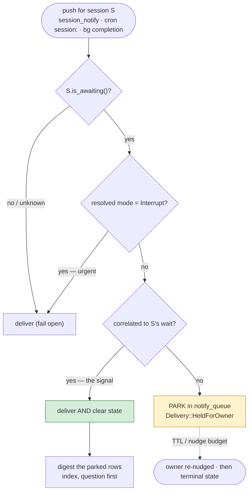
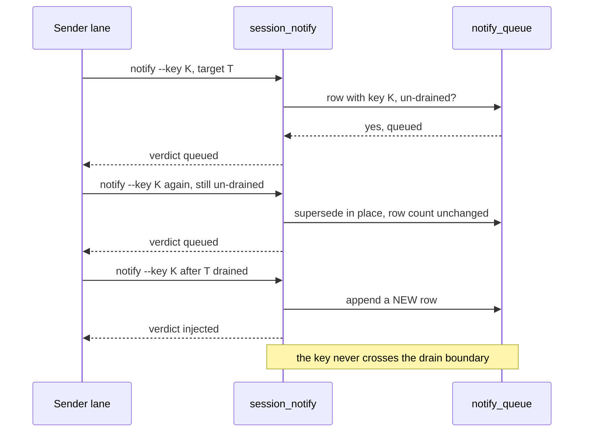

# Owner-Gated Lane Intake — holding a lane's automation while it awaits the owner

**Proposal ID:** `PROP-08-OWNER-GATED-INTAKE`
**Target:** the OpenCrabs harness (runtime behaviour), reaching every factory through the
harness binding
**Author:** meta-factory (this lane)
**Date:** 2026-10-03 · **rev.10** 2026-10-05 — **usage sequence diagrams added** (Appendix E: one
diagram per tool/surface). rev.9 restored the **CLI verbs and the wait graph as a first-class
surface** (one of the proposal's main surfaces, not an afterthought), removed the Open Questions
register from scope (an external add-on that *uses* the CLI verbs, never part of the harness), and
**restored the AFK section** to first-class standing. All load-bearing
citations re-verified at harness HEAD `717dfcd90` (2026-10-05).
**Status:** design input — **not law**. Owner ruled 2026-10-05: **HOLD + rework** (q59);
Q1 (q60) and Q6 (q61) answered and folded (§4.1, §9). On approval the issue is filed on
**`opencrabs/opencrabs`** (the binary tracker — owner order 2026-10-05). **Nothing is
implemented** — the proposed names are absent from the tree (checked this turn).
**Related:** `PROP-01` (cron-gated goal pipeline), `PROP-02` (human-load pacing),
`docs/addons/harness/opencrabs.md`; harness issues upstream — #13 (in-flight failsafe),
#43/#50 (notify quiet mode), #344 (durable await record), #393 (delivery modes).
Adversarial review: `docs/proposals/08-owner-gated-lane-intake.review.md`.

---

## 1. The problem

A lane's turn can end in **three** states. The harness distinguishes **two**.

| State | Durable record today? | What the harness does when new traffic arrives |
|---|---|---|
| **Done** — no pending work | none needed | wakes the lane; correct |
| **Awaiting an external completion** — a CI run, a peer lane | yes: `await_kind/await_ref/await_at` (#344) | resumed at boot; re-checked by a sweep |
| **Awaiting the OWNER** — a plan card, a blocking question | **none** | **wakes the lane and starts a fresh turn** |

The failure, in the owner's words (2026-10-03):

> *"the awaiting user input state is just flooded over by a wave of new notifications and
> info and tasks and the previous work is just lost."*

The mechanism is exact, and it is why no existing gate catches it: **an awaiting-owner lane is
idle, not mid-turn.** The #13 mid-turn gate (`session_routes.rs:416`) refuses only while a turn
is *running*. So the next cron `deliver_to: session:<uuid>`, the next `session_notify`, the next
background completion all find the lane idle and **start a new turn**; the pending question
scrolls out of working state.

Classify it: a **context-capacity failure** (a pending decision evicted by intake) whose counter
is **operational** — gate the intake, do not strengthen the generator
(`docs/methodology/01-llm-weakness-counters.md` §13).

---

## 2. What the substrate already has

Almost every part of the fix exists. The gap is that nothing connects them.

| Piece | Where (HEAD `717dfcd90`) | What it gives |
|---|---|---|
| Durable await record | `session_binding.rs:71-83` (`await_kind/await_ref/await_at`, `is_awaiting()`) | a restart-surviving per-binding "I am parked" flag |
| Await writer, `owner_gate` a named kind | `await_external.rs:36` (`AWAIT_KINDS`) | the owner wait is **already a named kind** — but gates nothing |
| Periodic sweep | `await_sweep.rs:217` (`sweep_inner`) | a timer that re-checks a lane parked too long |
| Boot resume | `resume.rs:2166` (`awaiting_for_channel`) | a parked lane is not lost across restart |
| **Delivery chokepoint** | `session_routes.rs:366` `deliver_to_session` → `Delivery{Delivered, Parked, NoRoute, RefusedInFlight, Redirected}` | every non-owner push passes here |
| **Durable parking** | `notify_queue.rs:38,85,169` (`MAX_ROW_AGE_SECS`, `wrap_busy_once`, `redeliver_persisted`) | a held push is persisted, not lost; redelivery exists |
| Delivery policy (#393) | `notify_policy.rs:29` `DeliveryMode{TurnEnd, Interrupt, Quiet{quiet_for, max_delay}}`; `resolve_mode:155` | modes + a starvation cap to reuse |
| Mid-turn probe | `session_routes.rs` `turn_probe` (channel gate #501/#845) | the shape of a per-session state probe to copy |
| Plan state | `plan_files.rs:200-218` (`PlanModeState::PostInitEditing:208`) | "awaiting owner" is already derivable for the plan case |

**The missing links:** nothing reads the await state at delivery time, `owner_gate` gates
nothing, and the await record carries **no resolvable edge** — `ref` is free text, so no caller
can walk *who is waiting on whom* (§4.2).

---

## 3. Best practices — the convergent core

Approval-pattern workflow engines (Temporal `wait_condition` + Signal + timeout), durable-execution
human-in-the-loop, actor mailboxes with backpressure, support-desk "waiting on customer", MCP
elicitation and BPMN message-catch events all converge on one shape: **a durable, named "awaiting
the human" state; the human's reply is the signal that clears it; every other producer queues
behind it; a timeout escalates to the human rather than waiting forever.** The design below is
exactly that.

---

## 4. The design

### 4.1 The state: awaiting, declared — not inferred

One durable state on the session binding, the same home as the await record, so it survives
restart.

**Set path — opt-in + a per-lane declaration (owner ruling q60, 2026-10-05).** The harness does
**not** infer the state from a generic turn end; a lane that wants its automation held says so.
Two paths set it, and both are *named objects the lane created*, not inferences:

| Producer | Sets the state? |
|---|---|
| A plan in `PlanModeState::PostInitEditing` (the approvable card) | **yes** — an explicit object the lane created |
| `await_external kind=owner_gate` (or any kind, §4.2) | **yes** — the call names the kind |
| `suggest_options` fired | **only on an opt-in flag** — non-blocking by contract (`suggest_options.rs:1-14`); a flagged card joins the declaration surface |

**The declaration surface is the CLI verb and the harness tool (§4.2)** — the public interface
every caller uses. The harness names no add-on; direction is always caller → harness. Any
external system (a question register, a dashboard, a cron) parks its lane by calling that
interface, and is **out of scope** for this design.

**Cleared** by the correlated signal (§4.4), or explicitly.

The state is not owner-only: a lane may be parked on a **peer lane**, whose record already exists
(`await_kind='peer_lane'`). §10 generalises the gate to it.
### 4.2 The declaration and query surface — the CLI verbs and the wait graph

This is one of the proposal's **two main surfaces** (the other is the gate, §4.3). A lane must be
able to say *what* it is parked on, and any caller — a human at a shell, a cron, an external
agent — must be able to read the resulting **wait-for graph** to find the bottleneck.

**The record gains one structured field.** Today `await_external` stores `kind` plus a free-text
`ref` (`await_external.rs:36`, `session_binding.rs:71-77`). `ref` is a handle for the logs, not a
resolvable edge: `peer_lane` with `ref="the Notifications lane"` cannot be walked. Add
**`await_target`** — the id of the awaited object, in its own column:

| `kind` | `await_target` |
|---|---|
| `peer_lane` | the peer's **session uuid** (validated to exist) |
| `ci_run` | the workflow **run id** |
| `owner_gate` | `null` — the owner is a graph **root** |
| `external` | `null`, or an opaque id — a graph **root** |

`ref` stays: the human-readable handle. `target` is what the graph walks.

**The harness tool** — `await_external` gains the field and a read action, so an agent declares
its wait *and* reads the graph from inside its own loop:

```
await_external set   --kind <k> --target <id> [--ref <handle>] [--prompt <text>]
await_external clear
await_external graph [--session <id>]        # read the wait-for graph
```

`graph` **derives** the graph and stores nothing:

- **nodes** — every session binding carrying a non-null `await_at`;
- **edges** — `session_id → await_target`, for every kind whose target is a session;
- **roots** — bindings whose kind is `owner_gate`/`external`, or whose `await_target` resolves to
  no binding (a dangling edge is a root, and a *reportable* one).

**The CLI verbs** — the same surface for a caller outside the agent loop, mirroring
`opencrabs session notify` → `session/notify` → `deliver_to_session` (`cli/session_notify.rs`):

```
opencrabs session await set   --session <id> --kind <k> [--target <id>] [--ref <h>] [--prompt <t>]
opencrabs session await clear --session <id>
opencrabs session await graph [--session <id>] [--json]
```

posting to new A2A methods `session/await` (set/clear) and `session/await/graph` (read). This is
the **public interface** every caller uses — a cron, a shell, an external agent, and any add-on.

**What the graph answers.** The owner's ask (2026-10-05) — *"an external agent can follow the
graph to see what the bottleneck is."* `graph` prints, for any node, its **root**: the terminal
object everything on that chain is really blocked on.

```
$ opencrabs session await graph --session A
A  --peer_lane-->  B
B  --peer_lane-->  C
C  --owner_gate--> (owner)          ← ROOT: the bottleneck is the owner
```

Root-first is the point: a chain of idle lanes with one unanswered owner question is **one**
bottleneck, not N. A root of kind `ci_run` is a build; a **dangling** target (a waiter pointing
at a session that no longer exists) is flagged as a broken edge, because that is a silent stall
(§6).

### 4.3 The gate — one place, keyed on the resolved mode

Add one check at the **route layer** (`session_route:492` / `deliver_or_park`), not only inside
`deliver_to_session`: the "single chokepoint" is not single today — `deliver_or_park` calls
`session_route` directly (`restart_recovery.rs:109-111`) and that is the exact path the boot
redelivery of held rows uses (`notify_queue.rs:231`). A gate placed above that layer leaks the
whole held wave on restart.

- If the target `is_awaiting()` (`session_binding.rs:82`) **and** the resolved mode is **not**
  `Interrupt` **and** the push is not the awaited signal → **park durably** in `notify_queue`,
  return a new `Delivery::HeldForOwner { since }`.
- **`Interrupt` bypasses** — the urgent tier (#393) must land (Gatus alerts).
- **Unknown state → deliver** (fail open), the posture of every existing gate.

**Key the gate on the mode, never on the `interrupt` bool.** `deliver_to_session` receives a bare
`interrupt: bool` (`session_routes.rs:366`) and **every production producer hardcodes it `true`** —
cron `:1035`, A2A `:347`, the `session_notify` tool `:563`, subagent spawn `:99`, background tasks
`:1363,1443`, restart recovery `:700`, quiet release `:198`. The code says why: `#393 TRAP: this
literal MUST stay true … keeps the mid-turn gate disarmed for EVERY mode` (`subagent/notify.rs:558-562`,
`a2a/handler/notify.rs:342-346`). A gate keyed on that bool parks nothing. **Do not flip the
literal** — that re-arms the mid-turn gate and refuses deliveries #373 deliberately stopped
refusing.

Since #393 the resolved `DeliveryMode` is already computed in both notify handlers
(`resolve_mode`, `notify_policy.rs:155`) and then discarded before the call. The change is one
step: **plumb the mode into `deliver_to_session`** (as an added parameter — the bool keeps its
job) and gate on `mode != Interrupt`. No producer learns a new rule.

### 4.4 The clear — correlated, on one hook, three surfaces

The clear must be the **signal**, not any owner message. An unrelated owner message is *input*;
clearing on it drains the wave and buries the question again — contradicting §3's own rule.

- **Correlated signal only:** the plan approve/discard callback (`flow_chrome.rs:63` `"plan:ok"`,
  handled `agent.rs:1813`), the tapped option, the answered question.
- **One hook, three surfaces:** text, **callback query** and **reaction** (👍, `agent.rs:2436`).
  Neither of the owner's two real approval gestures is `handle_message`, so a clear in
  `channels/*/handler.rs` alone misses both.
- **Owner identity is not on the wire:** `PushOrigin` has no owner variant (`types.rs:218`) and
  `QueuedUserMessage` carries no sender (`:311`). Key the clear on the channel's configured owner
  id inside the handler; drop the owner predicate from the delivery gate.

### 4.5 Drain as a digest — an index, not a summary

When the state clears, **do not** deliver the parked rows as N turns — that reproduces the flood,
merely delayed, and re-buries the question the hold protected. Deliver **one** turn.

**How information is not lost.** The digest is an **index**, not a summary, and the rows stay put.
`notify_queue` is durable and already holds every held push (§2); the digest renders **one line
per held row** — sender · instant · first line of the body — with the pending question first, and
the full rows stay **pullable** by the owner. Nothing is compressed away, so nothing is lost: the
digest changes *the order of attention*, never the *set of facts*. A model-written summary would
paraphrase and drop; this renders, so it cannot.

**Who makes it.** The **harness drain code**, mechanically: a deterministic template over the row
set (`drain_for_session`, §5). It is **not** a model call — a model would be lossy and
non-repeatable, and the point is that the same rows always render the same digest. The seam
exists (`wrap_busy_once`, the `queued_message_join` coalescing path, `notify_queue.rs:85`).

**Ordering.** The digest runs **after** the answer turn, framed with a reference to the question:
*"While you were answering X, 14 pushes were held — [one line each]."*

**Scope.** Only rows held **by the gate** are digested; ordinary queued traffic (a lane busy
mid-turn) keeps its existing delivery.

### 4.6 Sender-side — a sender replaces its own un-drained push

Today a sender cannot tell whether its push was consumed or is still queued, so a lane that
re-notifies hourly leaves twelve rows and buries the owner's question under its own duplicates.
Two additions close this at the source (owner ask 2026-10-05):

- **A stable key.** `session_notify` (and the tool) takes an optional **`key`** — stable per
  (sender, target, purpose). A re-send carrying a key that matches an **un-drained** row
  **supersedes** it in place, rather than appending.
- **A truthful verdict.** The send returns whether the push was `queued` (held, not yet drained)
  or `injected` (consumed by a turn). The tool's existing `status` action already distinguishes
  these two states, so the receipt reuses it.

**The guard that makes it safe.** Replace is scoped to **un-drained** rows only. Once the target
has read a push, a later re-send with the same key appends a **new** row — a replace would
silently rewrite history the target has already seen. So the rule is *supersede while un-drained,
append after drain*, and the key never crosses the drain boundary.

### 4.7 Receipts — a hold must print itself

- A held push logs and reports itself (`HELD: awaiting owner since <ts>`), so "held
  deliberately" and "silently dropped" are never the same output.
- The state is readable from the binding, and the **graph (§4.2)** makes it readable across a
  chain, so a third party can tell why a lane is quiet and where the block really is.


---

## 5. What changes, per file

| File | Change | Risk |
|---|---|---|
| `db/repository/session_binding.rs` | add **`await_target`** (§4.2) beside `await_ref`; `await_prompt`, `last_nudge_at` | migration-light (await columns already exist) |
| `brain/tools/await_external.rs` | `target` param on `set`; new **`graph`** action (§4.2) | new read path; no new state |
| `brain/tools/plan_tool.rs`, `suggest_options.rs` | set the state for the approvable plan card, or a card the lane flagged blocking | opt-in only; must not fire on non-interactive surfaces |
| `cli/session_notify.rs` + new `cli/session_await.rs`; A2A `session/await` + `session/await/graph` | the **declaration and query surface** (§4.2) — the main public interface | new public interface; the harness names no add-on |
| `brain/agent/service/session_routes.rs` | new `Delivery::HeldForOwner`; gate at the **route layer**; plumb the resolved `DeliveryMode` in | the one behavioural change; unit-testable |
| `brain/agent/service/notify_queue.rs` | `drain_for_session(id)` emitting the **digest** (§4.5); sender **`key`** + supersede-while-un-drained (§4.6) | reuses `redeliver_persisted` internals |
| `brain/tools/subagent/notify.rs` (`session_notify` tool) | optional `key` param; return the `queued`/`injected` verdict | additive |
| `channels/*/handler.rs` + `agent.rs` (callback / reaction hooks) | clear the state on the correlated signal, on **all three** surfaces | must be the owner, not any member |
| `channels/telegram/await_sweep.rs` | for a gated wait: nudge the **owner** (no wake), `last_nudge_at`, geometric backoff | changes sweep semantics for one kind only |
| `cron/scheduler.rs` | none — already routes through `deliver_to_session` | — |

---

## 6. Failure modes and their guards

| Failure | Guard |
|---|---|
| A lane wrongly marked awaiting → its automation stalls | fail open: unknown/unreadable state delivers; the state clears on the correlated signal; a TTL expires the held rows |
| A push is held and then lost | `notify_queue` is already durable; held rows ride the existing boot redelivery; the 72 h reap logs every drop loudly |
| The digest drops information | it is an **index** rendered mechanically over the rows, never a model summary (§4.5); the rows remain pullable |
| A sender's re-send rewrites history already read | replace is scoped to **un-drained** rows; after drain the same key appends (§4.6) |
| A lane is never answered | the sweep re-nudges the owner (no-wake); a nudge budget then a terminal state (§11) |
| An urgent alert is held | `Interrupt` bypasses the gate |
| The gate itself becomes the flood (the sweep re-waking lanes) | for a gated wait the sweep targets the owner, not the lane |
| A non-owner member clears the state | the clear is keyed to the owner identity, not to any inbound message |
| **A dangling wait edge** — a waiter points at a session that no longer exists | `graph` flags a root that resolves to no binding; the sweep re-checks a target that vanished |
| **Peer case:** a cyclic wait (A↔B) | wound-wait cycle rule (§10); the graph makes the cycle *visible* |
| **Peer case:** a waiter blocked transitively on the owner | the sweep probes the peer first and escalates to the owner (§10); the graph names the root |

---

## 7. Verification

- **Unit — the gate says no:** a binding with a gated wait + a `session_notify` push →
  `Delivery::HeldForOwner`, one row in `notify_queue`, no turn started.
- **Unit — the signal:** a correlated owner signal → `Delivered`, state cleared.
- **Unit — urgent bypass:** same binding + `Interrupt` → `Delivered`.
- **Unit — the digest:** N held rows + a clear → **one** summary turn (not N), question first,
  **N lines present** (losslessness: the digest's line count equals the row count).
- **Unit — the graph:** three bindings `A→B→C(owner_gate)` → `graph --session A` reports the root
  as `(owner)`; a dangling target is reported as a broken edge.
- **Unit — sender replace:** a keyed re-send while un-drained → the prior row is superseded (row
  count unchanged); after drain → a new row is appended.
- **Positive control:** no binding / unreadable state → `Delivered` (proves the gate can return
  "no", so its "yes" is not vacuous).
- **Integration:** a lane parked on a plan card; a cron with `deliver_to: session:<uuid>` fires →
  the cron parks; the owner presses Approve → the plan proceeds and the digest follows.
- **Starvation:** a held row past the TTL → expired with the reason recorded, never delivered
  stale.

---

## 8. Boundary — who implements what

The runtime change belongs to the **OpenCrabs harness** — on approval, a **binary issue on
`opencrabs/opencrabs`** (owner order 2026-10-05), this proposal attached. This factory's part is
the **process law** that follows from it: what a lane must do when it parks, what a sender must
expect (its push may be held), and the reversibility test it applies before asking at all (§9).
The two ship together — the harness leg alone would hold pushes with no lane-side rule to declare
the wait; the law alone would have nothing to enforce.

---

## 9. The reversibility test — lane-side law, upstream of the gate (owner ruling q61)

The owner's objection to "safe default on timeout", and it is correct: *if the lane knows what it
would do, why did it ask?* The default is not a *timeout policy* — it is an **ask-time
classification test**, and the presence of a safe default is itself the evidence the question
need not have been asked. Best practices converge on **reversibility**, not preference (Bezos'
one-way/two-way doors; Parasuraman levels of automation; human-on-the-loop; Apache lazy
consensus).

| Decision class | Test | Action | Parks the lane? |
|---|---|---|---|
| **Two-way door** | reversible, bounded blast radius | decide, record, **notify as FYI** | **no** |
| **One-way door** | irreversible or unbounded | ask; on timeout **escalate / hold — never auto-proceed** | yes |
| **Reversible, but the owner cares** | reversible, but a cost or rule he would want to weigh | **lazy consensus**: announce the default + a deadline | soft (only if T > 0) |

The residual timeout default survives **only** as lazy consensus — an *announced* default with a
deadline, never a default bolted silently onto an open question. **This is upstream of the gate:**
if two-way-door decisions stop parking lanes, most of the flood disappears at the root and the §4
gate carries only genuine one-way-door asks. The gate is the safety net; this rule is the
load-shedding. It is **lane-side process law** (the factory's half of the §8 boundary), not a
harness behaviour — the harness cannot know whether a question is a two-way door.
---

## 10. Peer-lane waits — the same state, a correlated signal, and two new failure classes

Raised by the owner, 2026-10-04: *"What if a lane is waiting not on the human but on another
lane?"*

### 10.1 The state already exists — the signal and the gate do not

`await_external` accepts `peer_lane` today (`await_external.rs:36`), the record is durable on the
binding, boot resumes it, and the sweep re-checks it. So a peer wait is **not** a gap in the
state — it is a gap in **how the wait is cleared**. For an owner wait the clearing signal is
origin-identifiable; for a peer wait the reply is an ordinary push, and `session/notify` carries
**no correlation field** (`grep request_id|correlation|reply_to` → **0 hits**). Gating without a
correlation is wrong either way: bypass "anything from the peer" and the peer's *unrelated*
pushes walk through; bypass nothing and the *actual answer* is held behind the gate that waits
for it.

### 10.2 Two failure classes owner-waits do not have

| Failure | Shape | Why owner-waits are immune |
|---|---|---|
| **Cyclic wait (deadlock)** | A waits on B, B waits on A; no human is in the loop to break it | a human answers, or does not — there is no second waiter to close a cycle |
| **Transitive block on the owner** | A waits on B; B is parked on `owner_gate`. A's record says `peer_lane`, so the sweep wakes *A* — into the flood — while the real blocker is the owner's unanswered question | an owner wait's root block *is* the owner; a peer wait's root block may be one hop away |

### 10.3 What the best practices say

Temporal Signals (`wait_condition` on a *named* Signal); Erlang/Akka selective receive (consume
only the correlated ref, leave the rest in the mailbox); gRPC deadline/cancellation propagation;
BPMN message-catch with a correlation key + boundary timer; AMQP `reply_to` + `correlation_id`;
Chandy–Misra–Haas deadlock probes / wound-wait; circuit-breaker bulkheads; saga compensation.
**Convergent core:** the same durable wait state, a signal that is **correlated** rather than
**origin-based**, a **deadline that propagates** along the chain, and a **cycle rule** — because
peer waits, unlike owner waits, can deadlock.

### 10.4 Design additions (generalise §4, add five pieces)

1. **Generalise the gate.** Key §4.3 on `is_awaiting()` (`session_binding.rs:82`) rather than on
   `owner_gate` alone. One gate, both kinds.
2. **Correlated bypass — the one new wire field.** Add a **request-side** `request_id` /
   `correlation_id` to `session/notify` and the `session_notify` tool (a *reply-side* `reply_to`
   is wrong — B cannot echo a token it never received). A push whose token matches the waiter's
   wait token is **delivered and clears the wait**; every other push parks.
3. **Deadline propagation.** Add `await_deadline`; A's effective deadline is `min(A's own, B's
   remaining)`. The sweep walks deadlines, not arrival order, so a chain unblocks root-outward.
4. **Cycle rule (wound-wait).** Before recording a `peer_lane` wait, walk the wait-for graph
   (**§4.2's `graph`** — the same read) for a path `B → … → A`. On a cycle, the earlier-deadline
   wait is broken by escalating; the later keeps waiting. (`set_await` has no transaction spanning
   graph-read + edge-write, `await_external.rs:150-160` — serialise declares, or detect cycles in
   the sweep.)
5. **Transitive escalation.** When the sweep finds a `peer_lane` waiter whose peer is itself
   parked on a gated wait, escalate to the **root** — the **owner** if the chain ends there,
   naming it (*"A is blocked because B awaits your approval"*) — and do **not** wake A. The
   **graph** (§4.2) is what names the root.

**Sweep semantics change for one case only.** Today the sweep clears the record and wakes the
waiter; for a gated peer wait, **probe the peer first**; wake only if the peer cannot answer; if
the chain ends at the owner, nudge the owner.

**Idempotency.** A boot redelivery can deliver a reply twice — the waiter dedupes on the token.

### 10.5 Peer-case details

Minted per-wait id with `await_ref` as the human-readable handle (a lane may wait on the same peer
twice) · wound-wait, not hard refusal (a refusal would need the whole graph) · a propagated
deadline floored at a fixed minimum · the owner as escalation target (the peer gets an
informational copy) · the edges are **derived** by `graph`, not stored — but from the **validated
peer session id in `await_target`** (§4.2), never from free-text `await_ref`.

---

## 11. The owner is AFK for hours — the load-bearing scenario

The owner asked (2026-10-05) why this section disappeared from rev.8: it did not survive the
streamline. It is restored here to first-class standing, because a hold that only works while the
owner is at his desk is not a hold — the overnight case is the whole point.

Six rules; the practices are consistent.

1. **The hold is passive and O(1).** A parked lane costs one `notify_queue` row plus one binding
   field — no running turn, no held process, no poll. Temporal: the workflow is durable state and
   the worker is not blocked by a sleeping human. Our substrate already satisfies this — the lane
   is *idle*, which is the whole reason the #13 mid-turn gate never fired for it.

2. **Do not drain the wave on wake — coalesce it into a digest.** This is what actually answers
   the question. Fourteen pushes parking over eight hours and delivered as fourteen turns at 07:00
   reproduces the flood, merely delayed — and re-buries the very question the hold protected.
   Practice (SQS/Kafka retention + notification digesting): on clear, deliver **one** index turn —
   *"14 pushes were held while you were away"*, one line each, **the pending question first** —
   and let the owner pull the rest (§4.5).

3. **Quiet hours for the nudge — measured, not configured.** The re-nudge must respect the owner's
   active window. Escalation policies (PagerDuty/Opsgenie) fire only inside on-call hours. So a
   non-urgent `owner_gate` nudge does **not** fire at 03:00 MSK — it waits for the window.
   `Interrupt` (Gatus) is the *page-the-on-call* tier and still bypasses; that asymmetry is the
   entire reason the two tiers exist. The window is a **measurement** off the substrate, not a
   hardcoded clock (§11.1).

4. **A TTL with a recorded reason — never a stale burst.** Held rows already reap at 72 h
   (`MAX_ROW_AGE_SECS`, `notify_queue.rs:38`) and log every drop. For gated holds the semantic TTL
   is shorter: a push whose point was a 14:00 decision is usually noise at 22:00. Expire with the
   reason recorded; never deliver an eight-hour-old burst as though it were fresh.

5. **The pending decision needs a terminal state.** After the nudge budget, exactly one of:
   **escalate** (a secondary surface or channel), or **abandon-with-record** (mark the work
   dropped, loudly). "Safe default" is **not** on this list — it was replaced by the ask-time
   reversibility test (§9, owner ruling q61). Which of escalate/abandon applies is per-decision.

6. **Schedule owner-gated automation inside the owner's window** (lane-side rule, not a harness
   change). A cron whose work needs approval should not fire at 04:00 and immediately park for five
   hours. Daytime-bias the cadence of owner-gated lanes.

**On the lane's non-gated work:** no separate rule is needed. A lane parked for eight hours is
idle by design and loses nothing — its cron fires are **held, not dropped** — so rule 2's digest
is what makes the wake survivable.

### 11.1 The AFK counter — measured, not configured

The owner's question (rev.5): *why a hardcoded quiet window rather than the existing AFK
counter?* Because the window was an **assumption** about the owner's schedule where the substrate
already carries a **measurement** of it. Read from source, there are two quiet-gate mechanisms,
and rule 3 is a *consumer* of them, never a parallel clock:

| Instrument | Scope | Writers | Where |
|---|---|---|---|
| `LAST_ACTIVITY` (#522) | **fleet-wide — one clock for the whole process** | every inbound channel message, plus the reclaim ticker while a turn is in flight | `session_routes.rs:223`; the channel writer at `handler.rs:759` |
| `quiet_delivery` (fork #50) | **per target** | the target's own turn end | `quiet_delivery.rs` — pure due-predicate + a per-entry starvation cap |

**Verdict: replace the window with the counter.** It adapts to a late night, needs no config, and
fails safe (`None` reads as *just active* → defer).

**The catch that must be designed, not assumed.** `LAST_ACTIVITY` is **fleet-scoped, not
owner-scoped**, and deliberately so — its own doc says *"One clock for the whole process … traffic
in ANY chat the bot can see defers the reclaim for every chat"*, and the handler writer branches on
**nothing**. It answers *"is the fleet busy"*, never *"is the owner awake"*. A peer lane posting at
03:00 would read as owner-activity and **permit** the 03:00 nudge — the exact failure this rule
exists to prevent.

**Fix: an owner-scoped sibling clock.** `note_owner_activity()`, written beside the fleet one at
the same handler site — where the sender is already in hand — so the nudge gate reads the
**owner's own** idle time.

**Polarity — the nudge is the *inverse* of the reclaim.** The reclaim fires when the fleet is
**quiet** (do not disrupt a live chat); the nudge is **suppressed** when the owner is quiet. Same
clock, opposite sense — a *consumer* of the counter, **not** a copy of `quiet_delivery::is_due`.

**And the starvation cap must NOT force through this gate** (unlike the reclaim's). If the owner
is genuinely asleep, waking him at 03:00 is precisely the harm; an unanswered nudge is resolved by
the TTL and the terminal state (§11 rule 5), never by a forced delivery.

**Limits, stated honestly.** The counter is *reactive*: it detects *"quiet for 90 min"*, it cannot
know he is **about to** sleep. And **silence ≠ asleep**: a silent working afternoon reads as
*away* and suppresses a nudge. That is acceptable — a nudge is a courtesy, the backoff retries
it, and the alternative (assuming he is awake *because* he is silent) is worse.

---

## 12. Decisions the owner still holds

The HOLD (q59) was a rework order, not a rejection of the diagnosis. Q1 (q60) and Q6 (q61) are
answered and folded; the off-hours question (Q7) and the declaration verb (Q8) are resolved in
revision. The register itself is **out of scope** — this design exposes the CLI verbs (§4.2) and
names no add-on. What remains open in the design:

| # | Question | Recommendation | Blocks re-approval? |
|---|---|---|---|
| **Q2** | Starvation cap: how long may a push be held? | the existing 1800 s `quiet` cap, configurable | no — mechanism detail |
| **Q3** | Does `Interrupt` bypass? | yes — an alert must land (the Gatus exception) | **eyeball this one** |
| **Q5** | State scope: per binding or per session? | per binding, matching the await record | no |
| **Q9** | Nudge window & budget | measured, not configured (owner-scoped clock, §11.1); 3 nudges, geometric backoff, TTL 24 h | no |
| **Q10** | Peer-case details | minted per-wait id; wound-wait; propagated deadline (floored); owner as escalation target; derive the graph, do not store (§10.5) | no — §10 extension |

---

## Appendix — corrections folded into this revision, and the revision log

This rev.9 keeps the one-design structure of rev.8 (which replaced the stacked supersession
sections of revs.3–7). Corrections are **in the body**; this appendix records what they were, so a
reader who saw an earlier revision can find where each landed.

### A. Corrections from the adversarial review (were §11)

| rev.2 said | Corrected (now in) |
|---|---|
| gate on `mode != interrupt`, but `deliver_to_session` takes a bare bool that is `true` everywhere | gate on the **resolved `DeliveryMode`**, plumbed in — never flip the literal (§4.3) |
| gate inside `deliver_to_session` alone | gate at the **route layer** — `deliver_or_park` bypasses it, and boot redelivery uses that path (§4.3) |
| set the state on `suggest_options` | never auto — **opt-in flag only** (§4.1) |
| reuse `await_sweep` as-is | it consumes-then-wakes and serves telegram only; add a **no-wake nudge** branch, `last_nudge_at`, every channel (§5) |
| starvation cap force-delivers the wave | cap on **owner non-response** → escalate / expire; never inject automation into the lane while the question is open (§6, §11) |
| clear in `channels/*/handler.rs` | clear on **three surfaces** (text, callback, reaction) — the owner's two real gestures are neither (§4.4) |
| drain parked rows in arrival order | **digest** — an index, one turn, question first (§4.5) |
| `PlanStatus::Editing` | the approvable state is `PlanModeState::PostInitEditing` (`plan_files.rs:208`); `plan_mode_state` has a side effect — unsafe on the hot path (§2) |

### B. Corrections from the owner review (were §12–§13, §15, and this revision)

| Point | Folded in |
|---|---|
| `oc-questions` is an **external add-on**; the harness must not depend on it | **removed from scope** — the declaration surface is the **CLI verb → `session/await`**; direction is caller → harness, and the harness names no add-on (§4.1, §4.2) |
| **CLI verbs are a main surface, not an afterthought** (owner, 2026-10-05) | promoted to their own section, with the **wait-graph** verbs and A2A methods (§4.2) |
| **a harness tool to set the wait on a session id, so an external agent can follow the graph** (owner, 2026-10-05) | structured **`await_target`** + the **`graph`** action on `await_external`, and the CLI `session await graph` (§4.2) |
| **digest: how to avoid info loss, and who makes it** (owner, 2026-10-05) | the digest is an **index rendered mechanically** by the harness drain code, never a model summary; the rows stay pullable (§4.5) |
| **a sender must be able to replace its own un-drained push** (owner, 2026-10-05) | stable **`key`** + supersede-while-un-drained; the `queued`/`injected` verdict (§4.6) |
| **the issue goes to `opencrabs/opencrabs`** (owner, 2026-10-05) | §8 boundary + header updated |
| **the AFK section vanished** (owner, 2026-10-05) | **restored** to first-class standing — the six rules and the owner-scoped clock (§11) |
| the sweep has **no payload to re-emit** | new optional **`await_prompt`** (the owner-facing text/card); cadence bounded, `last_nudge_at` dedup (§4.1, §5) |
| quiet hours were an **assumption** where the substrate has a **measurement** | the nudge consumes an **owner-scoped** activity clock — `note_owner_activity()`; polarity is the **inverse** of the reclaim; the reclaim's starvation cap must **not** force through this gate (§11.1) |
| "safe default on timeout" is incoherent | replaced by the **ask-time reversibility test** (§9) — owner ruling q61 |
| the auto-set list | **withdrawn**; opt-in + per-lane declaration — owner ruling q60 (§4.1) |

### C. Citation re-verification

Every load-bearing citation was re-read through the **code index** (`scope="external"`, which
covers `/root/opencrabs/src`) **and** confirmed against source, then re-confirmed at HEAD
`717dfcd90` for this revision. Two line slips were found and fixed in rev.8: `resolve_mode` is
**`notify_policy.rs:155`** (rev.6 wrote `:151`); the binding setter is **`set_await:229`** and
`:288` is `clear_await_of_kind` (rev.5 wrote `:288`). The instrument was characterised before
trusting a zero (AGENTS.md rule 7): the index answers a bare symbol well but returns "No matches"
for an English query against a *type* — a phrasing artifact, not an absence. The proposed names
(`HeldForOwner`, `await_target`, `await_prompt`, `last_nudge_at`, `note_owner_activity`,
`drain_for_session`, `session/await`) return **0 hits each** — the positive check that this is
still a design, not code.

### D. Revision log

| rev | date | change |
|---|---|---|
| 1–2 | 2026-10-03/04 | initial design; peer-lane waits added |
| 3 | 2026-10-04 | adversarial-review corrections (mode-vs-bool, route-layer gate, clear surfaces, digest) |
| 4 | 2026-10-04 | add-on boundary, `await_prompt` re-nudge payload, sleeping-owner rules |
| 5 | 2026-10-04 | off-hours measured not configured; safe-default → ask-time test |
| 6 | 2026-10-04 | every citation re-verified through the code index |
| 7 | 2026-10-05 | owner rulings: HOLD + rework; Q1 opt-in + declaration; Q6 reversibility test |
| 8 | 2026-10-05 | streamlined — revs.3–7 folded into one design + appendix; line slips fixed |
| **9** | **2026-10-05** | **CLI verbs + wait graph restored as a main surface; register removed from scope; AFK section restored; digest-as-index, sender-replace, issue → `opencrabs/opencrabs`** |
| **10** | **2026-10-05** | **usage sequence diagrams added — Appendix E, one per tool/surface (await_external, CLI + A2A, plan, suggest_options, the gate, the clear, the digest, session_notify key, await_sweep, peer-lane)** |

---

### E. Using the tools — sequence diagrams

One diagram per tool/surface named above. Every message is a call the design already specifies;
nothing here adds behaviour. Read them as the *usage* of §4: who calls what, and what comes back.

#### E.1 `await_external` — an agent declares its own wait (§4.2)

```mermaid
sequenceDiagram
    participant A as Agent lane
    participant T as await_external
    participant B as session_binding
    A->>T: set --kind owner_gate --ref "PROP-08 approval"
    T->>B: set_await kind=owner_gate, target=null
    B-->>T: await_at = now
    T-->>A: parked; this wait's root is the owner
    Note over A,B: the lane is now IDLE, not mid-turn; the #13 mid-turn gate does not apply
```

#### E.2 `await_external graph` — read the wait-for graph (§4.2)

```mermaid
sequenceDiagram
    participant C as Caller
    participant G as await_external graph
    participant B as session_binding store
    C->>G: graph --session A
    G->>B: read every binding with await_at set
    B-->>G: A to B, B to C, C is owner_gate
    G->>G: derive nodes, edges, roots; store nothing
    G-->>C: A to B to C to owner; ROOT = the owner
    Note over G,B: a target resolving to no binding is a ROOT and a broken edge — a silent stall
```

#### E.3 `opencrabs session await` + `session/await` — a caller outside the loop (§4.2)

```mermaid
sequenceDiagram
    participant X as Caller, cron or shell or add-on
    participant CLI as opencrabs session await
    participant A2A as session/await A2A method
    participant B as session_binding
    X->>CLI: set --session S --kind owner_gate --prompt "..."
    CLI->>A2A: session/await set, session S, kind, target, ref, prompt
    A2A->>B: set_await
    B-->>A2A: await_at = now
    A2A-->>CLI: ok
    CLI-->>X: S parked
    Note over X,B: the public interface; direction is caller to harness, and the harness names no add-on
```

#### E.4 `plan` — the approvable card sets the state (§4.1)

```mermaid
sequenceDiagram
    participant L as Lane
    participant P as plan tool
    participant F as plan_files
    participant B as session_binding
    participant O as Owner
    L->>P: init or edit; approvable card
    P->>F: plan_mode_state = PostInitEditing
    P->>B: set_await kind=owner_gate, prompt=card
    B-->>P: parked
    O->>P: taps Approve, plan:ok
    P->>B: clear_await
    P-->>L: plan proceeds
    Note over L,B: the approvable card is one of the two named objects that SET the state
```

#### E.5 `suggest_options` — the opt-in wait flag (§4.1)

```mermaid
sequenceDiagram
    participant L as Lane
    participant S as suggest_options
    participant B as session_binding
    participant O as Owner
    L->>S: options --wait  (OPT-IN flag)
    S->>B: set_await kind=owner_gate, prompt=card
    B-->>S: parked
    S-->>L: card posted; lane idle
    O->>S: taps an option
    S->>B: clear_await
    S-->>L: option delivered
    Note over L,B: without the flag, suggest_options is non-blocking by contract and sets nothing
```

#### E.6 the gate — a push meets a parked lane (§4.3)

```mermaid
sequenceDiagram
    participant P as Producer
    participant R as route layer, deliver_or_park
    participant D as deliver_to_session
    participant B as session_binding
    participant Q as notify_queue
    P->>R: push for session S
    R->>D: deliver_to_session S, mode
    D->>B: is S awaiting?
    B-->>D: yes
    D->>D: mode is not Interrupt, and not the awaited signal
    D->>Q: park durably, one row
    D-->>R: Delivery::HeldForOwner
    R-->>P: HELD, awaiting owner since ts
    Note over D,Q: Interrupt bypasses; unknown state delivers — fail open
```

#### E.7 the clear — a correlated owner signal (§4.4)

```mermaid
sequenceDiagram
    participant O as Owner
    participant H as channel handler
    participant C as clear hook
    participant B as session_binding
    O->>H: Approve tap, correlated reply, or reaction
    H->>C: correlated signal for S
    C->>B: clear_await S
    B-->>C: cleared
    Note over O,B: only the CORRELATED signal clears; an unrelated owner message is input, not the signal
```

#### E.8 `drain_for_session` — the digest, an index (§4.5)

```mermaid
sequenceDiagram
    participant C as clear hook
    participant D as drain_for_session
    participant Q as notify_queue
    participant L as Lane turn
    C->>D: state cleared for S
    D->>Q: read every row held by the gate
    Q-->>D: N rows, sender and instant and first line
    D->>D: render ONE index, question first
    D-->>L: one digest turn; N lines; rows stay pullable
    Note over D,Q: an index, not a summary; nothing compressed away, so nothing lost
```

#### E.9 `session_notify` — a sender replaces its own un-drained push (§4.6)



#### E.10 `await_sweep` — the AFK nudge (§11)

```mermaid
sequenceDiagram
    participant W as await_sweep
    participant B as session_binding, last_nudge_at
    participant K as owner-scoped clock
    participant O as Owner
    W->>B: is the gated wait past its nudge cadence?
    B-->>W: yes
    W->>K: how long has the OWNER been quiet?
    alt owner quiet
        K-->>W: quiet, so defer — no 03:00 nudge
    else owner active
        K-->>W: active
        W->>O: nudge, no wake of the lane
        W->>B: last_nudge_at = now, geometric backoff
    end
    Note over W,B: after the budget — escalate, or abandon-with-record; never a silent default
```

#### E.11 peer-lane wait — graph walk, cycle rule, correlated reply (§10)

```mermaid
sequenceDiagram
    participant A as Lane A
    participant T as await_external
    participant G as wait-for graph
    participant B as Lane B
    participant O as Owner
    A->>T: set --kind peer_lane --target B
    T->>G: walk B to A for a cycle, wound-wait
    G-->>T: no cycle, so record the edge A to B
    T-->>A: parked on B
    B->>A: reply, session_notify --request-id token
    A->>A: token matches, so deliver and clear the wait
    Note over B,A: a push with no matching token PARKS; only the correlated reply walks through
    Note over A,O: if B itself awaits the owner, the sweep escalates to the ROOT and does NOT wake A
```
