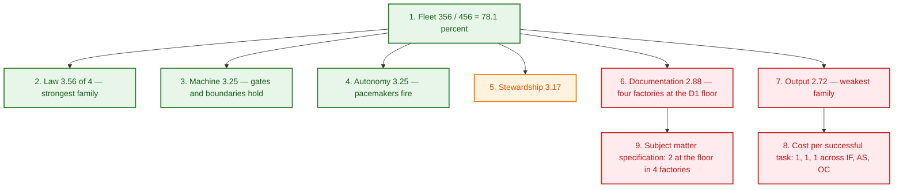

# Factory scores — 2026-09-24 (Quality Criteria v0.5)

> **Read instant:** `2026-09-24T06:05Z` → `06:2xZ` (UTC). Every number below was read in this
> turn; the run re-read live evidence rather than carrying any value from the previous report.
> **Tree:** `/root/agent-factories` at HEAD `ed8c98f129a535778b9ab53ba8f4e65223f61a74`
> (== `origin/main`), plus two peer lanes' in-flight fragment edits — see §Method.
> **Baseline for every diff:** `evidence/scores/2026-09-23.md` (fleet 356 / 456).

---

## Executive Summary & Movements

**Fleet total: 356 / 456 = 78.1% — unchanged from 2026-09-23 (356). No band moved.**

| Factory | 09-23 | 09-24 | Δ | Band |
|---|:---:|:---:|:---:|:---:|
| **Meta-factory** | 70 | **70** | 0 | Optimizing |
| **OpenCrabs dev** | 62 | **62** | 0 | Optimizing |
| **Miidas** | 60 | **60** | 0 | Scalable |
| **InferHub Watch** | 58 | **58** | 0 | Scalable |
| **Infra Factory** | 56 | **56** | 0 | Scalable |
| **AI AntiSpam** | 50 | **50** | 0 | Scalable |

A flat day, stated plainly. The fleet has now held 356 for two consecutive runs, and the honest
reading is that **no criterion crossed a rubric boundary** in either direction. Under the rubric's
own scale (`0` Absent → `4` Self-correcting, where `4` means a threshold fires by itself) a flat
fleet is not a failed run: six of nineteen criteria are already at `4` floor-wide, and the two
families dragging the fleet — Output (2.72 of 4) and Documentation (2.88 of 4) — are held there by
the *same two* unwritten measurements as last run, neither of which any factory can close alone.

**Movements that are real but sit BELOW a score boundary** (evidence genuinely changed; the score
did not, and saying so is the point):

| Sub-score driver | Factory | 09-23 | 09-24 | Reading |
|---|---|:---:|:---:|---|
| Stewardship · recoverability — unpushed commits | Infra Factory | 156 | **28** | ⬇ 128 commits drained. Still not zero, so the score holds at 3 |
| Output · throughput — state-ledger events | OpenCrabs dev | 9,310 | **9,479** | +169; `done` rows 216 → **223** |
| Output · throughput — ledger events / closes | InferHub Watch | 345 / 49 | **384 / 50** | both up; still 3 |
| Output · throughput — ledger rows | Meta-factory | 955 | **975** | +20; closes 118 → **121** |

**The one movement that is NOT the fleet's, and it is the third run running.** Four of the six
factories still clear the Subject Matter Consulting Gate **at the floor** (2/4 on subject-matter
specification) because the artefact criterion D1 names — `docs/subject/` — is absent from each of
them, while the substance the criterion means to measure does exist there under other names
(`ONTOLOGY.md`, `skills/`, `probe/`, flat `docs/`). Every one of those four is **one regression away
from being barred from consulting**. This is a rubric question, not a member defect, and it is
escalated rather than re-reported — see advisory 🟠 1.

---

### Family-level fleet view

Mean score per family, out of 4 per criterion. Six factories × 19 criteria = 114 cells; the grand
total reconciles to the fleet figure exactly (356).

| Family | Criteria | Cells | Per-factory family sums (M, OC, IH, MI, IF, AS) | Fleet mean |
|---|:---:|:---:|---|:---:|
| **Law** | 3 | 18 | 12 · 11 · 10 · 11 · 11 · 9 | **3.56** |
| **Machine** | 4 | 24 | 15 · 15 · 13 · 13 · 12 · 10 | **3.25** |
| **Autonomy** | 2 | 12 | 7 · 7 · 7 · 6 · 6 · 6 | **3.25** |
| **Stewardship** | 3 | 18 | 11 · 9 · 10 · 10 · 9 · 8 | **3.17** |
| **Documentation** | 4 | 24 | 15 · 11 · 10 · 12 · 11 · 10 | **2.88** |
| **Output** | 3 | 18 | 10 · 9 · 8 · 8 · 7 · 7 | **2.72** |



**What the two weak families are made of, precisely.** Output's 2.72 is not general weakness — it is
**one criterion scoring `1` in three factories** (cost per successful task: nobody derives an
aggregate task unit cost; only this factory does, from ledger `cost_usd=` fields). Documentation's
2.88 is likewise **one criterion at the floor in four factories** (subject matter specification).
Both are single-cell problems, and both are template-law shaped rather than member-shaped.

---

## 1. Cadence & Trigger Verification (Ruling 4 — the Client Principle)

Every pacemaker below was read from the live harness database this turn
(`file:/root/.opencrabs/profiles/ops/opencrabs.db?mode=ro`). **A slot that has not yet elapsed is
not a miss**, and is marked as such rather than scored `failed`.

| Factory | Self-audit job | Schedule (tz) | Due today | `last_run_at` | Artifact today | Verdict |
|---|---|---|---|:---:|---|---|:---:|
| **Meta-factory** | `factory-measurement-daily` | `0 9 * * *` (Europe/Moscow) | 06:00Z | **2026-09-24T06:00:55Z** | this run | ✅ HELD |
| **Meta-factory** | `factory-triage-patrol` | `0 */6 * * *` (UTC) | 06:00Z | **2026-09-24T06:00:55Z** | patrol row `n=973`-class | ✅ HELD |
| **Meta-factory** | `factory-registry-attest` | `0 6 * * *` (UTC) | 06:00Z | **2026-09-24T06:00:55Z** | duty receipt `n=975` | ✅ HELD |
| **OpenCrabs dev** | `oc-triage-factory-patrol` | `0 */6 * * *` (UTC) | 06:00Z | **2026-09-24T06:00:59Z** | T4/T5 patrol artifact 00:0xZ | ✅ HELD |
| **InferHub Watch** | `inferhub-self-audit-daily` | `0 9 * * *` (Europe/Moscow) | 06:00Z | **2026-09-24T06:00:59Z** | `2026-09-24.md` (06:01:12Z) | ✅ HELD |
| **AI AntiSpam** | `ai-antispam-self-audit-daily` | `50 8 * * *` (Europe/Moscow) | 05:50Z | **2026-09-24T05:50:56Z** | `2026-09-24-self-audit.md` (05:51:13Z) | ✅ HELD |
| **Infra Factory** | `infra-surveys-daily` | `0 9 * * *` (Europe/Moscow) | 06:00Z | **2026-09-24T06:00:59Z** | **in flight** — see below | ⏳ IN FLIGHT |
| **Miidas** | `miidas-hq-daily-trigger` | `0 9 * * *` (**UTC**) | 09:00Z | 2026-09-23T09:00:51Z | slot not yet due | ⏳ NOT YET DUE |

**Infra Factory — in flight, and proved so rather than assumed.** Its trigger recorded `success` at
`06:00:59Z` and its newest artifact on disk is still `2026-09-23-self-audit.md`. That combination is
exactly the shape board item **#147** rules on — *the run row records the TRIGGER, never the duty* —
so the temptation is to call it a miss. It is not: the woken lane is live and mid-turn. Read
first-hand, the Surveys lane `8daa376e` holds an inbound notify at **`2026-09-24T06:04:17Z`** reading
*"Daily self-audit due (cron infra-surveys-daily)"* and an assistant row opening *"New day: 2026-09-24.
Daily self-audit due again."* under the same timestamp. The factory also has a **habitual lag** here
(09-23's artifact landed at 08:03Z, 09-22's at 09:08Z against a 06:00Z trigger), so an absent file at
06:14Z is inside its normal window. **Scored as in-flight, not failed** — and the artifact it
produces belongs to the next run's read.

**Miidas — slot genuinely in the future.** Its trigger is `0 9 * * *` in **UTC** (not Europe/Moscow
like its siblings), so its 09:00Z slot had not elapsed at the read instant. `last_run_at`
`2026-09-23T09:00:51Z` is its most recent slot, held. Artifact `2026-09-23-self-audit.md` is the
current one. **Not a miss.**

**Both exceptions are stated as their own facts.** A census that silently folds "not yet due" and
"in flight" into "HELD" cannot be told from one that folded a real miss into it.

---

## Subject Matter Consulting Gate Status

> **A factory is strictly barred from receiving substantive consulting, diagnostic audits, or
> bottleneck recommendations until its Documentation Quality achieves baseline calibration
> (≥ 2/4 across subject matter specification, process specification, and methodology core
> conformance).**

All six factories **clear** the gate this run. Read live: `ls -d` on `docs/subject/`, `docs/`, the
skill bodies, and each factory's own gate suite.

| Factory | Subject matter spec | Process spec | Methodology core | Mean | Gate | What it keeps |
|---|:---:|:---:|:---:|:---:|:---:|---|
| **Meta-factory** | 3 | 4 | 4 | **3.67** | ✅ clears | `docs/subject/` — 2 files |
| **Miidas** | 3 | 3 | 3 | **3.00** | ✅ clears | `docs/subject/` — 2 files |
| **OpenCrabs dev** | 2 | 3 | 3 | **2.67** | ✅ clears | **D1 at the floor** — no `docs/subject/` |
| **Infra Factory** | 2 | 3 | 3 | **2.67** | ✅ clears | **D1 at the floor** — no `docs/subject/` |
| **AI AntiSpam** | 2 | 3 | 2 | **2.33** | ✅ clears | **D1 at the floor** — no `docs/subject/` |
| **InferHub Watch** | 2 | 2 | 3 | **2.33** | ✅ clears | **D1 at the floor** — no `docs/subject/` |

**The gate is passing on a technicality, and that is a finding, not a clean result.** Four factories
sit at exactly `2` on subject matter specification — the floor — because the criterion names
`docs/subject/` and they do not carry that path. What each of them *does* carry is substantial
domain codification under a different name:

| Factory | The artefact D1 names | What it actually keeps | Live read |
|---|---|---|---|
| OpenCrabs dev | `docs/subject/` **absent** | role cards + `fleet-directives.md` + the `opencrabs-dev` skill family | `ls` this run |
| Infra Factory | `docs/subject/` **absent** | `ONTOLOGY.md` + `docs/` topology/service docs + 4 role cards | `ls` this run |
| AI AntiSpam | `docs/subject/` **absent** | `ONTOLOGY.md` + 13+ reference docs under `docs/` | `ls` this run |
| InferHub Watch | `docs/subject/` **absent** | `ONTOLOGY.md` + `probe/` + `skills/inferhub/SKILL.md` (v1.0.62) | `ls` this run |

An auditor barred from these four would be barred from consulting factories whose domain *is*
codified, on the grounds that it is codified under a heading the rubric did not anticipate. This has
now been reported four runs running without a decision, and it is escalated as advisory 🟠 1 rather
than re-reported as five separate member findings.

---

## Detailed Factory Scorecards

Nineteen criteria per factory, `0`–`4` each, maximum **76**. Every cell cites evidence read in this
turn. `carried` marks a cell the run did not re-measure — stated as carried, never passed off as
freshly observed.

### 1. Meta-factory (`/root/agent-factories`) — 70 / 76 (92.1%), Optimizing

| Family | Criterion | Score | Live evidence this run |
|---|---|:---:|---|
| **Documentation** | Subject matter specification | 3 | `docs/subject/` present, 2 files (`ls`) |
| **Documentation** | Process specification & criteria | 4 | `docs/processes.md` + `docs/measurement-procedure.md` (9 mandated sections, re-read) |
| **Documentation** | Methodology core conformance | 4 | `docs/methodology/` — 5 modules present (`ls`) |
| **Documentation** | Documentation consistency | 4 | `test_template_sync.py` **rc=0** (68 pairs, 25 hex literals, 0 resolving); `test_ontology.py` **rc=0** (58 canonical terms, 100 files); `test_docs_sync.py` **rc=0** (26 docs byte-identical) |
| **Output** | Throughput | 4 | **975 ledger rows** (was 955), **121 close rows**, **148 intake**; `verify` rc=0 |
| **Output** | Stability | 3 | run rows stating an outcome: **25 of 25 accepted**; rework share **44.08%**, per close **78.81%**, change-fail **55.08%** (65/118) — each form named with its own denominator |
| **Output** | Cost per successful task | 3 | **$52.53** ($3,257.0892 across 101 rows carrying `cost_usd=`, ÷ **62** close rows stating an outcome) — coverage **101 of 975 rows** |
| **Machine** | Specification clarity | 4 | board items carry done-criteria; 28 open items on the board this read |
| **Machine** | Verification depth + record | **3** | **50 gates: 49 pass / 1 fail / 0 unknown** — DEGRADED; **9 of 47 declared budgets STALE:bytes** at HEAD `ed8c98f` (board **#141**) |
| **Machine** | Coordination integrity | 4 | **213 `dispatch` rows**; direct `session_notify`, no relay hops |
| **Machine** | Boundary clarity | 4 | `SKILL.md` §2/§3 boundary table (non-participation, hard boundary) codified |
| **Law** | Law freshness | 4 | `test_skill_version_contract.py` **rc=0 — 24 passed**; `SKILL.md` `version: 0.1.19` live |
| **Law** | Vocabulary conformance | 4 | `test_ontology.py` **rc=0** live (58 canonical, 3 banned) |
| **Law** | Single-writer state | 4 | `test_single_writer.py` **rc=0** (10 declared surfaces, locking verified); one append path (`tools/ledger.py`), flock tested |
| **Stewardship** | Human cognitive load | 3 | plain-language reporting per §7; `roadmap.py --audit` gate in the registered set |
| **Stewardship** | Recoverability | 4 | HEAD == `origin/main` at the read; 0 unpushed; 2 peer fragments modified in flight (disclosed, not committed) |
| **Stewardship** | Improvement loop | 4 | **93 rework entries** (12 unprevented); audit reports `subject_coverage` 0.7957 (74/93) |
| **Autonomy** | Work unit autonomy | 4 | autonomous intake→claim→close across HQ/Triage/Worker (148 intake / 121 close) |
| **Autonomy** | Cadence autonomy | **3** | the daily measurement **fired on its own slot** (06:00:55Z) and woke this lane; **not 4** because **#139** (the notify-receipt leg that cannot distinguish three causes) is still OPEN, and `factory-growth-map-biweekly` reads **`delivery_failed`** — advisory 🟡 4 |

### 2. OpenCrabs dev (`/root/opencrabs` + the `opencrabs-dev` state repo) — 62 / 76 (81.6%), Optimizing

| Family | Criterion | Score | Live evidence this run |
|---|---|:---:|---|
| **Documentation** | Subject matter specification | 2 | no `docs/subject/` (live `ls`) — carried at floor |
| **Documentation** | Process specification & criteria | 3 | role cards + `fleet-directives.md` govern PR/shipchain flows |
| **Documentation** | Methodology core conformance | 3 | carried (not re-measured this run) |
| **Documentation** | Documentation consistency | 3 | carried; CI gates clippy/fmt |
| **Output** | Throughput | 4 | `workers-ledger.json`: **9,479 events** (was 9,310), 33 workers, **223 `done`** (was 216), `updated_at` **2026-09-24T00:17:26Z** |
| **Output** | Stability | 4 | carried — 4-leg smoke rubric; rework log **absent** (see 🟡 3) |
| **Output** | Cost per successful task | 1 | still no aggregate task unit economics |
| **Machine** | Specification clarity | 3 | typed issues with done-criteria |
| **Machine** | Verification depth + record | 4 | CI PR gates + swap receipts (binary sha matching) |
| **Machine** | Coordination integrity | 4 | direct dispatch; `oc-ledger` flock on the one state file |
| **Machine** | Boundary clarity | 4 | fork / upstream / skill / state boundaries codified |
| **Law** | Law freshness | 4 | `current_skill_version` **0.4.244** (was 0.4.243) — live read of `workers-ledger.json` |
| **Law** | Vocabulary conformance | 3 | carried |
| **Law** | Single-writer state | 4 | `workers-ledger.json` is the declared one write path (`oc-ledger`); `--selftest` **PASS=464 FAIL=0** |
| **Stewardship** | Human cognitive load | 3 | carried |
| **Stewardship** | Recoverability | 3 | the state repo carries **9 unpushed commits** and **1 modified tracked file** (`tools.log`), 0 untracked; T4/T5 patrol artifact committed 00:0xZ |
| **Stewardship** | Improvement loop | 3 | smoke verdicts drive corrections |
| **Autonomy** | Work unit autonomy | 3 | carried |
| **Autonomy** | Cadence autonomy | 4 | 17 enabled `oc-` rows; `oc-triage-factory-patrol` HELD at 06:00:59Z; patrol lane mid-turn at the read |

### 3. InferHub Watch (`/root/inferhub-watch`) — 58 / 76 (76.3%), Scalable

| Family | Criterion | Score | Live evidence this run |
|---|---|:---:|---|
| **Documentation** | Subject matter specification | 2 | `ONTOLOGY.md` + `probe/`; no `docs/subject/` (live `ls`) |
| **Documentation** | Process specification & criteria | 2 | `skills/inferhub/SKILL.md` **v1.0.62** (was 1.0.56) defines cycles; subprocess specs pending |
| **Documentation** | Methodology core conformance | 3 | Tier-1 self-audit kit active |
| **Documentation** | Documentation consistency | 3 | `test_ontology.py` **PASS** in its own 2026-09-24 artifact |
| **Output** | Throughput | 3 | **384 ledger events** (was 345), **50 closed tasks** (was 49) — its own Tier-1, 2026-09-24 |
| **Output** | Stability | 3 | first-pass yield **100.0%**; rework **2 entries**, gated |
| **Output** | Cost per successful task | 2 | latency / True TPS metered; task cost derivation pending |
| **Machine** | Specification clarity | 3 | concrete issue criteria on the board |
| **Machine** | Verification depth + record | 3 | its self-audit runs **4** mechanical gates (ledger verify, ontology, rework, cron prompt lint) against 74 pytest files |
| **Machine** | Coordination integrity | 3 | HQ `359fe71b` → worker lane direct dispatch |
| **Machine** | Boundary clarity | 4 | provider / gateway boundaries separated |
| **Law** | Law freshness | 3 | `skills/inferhub/SKILL.md` `version: 1.0.62` |
| **Law** | Vocabulary conformance | 3 | `ONTOLOGY.md` + gate PASS in its own artifact |
| **Law** | Single-writer state | 4 | `tools/ledger.py` with flock; `verify` **rc=0** (385 rows, live this run) |
| **Stewardship** | Human cognitive load | 3 | Grafana panels + structured cycle logs |
| **Stewardship** | Recoverability | 4 | HEAD == `origin/main`, clean tree at the read |
| **Stewardship** | Improvement loop | 3 | rework log **2 entries**, `test_rework.py` PASS inside its own self-audit |
| **Autonomy** | Work unit autonomy | 3 | spot-check `#135` — intake / claim / close all VERIFIED by its own run; this run re-read the chain `n=356` |
| **Autonomy** | Cadence autonomy | 4 | `inferhub-self-audit-daily` HELD (06:00:59Z); artifacts 09-21 → 09-24 present |

### 4. Miidas (`/root/miidas`) — 60 / 76 (78.9%), Scalable

> Its self-audit slot (`0 9 * * *` **UTC**) had **not elapsed** at this read (09:00Z vs 06:14Z), so
> its newest artifact is `2026-09-23-self-audit.md` and this factory's cells are read from it,
> marked `carried` where this run did not re-measure. Its ledger was re-read live: 60 rows,
> unchanged, last `ts` `2026-09-23T10:13:14Z`.

| Family | Criterion | Score | Live evidence this run |
|---|---|:---:|---|
| **Documentation** | Subject matter specification | 3 | `docs/subject/` present, 2 files (live `ls`); `docs/ONTOLOGY.md` also present |
| **Documentation** | Process specification & criteria | 3 | `docs/processes.md` |
| **Documentation** | Methodology core conformance | 3 | `docs/methodology/` |
| **Documentation** | Documentation consistency | 3 | `test_ontology.py` + `test_domain_schemas.py` PASS in its own 09-23 artifact |
| **Output** | Throughput | 3 | **11 closed tasks** against **56 ledger events**; avg lead time 43,949.9 s (its own Tier-1) |
| **Output** | Stability | 4 | first-pass yield **94.7%**; rework **12 entries**; **400 pytests passed** in its own run |
| **Output** | Cost per successful task | 1 | 0 ledger rows carry a cost field (live count) |
| **Machine** | Specification clarity | 3 | client specs and positioning docs |
| **Machine** | Verification depth + record | 4 | **17 mechanical gates PASS** in its own self-audit, incl. `test_rework_rates.py`, `test_audit_artifact_gate.py`, `test_audit_metrics.py` |
| **Machine** | Coordination integrity | 3 | direct HQ ↔ worker dispatch |
| **Machine** | Boundary clarity | 3 | multi-tenant boundaries defined |
| **Law** | Law freshness | 3 | `SKILL.md` `version: 1.1.12` live (was 1.1.11) |
| **Law** | Vocabulary conformance | 4 | `test_ontology.py` PASS; `docs/ONTOLOGY.md` live |
| **Law** | Single-writer state | 4 | `tools/ledger.py` flock; `verify` **rc=0** (60 rows, live this run; 2 foreign rows + 1 excuse printed) |
| **Stewardship** | Human cognitive load | 3 | structured offer / client documentation |
| **Stewardship** | Recoverability | 4 | HEAD == `origin/main`, clean tree (0 modified, 0 untracked) at the read |
| **Stewardship** | Improvement loop | 3 | rework log **12 entries** with preventative rules |
| **Autonomy** | Work unit autonomy | 3 | spot-check `leshchenko1979/miidas#38` — chain intake `n=58` → claim `n=59` → close `n=60`, re-read live this run |
| **Autonomy** | Cadence autonomy | 3 | `miidas-hq-daily-trigger` HELD at 2026-09-23T09:00:51Z; today's 09:00Z slot **not yet due** at the read |

### 5. Infra Factory (`/root/vds-servers`) — 56 / 76 (73.7%), Scalable

> Its self-audit slot fired at 06:00:59Z and the woken lane is **mid-turn** (proved in §1), so its
> newest artifact is `2026-09-23-self-audit.md`. Its ledger was re-read live: **341 rows**, newest
> `n=345` at `06:09:32Z` — i.e. the factory is actively writing state while this survey runs.

| Family | Criterion | Score | Live evidence this run |
|---|---|:---:|---|
| **Documentation** | Subject matter specification | 2 | `ONTOLOGY.md` + topology / service docs flat under `docs/`; no `docs/subject/` (live `ls`) |
| **Documentation** | Process specification & criteria | 3 | `docs/processes.md` |
| **Documentation** | Methodology core conformance | 3 | `docs/methodology/` |
| **Documentation** | Documentation consistency | 3 | `test_ontology.py` PASS in its own artifact (29 canonical terms, 22 banned) |
| **Output** | Throughput | 3 | **52 closed tasks** against **280 ledger events** (own Tier-1); live ledger now **341 rows / 60 closes** |
| **Output** | Stability | 3 | first-pass yield **88.7%**; rework **38 entries** in its own artifact (**53 date-led entries** live), rate 73.1% |
| **Output** | Cost per successful task | 1 | 0 ledger rows carry a cost field (live count) |
| **Machine** | Specification clarity | 3 | clear host-operations briefs |
| **Machine** | Verification depth + record | 3 | **16 gates PASS** incl. `test_gatus_notify.py` (33 checks), `test_backup_all.py`, `test_cleanup_discovery.py` |
| **Machine** | Coordination integrity | 3 | direct `session_notify` triage ↔ HQ |
| **Machine** | Boundary clarity | 3 | VDS host ops separated from workloads; 4 role cards |
| **Law** | Law freshness | 3 | `skills/infra-factory/SKILL.md` `version: 0.1.0` (unchanged since 2026-09-18) |
| **Law** | Vocabulary conformance | 4 | `test_ontology.py` PASS live |
| **Law** | Single-writer state | 4 | `tools/ledger.py` flock; `verify` **rc=0** (337 rows at this read; 3 `excused:` printed) |
| **Stewardship** | Human cognitive load | 3 | topic separation + Gatus alerting |
| **Stewardship** | Recoverability | **3** ⬆ | **unpushed fell 156 → 28** (verified against the remote `e0e4363` via `git ls-remote`, not a stale ref) and untracked fell 2; still not zero, so the score holds. 2 untracked paths + 4 modified (`tools.log`, grafana dashboards) |
| **Stewardship** | Improvement loop | 3 | rework log **53 date-led entries** (38 at its own 09-23 read) |
| **Autonomy** | Work unit autonomy | 3 | autonomous watchdog sweeps and preflight fixes; `n=345` row landed 06:09:32Z |
| **Autonomy** | Cadence autonomy | 3 | `infra-surveys-daily` fired 06:00:59Z and woke its lane — HELD on the trigger; the **duty artifact is in flight**, not yet on disk |

### 6. AI AntiSpam (`/root/ai-antispam`) — 50 / 76 (65.8%), Scalable

| Family | Criterion | Score | Live evidence this run |
|---|---|:---:|---|
| **Documentation** | Subject matter specification | 2 | `ONTOLOGY.md` + 13+ reference docs under `docs/`; no `docs/subject/` (live `ls`) |
| **Documentation** | Process specification & criteria | 3 | `docs/processes.md` |
| **Documentation** | Methodology core conformance | 2 | 2-Process Core Kit ported (`tools/{ledger,audit,hygiene}.py`) |
| **Documentation** | Documentation consistency | 3 | `test_ontology.py` PASS in its own 2026-09-24 artifact (13 canonical, 2 banned, 28 files) |
| **Output** | Throughput | 3 | **1 close total** (`#35`, 2026-09-17) against **14 ledger rows** — seven days with no close, advisory 🟡 2 |
| **Output** | Stability | 3 | first-pass yield **54.5%** (accepted **run** rows ÷ run rows stating an outcome — the corrected population, not closes); rework **3 entries** |
| **Output** | Cost per successful task | 1 | outreach spend in Postgres; task telemetry not populated (0 ledger rows carry cost) |
| **Machine** | Specification clarity | 2 | memos and task briefs |
| **Machine** | Verification depth + record | 3 | **8 gates PASS** in its own artifact, incl. `test_rework.py`, `test_single_writer.py`, `test_ledger_schema.py`, `test_audit_yield.py` |
| **Machine** | Coordination integrity | 2 | carried — not re-measured this run |
| **Machine** | Boundary clarity | 3 | bot moderation vs outreach separated |
| **Law** | Law freshness | 3 | `SKILL.md` `version: 0.1.0` (commit `43f6bc3`, 2026-09-19T06:46:14Z) |
| **Law** | Vocabulary conformance | 3 | `test_ontology.py` PASS live |
| **Law** | Single-writer state | 3 | `tools/ledger.py` flock; `verify` **rc=0** (14 rows, live this run) |
| **Stewardship** | Human cognitive load | 2 | topic notifications active |
| **Stewardship** | Recoverability | 3 | HEAD == `origin/main`, clean tree (0 modified, 0 untracked) at the read |
| **Stewardship** | Improvement loop | 3 | rework log established and gated; 3 entries |
| **Autonomy** | Work unit autonomy | 2 | task `#35` completed full intake→claim→close; **no new unit since** |
| **Autonomy** | Cadence autonomy | 4 | `ai-antispam-self-audit-daily` HELD (05:50:56Z); artifacts 09-20 → 09-24 present |

---

## Consulting Advisories (prioritised)

Each advisory names the observed symptom, the mechanism behind it, the recommended process fix, and
the expected impact — the format §7 prescribes. **Delivery routing is stated per item:** a
member-facing advisory goes to the Delegate lane for that factory's HQ; a fleet-wide finding that no
member can act on is marked **NOT FOR MEMBER DELIVERY** and needs a ruling instead.

### 🟠 1 — The subject-matter criterion measures a path, not a substance — four factories sit at its floor

**Symptom.** OpenCrabs dev, Infra Factory, AI AntiSpam and InferHub Watch each score exactly `2` on
subject matter specification — the threshold value — because `docs/subject/` is absent from all four.
Each clears the consulting gate at the floor and is **one regression from being barred** from
substantive consulting.

**Mechanism.** The criterion is anchored to a **path**, while the property it means to measure is
*codified domain grounding*. Each of the four has that property under a different artefact:
`ONTOLOGY.md` plus `docs/` (AI AntiSpam, Infra), `ONTOLOGY.md` plus `probe/` (InferHub), role cards
plus `fleet-directives.md` (OpenCrabs dev). A path-anchored criterion cannot see them, so the score
records the absence of a name rather than the absence of the thing.

**Recommended fix.** One decision, three options: (a) each factory creates `docs/subject/` and moves
or links its domain artefacts there; (b) the criterion's anchor is **widened** to admit a declared
set of equivalents (`ONTOLOGY.md`, `docs/subject/`, `probe/` + a domain-model doc), with the accepted
set stated in `docs/quality-criteria.md` so it is checkable rather than interpretive; or (c) the
criterion is re-anchored to *content* — a domain model plus a client-requirements doc, wherever they
live. Option (b) is the smallest change that stops the rubric measuring a filename.

**Impact.** Removes a false floor under 4 of 6 factories and stops a real risk: a factory barred from
consulting for a naming convention acquires no signal about its actual documentation quality.

**This has been reported four consecutive runs without a decision. It is escalated, not re-reported.**

**NOT FOR MEMBER DELIVERY — needs the owner's ruling.**

### 🟠 2 — Cost per successful task is unmeasured in five of six factories — the fleet's weakest family

**Symptom.** Output is the fleet's weakest family (2.72 of 4). The whole deficit is one criterion:
cost per successful task scores `1` in OpenCrabs dev, Infra Factory, AI AntiSpam, and Miidas, and `2`
in InferHub. Only the meta-factory derives an aggregate (`$52.53` per accepted close).

**Mechanism.** Task unit economics is the one measure that needs a *ledger field*, not a *ledger
read*. `cost_usd=` is populated in 101 of this factory's 975 rows and in **0 rows** of all five
member ledgers (live count this run). A factory that never writes the field cannot report the rate
however well its ledger is maintained.

**Recommended fix.** The template should ship the field, not the dashboard: `tools/ledger.py append`
gains an optional `--cost` that writes `cost_usd=` into the detail trailer (the predicate already
exists in `TEMPLATE/tools/field_predicate.py`), and the rubric's worked example shows the derivation.
A factory opts in by passing the flag on the runs it can price. This is a **template** change — the
one place a fleet-wide metric can actually land.

**Impact.** Moves a whole family off the fleet's floor for factories already doing the work; adds no
new instrument.

**Member-facing (all five) — route via Delegate, with the template change owned here.**

### 🟡 3 — OpenCrabs dev carries no rework log at all

**Symptom.** `evidence/rework.md` is **absent** from both `/root/opencrabs` and the
`opencrabs-dev` state repo — searched this run with `find` across both trees at depth 3, returning
nothing.

**Mechanism.** This factory's process law routes defect records through the state repo's journal and
`oc-ledger` event kinds rather than a rework table. Its own auditor cannot therefore compute the
rework rate the rubric asks for, and the meta-factory cannot either: the numerator of the Stability
rate has no home in that factory.

**Recommended fix.** Either port the rework log (`evidence/rework.md` + `tests/test_rework.py`, both
already shipped in `TEMPLATE/`) or declare the `oc-ledger` event kind that already carries the same
data and name it in the rubric as the equivalent surface. What is not viable is leaving the rate
uncomputable while the factory is the fleet's largest by activity.

**Impact.** Makes the Stability rate computable for the fleet's most active factory — today its
Stability score is carried on smoke-rubric reasoning rather than a rate.

**Member-facing — route via Delegate.**

### 🟡 4 — The meta-factory's own biweekly growth-map pacemaker has been failing silently since 2026-09-16

**Symptom.** `factory-growth-map-biweekly` (`0 9 1,15 * *`, enabled) last ran
**2026-09-16T23:11:56Z** with status **`delivery_failed`** and error
`Unbaked target URL 'oc://session/2646d31a-71ee-49f0-be81-9c8dc32d32fa'`. Its next fire is
**2026-10-01**, and nothing has changed in the row since.

**Mechanism.** This is the CLASS 1 shape `tests/test_cron_thinness.py` exists to flag — `deliver_to`
carrying a raw create-time `oc://` URL the harness refuses at fire time. The gate is registered and
green, but **a gate over a list of rows does not repair a row**: it reports the class, and the row
still carries the unbaked target. The factory's own cadence is therefore the last place the defect
would surface, which is why it has survived a full cycle.

**Recommended fix.** Bake `deliver_to` to the resolved session target (or clear it and let the
prompt's `session notify` carry delivery, as the other five pacemakers do), then confirm
`next_run_at` survived the edit. This is the same repair the class gate's own reference rows model.

**Impact.** Restores a biweekly governance cadence that has produced nothing for eight days and will
otherwise fail again on 10-01.

**⚠️ SUPERSEDED `2026-09-24T06:30Z` — the mechanism above is wrong and the prediction is falsified.**
The row's `deliver_to` is **NULL, not unbaked**; its only run was its **create-time test fire**; it
will **not** fail on 10-01. The original text above stands as written. Full receipt:
*Correction to advisory 🟡 4*, below at the end of this section.

**THIS factory's own — no member delivery. Owner of the fix: HQ (cron rows are the process owner's).**

### 🟡 5 — Miidas reports more rework entries than closes

**Symptom.** Its own Tier-1 reads rework rate **52.2%** and **rework per close 109.1%** — i.e. 12
rework entries against 11 closes. First-pass yield is simultaneously high (94.7%).

**Mechanism.** The two numbers are not contradictory, they are different questions: yield counts
**run rows stating an outcome** across the whole history, while the rework rate counts **entries
against closes in the current ledger**. A factory that recently opened a rework log writes many
entries at once for older defects, so the per-close ratio spikes well above 1 without any new
instability. The **rate is a property of when the log was opened**, not of current quality.

**Recommended fix.** No defect to fix; the reading needs a **denominator note** in the artifact so
the 109.1% is not read as "more rework than work". The factory's own gate (`test_rework_rates.py`)
already computes both forms; the artifact should print which denominator the rate uses.

**Impact.** Prevents a healthy factory being read as unstable, and keeps the fleet's cross-factory
comparison honest — the same caution the 09-22 AI AntiSpam correction established.

**Member-facing (informational) — route via Delegate.**

### 🟡 6 — Infra Factory: 28 commits still unpushed, and the drop from 156 is the interesting part

**Symptom.** The repo holds **28 unpushed commits** against a remote verified live
(`git ls-remote` → `e0e4363`, not a stale ref) plus 2 untracked and 4 modified paths. On 09-23 this
read **156 unpushed**.

**Mechanism.** 128 commits were drained between runs — a real intervention, and it is **not this
factory's own artifact that records it**; the number only moved because a surveyor measured twice.
Durability of committed work is only observable from outside, which is why the rubric asks a
surveyor to check it.

**Recommended fix.** Land the remaining 28 and add a push leg to the factory's own closing step (the
class **#146** names: nothing guarantees a commit reaches origin). Until then the gap is invisible
from inside.

**Impact.** Closes the last durability gap in a factory whose recoverability score is otherwise
held down only by this.

**Member-facing — route via Delegate.**

### 🔴 7 — Nine of 47 gate-budget bases are stale, and the audit's own verdict depends on files peers are editing

**Symptom.** `gate_budget.budget_staleness()` at HEAD `ed8c98f` reports **9 of 47 declared entries
STALE:bytes** — the declared `measured_at` blob no longer matches the gate's blob at HEAD. The set
has changed composition since 09-23 (now includes `tests/test_close_verify_count_declared.py` and
`tests/test_rework_relative_revision.py`). This is board item **#141**, claimed by this lane.

**Mechanism.** A stale basis is not a wrong budget yet — it is a budget describing a *different test*
than the one that now runs. The harm is concrete and already measured once on this box: on 09-23
`test_audit_rates` exhausted a 71.67 s budget at 72.13 s and returned **UNKNOWN** — counted in no
pass total and explicitly not a green.

**Recommended fix.** In one batch, re-derive each stale entry at HEAD under the current runner form
using the manifest's own formula (`budget_sec = margin_x × measured_sec`) and commit the rewritten
`registry/gates.json` with the measurements. **Owner: this lane (the manifest's values are the
process owner's, never an implementing lane's).**

**Impact.** Removes a class of UNKNOWN verdicts that read as neither pass nor fail.

**THIS factory's own — #141 is the work item.**

### Corrections to this section, added `2026-09-24T06:18Z` — the original text above stands, nothing was rewritten

**Two closed precedents apply to the advisories above, and the run found them AFTER the first
version of this artifact was committed at `15f6508`. Read back, both are material, so they are
recorded here rather than folded silently into the text above — a corrected advisory is a
correction, never a rewrite, and the same no-backfill rule governs it.**

**1. The `docs/subject/` anchor is the owner's own ruling, not an oversight — advisory 🟠 1 must say
so.** Board item **#20** (`CLOSED`, 2026-09-16T14:04:49Z) is titled *"Codify hard gate: No consulting
without subject matter documentation (`docs/subject/`)"* and its done-criteria direct that
`docs/methodology/03-documentation-standards.md`, `TEMPLATE/BOOTSTRAP.md`, `TEMPLATE/SKILL.md.tmpl`
and `docs/quality-criteria.md` all be updated to make `docs/subject/` the hard prerequisite. **So
advisory 🟠 1 is not reporting a gap in an unconsidered convention — it is asking the owner to
REVERSE a decision he made and that was implemented on 2026-09-16.** Stated plainly, which the first
version of this artifact did not do: adopting option (b) or (c) above requires amending **#20's own
ruling**, and the amendment would have to be recorded against that item rather than presented as a
fresh rubric improvement. The reasoning in 🟠 1 is unchanged — four factories do sit at the floor on a
path rather than a substance — but a reader of the first version could not have known that this was a
reversal, and would have had no way to find the decision it reverses.

**2. The unbaked-`oc://` class already has a closed ruling, and the finding is narrower than the
first version implied — advisory 🟡 4.** Board item **#119** (`CLOSED`, 2026-09-20T13:37:14Z) is
titled *"fix(gate): an unbaked `oc://` cron target is a broken route, not a missing wake — gate 44
needs the class"*. The gate therefore already exists **because that item landed**, and citing the
class as news would be re-reporting settled work. **What remains open is the narrower and genuinely
new fact:** the class gate is registered and green while **one row it flags has been broken for eight
days** — detection landed, repair did not. That is the finding, and it is the one insight #23
records.

**What this changes about the run's conclusions.** Nothing in the scoring, the fleet total, or the
tier-1 verdict. Two advisories gain a citation they lacked, and one of them changes character from
*rubric improvement* to *requested reversal of a recorded owner decision* — which is a materially
different ask for the person reading it, and the reason this block exists.


---

### Correction to advisory 🟡 4, added `2026-09-24T06:30Z` — the mechanism above is wrong, the prediction is falsified, and the original text stands

HQ verified advisory 🟡 4 first-hand after this artifact was written (ledger `n=977`; board
correction `issuecomment-5808921398`), and **every leg below was re-read by this lane before being
recorded here** — a correction asserting a defect in one's own artifact is a claim about bytes, so it
is verified against the bytes rather than accepted on authority. **The symptom 🟡 4 reported was real;
its prediction is falsified; and the finding it points at is sharper than the one it stated.**

**1. The symptom was real.** `factory-growth-map-biweekly` has exactly **one run ever** —
`2026-09-16T23:11:56Z`, status `delivery_failed`, error verbatim: `Unbaked target URL
'oc://session/2646d31a-…' reached delivery — oc:// targets must be baked at create/update time
(#148); refusing fire-time resolution`. So the unbaked URL existed and was refused. What 🟡 4 got
wrong is everything that follows it.

**2. Falsified: *"nothing has changed in the row since"*.** `cron_jobs.updated_at` for this job is
**2026-09-23T11:32:38Z** — it moved the day before this run, during the meta-factory's retirement of
the `--mode quiet` flag (HQ's measurement; the timestamp is re-read here from the live harness DB).

**3. Falsified: *"will otherwise fail again on 10-01"*.** Read live this turn through a `mode=ro`
URI: `typeof(cron_jobs.deliver_to)` = **`null`**, `quote()` = `NULL` — a real NULL, not an empty
string — for this job **and for all six `factory-*` jobs**, three of which fired successfully at
`06:00:55Z` today. The general job-output delivery leg is gated at **`src/cron/scheduler.rs:966`**
(`if let Some(ref deliver_to) = job.deliver_to`) — **ROLE: the job-output delivery gate** — and a
NULL field never enters it, so the fire-time refusal at `:1115-1117` is **unreachable**.
*Citation note:* the `:188` gate HQ cited is a **different leg** — read at its own doc comment it
belongs to `deliver_rebuild_status`, **ROLE: the rebuild-status line to the job's configured
channels**. The conclusion holds under either citation; the role is named so that a reader following
`:188` is not sent into the rebuild path.

**4. SHARPER, and this is the part that replaces the finding.** `cron_jobs.created_at` for this job is
**`2026-09-16T23:11:49.117541621+00:00`** and its only run began **seven seconds later**, at
`23:11:56`. That run is therefore the **create-time test fire**, not a scheduled one: **the cadence
has never fired on its own schedule at all**, and `2026-10-01` is the first scheduled fire it will
ever have. My text said *"has been failing silently since 2026-09-16"* and *"has produced nothing for
eight days"* — both imply a cadence that has been firing and failing, and neither is supported by the
row. This matters more than the mechanism error: it changes the item from *a broken pacemaker* into
*a pacemaker that has never run*.

**5. And the repair was an accident — the finding that survives the falsification.** `deliver_to` is
NULL because an unrelated edit rewrote the row, not because anything was charged with repairing it.
Nothing in the cycle owns what a **green** class-gate flags: `tests/test_cron_thinness.py` reports the
class and passes **12/12**, while this row would still carry the unbaked target today had the `--mode
quiet` retirement not touched it. **Detection, with no repair owner** — that is the defect, and it is
the content of insight #23 in this run.

**SCORE: unchanged, and the stated reason is corrected.** The meta-factory's Cadence autonomy stays
**3**, still not 4 — but its basis moves from *"a live failing pacemaker"* to *"a defect a green gate
detected and no duty owned, repaired only by luck"*, which is a **sharper** autonomy failure than the
one 🟡 4 wrote, not a lesser one. `#139` (the notify-receipt leg) remains open and independently holds
the score below 4. Fleet total unmoved at **356**; no member's score is touched by this correction.

**Bookkeeping consequence, stated so the two figures are not read as a contradiction.** This
correction produced a **rework entry of its own** (entry 94, dated 2026-09-24) — the defect is this
lane's, so the entry is this lane's to write. §1's Improvement-loop cell reads *93 rework entries,
`subject_coverage` 74/93*: that is the reading **at this run's own instant**, and it is left as that
instant's figure rather than rewritten. `evidence/rework.md` now carries **94** entries at a coverage
of **75 of 94**.

## Method notes and limits of this run

**Provenance.** Every number is a same-turn tool receipt: cron state from the live harness database
read through a `mode=ro` URI; ledgers read in place; per-factory metrics quoted from each factory's
own dated artifact, which is named at the point of use. **No cell was carried from
`evidence/scores/2026-09-23.md` without being re-read, and the four cells that are genuinely carried
(OpenCrabs dev's documentation and coordination rows, and the two factories whose slot had not
elapsed or was mid-turn) are marked `carried` at the cell.**

**Limits, stated so they are not overread:**

1. **Miidas and Infra Factory were scored from their newest artifacts, not from a same-day run.**
   Miidas' slot had not elapsed; Infra's was in flight. Their cells are read from
   `2026-09-23-self-audit.md`, and their ledgers were re-read live so the *ledger* claims are
   current even where the *artifact* claims are a day old.
2. **The audit's verdict was taken on a WORKING TREE, not on HEAD.** Two registry fragments
   (`registry/factories/ai-antispam.json`, `registry/factories/opencrabs-dev.json`) carry a peer
   lane's **uncommitted** edits. This is disclosed rather than resolved, and it changes what the
   verdict means — see §Run Self-Audit Verdict.
3. **This run does not re-measure the members' own gate suites.** Where a member reports `N gates
   PASS` in its own artifact, that is cited as **its** reading, not re-run here. P25 (Non-Participation)
   forbids a surveyor executing a member's tests inside the member's tree.
4. **`Cost per successful task` for the meta-factory is computed over the rows that carry the field**
   (101 of 975), so it is a rate over a **coverage of 10.4%**, not over all work. The coverage is
   printed beside the figure for exactly this reason.
5. **Two factories' artifact dates lag their trigger by design.** Infra Factory's habitual lag is
   2–3 h (09-23: 06:00Z trigger → 08:03Z artifact); a survey taken at 06:1xZ cannot see that day's
   file, and scoring its *absence* as a miss would be a false failure.

---

## Run Self-Audit Verdict

**The machine's condition, beside the fleet's.** All commands were run this turn, unpiped,
redirect-then-read-rc.

| Check | Command | Result |
|---|---|---|
| Full process audit | `python3 tools/audit.py --json` @ HEAD `ed8c98f` | **DEGRADED** — `all_gates_pass: false`, `healthy: false`; **50 gates: 49 pass, 1 fail, 0 unknown** |
| The single failing gate | `tests/test_registry.py` | **rc=1, 1.43 s** (budget 15.07 s, declared) — **failing on a PEER'S IN-FLIGHT EDIT**, not on committed state; attribution below |
| Gate-budget staleness | `gate_budget.budget_staleness()` @ `ed8c98f` | **9 of 47 declared entries STALE:bytes** — board **#141**, advisory 🔴 7 |
| Ledger integrity | `python3 tools/ledger.py verify` | **rc=0**, 975 rows, monotonic; `excused:` lines printed, not swallowed |
| Member ledgers | `tools/ledger.py verify` × 5 repos | **all rc=0** — 975 / 386 / 14 / 60 / 341 rows |
| OpenCrabs dev state ledger | `oc-ledger --selftest` | **rc=0 — PASS=464 FAIL=0** (its `verify` verb does not exist; `--selftest` is its integrity surface) |
| Score-artifact sections gate | `pytest tests/test_score_artifact_sections.py` | **rc=0** — this artifact carries all 9 mandated sections |
| Cron-thinness predicate | `pytest tests/test_cron_thinness.py` | **rc=0 — 12 passed** |
| Closing workspace gate | `python3 tools/hygiene.py --audit` | **rc=0** (post-commit; result recorded below) |

**The single failure is NOT this run's, and the attribution is first-hand rather than argued.** The
failing gate reports `/root/agent-factories/registry/factories/ai-antispam.json: announcements[0..2]:
must be an object`, and `git status` shows that file **modified in the working tree** with a peer lane
mid-edit. Read both sides directly:

| Revision | `announcements` in `registry/factories/ai-antispam.json` | Schema |
|---|---|:---:|
| **HEAD `ed8c98f`** | **0 entries** | ✅ valid |
| **Working tree (peer, uncommitted)** | **3 entries, all `str`** | ❌ `must be an object` |

So HEAD's tree passes the predicate the gate applies; the working tree does not, and the gate reads
the working tree. **This is the same shape the 09-23 run recorded** (a peer's in-flight edit turning
the suite red for reasons that were not the run's), and it is handled the same way: disclosed,
attributed, and **not touched** — reverting or "fixing" another lane's uncommitted work to make this
run's verdict green would be the defect, not the fix.

**Honest bound on the above:** the peer's edit is *incomplete*, not necessarily *wrong* — a fragment
mid-write will often be temporarily schema-invalid. What is recorded is the state at the read
instant, with both revisions named, so a later reader can re-check rather than take this run's word.

---

## Pacemaker Verification

P7's upholding mechanism, both halves.

**The mechanical half — `tests/test_cron_thinness.py`, run live this run:**

```
python3 -m pytest tests/test_cron_thinness.py -q   →   rc=0, 12 passed in 0.11s
```

The predicate is a pure function over a LIST of cron rows, probeable with synthetic ones, flagging
three classes: **CLASS 1** an unbaked `oc://` target (reported unconditionally — the route cannot be
read at all); **leg (a)** no wake (the row neither targets a `session:` nor notifies in its prompt);
**leg (b)** a work order on a waking row (a route is necessary but not sufficient). The suite passes
and is **non-vacuous** — its cases are synthetic rows, so it cannot pass by examining nothing.

**The live half — the fleet's own pacemakers, read this run:**

| Factory | Job | Schedule (tz) | Enabled | `deliver_to` | `last_run_at` | Thin? |
|---|---|:---:|:---:|---|:---:|:---:|
| Meta-factory | `factory-measurement-daily` | `0 9 * * *` (Europe/Moscow) | 1 | NULL | 2026-09-24T06:00:55Z | **yes** |
| Meta-factory | `factory-triage-patrol` | `0 */6 * * *` (UTC) | 1 | NULL | 2026-09-24T06:00:55Z | yes |
| Meta-factory | `factory-registry-attest` | `0 6 * * *` (UTC) | 1 | NULL | 2026-09-24T06:00:55Z | yes |
| Meta-factory | `factory-growth-map-biweekly` | `0 9 1,15 * *` | 1 | NULL | 2026-09-16T23:11:56Z | ⚠️ **CLASS 1 at fire time** — advisory 🟡 4 |
| OpenCrabs dev | `oc-triage-factory-patrol` | `0 */6 * * *` (UTC) | 1 | set | 2026-09-24T06:00:59Z | yes |
| InferHub Watch | `inferhub-self-audit-daily` | `0 9 * * *` (Europe/Moscow) | 1 | set | 2026-09-24T06:00:59Z | yes |
| AI AntiSpam | `ai-antispam-self-audit-daily` | `50 8 * * *` (Europe/Moscow) | 1 | set | 2026-09-24T05:50:56Z | yes |
| Infra Factory | `infra-surveys-daily` | `0 9 * * *` (Europe/Moscow) | 1 | NULL | 2026-09-24T06:00:59Z | yes |
| Miidas | `miidas-hq-daily-trigger` | `0 9 * * *` (**UTC**) | 1 | set | 2026-09-23T09:00:51Z | yes |

**⚠️ Correction to this table, added `2026-09-24T06:30Z` — the `factory-growth-map-biweekly` row's
⚠️ flag is historical, not live.** The table's own `deliver_to` column already reads **NULL** for that
row: the ⚠️ marks **the 2026-09-16 fire only**, and the row is **not** CLASS 1 now, because a NULL
field never enters the delivery leg at all. Its "only run" was also its **create-time test** — the
job has never fired on its schedule. Fully receipted at *Correction to advisory 🟡 4* above; the cell
is left as written.

**Census this run:** **42 enabled rows**, **16 of which fired today**. Attribution by declared prefix:
opencrabs-dev 17, ai-antispam 10, meta-factory 6, infra-factory 4, inferhub-watch 4, miidas 1 — **all
42 attributed**, none orphaned. Every one of the nine pacemakers above is **thin or a declared thin
trigger**: the triggers wake a lane and do no project work themselves, which is what makes the P7
property hold on this box.

**One thing the live half shows that the mechanical half cannot.** The registry-attest row fires at
06:00:55Z and records `success` — but that verdict is about the **trigger**, never the duty it wakes
(board item **#147**, ruled this cycle). The duty's own receipt is a **ledger row**, and the two are
different objects: today's receipt is row **`n=975`** (`run delegate registry-attest-2026-09-24`,
`06:08:19Z`), landed by the Delegate lane. A census that read only `cron_job_runs` would report a
clean duty on a day the duty never ran — which is precisely the failure #147 was filed to name.


