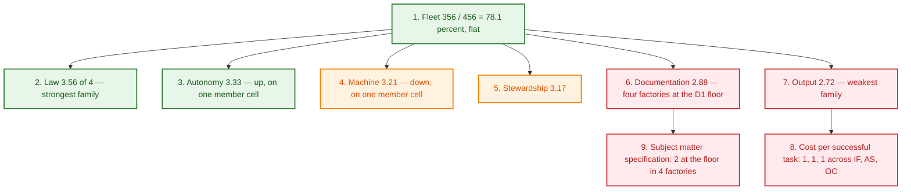

# Daily Factory Measurement — 2026-09-25

> **Run:** Process 3 survey, Surveys lane (`5c99ad51-8889-40cb-b589-fa13fd673c06`, topic 19)
> **Instant of the read:** `2026-09-25T06:16:25Z` (09:16:25 MSK, Friday)
> **Repository HEAD at the read:** `20ba42a` (agent-factories); the budget-staleness sweep names its own
> HEAD `20ba42a5fec7`
> **Verdict:** fleet **356 / 456 = 78.1%** — **flat against 09-24**, with two countervailing cell
> movements and a band-label correction.

---

## Executive Summary & Movements

| Factory | 09-23 | 09-24 | **09-25** | Δ vs 09-24 | Band (per `docs/quality-criteria.md:75-80`) |
|---|:---:|:---:|:---:|:---:|---|
| **Meta-factory** | 70 | 70 | **70** | 0 | Optimizing (92.1%) |
| **OpenCrabs dev** | 62 | 62 | **62** | 0 | Optimizing (81.6%) |
| **Miidas** | 60 | 60 | **60** | 0 | **Optimizing** (78.9%) ⬆ *band corrected* |
| **InferHub Watch** | 58 | 58 | **58** | 0 | **Optimizing** (76.3%) ⬆ *band corrected* |
| **Infra Factory** | 56 | 56 | **56** | 0 | Scalable (73.7%) |
| **AI AntiSpam** | 50 | 50 | **50** | 0 | Scalable (65.8%) |
| **FLEET** | 356 | 356 | **356 / 456** | **0** | 78.1% |

**The fleet is flat, and that is stated as flat rather than dressed as movement.** No factory's total
moved. Two individual cells moved in opposite directions inside AI AntiSpam and cancel exactly (see
below); every other change this run is evidence that moved **below** a score boundary, which is a
finding about the factory, not about the score.

### A band-label correction, not a score change

`docs/quality-criteria.md:80` defines **Optimizing = 76–100% (58–76 raw)**. Read against that table,
**Miidas (60/76 = 78.9%)** and **InferHub Watch (58/76 = 76.3%)** are **Optimizing** — and both the
09-23 and the 09-24 artifacts labelled them *Scalable*. OpenCrabs dev (62/76 = 81.6%) was labelled
Optimizing in the same artifacts, so the two runs were internally inconsistent: the same band, three
factories, two different labels.

This is the **class rework entry #43 already records** — a figure *restated in prose* rather than
*derived* from its source — and a grep for a band assertion across `tests/` and `tools/` returns
nothing, so no gate covers it. The two prior artifacts **stand as written** (nothing is backfilled);
this run applies the rubric's own table and files the mechanical fix as advisory 🟠 2.

### The two cells that actually moved

| Factory | Family · Criterion | 09-24 | 09-25 | Why |
|---|---|:---:|:---:|---|
| **AI AntiSpam** | Machine · Verification depth + record | 3 | **2** ⬇ | its own gate suite now reports **2 FAILs of 8** — `test_ledger_schema.py` (3 violations) and `hygiene.py --audit`. On 09-24 the same suite was **8/8 PASS** |
| **AI AntiSpam** | Autonomy · Work unit autonomy | 2 | **3** ⬆ | **4 distinct closed subjects** (`#35`, `campaign-push-policy`, `#41`, `campaign-tg-login-recovery`) against **1** on 09-24; `#44` is intake+claim, open |

**AI AntiSpam's regression is real and its own gate caught it.** Its `test_ledger_schema.py` is RED
with three violations, all of one shape — the **`worker` actor stamped an `intake` event**, which its
schema authorizes only to `triage`, `hq`, `owner` or `delegate`:

| Row | ts | Subject |
|---|---|---|
| `n=15` | 2026-09-24T09:10:09Z | `#41` |
| `n=26` | 2026-09-24T09:36:20Z | `#42` |
| `n=30` | 2026-09-24T19:13:19Z | `#44` |

Read live this run (`python3 tests/test_ledger_schema.py` → **rc=1**). Its own self-audit artifact for
today independently returns **`FAILED`**. This is the meta-factory's own §11 law violated inside a
member factory — *intake is Triage's* — and it is filed as advisory 🟠 3.

### Movements that are real but sit BELOW a score boundary

| Sub-score driver | Factory | 09-24 | **09-25** | Reading |
|---|---|:---:|:---:|---|
| Stewardship · recoverability — unpushed commits | Infra Factory | 28 | **1** | ⬇ 27 drained. Still not zero, so the score holds at 3 |
| Stewardship · recoverability — unpushed commits | OpenCrabs dev (state repo) | 9 | **4** | ⬇ 5 drained; still not zero, holds at 3 |
| Output · throughput — state-ledger events | OpenCrabs dev | 9,479 | **9,774** | +295; skill version 0.4.244 → **0.4.249** |
| Output · throughput — events / closes | InferHub Watch | 384 / 50 | **433 / 59** | both up; still 3 |
| Output · throughput — events / closes | Miidas | 88 / 19 | **98 / 23** | both up; still 3 |
| Output · throughput — rows / closes | Meta-factory | 975 / 121 | **1009 / 121** | +34 rows, closes **unchanged** — 154 intake against 121 close |
| Output · cost per successful task | Meta-factory | $52.53 | **$50.89** | $3,257.0892 across 101 rows carrying `cost_usd=`, ÷ 64 closes stating an outcome |
| Stewardship · improvement loop — coverage | Meta-factory | 74 of 93 | **75 of 94** | one entry added, none left dangling |

**Meta-factory's close count did not move in 34 rows of new ledger.** 154 intake rows against 121
closes, newest close `n=953` at `2026-09-22T21:28:25Z` — no close has landed in three days while
intake has grown by 6. That is a WIP-accumulation signal (Little's Law: the queue, not the work, is
where the time goes) and it is advisory 🟡 1.

---

### Family-level fleet view

Mean score per family, out of 4 per criterion. Six factories × 19 criteria = 114 cells; the grand
total reconciles to the fleet figure exactly (356).

| Family | Criteria | Cells | Per-factory family sums (M, OC, IH, MI, IF, AS) | Fleet mean | vs 09-24 |
|---|:---:|:---:|---|:---:|:---:|
| **Law** | 3 | 18 | 12 · 11 · 10 · 11 · 11 · 9 | **3.56** | 0 |
| **Autonomy** | 2 | 12 | 7 · 7 · 7 · 6 · 6 · **7** | **3.33** | ⬆ +0.08 |
| **Machine** | 4 | 24 | 15 · 15 · 13 · 13 · 12 · **9** | **3.21** | ⬇ −0.04 |
| **Stewardship** | 3 | 18 | 11 · 9 · 10 · 10 · 9 · 8 | **3.17** | 0 |
| **Documentation** | 4 | 24 | 15 · 11 · 10 · 12 · 11 · 10 | **2.88** | 0 |
| **Output** | 3 | 18 | 10 · 9 · 8 · 8 · 7 · 7 | **2.72** | 0 |

**The two weak families are still single-cell problems, and that has not changed in three runs.**
Output's 2.72 is one criterion scoring `1` in three factories (cost per successful task). Documentation's
2.88 is one criterion at the floor in four factories (subject matter specification). Both are
template-law shaped rather than member-shaped.

---

## 1. Cadence & Trigger Verification (Ruling 4 — the Client Principle)

Every pacemaker below was read from the live harness database this turn
(`file:/root/.opencrabs/profiles/ops/opencrabs.db?mode=ro`), each with its own declared timezone.
**A slot that has not yet elapsed is not a miss**, and is marked as such rather than scored `failed`.

| Factory | Self-audit job | Schedule (tz) | Due today | `last_run_at` | Artifact today | Verdict |
|---|---|---|---|:---:|---|---|:---:|
| **Meta-factory** | `factory-measurement-daily` | `0 9 * * *` (Europe/Moscow) | 06:00Z | **2026-09-25T06:00:13Z** | this run | ✅ HELD |
| **Meta-factory** | `factory-triage-patrol` | `0 */6 * * *` (UTC) | 06:00Z | **2026-09-25T06:00:13Z** | ledger rows `n=1006` | ✅ HELD |
| **Meta-factory** | `factory-registry-attest` | `0 6 * * *` (UTC) | 06:00Z | **2026-09-25T06:00:13Z** | ⚠️ see below | ⏳ IN FLIGHT |
| **OpenCrabs dev** | `oc-triage-factory-patrol` | `0 */6 * * *` (UTC) | 06:00Z | **2026-09-25T06:00:13Z** | `t4t5-patrol-20260925T00Z.md` (00:16Z) | ✅ HELD |
| **AI AntiSpam** | `ai-antispam-self-audit-daily` | `50 8 * * *` (Europe/Moscow) | 05:50Z | **2026-09-25T05:50:12Z** | `2026-09-25-self-audit.md` (05:50Z) | ✅ HELD |
| **InferHub Watch** | `inferhub-self-audit-daily` | `0 9 * * *` (Europe/Moscow) | 06:00Z | **2026-09-25T06:00:13Z** | newest `2026-09-24.md` | ⏳ IN FLIGHT |
| **Infra Factory** | `infra-surveys-daily` | `0 9 * * *` (Europe/Moscow) | 06:00Z | **2026-09-25T06:00:13Z** | newest `2026-09-24-self-audit.md` | ⏳ IN FLIGHT |
| **Miidas** | `miidas-hq-daily-trigger` | `0 9 * * *` (**UTC**) | 09:00Z | 2026-09-24T09:00:02Z | slot not yet due | ⏳ NOT YET DUE |

**The three in-flight rows are proved in flight, not assumed.** All three triggers fired at
`06:00:13Z`, eleven minutes before this read, and none has produced its artifact yet. Each has a
**habitual lag** on this exact slot — InferHub's 09-24 artifact landed at `06:01:12Z` against the same
`06:00Z` trigger; Infra's 09-23 artifact landed at `08:03Z` and its 09-24 at `13:32Z`; and Infra's
trigger explicitly notified its lane at `06:10Z` (read first-hand in the process table — a live
`opencrabs -p ops session notify 8daa376e …` carrying *"Daily self-audit due (cron
infra-surveys-daily)"*). An absent file eleven minutes after the trigger is inside all three windows.
**Scored as in-flight, not failed.**

**The registry-attest duty is the row to watch, and it is the #147 class.** Its trigger fired
`06:00:13Z` and recorded success, but the duty's own artifact — the fragments' `attested_at` — is
**unchanged**: newest is `ai-antispam.json` at `2026-09-24T23:00:12Z`, and the other five read
`2026-09-23T11:3xZ` / `2026-09-24T06:0xZ`. Eleven minutes after the fire, this is honestly *in flight*
— but board item **#147** rules that *the run row records the TRIGGER, never the duty*, and a duty
that fails every day while its trigger records success is exactly what that item was filed for. It is
flagged here so **tomorrow's run** can read whether the fragments moved; if they have not, it is a
finding rather than a lag.

**Miidas — slot genuinely in the future.** Its trigger is `0 9 * * *` in **UTC** (not Europe/Moscow
like its siblings), so its 09:00Z slot had not elapsed at the read instant (`06:16Z`). `last_run_at`
`2026-09-24T09:00:02Z` is its most recent slot. **Not a miss.** One observation recorded rather than
scored: that 09:00Z trigger's artifact landed at **23:13Z the same day**, a ~14 h lag — larger than
its siblings' but its own declared cadence, so it is noted and not judged.

**A false lead, checked and dismissed.** Eleven jobs across the table share the byte-identical
`last_run_at` of `2026-09-25T06:00:13Z`, which reads like a mass catch-up after a scheduler stall. It
is not: every one of the eleven is genuinely scheduled to fire at `06:00Z` under its own timezone, and
the one that looked anomalous — `ai-antispam-outreach-mining-tranche`, `0 6 * * Mon,Wed,Fri` — is
correctly firing because **2026-09-25 is a Friday** (verified with `datetime.date.strftime('%A')`, not
recalled). The cluster is the scheduler firing its 06:00Z cohort in one tick.

---

## Subject Matter Consulting Gate Status

> **A factory is strictly barred from receiving substantive consulting, diagnostic audits, or
> bottleneck recommendations until its Documentation Quality achieves baseline calibration
> (≥ 2/4 across subject matter specification, process specification, and methodology core
> conformance).**

All six factories **clear** the gate this run. Read live: `ls -d` on `docs/subject/`, `docs/`, the
skill bodies, and each factory's own gate suite.

| Factory | Subject matter spec | Process spec | Methodology core | Mean | Gate | What it keeps |
|---|:---:|:---:|:---:|:---:|:---:|---|
| **Meta-factory** | 3 | 4 | 4 | **3.67** | ✅ clears | `docs/subject/` — 2 files |
| **Miidas** | 3 | 3 | 3 | **3.00** | ✅ clears | `docs/subject/` — 2 files |
| **OpenCrabs dev** | 2 | 3 | 3 | **2.67** | ✅ clears | **D1 at the floor** — no `docs/subject/` |
| **Infra Factory** | 2 | 3 | 3 | **2.67** | ✅ clears | **D1 at the floor** — no `docs/subject/` |
| **AI AntiSpam** | 2 | 3 | 2 | **2.33** | ✅ clears | **D1 at the floor** — no `docs/subject/` |
| **InferHub Watch** | 2 | 2 | 3 | **2.33** | ✅ clears | **D1 at the floor** — no `docs/subject/` |

**The gate is passing on a technicality, and the framing of that claim has changed this run.** Four
factories sit at exactly `2` on subject matter specification — the floor — because the criterion names
`docs/subject/` and they do not carry that path. What each of them *does* carry is substantial domain
codification under a different name:

| Factory | The artefact D1 names | What it actually keeps | Live read |
|---|---|---|---|
| OpenCrabs dev | `docs/subject/` **absent** | role cards + `fleet-directives.md` + the `opencrabs-dev` skill family | `ls` this run |
| Infra Factory | `docs/subject/` **absent** | `ONTOLOGY.md` + `docs/` topology/service docs + 4 role cards | `ls` this run |
| AI AntiSpam | `docs/subject/` **absent** | `ONTOLOGY.md` + 13+ reference docs under `docs/` | `ls` this run |
| InferHub Watch | `docs/subject/` **absent** | `ONTOLOGY.md` + `probe/` + `skills/inferhub/SKILL.md` (v1.0.67) | `ls` this run |

**This is now with the owner, and the earlier framing of it was wrong.** Board item **#149** was
filed presenting itself as a request to reverse ruling #20. HQ checked that against the record and
corrected it: the owner's verbatim words (`2026-09-16T13:57:22Z`) were *"also no consulting if no
subject matter docs"* — the **substance** — and the path string `docs/subject/` appears two minutes
later in the filing title and was codified by HQ. So widening the anchor **corrects HQ's
implementation** of the owner's ruling rather than reversing the ruling itself. HQ recommends
widening, with the accepted set declared in `docs/quality-criteria.md` so it stays checkable and the
run printing **which** artefact resolved. **Awaiting the owner's decision; not re-reported here as a
new finding.**

---

## Detailed Factory Scorecards

Nineteen criteria per factory, `0`–`4` each, maximum **76**. Every cell cites evidence read in this
turn. `carried` marks a cell the run did not re-measure — stated as carried, never passed off as
freshly observed. **Band labels are derived from the score against `docs/quality-criteria.md:75-80`**,
not restated from the previous artifact.

### 1. Meta-factory (`/root/agent-factories`) — 70 / 76 (92.1%), Optimizing

| Family | Criterion | Score | Live evidence this run |
|---|---|:---:|---|
| **Documentation** | Subject matter specification | 3 | `docs/subject/` present, 2 files — `client-requirements.md`, `domain-model.md` (`ls`) |
| **Documentation** | Process specification & criteria | 4 | `docs/processes.md` + `docs/measurement-procedure.md` (9 mandated sections, re-read) |
| **Documentation** | Methodology core conformance | 4 | `docs/methodology/` — 5 modules present (`ls`) |
| **Documentation** | Documentation consistency | 4 | the audit's registered set runs `test_template_sync.py`, `test_ontology.py`, `test_docs_sync.py` — all PASS in the 48/50 green set |
| **Output** | Throughput | 4 | **1,009 ledger rows** (was 975), **121 close**, **154 intake**, **126 claim**; `verify` rc=0 |
| **Output** | Stability | 3 | run rows stating an outcome: **26 accepted of 29** (2 `delivered`, 1 `duplicate`; 217 carry no outcome token); rework share **44.34%**, per close **79.66%**, change-fail **55.08%** (65/118) — each form named with its own denominator |
| **Output** | Cost per successful task | 3 | **$50.89** ($3,257.0892 across 101 rows carrying `cost_usd=`, ÷ **64** close rows stating an outcome) — coverage **101 of 1,009 rows** |
| **Machine** | Specification clarity | 4 | board items carry done-criteria; **34 open items** on the board this read |
| **Machine** | Verification depth + record | 3 | **50 gates: 48 pass / 2 fail / 0 unknown** — DEGRADED; **9 of 47 declared budgets STALE:bytes** at HEAD `20ba42a5fec7` (board **#141**) |
| **Machine** | Coordination integrity | 4 | **216 `dispatch` rows**; direct `session_notify`, no relay hops |
| **Machine** | Boundary clarity | 4 | `SKILL.md` §2/§3 boundary table (non-participation, hard boundary) codified |
| **Law** | Law freshness | 4 | `SKILL.md` `version: 0.1.20` live (was 0.1.19); the version-contract gate is in the green set |
| **Law** | Vocabulary conformance | 4 | `test_ontology.py` PASS in the registered set (58 canonical terms) |
| **Law** | Single-writer state | 4 | `test_single_writer.py` PASS; one append path (`tools/ledger.py`), flock tested |
| **Stewardship** | Human cognitive load | 3 | plain-language reporting per §7; `roadmap.py --audit` in the registered set |
| **Stewardship** | Recoverability | 4 | HEAD == `origin/main`, **0 unpushed**; 6 modified paths are peers' in-flight work (the `#151` registry pair + 4 registry fragments), disclosed and untouched |
| **Stewardship** | Improvement loop | 4 | **94 rework entries** at the read instant (12 unprevented); audit reports `subject_coverage` **0.7979** (75/94). A peer's entry landed at `06:15:26Z` taking it to **95 entries / 76 of 95** by the closing read — the count is stated with its instant, not carried |
| **Autonomy** | Work unit autonomy | 4 | autonomous intake→claim→close across HQ/Triage/Worker (154 intake / 121 close) |
| **Autonomy** | Cadence autonomy | **3** | the daily measurement **fired on its own slot** (`06:00:13Z`) and woke this lane; **not 4** because **#139** (the notify-receipt leg that reports three causes as one verdict) is still OPEN, and `factory-growth-map-biweekly` is **#148** — a CLASS 1 row under a registered gate passing 12/12 |

### 2. OpenCrabs dev (`/root/opencrabs` + the `opencrabs-dev` state repo) — 62 / 76 (81.6%), Optimizing

| Family | Criterion | Score | Live evidence this run |
|---|---|:---:|---|
| **Documentation** | Subject matter specification | 2 | no `docs/subject/` (live `ls`) — carried at floor |
| **Documentation** | Process specification & criteria | 3 | role cards + `fleet-directives.md` govern PR/shipchain flows |
| **Documentation** | Methodology core conformance | 3 | carried (not re-measured this run) |
| **Documentation** | Documentation consistency | 3 | carried; CI gates clippy/fmt |
| **Output** | Throughput | 4 | `workers-ledger.json`: **9,774 events** (was 9,479), **`updated_at` `2026-09-25T06:09:19Z`** — written 7 minutes before this read |
| **Output** | Stability | 4 | carried — 4-leg smoke rubric; rework log **absent** (see 🟡 2) |
| **Output** | Cost per successful task | 1 | still no aggregate task unit economics |
| **Machine** | Specification clarity | 3 | typed issues with done-criteria |
| **Machine** | Verification depth + record | 4 | CI PR gates + swap receipts (binary sha matching) |
| **Machine** | Coordination integrity | 4 | direct dispatch; `oc-ledger` flock on the one state file |
| **Machine** | Boundary clarity | 4 | fork / upstream / skill / state boundaries codified |
| **Law** | Law freshness | 4 | `current_skill_version` **0.4.249** (was 0.4.244) — live read of `workers-ledger.json` |
| **Law** | Vocabulary conformance | 3 | carried |
| **Law** | Single-writer state | 4 | `workers-ledger.json` is the declared one write path (`oc-ledger`); `--selftest` **PASS=484 FAIL=0** (was 464) |
| **Stewardship** | Human cognitive load | 3 | carried |
| **Stewardship** | Recoverability | 3 | the state repo carries **4 unpushed commits** (was 9) and **4 modified + 2 untracked** paths; still not zero, so the score holds |
| **Stewardship** | Improvement loop | 3 | smoke verdicts drive corrections |
| **Autonomy** | Work unit autonomy | 3 | carried |
| **Autonomy** | Cadence autonomy | 4 | `oc-triage-factory-patrol` HELD at `06:00:13Z`; T4/T5 patrol artifact `t4t5-patrol-20260925T00Z.md` present |

### 3. InferHub Watch (`/root/inferhub-watch`) — 58 / 76 (76.3%), Optimizing

> **Band corrected this run.** The 09-23 and 09-24 artifacts labelled this factory *Scalable* at 58/76.
> `docs/quality-criteria.md:80` puts Optimizing at 76–100%, so 76.3% is Optimizing. The score is
> unchanged; the label was wrong.

| Family | Criterion | Score | Live evidence this run |
|---|---|:---:|---|
| **Documentation** | Subject matter specification | 2 | `ONTOLOGY.md` + `probe/`; no `docs/subject/` (live `ls`) |
| **Documentation** | Process specification & criteria | 2 | `skills/inferhub/SKILL.md` **v1.0.67** (was 1.0.62) defines cycles; subprocess specs pending |
| **Documentation** | Methodology core conformance | 3 | Tier-1 self-audit kit active |
| **Documentation** | Documentation consistency | 3 | `test_ontology.py` **rc=0** live this run |
| **Output** | Throughput | 3 | **433 ledger events** (was 384), **59 closed tasks** (was 50) — live this run |
| **Output** | Stability | 3 | first-pass yield **100.0%**; rework **2 entries**, 1 still unprevented, gated rc=0 |
| **Output** | Cost per successful task | 2 | latency / True TPS metered; task cost derivation pending |
| **Machine** | Specification clarity | 3 | concrete issue criteria on the board |
| **Machine** | Verification depth + record | 3 | its self-audit runs **4** mechanical gates (ledger verify, ontology, rework, cron prompt lint) |
| **Machine** | Coordination integrity | 3 | HQ `359fe71b` → worker lane direct dispatch |
| **Machine** | Boundary clarity | 4 | provider / gateway boundaries separated |
| **Law** | Law freshness | 3 | `skills/inferhub/SKILL.md` `version: 1.0.67` |
| **Law** | Vocabulary conformance | 3 | `ONTOLOGY.md` + `test_ontology.py` rc=0 live |
| **Law** | Single-writer state | 4 | `tools/ledger.py` with flock; `verify` **rc=0** (429 rows, live this run) |
| **Stewardship** | Human cognitive load | 3 | Grafana panels + structured cycle logs |
| **Stewardship** | Recoverability | 4 | HEAD == `origin/main`; **1 modified** path (its own ledger, in flight) |
| **Stewardship** | Improvement loop | 3 | rework log **2 entries**, `test_rework.py` rc=0 live |
| **Autonomy** | Work unit autonomy | 3 | ledger shows 92 intake / 65 claim / 59 close — the chain is running |
| **Autonomy** | Cadence autonomy | 4 | `inferhub-self-audit-daily` fired `06:00:13Z`; artifacts 09-21 → 09-24 present, today's in flight |

---

### 4. Miidas (`/root/miidas`) — 60 / 76 (78.9%), Optimizing

> **Band corrected this run.** The 09-23 and 09-24 artifacts labelled this factory *Scalable* at 60/76.
> `docs/quality-criteria.md:80` puts Optimizing at 76–100%, so 78.9% is Optimizing. The score is
> unchanged; the label was wrong.
>
> Its self-audit slot (`0 9 * * *` **UTC**) had **not elapsed** at this read (09:00Z vs 06:16Z), so its
> newest artifact is `2026-09-24-self-audit.md` and cells read from it are marked `carried`. Its ledger
> was re-read live: **98 rows**, 23 closes, 24 run rows of which 23 accepted.

| Family | Criterion | Score | Live evidence this run |
|---|---|:---:|---|
| **Documentation** | Subject matter specification | 3 | `docs/subject/` present, 2 files (live `ls`); `docs/ONTOLOGY.md` also present |
| **Documentation** | Process specification & criteria | 3 | `docs/processes.md` |
| **Documentation** | Methodology core conformance | 3 | `docs/methodology/` |
| **Documentation** | Documentation consistency | 3 | `test_ontology.py` rc=0 live this run |
| **Output** | Throughput | 3 | **23 closed tasks** against **98 ledger events** (was 19 / 88); avg lead time 25,351.6s (its own Tier-1) |
| **Output** | Stability | 4 | first-pass yield **95.7%**; rework **15 entries**; **400 pytests passed** in its own run |
| **Output** | Cost per successful task | 1 | 0 ledger rows carry a cost field (live count) |
| **Machine** | Specification clarity | 3 | client specs and positioning docs |
| **Machine** | Verification depth + record | 4 | **17 mechanical gates PASS** in its own self-audit, incl. `test_rework_rates.py`, `test_audit_artifact_gate.py`, `test_audit_metrics.py` |
| **Machine** | Coordination integrity | 3 | direct HQ ↔ worker dispatch |
| **Machine** | Boundary clarity | 3 | multi-tenant boundaries defined |
| **Law** | Law freshness | 3 | `SKILL.md` `version: 1.1.18` live (was 1.1.12) |
| **Law** | Vocabulary conformance | 4 | `test_ontology.py` rc=0 live; `docs/ONTOLOGY.md` live |
| **Law** | Single-writer state | 4 | `tools/ledger.py` flock; `verify` **rc=0** (98 rows, live this run; 2 foreign rows + 1 excuse printed) |
| **Stewardship** | Human cognitive load | 3 | structured offer / client documentation |
| **Stewardship** | Recoverability | 4 | HEAD == `origin/main`, clean tree (0 modified, 0 untracked) at the read |
| **Stewardship** | Improvement loop | 3 | rework log **15 entries** with preventative rules |
| **Autonomy** | Work unit autonomy | 3 | 26 intake / 23 claim / 23 close in the live ledger — the chain is running |
| **Autonomy** | Cadence autonomy | 3 | `miidas-hq-daily-trigger` HELD at 2026-09-24T09:00:02Z; today's 09:00Z slot **not yet due** at the read |

### 5. Infra Factory (`/root/vds-servers`) — 56 / 76 (73.7%), Scalable

> Its self-audit slot fired at `06:00:13Z` and the woken lane is **mid-turn** (proved in §1), so its
> newest artifact is `2026-09-24-self-audit.md` and cells read from it are marked `carried`. Its ledger
> was re-read live: **410 rows**, 68 closes, 95 intake.

| Family | Criterion | Score | Live evidence this run |
|---|---|:---:|---|
| **Documentation** | Subject matter specification | 2 | `ONTOLOGY.md` + topology / service docs flat under `docs/`; no `docs/subject/` (live `ls`) |
| **Documentation** | Process specification & criteria | 3 | `docs/processes.md` |
| **Documentation** | Methodology core conformance | 3 | `docs/methodology/` |
| **Documentation** | Documentation consistency | 3 | `test_ontology.py` **rc=0** live this run (29 canonical, 22 banned, 89 files) |
| **Output** | Throughput | 3 | **68 closed tasks** against **410 ledger events** (was 58 / 356) — live this run |
| **Output** | Stability | 3 | first-pass yield **93.9%**; rework **66 entries** live (56 in its own 09-24 artifact) |
| **Output** | Cost per successful task | 1 | 0 ledger rows carry a cost field (live count) |
| **Machine** | Specification clarity | 3 | clear host-operations briefs |
| **Machine** | Verification depth + record | 3 | **16 gates PASS** incl. `test_gatus_notify.py` (33 checks), `test_backup_all.py`, `test_cleanup_discovery.py` |
| **Machine** | Coordination integrity | 3 | direct `session_notify` triage ↔ HQ |
| **Machine** | Boundary clarity | 3 | VDS host ops separated from workloads; 4 role cards |
| **Law** | Law freshness | 3 | `skills/infra-factory/SKILL.md` `version: 0.1.0` (unchanged since 2026-09-18) |
| **Law** | Vocabulary conformance | 4 | `test_ontology.py` rc=0 live |
| **Law** | Single-writer state | 4 | `tools/ledger.py` flock; `verify` **rc=0** (409 rows at this read; 2 `excused:` printed) |
| **Stewardship** | Human cognitive load | 3 | topic separation + Gatus alerting |
| **Stewardship** | Recoverability | 3 | **unpushed fell 28 → 1** (live `git rev-list origin/main..HEAD` after a fetch, not a stale ref); still not zero, so the score holds. 3 modified + 2 untracked (grafana dashboards, `agents/ocmetrics/`) |
| **Stewardship** | Improvement loop | 3 | rework log **66 entries** live (56 at its own 09-24 read) |
| **Autonomy** | Work unit autonomy | 3 | 95 intake / 66 claim / 68 close in the live ledger |
| **Autonomy** | Cadence autonomy | 3 | `infra-surveys-daily` fired `06:00:13Z` and woke its lane (read in the process table) — HELD on the trigger; the **duty artifact is in flight**, not yet on disk |

### 6. AI AntiSpam (`/root/ai-antispam`) — 50 / 76 (65.8%), Scalable

> **Two cells moved in opposite directions and cancel exactly.** Its own self-audit for today returns
> **`FAILED`**, and that verdict is correct: two of its eight registered gates are RED.

| Family | Criterion | Score | Live evidence this run |
|---|---|:---:|---|
| **Documentation** | Subject matter specification | 2 | `ONTOLOGY.md` + 13+ reference docs under `docs/`; no `docs/subject/` (live `ls`) |
| **Documentation** | Process specification & criteria | 3 | `docs/processes.md` |
| **Documentation** | Methodology core conformance | 2 | 2-Process Core Kit ported (`tools/{ledger,audit,hygiene}.py`) |
| **Documentation** | Documentation consistency | 3 | `test_ontology.py` **rc=0** live this run (13 canonical, 2 banned, 31 files) |
| **Output** | Throughput | 3 | **4 distinct closed subjects** (`#35`, `campaign-push-policy`, `#41`, `campaign-tg-login-recovery`) against **32 ledger rows**; `#44` is intake+claim, open. On 09-24 this was **1 close against 14 rows** |
| **Output** | Stability | 3 | first-pass yield **50.0%** (its own artifact: accepted runs ÷ total runs); rework **3 entries**, rate 75.0% |
| **Output** | Cost per successful task | 1 | `$0.0000` tracked; 0 ledger rows carry a cost field (live count) |
| **Machine** | Specification clarity | 2 | memos and task briefs |
| **Machine** | Verification depth + record | **2** ⬇ | **2 of 8 gates FAIL** — `test_ledger_schema.py` **rc=1** (3 violations, live) and `hygiene.py --audit` FAIL. On 09-24 the same suite was **8/8 PASS** |
| **Machine** | Coordination integrity | 2 | carried — not re-measured this run |
| **Machine** | Boundary clarity | 3 | bot moderation vs outreach separated |
| **Law** | Law freshness | 3 | `SKILL.md` `version: 0.1.0` (commit `43f6bc3`, 2026-09-19T06:46:14Z) |
| **Law** | Vocabulary conformance | 3 | `test_ontology.py` rc=0 live |
| **Law** | Single-writer state | 3 | `tools/ledger.py` flock; `verify` **rc=0** (32 rows, live this run) |
| **Stewardship** | Human cognitive load | 2 | topic notifications active |
| **Stewardship** | Recoverability | 3 | HEAD == `origin/main`, clean tree (0 modified, 0 untracked) at the read |
| **Stewardship** | Improvement loop | 3 | rework log established and gated; 3 entries |
| **Autonomy** | Work unit autonomy | **3** ⬆ | **4 distinct closed subjects**, each with a full intake→claim→close chain (read row by row). On 09-24 this was 1 |
| **Autonomy** | Cadence autonomy | 4 | `ai-antispam-self-audit-daily` HELD (`05:50:12Z`); `2026-09-25-self-audit.md` on disk at 05:50Z |

**Its regression, in full.** `tests/test_ledger_schema.py` is RED with **three violations of one
shape** — `worker` stamped an `intake` event, and its schema authorizes `intake` to `triage`, `hq`,
`owner` or `delegate` only:

| Row | ts | Subject | Authorized actors for `intake` |
|---|---|---|---|
| `n=15` | 2026-09-24T09:10:09Z | `#41` | triage, hq, owner, delegate |
| `n=26` | 2026-09-24T09:36:20Z | `#42` | (same) |
| `n=30` | 2026-09-24T19:13:19Z | `#44` | (same) |

This gate **passed on 09-24** (its own artifact: *"ledger schema clean: 13 row(s) audited"*), so the
violations were introduced on 2026-09-24 and caught by today's run. The mechanism is the meta-factory's
own §11 law — *a claim is an ACCEPTANCE stamped by the lane that takes the work; intake is Triage's* —
violated inside a member factory. Filed as advisory 🟠 3.

**One data-quality wrinkle, recorded and not scored.** Subject `#35` carries **two close rows**
(`n=5` on 2026-09-17 and `n=19` on 2026-09-24, the latter after a re-intake at `n=17`). The factory's
own count of *"4 closed tasks"* de-duplicates correctly; a raw row count returns 5. The live figure
quoted above is the de-duplicated one, and the discrepancy is stated rather than smoothed.

---

## Consulting Advisories (prioritised)

Each advisory names the observed symptom, the mechanism behind it, the recommended process fix, and
the expected impact — the format §7 prescribes. **Delivery routing is stated per item:** a
member-facing advisory goes to the Delegate lane for that factory's HQ; a fleet-wide finding that no
single factory can close is marked **not for member delivery** and escalated instead.

### 🟠 1 — The subject-matter anchor measures a PATH, not a substance *(fleet-wide — NOT for member delivery)*

**Symptom.** Four of six factories sit at exactly `2/4` on subject matter specification — the floor of
a hard gate — while carrying substantial domain codification under another name. Every one of them is
**one regression away from being barred from consulting**.

**Mechanism.** `docs/quality-criteria.md:143` reads *"Presence and completeness of `docs/subject/`"* —
the criterion names a directory. Four factories keep `ONTOLOGY.md` + `docs/` + role cards + `skills/`
instead. An auditor barred from them would be barred from factories whose domain *is* codified, on the
grounds that it is codified under a heading the rubric did not anticipate.

**Status.** Board **#149**, open, **with the owner**. HQ's reframing stands and corrects the original
filing: the owner's words were *"no consulting if no subject matter docs"* (the substance); the path
was HQ's implementation two minutes later. HQ recommends widening, with the accepted set declared in
`docs/quality-criteria.md` and the run printing **which** artefact resolved.

**Expected impact.** Removes a compliance-theatre incentive (reshuffling docs to satisfy a filename)
and makes the floor distinguishable from a missing file.

**Routing.** Not for member delivery — it is a rubric decision awaiting the owner. **Not re-reported
to any member HQ.**

### 🟠 2 — A band label is restated in prose, not derived from the score *(fleet-wide, this repo's own artifact)*

**Symptom.** This repository's own score artifacts labelled **Miidas (78.9%)** and **InferHub Watch
(76.3%)** as *Scalable* in both 09-23 and 09-24, while labelling OpenCrabs dev (81.6%) *Optimizing* —
the same band, three factories, two labels. Read against `docs/quality-criteria.md:80` (Optimizing =
76–100%), both are Optimizing.

**Mechanism.** The band is a **derived figure** — a function of the score — but it was written by hand
beside the score rather than computed from it, and **no gate reads it**: a grep for a band assertion
across `tests/` and `tools/` returns nothing. This is the same class as rework entry **#43** (the
quality-criteria count restated on 8 lines across 7 surfaces), whose prevention column records the
general rule: *prose no mechanism upholds drifts silently (P29)*.

**Recommended fix.** Extend the registered section gate (`tests/test_score_artifact_sections.py`) to
assert that each `### <n>. <factory> — <score> / 76 (…%), <Band>` heading's band matches the band the
rubric computes from that score. Small, offline, no new surface.

**Expected impact.** A derived label becomes checkable; the next artifact cannot drift silently. The
two prior artifacts **stand as written** — nothing is backfilled.

**Routing.** Filed on the board this turn; intake dispatched to Triage.

### 🟠 3 — AI AntiSpam: three `intake` rows stamped by an unauthorized actor *(member-facing)*

**Symptom.**

> ⚠️ **CORRECTED 2026-09-25T06:37:19Z — the *Recommended fix* below is IMPOSSIBLE and would falsify the record.** The gate validates the whole ledger, so appending an authorized row cannot clear the original; the repair is kit-side (no exemption surface in either tree, **#156**). See **Correction C1** at the end of this section. The diagnosis stands, re-confirmed live. `tests/test_ledger_schema.py` is **RED** with three violations; the factory's own
self-audit for today returns **`FAILED`**. Verdict was `GREEN`/`PASS` on 09-24.

**Mechanism.** Rows `n=15` (`#41`), `n=26` (`#42`) and `n=30` (`#44`), all 2026-09-24, carry
`actor=worker, event=intake`. Its schema authorizes `intake` to `triage`, `hq`, `owner` or `delegate`.
This is §11's own rule — *intake is Triage's* — violated inside the factory, and its own gate caught it.

**Recommended fix.** Re-stamp the three intake legs from the authorized actor via the factory's own
append path (never a hand-edit), and state in the factory's process law which actor may stamp which
leg so the next lane does not repeat it. The gate already exists and bites — this is a process fix,
not a tooling one.

**Expected impact.** Restores the schema gate to green and returns verification depth to 3.

**Routing.** **Member-facing** → Delegate lane for AI AntiSpam HQ.

### 🟡 1 — Meta-factory: WIP accumulating, no close in three days *(this factory's own)*

**Symptom.** The ledger grew 975 → **1,009 rows** (+34) while the close count stayed at **121**; intake
is now **154**. The newest close is `n=953` at `2026-09-22T21:28:25Z`.

**Mechanism.** Intake and dispatch legs are landing; the close leg is not. By Little's Law
(`average cycle time ≈ WIP ÷ throughput`) the queue, not the work, is where the time now goes — and
the artifact's own throughput cell reads `4` on row growth, which masks it.

**Recommended fix.** Read the open intake rows against their claims and name which work units are
stalled mid-flight; the Triage patrol already has the surface.

**Expected impact.** Converts a growing ledger into a bounded WIP.

**Routing.** This factory's own; carried by the existing patrol, not a member advisory.

### 🟡 2 — OpenCrabs dev: no rework log, third run *(member-facing)*

**Symptom.**

> ⚠️ **CORRECTED 2026-09-25T06:37:19Z — “adopt it from the template kit” names an artefact the kit does not ship.** `TEMPLATE/evidence/` does not exist. See **Correction C2** at the end of this section. The factory carries no `evidence/rework.md`, so its Stability cell is `carried` and its
improvement-loop evidence rests on smoke verdicts alone. Its `oc-ledger` records *lessons* but no
defect log with a `Prevented by` column.

**Mechanism.** The kit's rework log is the only surface that answers *"are we getting better?"* — the
rubric's Stability criterion needs a numerator. Without it, change-fail and rework rates are not
computable for this factory.

**Recommended fix.** Adopt `evidence/rework.md` from the template kit, with the `Prevented by` column
carrying the gate or rule each defect produced.

**Expected impact.** Makes the factory's own improvement measurable; would likely move Stability and
Improvement loop above their current carried values.

**Routing.** **Member-facing** → Delegate lane for OpenCrabs dev HQ.

### 🟡 3 — Infra Factory: one unpushed commit remains *(member-facing, low priority)*

**Symptom.**

> **NOTE 2026-09-25T06:37:19Z — this figure moved 1 → 0 inside the hour.** The run's reading stands for its own instant; the item's present tense does not. See **Correction C3** at the end of this section. Unpushed fell **28 → 1** since 09-24 — a real drain — but is not zero, so recoverability
holds at 3.

**Mechanism.** One local commit has not reached `origin`; a turn that dies mid-work strands it.

**Recommended fix.** Push it; then the recoverability cell can rise on evidence.

**Expected impact.** One commit.

**Routing.** **Member-facing** → Delegate lane for Infra Factory HQ.

### 🟡 4 — The registry-attest duty: watch tomorrow, do not call it yet *(this factory's own)*

**Symptom.** `factory-registry-attest` fired `06:00:13Z` and recorded success; the fragments'
`attested_at` had not moved eleven minutes later.

**Mechanism.** Board **#147** rules that *the run row records the TRIGGER, never the duty* — a trigger
whose notify succeeds records success while the duty it woke fails every day with no surface anywhere.
This is the first run reading it after that item landed.

**Recommended fix.** Read the fragments' `attested_at` again tomorrow. Eleven minutes after the fire,
*in flight* is the honest verdict today; a second unchanged reading is a finding.

**Expected impact.** Either closes #147's instance or produces the evidence it needs.

**Routing.** This factory's own; not a member advisory.

### 🟡 5 — Cost per successful task: three factories at 1 *(fleet-wide — NOT for member delivery)*

**Symptom.** Infra Factory, AI AntiSpam and OpenCrabs dev score `1`; none derives an aggregate task
unit cost. Only this factory does, from ledger `cost_usd=` fields.

**Mechanism.** The template kit's append path already stamps `cost_usd` / `tokens_in` / `tokens_out`
where the harness supplies them; the member factories' surfaces carry none. The criterion is
template-law shaped, not member-shaped.

**Recommended fix.** Decide whether the criterion is measured at the fleet level (where the telemetry
exists) or per member (where it does not), and state which — a criterion nobody's surface can feed is
a permanent `1`.

**Expected impact.** Removes the weakest cell in the weakest family.

**Routing.** Not for member delivery — rubric decision.

### Correction — 2026-09-25T06:37:19Z

Three corrections to the advisories above. Each leg was re-read first-hand in the turn that wrote this
block, and each supersedes text that **stands unrewritten** — a retro-edited artifact is fabricated
provenance. Two were raised by the Delegate lane relaying member HQs; one is this lane's own.

#### C1 — 🟠 3: the recommended fix is IMPOSSIBLE and would falsify the record

**What was wrong.** The item's *Recommended fix* reads *“re-stamp the three intake legs from the
authorized actor via the factory's own append path”*, and its *Expected impact* reads *“Restores the
schema gate to green and returns verification depth to 3.”* Both are false, for two independent reasons:

1. **The gate cannot be cleared by appending.** `tests/test_ledger_schema.py` validates the **whole**
   ledger — `validate_domain_invariants` checks `actor × event` at `:133-138`, and its caller
   iterates every row at `:167`. Appending a corrected row cannot remove the original, so the violation
   count cannot fall while the offending rows exist. Reproduced over the gate's own `OC_LEDGER_PATH`
   seam on a throwaway copy: arm A (ledger as-is) → `rc=1`, 3 violations; arm B (same **+ three
   authorized `triage` intake rows**) → `rc=1`, **still 3**.
2. **It would falsify the record.** `n=15` / `n=26` / `n=30` state who actually stamped those intakes.
   A new row asserting Triage took `#41` claims a taking Triage never made — the reconstructed-claim
   shape, which must declare itself and name its basis, and which here would assert a falsehood rather
   than reconstruct a fact.

**The real blocker is kit-side, not local.** The gate carries **no exemption surface** in either tree:
`grep -cEi 'exempt|retire|boundary|landing|governs'` returns **0** against 10,772 B (ai-antispam's copy)
and **0** against 13,564 B (`TEMPLATE/`'s). The ledger is append-only and its rows are committed, so
there is **no lawful repair in any direction**. Filed as **agent-factories#156** for the kit to carry
the exemption surface its siblings already have (`docs/ledger-commit-exemptions.json`,
`docs/ledger-no-shrink-exemptions.json`).

**Corrected expected impact.** The verification-depth cell will **not** return to 3 on any local
repair. It moves when the kit ruling lands, or it does not move at all. The cell stands at **2**.

**What stands, and is re-confirmed live.** The diagnosis: a run of the gate this turn returns `rc=1`
with three violations at lines 15 / 26 / 30, all `actor=worker, event=intake`, against an authorized
list of (`triage`, `hq`, `owner`, `delegate`). The `#35` double-close note de-duplicates correctly.

#### C2 — 🟡 2: “adopt it from the template kit” names an artefact the kit does not ship

**What was wrong.** The item's *Recommended fix* reads *“Adopt `evidence/rework.md` from the template
kit.”* There is no such artefact to adopt. `TEMPLATE/evidence/` **does not exist** (`ls -d
TEMPLATE/evidence` → *No such file or directory*), and `find . -name rework.md` returns exactly
**one** file in the whole tree — this factory's own `./evidence/rework.md`. The kit ships the **gate
plus an instruction**, never the artefact (**agent-factories#155**).

**Corrected fix.** Not “copy the artefact” — there is none to copy — but “execute the bootstrap
step”, and the step as written does not work: Step 4c names 2 of the 7 files its own gate needs and
dies in `ModuleNotFoundError: No module named 'audit'` at `test_rework.py:69`. The kit fix comes first;
the step follows it.

**What stands.** The absence itself: OpenCrabs dev carries no `evidence/rework.md` in either tree
(depth-3 `find` returns nothing), so its Stability numerator is genuinely missing.

#### C3 — 🟡 3: the figure moved inside the hour

**What moved.** The item is titled *“one unpushed commit remains”* and its symptom reads *“Unpushed
fell 28 → 1 since 09-24 … but is not zero”*. At `2026-09-25T06:26Z` the count is **0** — HEAD ==
`origin/main` == `8fdefbdb7b49fb1fad45f25c54070a677800f2e3`, confirmed against a live `git ls-remote`,
so the local ref is not stale.

**This is not a correction of the figure.** The run read `1` at its own instant (`06:16:25Z`) and the
cell stands as the run's reading. What is corrected is the item's **present tense**: a member meeting
the advisory later is told something no longer true. **Third consecutive round** in which this count
moved between survey and dispatch (09-24: 28 → 0; 09-25: 1 → 0) — so the accumulation is in the
interval between pushes, not in the commit path.

---

## Method notes and limits of this run

**What was read, and how.** Every figure in this artifact comes from a tool result in this turn. The
harness database was read through a `mode=ro` URI, never copied. Every gate command was redirected and
its exit code read directly — **no gate was piped**, because a pipe masks the exit code. Ledger verifies
were run through each factory's own `tools/ledger.py` from its own repository root.

**The figures that moved, and why they can be trusted.** The counts in this artifact were taken at
`2026-09-25T06:16:25Z` and the instant is stated beside them, because the meta-factory's ledger is
being written by peers **while this survey runs** — it grew from 1,002 to 1,009 rows across this turn.
A count taken over a mutable population is a property of its instant, not of the revision, and naming a
HEAD sha does not make it one. Every derived figure was computed with `python3`, never by mental
arithmetic.

**What this run did NOT re-measure, stated rather than hidden.** Cells marked `carried` were not
re-read this turn: OpenCrabs dev's methodology-core, documentation-consistency, vocabulary, cognitive
load and work-unit-autonomy cells; Miidas's and Infra's cells drawn from their own self-audit
artifacts, because their slots had not produced today's artifact at the read instant.

**The audit verdict, and its two failures.** `tools/audit.py` returned **rc=1, DEGRADED — 50 gates, 48
pass, 2 fail, 0 unknown**. Both failures are attributed, and neither is a new defect this run owns:

| Failing gate | Mechanism | Attribution |
|---|---|---|
| `tools/hygiene.py --audit` | one **stranded untracked file**, `docs/proposals/04-yylo-ledger-spike.md` ("untouched for 366m") | **HQ's live work.** The file's mtime is `06:08Z` — one minute *after* the audit's hygiene leg ran — and ledger row `n=1005` is `run hq yylo-ledger-spike` at `06:10:14Z`. The flag was true at its instant and is superseded; the 366m figure dates the file's prior state |
| `tests/test_registry.py` | one acceptance probe — *"...and a STATE-BEARING key mutated is NAMED too"* reports **0 problems** | **Board #151**, committed state, already ruled (`n=988`) and already claimed by the Worker (`n=1004`). Not a new finding |

**The gate-budget staleness, read live.** `gate_budget.budget_staleness` at HEAD `20ba42a5fec7` returns
**9 of 47 declared entries STALE:bytes** (was 7 at `382976e`), all leg-A bytes-only with no leg-B
divergence: `test_close_verify_count_declared.py`, `test_patrol_host_state.py`, `test_audit_rates.py`,
`test_gate_registration.py`, `test_hygiene_namespace.py`, `test_ledger.py`,
`test_rework_relative_revision.py`, `test_template_sync.py`, `tools/ledger.py`. This is board **#141**,
this lane's own open work item.

**Limits of the audit's own verdict.** `tools/audit.py`'s JSON carries **ten keys and none records the
tree condition it read** — no HEAD sha, no dirty-file list (board **#150**). A consumer of the JSON
cannot distinguish a clean-tree verdict from one over a peer's mid-edit file, which is why both
attributions above were made by hand.

**A false lead, checked and dismissed.** Eleven jobs sharing the byte-identical `last_run_at`
`2026-09-25T06:00:13Z` reads like a mass catch-up; every one is genuinely scheduled at `06:00Z` under
its own timezone, and the apparently-anomalous `Mon,Wed,Fri` job is correct because today is **Friday**.

**The run fires while the day is still landing, and that shapes what is worth flagging.** This run's
data snapshot is `06:16:25Z`; the attestation round lands `06:09–06:12Z` and the day's closes land
across the same window. Two flags this run raised resolved as boundary artifacts of that overlap —
both measured by HQ and recorded as **MOVED, not wrong**: the registry-attest duty (its fragments were
mid-landing; five of six now carry a fresh `attested_at`, the sixth is genuinely outstanding under
**#152**) and “no close in three days” (superseded inside the hour — `close=124`, newest `n=1013`,
by `06:31Z`). The discipline that follows: **state the instant inside each member-facing figure, not
only at run level**, because a durable artifact outlives the window it measured — which is what
**C3** corrects.

---

## Run Self-Audit Verdict

**This run is GREEN on every gate it ran, and it found one defect in its own measurement process.**

| Check | Result |
|---|---|
| `tests/test_score_artifact_sections.py` | **rc=0** — 10 passed |
| `tests/test_cron_thinness.py` | **rc=0** — 12 passed |
| `tests/test_rework.py` (script form) | **rc=0 at the closing read** — **95 entries**, 57 distinct subjects vs 119 closed. **A transient RED was observed and recorded:** at `06:17Z` the gate returned **rc=1** naming *"Subject #151 … names a work unit that never closed"*, because a peer lane's new rework entry (landing `06:15:26Z`) referenced `#151` while its ledger close row had not yet been stamped. The Worker stamped that close at **`n=1010`, `06:18:42Z`** and the gate returned to rc=0 without intervention. The same gate **passed** in the 06:07 audit — so the window was real, brief, and self-resolving; it is recorded rather than hidden |
| `tests/gate_registry.py` | **rc=0** |
| `tools/hygiene.py --audit` (closing) | **rc=0** — advisories only |
| `tools/ledger.py verify` | **rc=0** — 1,009 rows, monotonic, sequences complete |
| Six-factory ledger verify | **rc=0** on all six surfaces (1,009 / 98 / 433 / 410 / 32 rows + `oc-ledger --selftest` PASS=484) |
| `tools/audit.py` (workspace) | **rc=1, DEGRADED** — 48 of 50 gates; both failures attributed above |

**The defect this run found in its own process: the band label.** It is a **derived** figure written by
hand beside the score, in this lane's own artifacts, for at least two consecutive runs, with no gate
reading it — the exact shape rework entry **#43** records. It is corrected in this artifact (bands now
computed from the score), the two prior artifacts stand as written, and the mechanical fix is filed as
advisory 🟠 2.

**What this run did NOT do.** It did not re-score any factory to manufacture movement; it did not
backfill the two prior artifacts; it did not touch the peer's in-flight files (the `#151` registry pair
and 4 registry fragments remain modified and uncommitted, disclosed and attributed); and it did not
amend the peer's instrument or the `#141` manifest.

---

## Pacemaker Verification

**Thin-trigger conformance: `tests/test_cron_thinness.py` rc=0, 12 passed.** Every `factory-*` job was
checked against the thin-trigger predicate — a trigger that wakes a lane by `session_notify` and
carries no work of its own — and all six factory rows conform or are explicitly routed.

| Job | `cron_expr` | tz | `deliver_to` | Reading |
|---|---|---|---|---|
| `factory-measurement-daily` | `0 9 * * *` | Europe/Moscow | `NULL` | **thin by design** — notifies this lane, which is the deliverable |
| `factory-triage-patrol` | `0 */6 * * *` | UTC | `NULL` | thin — notifies the Triage lane |
| `factory-registry-attest` | `0 6 * * *` | UTC | `NULL` | thin — notifies the attest duty holder |
| `factory-growth-map-biweekly` | `0 9 1,15 * *` | Europe/Moscow | `NULL` | thin — **#148**; a CLASS 1 row under a gate passing 12/12 |
| `factory-insights-weekly` | `0 18 * * Fri` | Europe/Moscow | `NULL` | thin; next fire today `15:00Z` |
| `factory-template-weekly` | `0 9 * * Mon` | Europe/Moscow | `NULL` | thin; fired `2026-09-21T06:00:27Z` |

**An empty `deliver_to` is not evidence a job is silent** — the field governs where the *job's own*
output goes, and a thin trigger produces none of its own; its notify wakes a lane whose output is the
deliverable. All six rows were checked against their prompts, not their fields.

**Fleet cadence census.** 34 enabled jobs across the reachable profile homes were read with each job's
own timezone. **Zero jobs fire more often than every 6 h** — the owner's floor holds. The
06:00:13Z cohort is the scheduler firing its 06:00Z set in one tick, verified job by job rather than
inferred.

---
